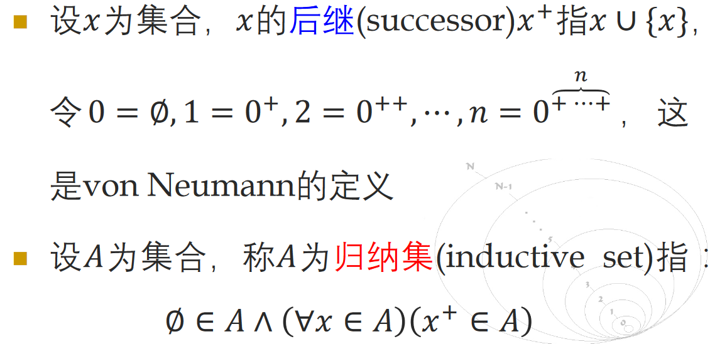
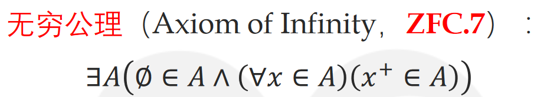
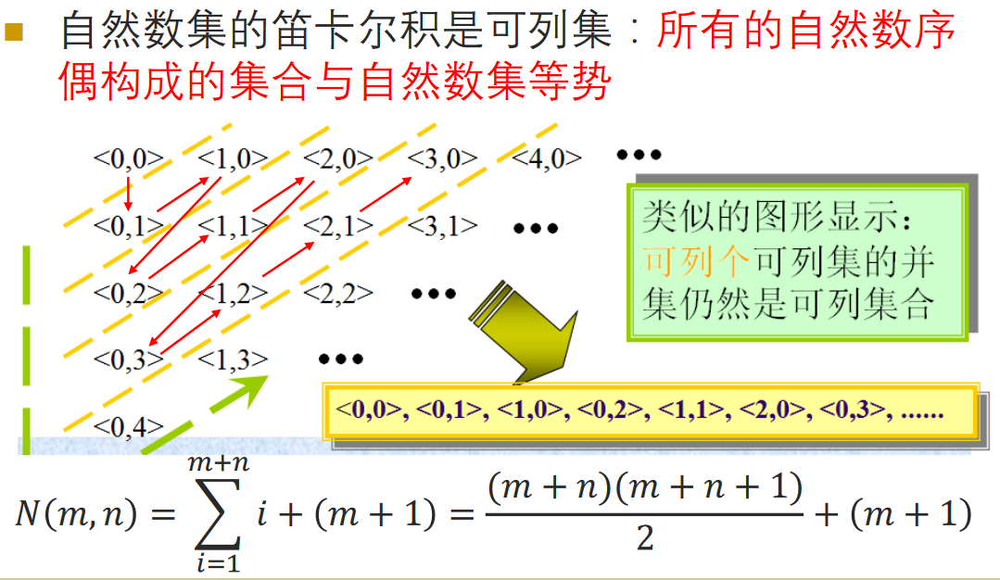
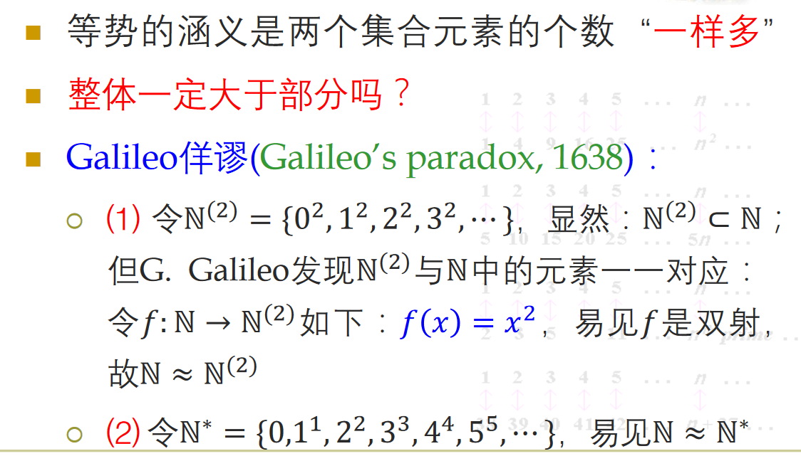

# 集合的基数

# 回顾: 自然数的定义

$0 = \empty$

$1 = \empty \cup \{\empty\}= \{\empty\}$

$2 = \{\empty\} \cup \{\{\empty\}\} = \{\empty, \{\empty\}\}$

$3 = \{\empty, \{\empty\},\{\empty, \{\empty\}\}\}$

$4 = \{\empty, \{\empty\},\{\empty, \{\empty\}\}\{\empty, \{\empty\},\{\empty, \{\empty\}\}\}\}$

$公理系统倾向于潜无穷$

## 无穷公理

$即存在归纳集.$

$存在实无穷.$

$定义自然数集:$

# 自然数五公设

* $Ax.1: 0 \in \mathbb{N}$
* $Ax.1: n \in \mathbb{N} \to n^+ \in \mathbb{N}$

## 加法构造

## 若干命题

# 自然数的定义方式

* $归纳定义: \empty为自然数, 若n为自然数, 则n^+也是自然数$
* $集合定义: n为自然数 \Leftrightarrow n\in \mathbb N$

# 集合的基数

集合𝐴中所包含元素的个数称为集合𝐴的基数(cardinalnumbers, 简写为cardinals), 或称𝐴的势(cardinality),
记为$card 𝐴$, 也可记为$|𝐴|$(von Neumann基数记号)

# 等势

$设𝐴，𝐵为集合，𝐴等势于B指有f:A\xrightarrow{1-1,onto} B, 记为A\sim B$

# 有限集与无穷集的基数定义

$\aleph$

# 可列集

$\mathbb{N}\times\mathbb{N} \approx \mathbb{N}$

$\aleph_0\times\aleph_0=\aleph_0$

## 佯谬(看起来像谬论的真理)

# 与自然数有关的若干命题

# 典型的等势

* $[a,b]\approx [c,d], (a,b)\approx (c,d)$
* $(a,b)\approx \mathbb{R}$

# Cantor对角化原理

$证明了诸多东西, 如实数集不是可数集.$

# 直线点集与平面点集等势

# 幂集的基数

$P(A)\approx \{0,1\}^{A}=\{f:A\to \{0,1\}\}$

## 一般证法

## 直观证法

$P(A)有2^{|A|}个元素,$
$f:A\to \{0,1\}的定义域A有|A|个元素,$
$所以\{0,1\}^{A}也有2^{|A|}个元素.$

# Cantor定理

* $\mathbb{N} \not\approx \mathbb{R}$
* $A \not\approx P(A)$

## 证明

$使用Cantor对角化证明$

