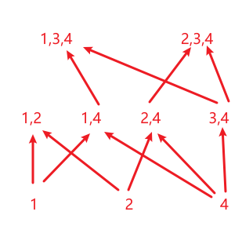

# Problem Set 15

# Problem 1

$\{$
$\qquad(\{a\},\empty),(\{b\},\empty),(\{c\},\empty),$
$\qquad(\{a,b\},\{a\}),(\{a,b\},\{b\}),$
$\qquad(\{a,c\},\{a\}),(\{a,c\},\{c\}),$
$\qquad(\{b,c\},\{b\}),(\{b,c\},\{c\}),$
$\qquad(\{a,b,c\},\{a,b\}),(\{a,b,c\},\{a,c\}),(\{a,b,c\},\{b,c\})$
$\}$

# Problem 2

$设有穷偏序集为S, 它的覆盖关系为R, 设R\subseteq A\times A$

$由覆盖关系的定义可知, R\subseteq S$

$\because S为有穷偏序集$

$\therefore S具有自反性和传递性$

$对于任意T满足R\subseteq T且T具有自反性和传递性$

$\therefore I_A\subseteq T, R\cup R^2\cup\cdots\cup R^n\subseteq T$

$若(x,y)\in S, 即x\preceq y, 那么只有x=y和x\prec y两种情况$

$对于\forall x=y的时候, (x, y)\in I_A$

$\because R=\{(x,y)|\forall x,y\in A, x\prec y\land \lnot\exist z\in A(x\prec z\prec y)\}$

$对于\forall x,y满足x\prec y, 只有两种情况$
$当\lnot\exist z\in A使得x\prec z\prec y时, (x,y)\in R$

$当\exist z\in A使得x\prec z\prec y时,$

$可以分别看x\prec z和z\prec y,$
$若两者都无中间元素即(x,z)\in R, (z,y)\in R,$

$则有xRzRy, 即(x,y)\in R^2$

$若有中间元素, 则同理也可以证明(x,y)\in R^k$

$\therefore 可知此时有(x,y)\in R\cup R^2\cup\cdots\cup R^n$

$\therefore S\subseteq I_A\cup R\cup R^2\cup\cdots\cup R^n$

$\because I_A\subseteq S, R\cup R^2\cup\cdots\cup R^n\subseteq S$

$\therefore S=I_A\cup R\cup R^2\cup\cdots\cup R^n\subseteq T$

$\therefore S是R的自反传递闭包$

$\therefore S可以从R中构造出来$

# Problem 3

(a) $极大元素为\{1,2\},\{1,3,4\},\{2,3,4\}$

(b) $极小元素为\{1\},\{2\},\{4\}$

(c) $不存在最大元素$

(d) $不存在最小元素$

(e) $\{2,4\},\{2,3,4\}$

(f) $最小上界为\{2,4\}$

(g) $\{4\}, \{3,4\}$

(h) $最大下界为\{3,4\}$

# Problem 4

(a) 该偏序集为格

(b) 该偏序集不为格

(c) 该偏序集为格

# Problem 5

$设该格为A, 该非空子集为B=\{b_1,b_2,\cdots,b_n\}, 设|B|=n$

$若n=1, 则上下确界就是B里唯一的一个元素$

$\therefore 对\{b_1,b_2\},\{b_2,b_3\},\cdots, \{b_{n-1},b_n\}都有上确界m_i, i=1,2,\cdots,n-1$

$\because 对于B的最小上界M, 有b_i\preceq M, 则b_i\preceq M,b_{i+1}\preceq M$

$\because b_i\preceq m_i, b_{i+1}\preceq m_i,$
$\quad 由最小上界定义可知\forall x(b_i\preceq x, b_{i+1}\preceq x \to m_i\preceq x)$

$\therefore m_i\preceq M, M也是\{m_i\}的上界$

$\therefore 假设\exist x使得b_i\preceq m_i\preceq x \prec M$

$\because \forall y(b_i\preceq y\to M\preceq y)$

$\therefore M\preceq x与x\prec M产生矛盾$

$\therefore M也是\{m_i\}的最小上界$

$\therefore |\{m_i\}|\leq n-1$

$\therefore 若\{m_i\}基数为1, 则可得该唯一元素就为上确界,$
$\quad 若基数不为1, 同理可以重复该步骤直至基数唯一$

$\therefore 上确界唯一$

$\therefore 同理可知下确界也唯一$

# Problem 6

$假设该有穷格无最大元素$

$\therefore 有两个或两个以上的极大元, 设其中两个为a,b, 且a\neq b$

$\therefore 不存在关系a\prec b或b\prec a$

$\because 格的性质\exist c, 使得a\preceq c且b\preceq c$

$若a\prec c或b\prec c, 则a或b不为极大值, 矛盾$

$若a=c且b=c, 则有a\preceq b且b\preceq a即a=b, 矛盾$

$\therefore 每个有限格都有一个最大元素$

$\therefore 同理每个有限格都有一个最小元素$

# Problem 7

$设有穷非空偏序集为A, 随机取x\in A$

$若不存在y\in A使得x\prec y, 则x即为一个极大元素$

$若存在y\in A使得x\prec y, 则用y替换x, 继续该循环$

$\because 该集合为有限集$

$\therefore 总能找到一个x符合条件, 即有极大元素$

# Problem 8

$\because 对于\forall \begin{pmatrix}a_{11}&a_{12}\\a_{21}&a_{22}\end{pmatrix},\begin{pmatrix}b_{11}&b_{12}\\b_{21}&b_{22}\end{pmatrix}\in A,$
$\quad 我们取\begin{pmatrix}c_{11}&c_{12}\\c_{21}&c_{22}\end{pmatrix}\in A, 且c_{ij}=\max(a_{ij},b_{ij})$

$\therefore 易知(a_{ij})\preceq(c_{ij}),(b_{ij})\preceq(c_{ij}), 即(c_{ij})是\{(a_{ij}),(b_{ij})\}的一个上界$

$假设\exist (d_{ij})使得(a_{ij})\preceq(d_{ij})\prec(c_{ij})且(b_{ij})\preceq(d_{ij})\prec(c_{ij})$

$\therefore 矩阵(d_{ij})的其中一个元素d_{ij}<max(a_{ij},b_{ij}), 不妨设为d_{ij}<a_{ij}$

$\therefore 由定义知(c_{ij})\preceq (d_{ij})不成立, 产生矛盾$

$\therefore \lnot\exist (d_{ij})使得(a_{ij})\preceq(d_{ij})\prec(c_{ij})且(b_{ij})\preceq(d_{ij})\prec(c_{ij})$

$\therefore (c_{ij})即为\{(a_{ij}),(b_{ij})\}的上确界$

$\therefore 同理可证任何一个(a_{ij}),(b_{ij})\in A, 存在下确界(\min((a_{ij}),(b_{ij})))$

$\therefore (A,R)是格$