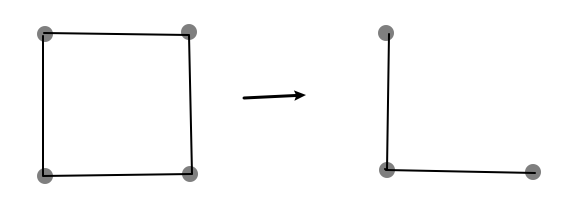

# Problem Set 18A

# Problem 1

$由握手定理可知, 剩下的度数为2|E_G|-3\times 6=2\times 12-3\times 6=6$

$\because 其余顶点的度数均小于3$

$\therefore 要到达顶点最少, 则令剩下顶点的度数都等于2, 即剩下6/2=3个点$

$\therefore G中至少有9个顶点, 如图:$

# Problem 2

$对于四个顶点, 每个顶点都最多能与3个顶点相连, 即最多能有3\times 4/2=6条边$

$对于6条边的情况: 易知只有一种情况$

$对于5条边的情况:$

$只有这两个可能的图形, 但这两个图形也同构, 因此也只有一种情况$

$对于4条边的情况:$

$只有这两种情况$

$对于3条边的情况:$

$有三种可能的情况$

$而由对称性可知0条边和6条边相同, 1条边和5条边相同, 2条边和4条边相同$

$\therefore 四个顶点的非同构简单图总共有2\times(1+1+2)+3=11种$

# Problem 3

$假设存在一个n阶简单图G, G至少有两个顶点且各顶点度数均不相同$

$由n阶简单图的最大度\Delta(G)\leq n-1可知,$
$每个顶点的度数分别为0, 1, 2, \cdots n-1$

$\because 度为0的点和其他点无边$

$\therefore 将其去掉, 剩下的G也是n-1阶简单图$
$\quad 但是此时G的度数却是1, 2, \cdots n-1, 而非0, 1, 2, \cdots n-2, 产生矛盾$

$\therefore 假设不成立$

$\therefore 不存在n阶简单图G使得G至少有两个顶点且各顶点度数均不相同$

# Problem 4

$将v_i按照度从小到大排列, 即d(v_1)\leq d(v_2)\leq\cdots \leq d(v_n)$

$\therefore v\delta(G)=vd(v_1)\leq \displaystyle\sum_{i=1}^{|v_G|}d(v_i)\leq v\Delta(G)=vd(v_n)$

$\therefore \delta(G)\leq \displaystyle\frac{\displaystyle\sum_{i=1}^{|v_G|}d(v_i)}{v}\leq \Delta(G)$

$\therefore 由握手定理可知\delta(G)\leq \displaystyle\frac{2\varepsilon}{v}\leq \Delta(G)$

# Problem 5

## (1)

$对于去掉度最大点之后的G',$
$我们易知\displaystyle\sum_{i=1}^{|V_{G'}|}d(v_i)=\sum_{i=1}^{|V_{G}|}d(v_i)-2\Delta(G)\leq \sum_{i=1}^{|V_{G}|}d(v_i)-\Delta(G)$

$即证\displaystyle\frac{\displaystyle\sum_{i=1}^{|V_{G}|}d(v_i)-2\Delta(G)}{v-1}\leq\frac{\displaystyle\sum_{i=1}^{|V_{G}|}d(v_i)-\Delta(G)}{v-1}\leq\frac{\displaystyle\sum_{i=1}^{|V_{G}|}d(v_i)}{v}$

$即证\displaystyle v(\sum_{i=1}^{|V_{G}|}d(v_i)-\Delta(G))\leq (v-1)\sum_{i=1}^{|V_{G}|}d(v_i)$

$即证\displaystyle \sum_{i=1}^{|V_{G}|}d(v_i)\leq v\Delta(G)$

$\because d(v_i)\leq \Delta(G), i=1,2,\cdots ,v$

$\therefore 原命题成立$

## (2)

$如图, 去掉了一个度数最小的点和相关的边,$
$但是图的顶点平均度从2变成了1, 减小了, 命题不成立$

