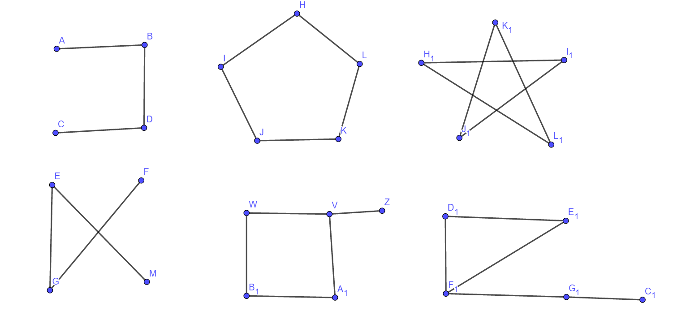
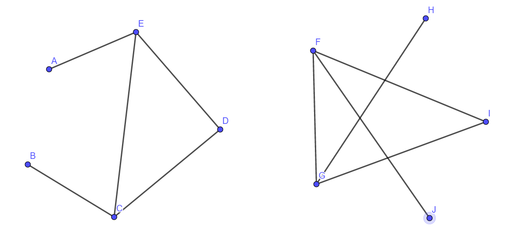

# Problem 1

(1) $K_n对于任意n值均是正则图$

(2) $W_n对于n=3时是正则图$

(3) $Q_n对于任意n值均是正则图$

# Problem 2

$下右图(1)的补图如图(2), 经过变形后得图(3), 可以与图(4)一一对应$

$$
\begin{aligned}
即构造f=\{& \\
&\quad(a, B), (b, E), (c, C), (d, H), (e, D), (f, G), (g, A), (h, F), \\
&\quad(ab, BE), (bc, EC), (cd, CH), (da, HB), \\
&\quad(ae, BD), (bf, EG), (cg, CA), (dh, HF), \\
&\quad(ef, DG), (fg, GA), (gh, AF), (he, FD), \\
&\} \\
\end{aligned}
$$

$即可知f满足使得两图同构的条件$

# Problem 3

$G\simeq H\Rightarrow \overline{G}\simeq \overline{H}:$

$\because G\cup \overline{G}=H\cup\overline{H}=K_n, G\simeq H$

$\therefore G, H, \overline{G}, \overline{H}的阶数都是相同的$

$对于任意一条边e\in K_n,$

$若e\not\in E_{\overline{G}}, 即\gamma_{\overline{G}}(e)=\{v_i, v_j\}不存在$

$我们假设此时\gamma_{\overline{H}}(e)=\{f(v_i), f(v_j)\}存在,$
$则由补图定义我们有\gamma_{G}(e)=\{v_i, v_j\}存在而\gamma_{H}(e)=\{f(v_i), f(v_j)\}不存在, 与G\simeq H矛盾$

$因此我们有\gamma_{\overline{G}}(e)=\{v_i, v_j\}和\gamma_{\overline{H}}(e)=\{f(v_i), f(v_j)\}不可能同时存在$

$若e\in E_{\overline{G}}, 同理我们可知\gamma_{\overline{G}}(e)=\{v_i, v_j\}和\gamma_{\overline{H}}(e)=\{f(v_i), f(v_j)\}不可能同时不存在$

$即\gamma_{\overline{G}}(e)=\{v_i, v_j\}\Leftrightarrow \gamma_{\overline{H}}(e)=\{f(v_i), f(v_j)\}$

$\therefore 我们有\overline{G}\simeq \overline{H}$

$\overline{G}\simeq \overline{H}\Rightarrow G\simeq H:$

$同上述论证, 同理可知成立$

# Problem 4

$设正则图G中d(v)=k, 阶数为v$

$\because G和\overline{G}是同构的$

$\therefore 2k=v-1, 即v=2k+1, k\in \mathbb{N}$

$\therefore v\equiv 1 (mod 2)$

$\therefore v\equiv 1 (mod 4) 或 v\equiv 3 (mod 4)$

$对于v\equiv 3 (mod 4):$

$即顶点数v=4n+3, n\in \mathbb{N}$

$\therefore v=4n+3=2k+1 \Rightarrow k=2n+1, k为奇数$

$\therefore 由握手定理可知边数|E_G|=\frac{1}{2}vk, 其中v和k都是奇数, |E_G|不是整数, 导致矛盾$

$所以舍去该情况$

$\therefore v\equiv 1 (mod 4)$

# Problem 5

## (1)

$若有一个点有n-1度即与其他边均相连,$
$则补图该点必定与其他点都不相连, 不可能与原图重构, 排除该种情况$

$对于4阶图如上左下左, 易知互为补图且重构, 因此4阶自补图有一个$

$对于5阶图, 如图可知有两个$

## (2)

$对于任意一个n阶全图, 由握手定理可知有\displaystyle\frac{n(n-1)}{2}条边$

$一个n阶自补图G和补图\overline{G}同构, 即也有相同数目的边$

$又知道G和\overline{G}的并图是全图K_n, 则可知G的边数为\displaystyle\frac{n(n-1)}{4}$

$对于3阶图, 边数\displaystyle\frac{n(n-1)}{4}=\frac{3}{2}不是整数, 因此自补图不存在$

$对于6阶图, 边数\displaystyle\frac{n(n-1)}{4}=\frac{15}{2}不是整数, 因此自补图不存在$