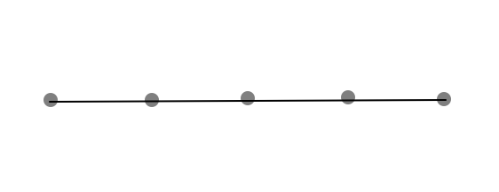
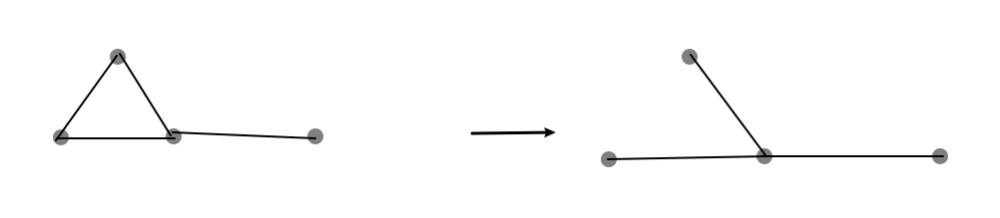

# Problem Set 19

# Problem 1

## (1)

$用反证法, 设S为G的最小点割集, 假设\kappa(G)=|S|<n-2$

$\therefore 令G_1=G-S, |G_1|=n-|S|\geq 3, G_1的连通分支数p(G)\geq 2$

$\therefore 存在其中的一个连通分支V_0, 使得剩下的连通分支的点的数目\geq 2$

$\therefore 对于V_0其中的一个点v_0来说,$
$\quad 在G中的点度数d(v_0)\leq|S|+(|G_1|-2-1)=n-3$

$\therefore d(v_0)\leq n-3<n-2\leq \delta(G), 产生矛盾$

$\therefore |S|\geq n-2$

$\because 对任意简单图G, 有\kappa(G)=|S|\leq \delta(G)$

$考虑是否存在|S|=n-2, \delta(G)=n-1的情况:$

$任何一个全图, 去掉任意n-2个点之后,$
$都依然存在一条边相连剩下的两个点, 即这种可能性不存在$

$\therefore 综上, \kappa(G)=\delta(G)$

## (2)

$如图, n=5, \delta(G)=2, \kappa(G)=1$

# Problem 2

$对于充分性:$

$\because 简单图G是二部图, 记这两个部分为V_1和V_2$

$假设G包含一条奇数条边的回路,$
$设为\Gamma=v_0e_1\cdots e_kv_k, 其中k为奇数, v_i和v_j为e_j的端点,v_k=v_0$

$不妨令v_0\in V_2, 那么由二部图性质与v_0,v_1通过e_1相邻可知v_1\in V_1$

$同理可知v_2,v_4,\cdots ,v_{k-1}\in V_2, v_3, v_5,\cdots ,v_k\in V_1$

$此时v_0=v_k\in V_1且v_0=v_k\in V_2, 产生矛盾$

$\therefore G没有包含奇数条边的回路$

$对于必要性:$

$\because G没有奇数条边的回路$

$假设G的任意一条回路\Gamma=v_0e_1\cdots e_kv_k,$
$其中k为偶数, v_i和v_j为e_j的端点,v_k=v_0$

$我们令v_0, v_2,v_4,\cdots ,v_{k}\in V_2, v_3, v_5,\cdots ,v_{k-1}\in V_1,$
$即偶数顶点位于V_2, 奇数顶点位于V_1$

$\because 任意一条边v_ie_jv_j都可以构造出一个偶数边回路v_ie_iv_je_jv_i$

$\therefore 对于任意边都可以让这条边的两个端点分属V_1和V_2$

$\therefore G是二部图$

# Problem 3

## (1)

$反驳:$

$设该最小度f(k)=\delta, 我们可以构造出这样的图:$

$中间有一点v_0, 且d(v_0)=\delta, 两边与两个完全图K_{(\delta+1)}相连$

$则改图满足最小度至少为f(k)=\delta, 但是这个图的连通度\kappa=1$

$我们可知对任何f(k)\in \mathbb{N}都存在这样的一个图, 使得k\leq \kappa = 1$

$\therefore 不存在这样的函数f$

## (2)

$反驳:$

$由(1)中的图可知, 只要我们将点v_0纳入左边的完全图里,$
$这时可以同理剩下的边作为f(k), 即边连通度$

$我们仍然可以知道\kappa=1, 与(1)同理可知不存在这样的函数f$

# Problem 4

$假设能够有一种删除k条边获得多于2个连通分支的方法$

$则我们可知可以删除这k条边其中的p条边, 来获得2个连通分支, p<k$

$\therefore 这p条边是G的边割集, 可知边连通度\lambda \leq p$

$\therefore k\leq \lambda\leq p<k, 产生矛盾$

$\therefore 最多能获得两个连通分支$

# Problem 5

## (1)

$假设\varepsilon<v-1$

$对于连通图G的所有初级回路, 去掉其中的一条边,$
$则仍然有边数\varepsilon'<\varepsilon<v-1, 且此时图变成了树$

$对于将树的枝干移动到另一条枝干上的顶点上, 易知不会改变边数\varepsilon'$

$循环此过程, 则能够将图变为一个\varepsilon'条边的线图, 且点数v不变$

$\therefore 由线图存在一条路径将整个图连通可知$

$\therefore \varepsilon'=v-1, 与\varepsilon'<v-1矛盾$

$\therefore 任意连通的简单图都有\varepsilon\geq v-1$

## (2)

$\because 若已知\varepsilon=v时, G中有回路,$
$\quad则加上任意条边使得\varepsilon\geq v时, G仍有回路$

$\therefore 只需证\varepsilon=v时, G中有回路$

$当\varepsilon=1或者\varepsilon=2时, 不能实现只有有1个或2个点, 舍去$

$当\varepsilon=3时, 易知此时存在回路$

$假设当\varepsilon=k时, G中有回路v_0e_1v_1e_2v_2e_3v_0$

$则当\varepsilon=k+1时,$

$任意一个边数点数均为k+1的图都可以分为两类: 圈图和非圈图$

$对于圈图, 易知这个图有回路, 即v_0e_1\cdots e_{k+1}v_0$

$对于非圈图, 则存在一个度数为1的点, 设为v_0, 与其相连的边为e_0$

$去点v_0和e_0之后, 则该图变为边数点数都为\varepsilon的图, 由归纳假设可知有回路$

$\therefore 综上所述, G中有回路$