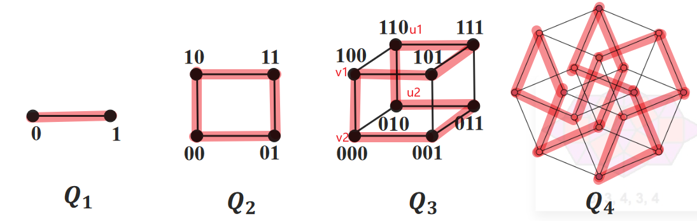

# Problem Set 20B

# Problem 1

$图1没有哈密顿回路, 去掉b点之后, 有两个连通分支$
$并且图1有三个点的度数为1, 对于度数为1的点, 必须要作为入口或者出口$
$而入口和出口一共只有两个, 三个度数为1的点过多, 不可能存在哈密顿通路$

$图2没有哈密顿通路, 去掉o,j,q,m四点之后, 有六个连通分支, 多于4+1=5个$

$图3有哈密顿通路, 一条通路如图$

# Problem 2

$\therefore m\geq \displaystyle\frac{(n-1)(n-2)}{2}+2=\frac{n^2-3n+6}{2}$

$\therefore\displaystyle\sum_{v\in V(G)}d(v)=2m\geq n^2-3n+6$

$用反证法, 假设其中有两点u_1,u_2不相邻,它们的度数之和d(u_1)+d(u_2)\leq n-1$

$我们可知,$
$该图\leq u_1和u_2的度数和恰为n-1的图\leq 恰为n-1且剩余点构成全图的图$

$\therefore\displaystyle\sum_{v\in V(G)} d(v)\leq 2(n-1)+\sum_{v\in V(G)-u_1,u_2}d(v)\leq2(n-1)+(n-2)(n-3)=n^2-3n+4$

$\therefore 与\displaystyle\sum_{v\in V(G)}d(v)=2m\geq n^2-3n+6矛盾$

$\therefore 任何不相邻两点u,v的度数和d(u)+d(v)\geq n$

$\therefore G是哈密顿图$

# Problem 3

$当n=2时, 对于的2维立方体图是正方形, 如图易知有哈密顿回路$

$假设当n=k时, k维立方体图Q_k有哈密顿回路$

$当n=k+1时, 对于k+1维立方体图Q_{k+1}, 我们可知$

$Q_k有2^k个顶点, 2^{k-1}k条边, 且是k-正则图$

$Q_{k+1}是由两个k维立方体图Q_k组合,再让这两个同构的Q_k对应点进行一一相连形成的,$
$这样的Q_{k+1}有2\times 2^k=2^{k+1}个顶点, 2\times 2^{k-1}k+2^k=2^k(k+1)条边,是(k+1)-正则图, 满足条件$

$由归纳假设可知这两个Q_k有哈密顿回路, 分别设为C_1和C_2$

$设其中一个Q_k有相邻的两点v_1和u_1, 另一个Q_k有同构的两点v_2和u_2$

$\therefore C_1-v_1u_1和C_2-v_2u_2是同构的两个哈密顿通路, 分别设为L_1和L_2$

$\because v_1和v_2在Q_{k+1}中相邻, u_1和u_2在Q_{k+1}中相邻$

$\therefore 可以构造哈密顿回路v_1L_1u_1u_2L_2v_2v_1, 如图$

$\therefore Q_{k+1}也是哈密顿图$

$\therefore 综上n>1的n维立方体Q_n, 总是有哈密顿回路$

# Problem 4

## (1)

$不一定存在哈密顿回路, 如图,$

$9阶图G的每一点的度数都\geq\displaystyle\frac{9-1}{2}=4,$
$但去掉点v后连通分支数变为2>1, 不可能存在哈密顿回路$

## (2)

$对于G中任意两点u,v, 有d(u)+d(v)\geq 2\delta(G)=V(G)-1=n-1$

$\therefore 由半哈密顿图的充分条件可知, G一定存在哈密顿通路$

# Problem 5

$将这15们课程作为一个图的15个点, 两个点相邻当且仅当任课老师是同一个人$

$\therefore 这个图的任意一个点的度数\leq 8$

$\therefore 这个图的补图的任意一个点的度数\geq 7$

$\therefore 补图的任意两个点的度数和d(u)+d(v)\geq 14=15-1=n-1$

$\therefore 可知补图必定存在一个哈密顿通路, 且这个哈密顿通路满足:$
$\quad 相连的两点的任课老师必定不是同一个人$

$\therefore 按照这个通路安排考试时间, 则可以满足题意$