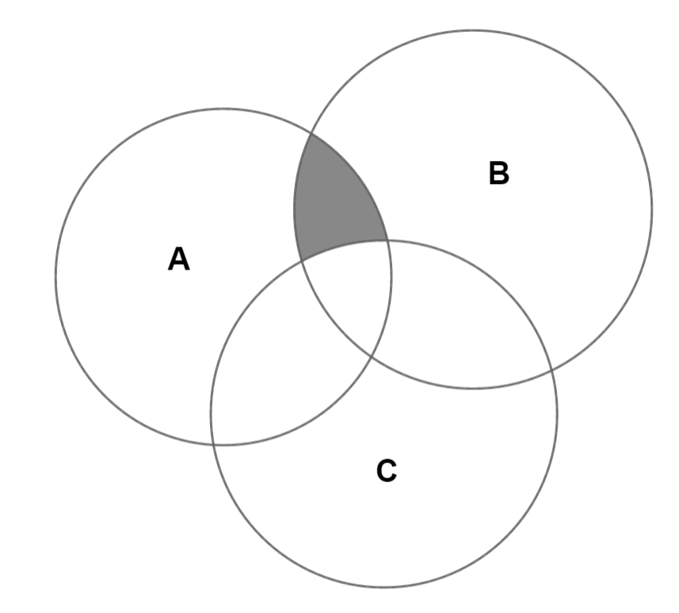
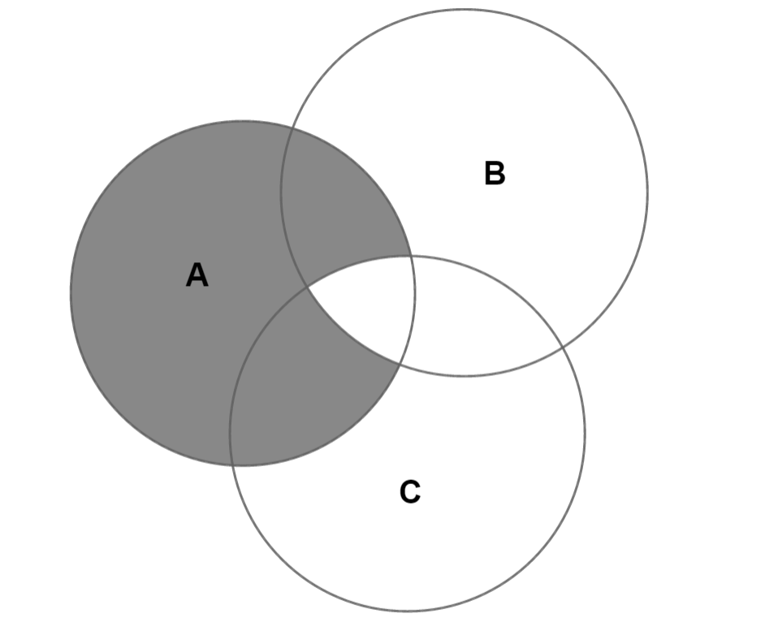
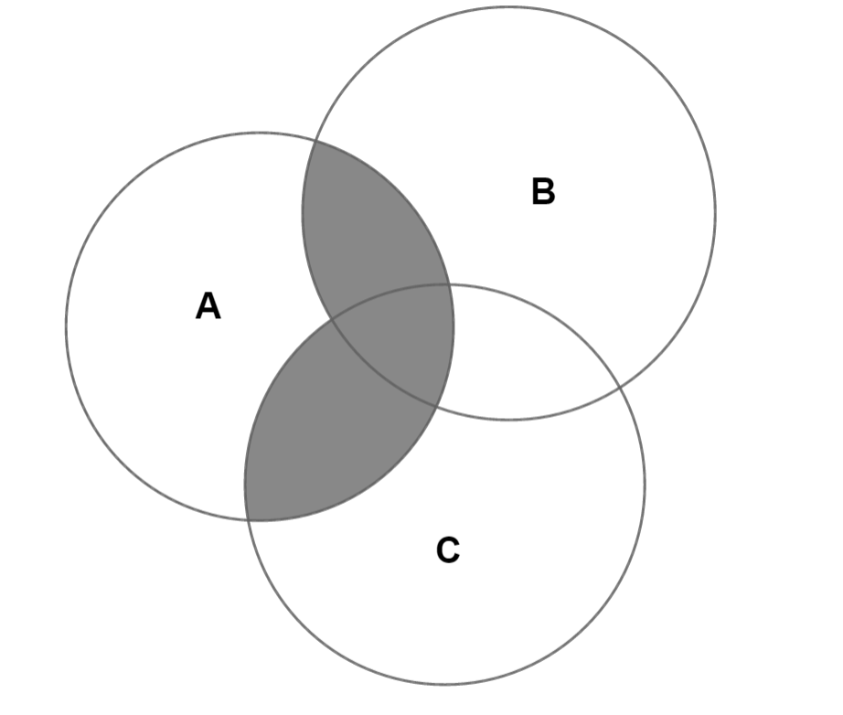

# Problem Set 5 Ans

# Problem 1

## a)

$不能.$

$例如A=\{1,2,3\},B=\{1,2\},C=\{3,4\}时,$

$有A\cup C= B\cup C=\{1,2,3,4\}, 但A\neq B$

# Problem 2

# Problem 3

a) $(-\sqrt{3}, \sqrt{3})$

b) $\displaystyle\{-\frac{1}{2}\}$

# Problem 4

# Problem 5

## a)

$不能.$

$例如A=\{1,2,3\},B=\{1,2\},C=\{3,4\}时,$

$有A\cup C= B\cup C=\{1,2,3,4\}, 但A\neq B$

## b)

$不能.$

$例如A=\{1,2,3\},B=\{2, 3\},C=\{3,4\}时,$

$有A\cup C= B\cup C = \{3\}, 但A\neq B$

## c)

$能.$

# Problem 6

# Problem 7

# Problem 8

# Problem 9

# Problem 10

## a)

$A \cap (B - C)$

## b)

$(A \cap \overline B) \cup (A \cap \overline C)$

## c)

$(A \cap B) \cup (A \cap C)$

