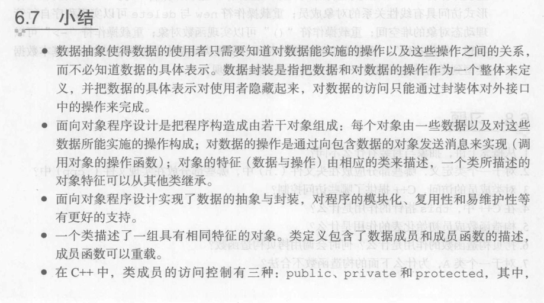

```c++
void bubble(int array[], int n)
{
    for (int i = 0; i < n - 1; i++)
    {
        for (int j = 0; j < n - i - 1; j++)
        {
            if (array[j] > array[j + 1])
            {
                int tmp = array[j];
                array[j] = array[j + 1];
                array[j + 1] = tmp;
            }
        }
    }
}

int deleteByMoving(int array[], int &n)
{
    int count = 0;
    for (int i = 0; i < n - 1; i++)
    {
        if (array[i] == array[i + 1])
        {
            for (int j = i + 1; j < n - 1; j++)
                array[j] = array[j + 1];
            i--;
            n--;
            count++;
        }
    }
    return count;
}

int *deleteByCopying(int array[], int n)
{
    int *arr = new int[n];
    arr[0] = array[0];
    for (int i = 1, j = 1; j < n; j++)
    {
        if (arr[i - 1] != array[j])
        {
            arr[i] = array[j];
            i++;
        }
    }
    return arr;
}

struct Node
{
    int data;
    Node *next = NULL;
};

int query(Node *head, int index)
{
    Node *current = head;
    for (int i = 0; i < index; i++)
        current = current->next;
    return current->next->data;
}

void insert(Node *head, int data, int index)
{
    Node *current = head;
    for (int i = 0; i < index; i++)
        current = current->next;
    Node *newNode = new Node;
    newNode->data = data;
    newNode->next = current->next;
    current->next = newNode;
}

void append(Node *head, int data)
{
    Node *newNode = new Node;
    newNode->data = data;
    newNode->next = head->next;
    head->next = newNode;
}

void removeByIndex(Node *head, int index)
{
    Node *current = head;
    for (int i = 0; i < index; i++)
        current = current->next;
    Node *tmp = current->next;
    current->next = tmp->next;
    delete tmp;
}

void removeAll(Node *head)
{
    if(head->next->next != NULL)
        removeAll(head->next);
    delete head->next;
    head->next = NULL;
}

void remove(Node *head, int data)
{
    Node *current = head;
    while(current != NULL && current->next != NULL)
    {
        if(current->next->data == data)
        {
            Node *tmp = current->next;
            current->next = tmp->next;
            delete tmp;
        }
        current = current->next;
    }
}

bool isExist(Node *head, int data)
{
    Node *current = head;
    while (current->next != NULL)
    {
        current = current->next;
        if(current->data == data)
            return true; 
    }
    return false;
}

void print(Node *head)
{
    Node *current = head;
    while (current->next != NULL)
    {
        current = current->next;
        cout << current->data << ' ';
    }
    cout << endl;
}
```