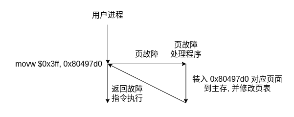
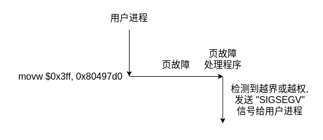

# 计算机系统基础第六次作业

《计算机系统基础》教材第2版第7章后习题中的第3、4、5，第8章后习题的第3、5、7、13题作业

## 3.

P1 - P2 并发, P1 - P3 并发, P1 - P4 并发, P2 - P3 并发, P3 - P4 并发.

## 4.

**(1)**

第一行指令的虚拟地址为 0x80482c0, 对于 Linux 来说线性地址也为 0x80482c0. 我们又知道页的大小为 4KB, 因此 0x80482c0 并非是是一个页的起始地址, 在调用到的时候已经被装入主存, 因此这 7 条指令均不会发生缺页异常.

**(2)**

第 1 行指令执行时, 因为 0x80497d0 对应的页面还没有被加载入主存中, 所以会发生缺页, 这是一个可恢复的故障.

第 2 行指令执行时, 因为 0x8041324 对应的页面还没有被加载入主存中, 所以会发生缺页, 这是一个可恢复的故障.

第 6 行指令执行时, 因为第 2 行指令已经把 0x8041324 对应的页面加载入内存中了, 所有不会发生缺页. 但是由于数组 `b[2500]` 只有 `2500` 个数组元素, 此时 `b[2500] = 2049 % k` 其实已经越界了, 且恰好写入了变量 `k` 所在的位置. 

第 7 行指令执行时, 几乎肯定会发生页错误, 且不可恢复. 因为 `b[10000]` 远远超过了数组 `b[2500]` 的大小, 已经偏移了数个页面, 因此会报地址越界或访问越权的错误.

第 1 行指令发生故障处理过程如图:

第 7 行指令发生故障处理过程如图:

**(3)**

看 C 语言代码可知, `k` 变量是全局变量且为初始化, 位于 .bss 节且未初始化的变量会被默认设置为 0, 因此 `k = 0`, 第 5 行指令的 `2049 % k` 会发生除零故障, 该故障不可恢复.

## 5.

**(1)**

执行该段代码时, 因为这段代码是用户程序所拥有的代码, 所以用户处于用户态. 而在执行完第 5 行指令 (即系统调用) 后, 就进入内核态.

**(2)**

第 5 行指令 `int $0x80` 为系统调用, 属于陷阱指令. `int $0x80` 指令通过系统门描述符来激活异常处理程序, 对应的中断类型号为 128, 由于 Linux 总把 P 设为 1, 字段 P 内容为 1, DPL 内容为 3, TYPE 内容为 1111B.

由于根据门描述符中的段选择符取出 GDP 中的段描述符为内核代码段对应的段描述符, 因此基地址为 0, 界限为 0xFFFFF,  G 为 1, S 为 1, TYPE 为 2, DPL 为 0, D 为 1, P 为 1.

**(3)**

1. 确定中断类型号为 128, 从 IDTR 指向的 IDT 中取出第 128 个表项, 即 Linux 所初始化的系统门描述符, P = 1, DPL = 3, TYPE = 1111B, 段选择符为在 GDT 中的内核代码段描述符.
2. 根据 IDT 的段选择符, GDT 中的内核代码段描述符, 从 GDT 中取出内核代码段, 这一异常处理程序或中断服务程序所在段, 的 DPL, 基地址等信息, 分别是 DPL 为 0, 基地址为 0.
3. 接下来要判断是否 CPL (CS 寄存器的最低两位, 0 为内核权限级, 3 为用户权限级, 当前 CPL = 3) 小于 GDT 的内核代码段的 DPL, 如果小于则产生 13 号异常 (#GP). 但是由于 DPL = 0, 所以不可能有 CPL < DPL, 也就不会产生这个异常. 由于系统调用也是编程异常中的一种, 我们还要继续判断 IDT 128 门描述符中的 DPL 是否小于 CPL, 如果是则产生 13 号异常. 由于系统调用对应的是系统门, 其 DPL = 3, 因此也不会产生这个异常.
4. 检查是否发生了权限级的编号, 即判断 CPL 是否与相应段描述符中的 DPL 不同. 由于当前处于用户态, CPL = 3, 而内核代码段的 DPL = 0, 可以看出两者并不相同, 因此要从用户态转为内核态, 从用户栈转为内核栈. 接下来要通过以下步骤完成切换:
   1. 读取 TR 寄存器, 以访问正在运行的 TSS 段.
   2. 将 TSS 段寄存器中保存的内核栈的段选择符和栈指针分别装入寄存器 SS 和 ESP, 然后在内核态栈中保存原来的用户栈的 SS 和 ESP.
5. 判断是不是故障, 如果是故障需要将发生故障的指令的逻辑地址写入 CS 和 EIP, 其他情况保持不变 (默认为第 5 行的后一条指令). 这里不是故障, 所以不用重新写入.
6. 在当前内核栈中保存 EFLAGS, CS 和 EIP 寄存器的内容. 如果是中断门, 要将 IF 清零, 但是这是系统门, 不是中断门, 因此不需要将 IF 清零.
7. 如果异常产生了一个硬件出错码, 则将其保存在内核态中. 这里应该是不会产生的.
8. 将 IDT 128 中的段选择符, 即指向 GDT 的内核代码段的段选择符 (0x60) 装入 CS, 将 IDT 中的偏移地址装入 EIP, 它指向内核代码段中系统调用处理程序 `system_call` 的第一条指令. 这样, 从下一个时钟开始, 就执行 `system_call` 中的对应指令. 在完成系统调用服务后, 通过执行最后一条指令 IRET 回到第 5 行指令的下一条指令继续执行. 而 IRET 指令做了以下工作:
   1. 从内核栈中弹出 EIP, CS 和 EFLAGS.
   2. 检查当前 CPL 是否等于 CS 中的最低两位, 发现不一致, 说明前后不属于同一个特权级, 要继续进行以下工作.
   3. 从内核栈中弹出 SS 和 ESP, 以恢复到原使用栈, 即用户栈.
   4. 检查 DS, ES, FS, GS 段寄存器的内容, 如果 DPL 小于 CPL, 则将对应寄存器清 0, 以免恶意程序 (CPL = 3) 通过内核以前使用过的段寄存器 (DPL = 0) 来访问内核地址空间.

