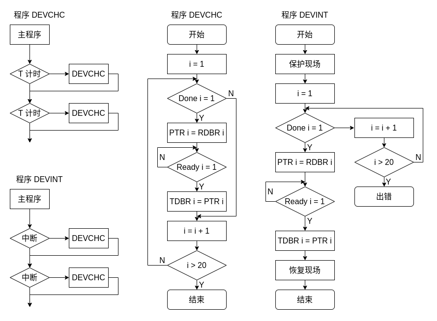

# 计算机系统基础第六次作业

## 201300035 方盛俊

《计算机系统基础》教材第2版第7章后习题中的第3、4、5，第8章后习题的第3、5、7、13题作业

## 3.

P1 - P2 并发, P1 - P3 并发, P1 - P4 并发, P2 - P3 并发, P3 - P4 并发.


## 4.

**(1)**

第一行指令的虚拟地址为 0x80482c0, 对于 Linux 来说线性地址也为 0x80482c0. 我们又知道页的大小为 4KB, 因此 0x80482c0 并非是是一个页的起始地址, 在调用到的时候已经被装入主存, 因此这 7 条指令均不会发生缺页异常.

**(2)**

第 1 行指令执行时, 因为 0x80497d0 对应的页面还没有被加载入主存中, 所以会发生缺页, 这是一个可恢复的故障.

第 2 行指令执行时, 因为 0x8041324 对应的页面还没有被加载入主存中, 所以会发生缺页, 这是一个可恢复的故障.

第 6 行指令执行时, 因为第 2 行指令已经把 0x8041324 对应的页面加载入内存中了, 所有不会发生缺页. 但是由于数组 `b[2500]` 只有 `2500` 个数组元素, 此时 `b[2500] = 2049 % k` 其实已经越界了, 且恰好写入了变量 `k` 所在的位置. 

第 7 行指令执行时, 几乎肯定会发生页错误, 且不可恢复. 因为 `b[10000]` 远远超过了数组 `b[2500]` 的大小, 已经偏移了数个页面, 因此会报地址越界或访问越权的错误.

第 1 行指令发生故障处理过程如图:


第 7 行指令发生故障处理过程如图:


**(3)**

看 C 语言代码可知, `k` 变量是全局变量且为初始化, 位于 .bss 节且未初始化的变量会被默认设置为 0, 因此 `k = 0`, 第 5 行指令的 `2049 % k` 会发生除零故障, 该故障不可恢复.


## 5.

**(1)**

执行该段代码时, 因为这段代码是用户程序所拥有的代码, 所以用户处于用户态. 而在执行完第 5 行指令 (即系统调用) 后, 就进入内核态.

**(2)**

第 5 行指令 `int $0x80` 为系统调用, 属于陷阱指令. `int $0x80` 指令通过系统门描述符来激活异常处理程序, 对应的中断类型号为 128, 由于 Linux 总把 P 设为 1, 字段 P 内容为 1, DPL 内容为 3, TYPE 内容为 1111B.

由于根据门描述符中的段选择符取出 GDP 中的段描述符为内核代码段对应的段描述符, 因此基地址为 0, 界限为 0xFFFFF,  G 为 1, S 为 1, TYPE 为 2, DPL 为 0, D 为 1, P 为 1.

**(3)**

1. 确定中断类型号为 128, 从 IDTR 指向的 IDT 中取出第 128 个表项, 即 Linux 所初始化的系统门描述符, P = 1, DPL = 3, TYPE = 1111B, 段选择符为在 GDT 中的内核代码段描述符.
2. 根据 IDT 的段选择符, GDT 中的内核代码段描述符, 从 GDT 中取出内核代码段, 这一异常处理程序或中断服务程序所在段, 的 DPL, 基地址等信息, 分别是 DPL 为 0, 基地址为 0.
3. 接下来要判断是否 CPL (CS 寄存器的最低两位, 0 为内核权限级, 3 为用户权限级, 当前 CPL = 3) 小于 GDT 的内核代码段的 DPL, 如果小于则产生 13 号异常 (#GP). 但是由于 DPL = 0, 所以不可能有 CPL < DPL, 也就不会产生这个异常. 由于系统调用也是编程异常中的一种, 我们还要继续判断 IDT 128 门描述符中的 DPL 是否小于 CPL, 如果是则产生 13 号异常. 由于系统调用对应的是系统门, 其 DPL = 3, 因此也不会产生这个异常.
4. 检查是否发生了权限级的编号, 即判断 CPL 是否与相应段描述符中的 DPL 不同. 由于当前处于用户态, CPL = 3, 而内核代码段的 DPL = 0, 可以看出两者并不相同, 因此要从用户态转为内核态, 从用户栈转为内核栈. 接下来要通过以下步骤完成切换:
   1. 读取 TR 寄存器, 以访问正在运行的 TSS 段.
   2. 将 TSS 段寄存器中保存的内核栈的段选择符和栈指针分别装入寄存器 SS 和 ESP, 然后在内核态栈中保存原来的用户栈的 SS 和 ESP.
5. 判断是不是故障, 如果是故障需要将发生故障的指令的逻辑地址写入 CS 和 EIP, 其他情况保持不变 (默认为第 5 行的后一条指令). 这里不是故障, 所以不用重新写入.
6. 在当前内核栈中保存 EFLAGS, CS 和 EIP 寄存器的内容. 如果是中断门, 要将 IF 清零, 但是这是系统门, 不是中断门, 因此不需要将 IF 清零.
7. 如果异常产生了一个硬件出错码, 则将其保存在内核态中. 这里应该是不会产生的.
8. 将 IDT 128 中的段选择符, 即指向 GDT 的内核代码段的段选择符 (0x60) 装入 CS, 将 IDT 中的偏移地址装入 EIP, 它指向内核代码段中系统调用处理程序 `system_call` 的第一条指令. 这样, 从下一个时钟开始, 就执行 `system_call` 中的对应指令. 在完成系统调用服务后, 通过执行最后一条指令 IRET 回到第 5 行指令的下一条指令继续执行. 而 IRET 指令做了以下工作:
   1. 从内核栈中弹出 EIP, CS 和 EFLAGS.
   2. 检查当前 CPL 是否等于 CS 中的最低两位, 发现不一致, 说明前后不属于同一个特权级, 要继续进行以下工作.
   3. 从内核栈中弹出 SS 和 ESP, 以恢复到原使用栈, 即用户栈.
   4. 检查 DS, ES, FS, GS 段寄存器的内容, 如果 DPL 小于 CPL, 则将对应寄存器清 0, 以免恶意程序 (CPL = 3) 通过内核以前使用过的段寄存器 (DPL = 0) 来访问内核地址空间.


## 3.

**(1)**

程序的功能是通过 `write(1, "Hello, world.\n", 14)` 系统调用在标准输出设备 (stdout) 上显示字符串 "Hello, world.", 然后通过 `exit(0)` 系统调用退出程序.

**(2)**

<!-- $ -->

执行到 16 行和 20 行的 `int $0x80` 指令时从用户态转到内核态.

**(3)**

用户程序第 16 行调用了 4 号系统调用 `write`, 对应服务例程为 `sys_write()` 函数;

用户程序第 20 行调用了 1 号系统调用 `exit`, 对应服务例程为 `sys_exit()` 函数;


## 5.

**(1)**

因为 `hello.c` 使用了 C 标准库函数 `printf()`, 所以需要引用头文件, 加上 `#include <stdio.h>`; 因为引用的头文件 `stdio.h`  中包含了 `printf()` 函数的原型声明.

**(2)**

需要经过预处理, 编译, 汇编, 链接才能形成可执行程序 `hello` 进而运行. 预处理主要是对开头为 `#` 的语句进行处理, 例如 `#include <stdio.h>` 语句, 需要将 `stdio.h` 头文件包含进 `hello.c` 中; 编译阶段是将预处理完成后的纯 C 语言代码编译生成汇编语言程序代码; 汇编阶段将编译阶段生成的汇编语言代码转化为可重定位的机器码目标文件; 链接阶段将多个可重定位的机器码目标文件以及库函数链接起来, 生成最后的可执行程序文件.

**(3)**

因为 `printf()` 函数内部会调用 `write` 系统调用, 默认将字符串输出到标准输出设备 (stdout) 中, 所以不需要显式指定字符串输出目的地.

**(4)**

字符串 "Hello, world.\n" 在机器中的机器码为它的 ASCII 码序列, 具体为 `48H 65H 6CH 6CH 6FH 2CH 77H 6FH 72H 6CH 64H 0AH 00H`. 这个 0/1 序列存放在 .rodata 节中, 作为只读数据使用, 所以我们可知其存放在 `hello` 中的只读代码段中.

**(5)**

`printf.o` 在静态库 `libc.a` 中; 静态链接后, `printf.o` 中代码部分被映射到虚拟地址空间的只读代码段中; 若采用动态链接, 则 `printf()` 的代码在虚拟地址空间中的共享库映射区.

**(6)**

我们确认, 参数从右到左的顺序先后入栈, 分别是字符串长度 `len = 14`, 字符串首地址 `str_p`, 文件描述符 (stdout) `fd = 1` 这三个参数先后压栈, 然后是将返回地址压栈, 然后跳转到 `write` 代码执行. 

因此我们可以进行注释如下:

<!-- $ -->

``` asm
push    %ebx                        // 被调用者保存寄存器 EBX 入栈
mov     0x10(%esp), %edx            // 字符串长度 len = 14 送 EDX
mov     0xc(%esp), %ecx             // 字符串首地址 str_p 送 ECX
mov     0x8(%esp), %ebx             // 文件描述符 fd = 1 送 EBX
mov     $0x4, %eax                  // 将 EAX 设置为系统调用号 4 (write)
int     $0x80                       // 系统调用入口
pop     %ebx                        // 恢复 EBX 旧值
cmp     $0xfffff001, %eax           // 系统调用返回值与 0xfffff001 进行比较
jae     8051910 <__syscall_error>   // 大于等于时进行出错处理
ret                                 // 返回到调用 write 的过程
```

通过以上指令可以看出, 最大错误号为 `4095`. 因为 0xfffff001 对应 `-4095`, 取负之后就可以看出最大错误号为 `4095`. 

**(7)**

显然, 第 5 题中的便捷性和灵活性均要优与第 3 题和第 4 题, 因为第 3 题直接写了汇编, 只要参数不同, 就得重写指令; 第 4 题直接使用 `write` 进行系统调用, 只能用于 Linux 这种类 UNIX 的系统中.

但是程序执行性能方面, 却是第 3 题优于第 4 题和第 5 题, 第 4 题优于第 5 题. 第 3 题使用汇编直接编写, 省去许多调用过程, 因此效率最高; 第 4 题直接使用 `write`, 想比于第 5 题 `printf` 省去了许多格式控制的功能, 也没有缓冲区 (这里存在换行, `printf` 最终也会输出), 因此性能更高.

所以第 3 题中的程序执行时间最短.


## 7.




## 13.

主频为 1 GHz, 所以时钟周期为 1 / 1 GHz = 1 ns. 因为题目中说每个字节读取并存入内存缓冲区需要 1000 个时钟周期, 因此一个字节需要的时间为 1000 x 1 ns = 1 us. 而对于 50 kB / s 的数据传输率, 我们知道设备每隔 10^6^ x 1 B / 50 kB = 20 us 准备好一个字节. 因此读取 1000 字节的时间为 1000 x 20 us = 20 ms.

**(1)**

定时查询方式下, 可以设定每隔 20 us 即 20000 ns 查询一次, 这样查询开销就能达到最小. 对于每个字节的传送, 所用时钟周期数为 60 + 1000 = 1060, 因此在 1000 字节读取中 CPU 花在该设备的 I/O 操作上的时间为 1000 x 1060 x 1 ns = 1.060 ms, 占 CPU 时间的百分比为 1.060 ms / 20 ms x 100% = 5.3%

**(2)**

独占查询的方式下, 进行查询之后, 先是使用 1000 个时钟周期进行处理一个字节, 然后不断进行周而复始的 60 个时钟周期的查询, 将 CPU 完全占满. 也就是说, 一共 1000 x 20 us = 20 ms 时间的 I/O 操作, 对应的 20 ms 的 CPU 时间完全被占满. 因此在 1000 字节读取中 CPU 花在该设备的 I/O 操作上的时间为 20 ms, 占 CPU 时间的百分比为 20 ms / 20 ms x 100% = 100%

**(3)**

中断控制 I/O 方式下, 每 20000 个时钟周期, 就需要处理一次中断响应和中断服务程序, 也就是 1200 + 2 = 1202 个时钟周期, 因此在 1000 字节读取中 CPU 花在该设备的 I/O 操作上的时间为 1000 x 1202 x 1 ns = 1.202 ms, 占 CPU 时间的百分比为 1.202 ms / 20 ms x 100% = 6.01%

**(4)**

周期挪用 DMA 方式下, 因为没有访存冲突, 因此 DMA 初始化和后处理的 2000 个时钟周期即 CPU 花在 1000 个字节 I/O 操作的时钟周期, 因此在 1000 字节读取中 CPU 花在该设备的 I/O 操作上的时间为 2000  x 1 ns = 0.002 ms, 占 CPU 时间的百分比为 0.002 ms / 20 ms x 100% = 0.01%

**(5)**

若设备数据传输率达到 5 MB/s, 则外设传输 1000 字节所用时间为 10^6^ x 1000 B / (5 x 10^6^) B/s = 0.2 ms.

我们可以看出, 上述的前三种方式, 定时查询, 独占查询, 中断控制, 对应 CPU 处理 1000 字节数据的时间分别至少为 1.060 ms, 1.060 ms, 1.202 ms, 都远远超过了 0.2 ms, I/O 设备读取速度比 CPU 处理速度还要快, 所以就会造成数据丢失.

而使用 DMA 方式, 传输 1000 字节所用时间为 0.002 ms, 小于 0.2 ms, 因此是可行的. 而 0.002 ms / 0.2 ms = 1%, 也就是 CPU 花在该设备 I/O 操作上的时间占整个处理器时间的百分比为 1%.


