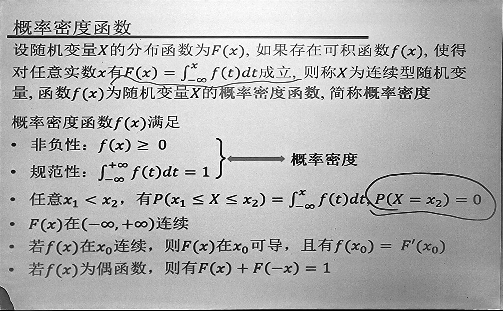

# 概率统计

## 概率和统计的区别

- **概率**: **研究事件的不确定性**, 在给定数据生成过程中观察, 研究数据的性质, 强调 **公理体系**, **推理**.
- **统计**: **收集与分析数据**, 根据观察的数据反思其数据生成过程, 强调 **归纳**.
- 概率和统计的重要的区别在于公理体系化.

## 知识结构

## 必然现象和随机现象

- 必然现象:
- 随机现象:
- 随机现象的二重性:
    - 偶然性:
    - 必然性: 做大量观察, 有一定规律性, 即 **统计规律性**.
- 随机试验
    - 三特点
        - 可重复
        - 多结果
        - 不确定
    - 样本点: $\omega$
    - 样本空间: $\Omega$
- 随机事件: 样本空间 $\Omega$ 的子集, 本质是集合.
    - 事件间的关系: $\subset, =, \cup, \cap, \bar{A}, -$, 互斥/互不相容.
        - $A - B = A - AB = A \bar{B} = (A \cup B) - B$.
        - 运算规律: 幂等律, 交换律, 结合律, 分配律, 对偶律.
        - $(AB)\cup (CD) = (A \cup C)(A \cup D)(B \cup C)(B \cup D)$
        - 容斥原理

## 频率和概率的关系

- 概率用于度量事件发生的可能性, 是事件的固有属性
- 频率在一定程度上反映了事件发生的可能性
- 概率是恒定的, 而频率在试验中具有随机性
- 若试验次数足够多, 频率与概率非常接近
- 概率开源通过频率来测量, 频率是概率的一个近似

概率的公理性定义:

- 非负性
- 规范性

## 概率的性质

- 事件可以推出概率, 反之则不行
- 有限可加性: 两两不相容事件可以相加
- 容斥原理: $P(A\cup B) = P(A) + P(B) - P(AB)$

## 古典概型

略

## 几何概型

基于测度.

## 条件概率

$\displaystyle P(B|A) = \frac{P(AB)}{P(A)}$

## 例: 验证大矩阵乘法是否相等

给定大矩阵 $A, B, C \in \{ 0, 1 \}^{n\times n}$, 验证是否有 $AB = C$.

$AB$ 开销为 $O(n^{3})$.

矩阵分块为 $O(n^{2.7\cdots})$

重复使用 $K$ 次随机向量 $x$, 判断 $ABx = Cx$ 是否相等, 则有较大的概率成立.

## 三种分布

- 泊松分布
- 正态分布
- 指数分布

## 随机变量函数分布

## 随机变量

将样本空间 $\Omega$ 中每个样本点 $\omega$ 与一实数 $X(\omega)$

- 单调性
- 规范性
- 右连续性
- 对任意实数

例题:

## 离散型随机变量

离散型随机变量: 随机变量的取值是有限的, 或无限可列的.

假设其取值为 $x_1, x_2, \cdots, x_n, \cdots$, 事件 $X=x_k$ 的概率记为

$p_k = P(X=x_k), k=1,2,\cdots$

称之为随机变量 $X$ 的分布列.

- 和为 1.
- 非负.

## 均匀 / 0-1 分布

- 期望: $E(X) = \sum_{i=1}^{n}\frac{x_i}{n}$
- 方差: $\operatorname{Var}(X) = $

## 德国坦克数量问题

假设德国生产 $N$ 辆坦克, 编号为 $1, \cdots, N$, 盟军随机击毁 $k$ 辆, 被随机机会坦克编号分别为 $x_1, x_2, \cdots, x_k$, 如何估计 $N$.

1. $N \ge \max_{}(x_1,\cdots,x_n)$
2. $\displaystyle \frac{N+1}{2}=\frac{x_1+\cdots+x_k}{k}$

设 $k$ 为击毁的坦克总数, $X$ 为击毁坦克编号的最大值.

$\therefore P(X=i)=\frac{\displaystyle \binom{i-1}{k-1}}{\displaystyle \binom{N}{k}}$

$\therefore \displaystyle E(X)=\sum_{i=k}^{N}i\cdot \frac{\displaystyle \binom{i-1}{k-1}}{\displaystyle \binom{N}{k}}=\binom{N}{k}^{-1}\sum_{i=k}^{N}i\binom{i-1}{k-1}$

$\because \displaystyle \binom{N+1}{k+1}=\sum_{i=k+1}^{N+1}\binom{i-1}{k}=\sum_{i=k}^{N}\binom{i}{k}=\sum_{i=k}^{N}\frac{i}{k}\binom{i-1}{k-1}$

$\therefore \displaystyle E(X)=\binom{N}{k}^{-1}\cdot k\cdot \binom{N+1}{k+1}=\frac{k \left(N + 1\right)}{k + 1}$

$\therefore \displaystyle N=(1+\frac{1}{k})E(X)-1$

## 二项/几何分布

## 负二项分布

## 泊松分布

由于 $\displaystyle e^{\lambda} = \sum_{k=0}^{\infty}\frac{\lambda^{k}}{k!}$

则 $\displaystyle 1 = \sum_{k=0}^{\infty}\frac{\lambda^{k}}{k!}e^{-\lambda}$

泊松定理: 二项分布可以用泊松分布近似.

### 例题

设随机变量 $X \sim U(2, 5)$, 若对 $X$ 进行三次独立观测, 求至少两次观察值大于 $3$ 的概率.

解:

$Y \sim B(3, \frac{2}{3})$

$P(Y \ge 2) = \cdots$

## 概率密度函数

$
\begin{aligned}
F(x) &= \operatorname{Pr}(X \le x)  \\
&= \operatorname{Pr}(X \ge -x)  \\
&= 1 - F(-x)  \\
\end{aligned}
$

### 例题

- 已知随机变量 $Y \sim e(1)$, 对任意 $a > 0$ 求 $P[Y \le a + 1 | Y > a]$.
- 随机变量 $X \sim e(\lambda)$, 且 $X$ 落入 $(1,3)$ 内的概率达到最大, 求 $\lambda$.

## 正态分布

### 例题

1. C

## 二维随机变量

## 边缘分布与独立性

### 例题

## 边缘分布列

## 离散型随机变量独立性

### 例题

选 C.

## 不等式

- Markov 不等式: $\displaystyle P(X \ge \epsilon) \le \frac{E[X]}{\epsilon}$
- Chebyshev 不等式: $\displaystyle P(|X - \mu| > \epsilon) \le \frac{\operatorname{Var}(X)}{\epsilon^{2}}$

### 例题

### Chernoff 方法

有界的 Chernoff 不等式:

Chernoff 引理: $E[e^{tX}] \le e^{t\mu + \frac{t^{2}}{8}}$

**重点**: 证明推论: $X \in [a,b]$ 期望 $\mu = E[X]$, 对 $\forall t > 0$ 有 $E[e^{tX}] \le e^{t\mu + \frac{t^{2}(b-a)^{2}}{8}}$

**能够会用会证明的**: Chernoff 不等式:

证明在第二十一次讲义.

### 例题

### 矩生成

## 统计

- **三大统计分布 + 五大统计定理**

**问题**: 什么是统计学?

**统计学**: 以概率论为基础, 研究如何有效手机研究对象的随机数据, 以及如何运用所获得的数据揭示统计规律的一门学科.

统计学研究的内容包括:

- 抽样
- 参数估计
- 假设检验

### 参数估计

问题: 如何根据样本 $X_1, X_2, \cdots, X_n$ 估计参数 $\theta$.

包括: 点估计, 矩估计等

### 最大似然估计

- 离散情况
- 连续情况

步骤:

- 先写出似然函数 $L(\theta)$, 并求出对数似然函数 $\ln(L(\theta))$
- 求导等于零

### 例题

## 假设检验

- 假设检验基本思想: 小概率原理
- 假设检验概念
- 两类错误
- 显著性检验
- 显著性检验基本步骤

### 假设检验

根据样本信息来检验关于总体的某个假设是否正确, 此类问题称为假设检验问题, 可分为参数检验问题和非参数检验问题.
