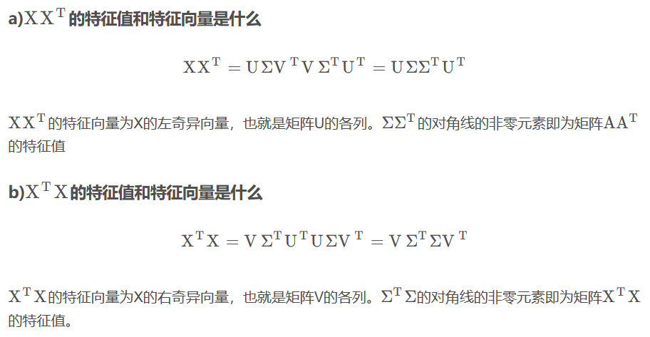

# 模式识别


1.  内积与范数
    - 线性空间 (向量空间, Vector Space): 集合 + 线性结构
        - 加法和数乘, 封闭性
        - 向量, 矩阵, 多项式
    - 度量空间 (Metric Space): 集合 + 拓扑结构 (距离函数)
        - 存在度量函数 $d:V \times V arrow R$, 满足
            - $d(x,y) \geq 0$ (非负性)
            - $d(x,y) = 0\text{ iff }x = y$ (同一性)
            - $d(x,y) = d(y,x)$ (对称性)
            - $d(x,z) \leq d(x,y) + d(y,z)$ (三角不等式)
    - 赋范向量空间 (Normed Vector Space): 向量空间 + 范数
        - 存在范数: $\| \cdot \|:V arrow R$, 满足
            - $\| x \| \geq 0$ (非负性), 且 $\| x \| = 0\text{ iff }x = 0$
            - $\|{ax} \| = |a|\| x \|,a \in R$
                (齐次性)
            - $\|{x + y} \| \leq \| x \| + \| y \|,x,y \in V$ (三角不等式)
        - 根据范数定义距离函数:
            $d(x,y) = \|{x - y} \|$
    - 内积空间 (Inner Product Space): 向量空间 + 内积
        - 存在内积: $\langle 1,1 \rangle:V \times V \to R$, 满足
            - $\langle x,y \rangle = \underset{¯}{\langle y,x \rangle}$ (共轭对称性)
            - $\langle ax,y \rangle = a \langle x,y \rangle,\langle x + y,z \rangle = \langle x,z \rangle + \langle y,z \rangle$ (线性)
            - $\langle x,x \rangle \geq 0,x \in V$ (非负性)
            - $\langle x,x \rangle = 0\text{ iff }x = 0$ (非退化)
        - 根据内积定义范数:
            $\| x \| = \sqrt{\langle x,x \rangle}$
        - 常用内积: $\langle x,y \rangle = x^{T}y$, $\langle f(x),g(x) \rangle = \int f(x)g(x)dx$
        - 性质
            - $\langle x,y \rangle \leq | \langle x,y \rangle | \leq \| x \|\| y \|$
            - $( \sum_{i = 1}^{d}x_{i}y_{i} )^{2} \leq ( \sum_{i = 1}^{d}x_{i}^{2} )( \sum_{i = 1}^{d}y_{i}^{2} ) $ (柯西不等式)
            - $( \int f(x)g(x)dx )^{2} \leq ( \int f^{2}(x)dx )( \int g^{2}(x)dx )$


## 1.1

我们不妨设公式:

$$
f(a) = \sqrt[3]{a + \frac{a + 1}{3}\sqrt{\frac{8a - 1}{3}}} + \sqrt[3]{a - \frac{a + 1}{3}\sqrt{\frac{8a - 1}{3}}}
\tag{1.1}
$$

#### (a)

由于只考虑实数的情况, 虚部为零, 因此有

$$
\frac{8a - 1}{3} \ge 0
$$

则我们可推出对输入的要求:

$$
a \ge \frac{1}{8}
\tag{1.2}
$$


#### (b)

当 $\displaystyle a = \frac{1}{8}$ 时, 带入式 $(1.1)$ 有

$$
f(\frac{1}{8}) = \sqrt[3]{\frac{1}{8}} + \sqrt[3]{\frac{1}{8}} = 1
\tag{1.3}
$$


#### (c)

我们带入方便计算的特殊样例 $\displaystyle a = \frac{1}{2}$ 可得

$$
f(\frac{1}{2}) = \sqrt[3]{\frac{1}{2} + \frac{1}{2}} + \sqrt[3]{\frac{1}{2} - \frac{1}{2}} = 1
$$

同理带入方便计算的特殊样例 $\displaystyle a = \frac{13}{8}$ 可得

$$
f(\frac{13}{8}) = \frac{3}{2} + \frac{\sqrt[3]{-1}}{2} = 1
$$

我们发现两者结果均为 $1$.


#### (d)

这条命令的返回值为 $1.2182 + 0.1260i$.


#### (e)

由于 $(\cdot)^{1 / 3}$ 在 MATLAB 中等价于 $\operatorname{power}(\cdot, 1 / 3)$, 该函数是在复数域内计算, 最终计算结果的误差会累计增大, 得到一个错误的结果, 我们应该使用在实数域计算的函数 $\operatorname{nthroot}(\cdot, n)$, 即使用 

```matlab
a = 3 / 4
f = nthroot(a + (a+1)/3 * sqrt((8*a-1)/3), 3) + ...
    nthroot(a - (a+1)/3 * sqrt((8*a-1)/3), 3)
```

可以算出结果为 $1.0$.

给 $a \ge 0.125$ 带入不同的值, 依然等于这个结果.


#### (f)

由于 $\displaystyle a \ge \frac{1}{8}$, 我们不妨令 $\displaystyle a = \frac{3 x^{2}}{8} + \frac{1}{8}$, 其中 $x \ge 0$, 则有

$$
\begin{aligned}
f(\frac{3 x^{2}}{8} + \frac{1}{8}) & = \sqrt[3]{a + \frac{a + 1}{3}\sqrt{\frac{8a - 1}{3}}} + \sqrt[3]{a - \frac{a + 1}{3}\sqrt{\frac{8a - 1}{3}}} \\
& = \frac{\sqrt[3]{3 x^{2} - (x^{2} + 3) \sqrt{x^{2}} + 1}}{2} + \frac{\sqrt[3]{3 x^{2} + (x^{2} + 3) \sqrt{x^{2}} + 1}}{2}  \\
& = \frac{\sqrt[3]{- (x - 1)^{3}}}{2} + \frac{\sqrt[3]{(x + 1)^{3}}}{2}  \\
& = \frac{1 - x}{2} + \frac{1 + x}{2}  \\
& = 1  \\
\end{aligned}
$$

可见当 $\displaystyle a \ge \frac{1}{8}$ 时有 $f(a) = 1$.


#### (g)

令 $a = 2$ 则有

$$
\begin{aligned}
f(2) & = \sqrt[3]{2 + \frac{2 + 1}{3}\sqrt{\frac{16 - 1}{3}}} + \sqrt[3]{2 - \frac{2 + 1}{3}\sqrt{\frac{16 - 1}{3}}}  \\
& = \sqrt[3]{2 + \sqrt{5}} + \sqrt[3]{2 - \sqrt{5}}  \\
& = 1  \\
\end{aligned}
$$

即该表达式结果为 $1$.


#### (h)

查阅资料后, 得知 Cardano 证明了三次方程

$$
z^{3} + pz + q = 0
$$

其中 $p, q$ 是实数, 且 $\displaystyle \Delta = \frac{q^{2}}{4} + \frac{p^{3}}{27} > 0$ 时, 方程有实根

$$
\sqrt[3]{-\frac{q}{2} + \sqrt{\frac{q^{2}}{4} + \frac{p^{3}}{27}}} + \sqrt[3]{-\frac{q}{2} - \sqrt{\frac{q^{2}}{4} + \frac{p^{3}}{27}}}
$$

因此我们推测式子

$$
f(a) = \sqrt[3]{a + \frac{a + 1}{3}\sqrt{\frac{8a - 1}{3}}} + \sqrt[3]{a - \frac{a + 1}{3}\sqrt{\frac{8a - 1}{3}}}
$$

是某个三次方程的根.

由于 $f(a) = 1$ 在 $a > 0.125$ 时恒成立, 我们可以猜测存在该三次方程存在一个根 $z = 1$.

使用待定系数法, 可得

$$
(z-1)(z^{2}+bz+c) = z^{3} + (b - 1) z^{2} + (c - b) z  - c
$$

令 $b - 1 = 0$, $-c = q$ 可得

$$
(z-1)(z^{2}+z-q) = z^{3} + (-q - 1)z  + q
$$

再观察求根公式与 $f(a)$ 的差异, 我们可以令 $\displaystyle a = -\frac{q}{2}$, 则有

$$
\begin{cases} p = 2a - 1  \\ q = -2a  \end{cases}
$$

则我们可以知道, $f(a)$ 是三次方程

$$
z^{3} + (2a - 1)z - 2a = 0
$$

的一个根, 在 $a > 0.125$ 时恒等于 $1$.

并且经过检验, 该结论成立.


## 习题二


#### (a)

由于 $X \sim \mathcal{N}(0, 1)$, 我们有

$$
\begin{aligned}
P(X \ge \epsilon) & = \int_{\epsilon}^{+\infty}\frac{1}{\sqrt{2\pi}}e^{-t^{2}/2}\mathrm{d}t  \\
& = \int_{0}^{+\infty}\frac{1}{\sqrt{2\pi}}e^{-(x+\epsilon)^{2}/2}\mathrm{d}x \\
& \le e^{-\epsilon^{2} / 2} \int_{0}^{+\infty}\frac{1}{\sqrt{2\pi}}e^{-x^{2}/2}\mathrm{d}x \\
& = \frac{1}{2}e^{-\epsilon^{2} / 2}
\end{aligned}
$$

#### (b)

由于 $X$ 的概率密度函数为 $\displaystyle f(x) = \frac{e^{- x^{2} / 2}}{\sqrt{2\pi}}$, 因此求导有 $f'(x) = -xf(x)$, 则有

$$
\begin{aligned}
P(|X| \ge \epsilon) & = 2\int_{\epsilon}^{+\infty}f(x)\mathrm{d}x = 2 \int_{\epsilon}^{+\infty}\frac{xf(x)}{x}\mathrm{d}x  \\
& \le 2 \int_{\epsilon}^{+\infty}\frac{xf(x)}{\epsilon}\mathrm{d}x = -2 \int_{\epsilon}^{+\infty}\frac{f'(x)}{\epsilon}\mathrm{d}x  \\
& = -\frac{2}{\epsilon}[f(x)]_{\epsilon}^{+\infty}  \\
& = \sqrt{\frac{2}{\pi}}\frac{e^{-\epsilon^{2} / 2}}{\epsilon}  \\
\end{aligned}
$$

因此我们有

$$
P(|X| \ge \epsilon) \le \min\{ 1, \sqrt{\frac{2}{\pi}}\frac{e^{-\epsilon^{2} / 2}}{\epsilon} \}
$$


## 习题三


#### (a)

带入 $x = 0$ 则有

$$
f^{*}(0) = \sup_{x \in \operatorname{dom} f} (y^{\mathrm{T}}x - f(x)) = \sup_{x \in \operatorname{dom} f} - f(x)
$$

两边取负号则有

$$
\inf_{x} f(x) = -f^{*}(0)
$$


#### (b)

当 $x \notin \operatorname{dom}(f)$ 时, 由于 $f(x) = \infty$,

$$
f(x) + f^{*}(y) = \infty \ge x^{\mathrm{T}}y
$$

恒成立.

当 $x \in \operatorname{dom}(f)$ 时,

要证

$$
f(x) + f^{*}(y) \ge x^{\mathrm{T}}y
$$

即证

$$
f^{*}(y) \ge y^{\mathrm{T}}x - f(x)
$$

我们知道

$$
f^{*}(y) = \sup_{x \in \operatorname{dom}f}(y^{\mathrm{T}}x - f(x)) \ge y^{\mathrm{T}}x - f(x)
$$

因此原式成立.


#### (c)

使用 (b) 中的结论 $f(x) + f^{*}(y) \ge x^{\mathrm{T}}y$,

则有对任意 $x, y$ 有

$$
y^{\mathrm{T}}x - f^{*}(y) \le f(x)
$$

因此有

$$
\begin{aligned}
f^{**}(x) & = \sup_{y} (y^{\mathrm{T}}x - f^{*}(y))  \\
& = y^{*T}x - f^{*}(y^{*})  \\
& \le f(x)  \\
\end{aligned}
$$

其中 $y^{*}$ 是使得 $(y^{\mathrm{T}}x - f^{*}(y))$ 取得其中一个上界的 $y$ 值.


## 习题四


#### (a)

1. 最近邻插值: 将拍摄图像中的 $(4i+1, 4j+1)$ 的像素点 $f(4i+1, 4j+1)$ 像素值作为最近邻插值, 插值成为存储图像的 $(i, j)$ 像素点的像素值.
2. 双线性插值: 将拍摄图像中的均值 $[f(4i+1, 4j+1) + f(4i+2, 4j+1) + f(4i+1, 4j+2) + f(4i+2, 4j+2)] / 4$ 的像素值作为双线性插值, 插值成为存储图像的 $(i, j)$ 像素点的像素值.
3. 均值插值: 将拍摄图像中的 $4 \times 4$ 像素点, 类似双线性插值一般取取均值, 插值成为存储图像的 $(i, j)$ 像素点的像素值.


#### (b)

将每 $2 \times 2$ 像素格取均值进行插值, 变为一个 $1 \times 1$ 的像素点. 存储开销能降为原来的 $25\%$.


#### (c)

在训练集上的准确率 $\displaystyle acc_{train} = \frac{9900 + 0}{9900 + 100} \times 100\% = 99\%$

在测试集上的准确率 $\displaystyle acc_{test} = \frac{5000 + 0}{5000 + 5000} \times 100\%= 50\%$


#### (d)

对于在 $n$ 个二分类混淆矩阵上综合考察查准率, 查全率以及准确率等指标的情况, 我们有两种不同的方法.

第一种是 micro 方法, 将自身类作为正类, 其他所有类作为反类, 先计算每一类正例反例的样本数, 其中 $i \in \{ A, B \}$, 得到 $TP_{i}, FP_{i}, TN_{i}, FN_{i}$, 则 micro 准确率为:

$$
\mathrm{micro-}Acc = \frac{\sum_{i}TP_{i}}{\text{total examples}}
$$

第二种是 macro 方法, 先对各类别求出准确率, 得到 $Acc_{i}$, 再取平均值计算出 macro 准确率:

$$
\mathrm{macro-}Acc = \frac{1}{N}\sum_{i}\frac{TP_{i}}{TP_{i} + FP_{i}}
$$

按照 micro 方法, (c) 中训练集的准确率结果为 $\displaystyle \frac{9900 + 0}{9900 + 100} \times 100\% = 99\%$

按照 macro 方法, (c) 中训练集的准确率结果为 $\displaystyle \frac{1}{2} \times (\frac{9900}{9900} + \frac{0}{100}) \times 100\% = 50\%$

因此我们在 (c) 中采用的是 micro 方法.

或者我们通过 F1 来分析, 其中 micro-F1 为先对混淆矩阵的对应元素进行平均, 再进行计算:

$$
\mathrm{micro-}P = \frac{\overline{TP}}{\overline{TP} + \overline{FP}}
$$

$$
\mathrm{micro-}R = \frac{\overline{TP}}{\overline{TP} + \overline{FN}}
$$

$$
\mathrm{micro-}F1 = \frac{2 \times \mathrm{micro-}P \times \mathrm{micro-}R}{\mathrm{micro-}P + \mathrm{micro-}R}
$$

其中 macro-F1 为先在各个混淆矩阵上算出查准率和查全率, 再算平均值:

$$
\mathrm{macro-}P = \frac{1}{N}\sum_{i=1}^{N} P_i
$$

$$
\mathrm{macro-}R = \frac{1}{N}\sum_{i=1}^{N} R_i
$$

$$
\mathrm{macro-}F1 = \frac{2 \times \mathrm{macro-}P \times \mathrm{macro-}R}{\mathrm{macro-}P + \mathrm{macro-}R}
$$

经过计算我们可以算出, 在多分类问题下, 准确率 (accuracy), 查准率 (precision), 查全率 (recall) 以及 F1 的值都是相同的.

这也可以说明我们在 (c) 中采用的是 micro 方法.

#### (e)

我们应该采用 macro 方法来评估准确率. 因为 macro-F1 是计算每一类的 F1 score, 然后再求算术平均, 如果模型在小样本上表现不好, 小样本的 F1 会极大程度上拉低 macro-F1, 这样就能对长尾识别问题中类别不平衡问题进行一定的改善.

并且我们知道, 按照 macro 方法, (c) 中训练集的准确率结果为

$$
\frac{1}{2} \times (\frac{9900}{9900} + \frac{0}{100}) \times 100\% = 50\%
$$

可以看出是通过对各个类别的准确率都赋予了相同的权重, 避免了类别不平衡导致的问题.

为了长尾识别问题中的类别不平衡问题, 我们可以采用以下方法:

1. **重采样**: 对样本少的类别进行又放回的随机采样, 并加入训练集中. 例如此时 $A$ 类有 9900 个样本, $B$ 类有 100 个样本, 我们就可以随机在 $B$ 类上重采样 9800 个样本, 来平衡不同类别的样例. 
2. **欠采样**: 在样本多的类别中取出样本少的类别数目一样的样本用于训练.
3. **代价敏感矩阵**: 给不同的类别的样本赋予不同的权重, 以增加样本少的类别对结果的影响.


## 习题五


#### (a)

$z_1 = (0, -2)$ 的最近邻分类结果为 $x_3 = (0, -1)$ 对应的类别 $A$.

$z_2 = (8, 2)$ 的最近邻分类结果为 $x_7 = (8, 1)$ 对应的类别 $A$.


#### (b)

$z_1 = (0, -2)$ 的 k-近邻分类结果为 k-近邻 $x_1, x_3, x_4$ 投票得到的类别 $A$.

$z_2 = (8, 2)$ 的 k-近邻分类结果为 k-近邻 $x_6, x_7, x_8$ 投票得到的类别 $B$.


#### (c)

$z_1$ 附近都是类别 $A$ 的样本, 因此仍然是分类为类别 $A$ 不变, 但是 $z_2$ 附近只是偶然有一个类别 $A$ 的样本 $x_7$, 但是还有更多的类别为 $B$ 的临近样本 $x_6, x_8$, 因此被分类成类别 $B$.


#### (d)

$x_7$ 可能属于类别 $B$, 可能是在采集数据的时候数据不小心打错了标签. 因此 k-NN 相比于 1-NN 的一个很大的优势就是容错率高, 不容易被偶然的错误样本影响到分类结果.


## 2.1


## 2.2


## 2.6


## 2.10


## 3.2

#### (a)

题目中引入了 $\gamma_{ij}$, 其标识着样本 $\bm{x}_j$ 是否 被分到了第 $i$ 组, 同时引入了 $\bm{\mu}_i$ 作为第 $i$ 组的代表, 因此我们使用 $\gamma_{ij}$ 和 $\bm{\mu}_i$ 对 K-means 的目标进行形式化.

K-means 的目标是每组的样本彼此相似, 即属于相同组的一对样本之间的距离很小. 为了形式化地定义 K-means 的目标, 我们认为 $\bm{\mu}_i$ 表示了聚类的中心, 我们的目标是找到数据点分别属于的聚类, 以及一组向量 $\{ \bm{\mu}_i \}$, 使得每个数据点和它最近的向量 $\bm{\mu}_i$ 之间的距离的平方和最小. 因此, 我们就可以定义一个目标函数

$$
J = \sum_{j=1}^{M}\sum_{i=1}^{K}\gamma_{ij}\left\| \bm{x}_j - \bm{\mu}_i \right\|^{2}
$$

其表示每个数据点和它被分配到的向量 $\bm{\mu}_i$ 之间距离的平方和, 只需要最小化目标函数 $J$ 即可求解出最优 $\gamma_{ij}$ 和 $\bm{\mu}_i$, 进而完成样本的聚类, 即有

$$
\argmin_{\gamma_{ij}, \bm{\mu}_i}\sum_{i=1}^{K}\sum_{j=1}^{M}\gamma_{ij}\left\| \bm{x}_j - \bm{\mu}_i \right\|^{2}
$$

#### (b)

第 i 步:

在固定 $\bm{\mu}_i$ 的情况下, 每个样本 $\bm{x}_j$ 对应的 $J$ 的每一个贡献成分

$$
J_j = \sum_{i=1}^{K}\gamma_{ij}\left\| \bm{x}_j - \bm{\mu}_i \right\|^{2}
$$

互相独立, 因此我们只要最优化每一个 $J_j$ 即可最优化最终的 $J$.

由于 $\displaystyle \sum_{i=1}^{K}\gamma_{ij} = 1$ 且 $\gamma_{ij} \in \{ 0, 1 \}$, 因此 $\{\gamma_{ij}, i = 1, 2, \cdots, K\}$ 中只有一个元素为 $1$, 其他元素均为零. 则我们易知最优化问题

$$
\argmin_{i}\sum_{i=1}^{K}\gamma_{ij}\left\| \bm{x}_j - \bm{\mu}_i \right\|^{2}
$$

与最优化问题

$$
\argmin_{i}\left\| \bm{x}_j - \bm{\mu}_i \right\|^{2}
$$

等价.

因此我们可以简单地将数据点对应的聚类设置为最近的聚类中心, 形式化地表达即为

$$
\gamma_{ij} = \begin{cases} 1, & \text{if } i = \arg\min_{i}\left\| \bm{x}_j - \bm{\mu}_i \right\|^{2} \\ 0, & \text{otherwise}  \end{cases}
$$

第 ii 步:

在固定 $\gamma_{ij}$ 的情况下, $J$ 是一个关于 $\bm{\mu}_i$ 的二次函数, 为了最小化 $J$, 我们只需令 $J$ 关于 $\bm{\mu}_i$ 的导数等于零, 即可有最小值, 即

$$
\frac{\partial J}{\partial \bm{\mu}_i} = 2\sum_{j=1}^{M}\gamma_{ij}(\bm{x}_j - \bm{\mu}_i) = 0
$$

解出 $\bm{\mu}_i$ 即可得这一步的更新规则, 即

$$
\bm{\mu}_i = \frac{\sum_{j=1}^{M}\gamma_{ij}\bm{x}_j}{\sum_{j=1}^{M}\gamma_{ij}}
$$

#### (c)

由上一小问可知损失函数总是单调递减的. 或者我们也可以显式地证明这件事:


**对于第 i 步**:

由于我们有更新后的 $\gamma_{ij}'$:

$$
\gamma_{ij}' = \begin{cases} 1, & \text{if } i = \arg\min_{i}\left\| \bm{x}_j - \bm{\mu}_i \right\|^{2} \\ 0, & \text{otherwise}  \end{cases}
$$

因此新目标函数值减去原目标函数值为

$$
\begin{aligned}
J' - J &= \sum_{i=1}^{K}\sum_{j=1}^{M}\gamma'_{ij}\left\| \bm{x}_j - \bm{\mu}_i \right\|^{2} - \sum_{i=1}^{K}\sum_{j=1}^{M}\gamma_{ij}\left\| \bm{x}_j - \bm{\mu}_i \right\|^{2} \\
&= \sum_{i=1}^{K}\sum_{j=1}^{M}(\gamma'_{ij}-\gamma_{ij})\left\| \bm{x}_j - \bm{\mu}_i \right\|^{2} \\
&= \sum_{i=1}^{K}(\left\| \bm{x}_j - \bm{\mu}_i' \right\|^{2} - \left\| \bm{x}_j - \bm{\mu}_{i} \right\|^{2}) \\
&\le 0
\end{aligned}
$$

其中 $\bm{\mu}_i'$ 是离 $\bm{x}_j$ 最近的簇, 而 $\bm{\mu}_{i}$ 可能是任意一个簇, 因此我们有 $J' \le J$. 即第 i 步会使目标函数 $J$ 的值减小或持平.

**对于第 ii 步**:

对于任意一个簇 $i$ 来说, 它的簇中心原来是 $\bm{\mu}_{i}$, 可能是任意一个向量, 之后被优化为

$$
\bm{\mu}_i' = \frac{\sum_{j=1}^{K}\gamma_{ij}\bm{x}_j}{\sum_{j=1}^{K}\gamma_{ij}}
$$

原来的目标函数可以改写为

$$
J = \sum_{j=1}^{M}\sum_{i=1}^{K}\gamma_{ij}\left\| \bm{x}_j - \bm{\mu}_i \right\|^{2}
$$

即交换求和符号, 这样我们只需要证明 $\displaystyle J_{j} = \sum_{i=1}^{K}\gamma_{ij}\left\| \bm{x}_j - \bm{\mu}_i \right\|^{2}$ 降低或不增加即可.

$$
\begin{aligned}
J_j' - J_j & = \sum_{i=1}^{K}\gamma_{ij}\left\| \bm{x}_j - \bm{\mu}_i' \right\|^{2} - \sum_{i=1}^{K}\gamma_{ij}\left\| \bm{x}_j - \bm{\mu}_i \right\|^{2}  \\
& = \sum_{i=1}^{K}\gamma_{ij}(\left\| \bm{x}_j - \bm{\mu}_i' \right\|^{2} - \left\| \bm{x}_j - \bm{\mu}_i \right\|^{2})  \\
& = \sum_{i=1}^{K}\gamma_{ij}(\bm{x}_j - \bm{\mu}_i' + \bm{x}_j - \bm{\mu}_i)^{\mathrm{T}}(\bm{x}_j - \bm{\mu}_i' - \bm{x}_j + \bm{\mu}_i)  \\
& = \sum_{i=1}^{K}\gamma_{ij}(\bm{\mu}_i - \bm{\mu}_i')^{\mathrm{T}}(2\bm{x}_j - \bm{\mu}_i' - \bm{\mu}_i)  \\
& = (\bm{\mu}_i - \bm{\mu}_i')^{\mathrm{T}}(2(\sum_{i=1}^{K}\gamma_{ij}\bm{x}_j) - (\sum_{i=1}^{K}\gamma_{ij})(\bm{\mu}_i' + \bm{\mu}_i))  \\
& = (\sum_{i=1}^{K}\gamma_{ij})(\bm{\mu}_i - \bm{\mu}_i')^{\mathrm{T}}(2\frac{\sum_{i=1}^{K}\gamma_{ij}\bm{x}_j}{\sum_{i=1}^{K}\gamma_{ij}} - \bm{\mu}_i' - \bm{\mu}_i)  \\
& = (\sum_{i=1}^{K}\gamma_{ij})(\bm{\mu}_i - \bm{\mu}_i')^{\mathrm{T}}(2\bm{\mu}_i' - \bm{\mu}_i' - \bm{\mu}_i)  \\
& = -(\sum_{i=1}^{K}\gamma_{ij})(\bm{\mu}_i - \bm{\mu}_i')^{\mathrm{T}}(\bm{\mu}_i - \bm{\mu}_i')  \\
& \le 0  \\
\end{aligned}
$$

因此我们有 $J_j' - J_j$, 也即有第 ii 步会使目标函数 $J$ 的值降低或不增加.

**下面证明 Lloyd 算法会停止**:

假设算法不会在有限步内停止, 则目标函数的值 $J$ 一直在变化.

由 (1) 可知, 目标函数 $J$ 的值降低或不增加, 又因为 $J$ 一直在变化, 可以将一系列 $J$ 的值视作严格单调递减数列, 由于 $J \ge 0$, 有下界, 因此一定收敛.

并且我们可知, $J$ 的值由簇的分类 $i$ 和簇中心 $\bm{\mu}_i$ 唯一确定, 而 $\displaystyle \bm{\mu}_i = \frac{\sum_{i=1}^{K}\gamma_{ij}\bm{x}_{i}}{\sum_{i=1}^{K}\gamma_{ij}}$, 因此 $\bm{\mu}_i$ 也由 $i$ 唯一确定, 也即 $J$ 由 $i$ 唯一确定, 其中 $j = 1, \cdots, k$.

由于样本 $\bm{x}_j$ 是有限个的, 因此 $i$ 的划分方式是有限个的, 也就是 $J$ 的取值是离散的有限个的值, 再由 $J$ 是严格单调递减数列且有下界可知, 一定会有一个最小值 $J_{\min} \le J$, 对于任何一个 $J$ 值来说. 因此 $J$ 一定会在 $J_{\min}$ 的时候停止, 与假设矛盾.

因此算法会在有限步内停止, 即能够收敛.


## 4.2

#### (a)

由线性回归的模型假设

$$
y = \bm{x}^{\mathrm{T}}\bm{\beta} + \epsilon
$$

可得平方误差

$$
\sum_{i=1}^{n} \epsilon_i^{2} = \sum_{i=1}^{n} (y_i - \bm{x}_i^{\mathrm{T}}\bm{\beta})^{2}
$$


则线性回归任务可以表示为优化问题

$$
\argmin_{\bm{\beta}} \sum_{i=1}^{n} (y_i - \bm{x}_i^{\mathrm{T}}\bm{\beta})^{2}
$$

#### (b)

使用 $\bm{X}$ 和 $\bm{y}$ 重写优化问题即有

$$
\argmin_{\bm{\beta}} (\bm{y} - \bm{X}\bm{\beta})^{\mathrm{T}}(\bm{y} - \bm{X}\bm{\beta})
$$


#### (c)

令平方误差 $\displaystyle E = \sum_{i=1}^{n} \epsilon_i^{2} = (\bm{y} - \bm{X}\bm{\beta})^{\mathrm{T}}(\bm{y} - \bm{X}\bm{\beta})$

为了最小化 $E$, 我们对 $\beta$ 求导且令其等于零向量有

$$
\frac{\partial E}{\partial \bm{\beta}} = 2\bm{X}^{\mathrm{T}}(\bm{X}\bm{\beta} - \bm{y}) = \bm{0}
$$

由于 $\bm{X}^{\mathrm{T}}\bm{X}$ 是可逆的, 则有最优

$$
\bm{\beta}^{*} = (\bm{X}^{\mathrm{T}}\bm{X})^{-1}\bm{X}^{\mathrm{T}}\bm{y}
$$


#### (d)

由于 $d > n$, 且我们知道 $\bm{X}$ 是一个 $n \times d$ 矩阵, 则其秩 $\operatorname{rank}(\bm{X}) \le n < d$.

由矩阵的性质可知 $\operatorname{rank}(\bm{X}^{\mathrm{T}}\bm{X}) = \operatorname{rank}(\bm{X}) \le n < d$.

而我们又知道 $\bm{X}^{\mathrm{T}}\bm{X}$ 是一个 $d \times d$ 的矩阵, 因此 $\bm{X}^{\mathrm{T}}\bm{X}$ 必然不满秩, 因此 $\bm{X}^{\mathrm{T}}\bm{X}$ 不可逆.


#### (e)

该正则项带来的影响为减少模型的复杂度. 在实际问题中, 我们常常会遇到示例相对较少, 而特征较多的情况, 这种情况下 $\bm{X}^{\mathrm{T}}\bm{X}$ 不一定可逆, 因此无法获得唯一的模型参数, 会有多个模型能够 "完美" 拟合训练集中的所有样例. 在加入正则化项之后, 由于正则化表示了对模型的一种偏好, 可以对模型的复杂度进行约束, 因此相对于在多个训练集上表现痛的预测结果的模型中选出模型复杂度最低的一个.


#### (f)

加入正则化项后得到的岭回归的优化问题为

$$
\argmin_{\bm{\beta}} (\bm{y} - \bm{X}\bm{\beta})^{\mathrm{T}}(\bm{y} - \bm{X}\bm{\beta}) + \lambda \bm{\beta}^{\mathrm{T}}\bm{\beta}
$$

为了最小化 $E$, 我们对 $\bm{\beta}$ 求导并令其等于零向量可得

$$
\frac{\partial E}{\partial \bm{\beta}} = 2\bm{X}^{\mathrm{T}}(\bm{X}\bm{\beta} - \bm{y}) + 2\lambda\bm{\beta} = \bm{0}
$$

解得最优

$$
\bm{\beta}^{*} = (\bm{X}^{\mathrm{T}}\bm{X} + \lambda \bm{I})^{-1}\bm{X}^{\mathrm{T}}\bm{y}
$$


#### (g)

当 $\bm{X}^{\mathrm{T}}\bm{X}$ 不可逆时, 我们无法求解普通线性回归, 也即无法获得唯一的模型参数, 会有多个模型能够 "完美" 拟合训练集中的所有样例. 加入岭回归正则项后, $\bm{X}^{\mathrm{T}}\bm{X} + \lambda \bm{I}$ 几乎总是可逆的, 进而可以求解.

在加入正则化项之后, 由于正则化表示了对模型的一种偏好, 可以对模型的复杂度进行约束, 因此相对于在多个训练集上表现痛的预测结果的模型中选出模型复杂度最低的一个.


#### (h)

如果 $\lambda = 0$, 岭回归退化为普通线性回归.

如果 $\lambda = \infty$, 则优化问题变为 $\argmin_{\bm{\beta}} \bm{\beta}^{\mathrm{T}}\bm{\beta}$, 进而只能解出 $\bm{\beta} = \bm{0}$.


#### (i)

不能, 因为联合优化的话岭回归会退化为普通线性回归, 即一定有 $\lambda = 0$.

我们可以使用反证法来说明:

假设我们联合优化后得到最优 $\bm{\beta}^{*}$ 和非零的最优 $\lambda^{*}$, 对应的岭回归损失函数值为

$$
E^{*} = (\bm{y} - \bm{X}\bm{\beta}^{*})^{\mathrm{T}}(\bm{y} - \bm{X}\bm{\beta}^{*}) + \lambda^{*} \bm{\beta}^{*\mathrm{T}}\bm{\beta}^{*}
$$

但是我们令 $\lambda = 0$ 有

$$
(\bm{y} - \bm{X}\bm{\beta}^{*})^{\mathrm{T}}(\bm{y} - \bm{X}\bm{\beta}^{*}) < (\bm{y} - \bm{X}\bm{\beta}^{*})^{\mathrm{T}}(\bm{y} - \bm{X}\bm{\beta}^{*}) + \lambda^{*} \bm{\beta}^{*\mathrm{T}}\bm{\beta}^{*} = E^{*}
$$

则与 $E^{*}$ 是最小岭回归损失矛盾, 因此一定有 $\lambda = 0$.


## 4.5

#### (a)

| 下标 | 类别标记 | 得分 | 查准率 P | 查全率 R | AUC-PR |   AP   |
|-----|----------|------|---------|---------|--------|--------|
| 0   |     -    |  -   | 1.0000  | 0.0000  |    -   |    -   |
| 1   |     1    |  1.0 | 1.0000  | 0.2000  | 0.2000 | 0.2000 |
| 2   |     2    |  0.9 | 0.5000  | 0.2000  | 0.0000 | 0.0000 |
| 3   |     1    |  0.8 | 0.6667  | 0.4000  | 0.1167 | 0.1333 |
| 4   |     1    |  0.7 | 0.7500  | 0.6000  | 0.1417 | 0.1500 |
| 5   |     2    |  0.6 | 0.6000  | 0.6000  | 0.0000 | 0.0000 |
| 6   |     1    |  0.5 | 0.6667  | 0.8000  | 0.1267 | 0.1333 |
| 7   |     2    |  0.4 | 0.5714  | 0.8000  | 0.0000 | 0.0000 |
| 8   |     2    |  0.3 | 0.5000  | 0.8000  | 0.0000 | 0.0000 |
| 9   |     1    |  0.2 | 0.5556  | 1.0000  | 0.1056 | 0.1111 |
| 10  |     2    |  0.1 | 0.5000  | 1.0000  | 0.0000 | 0.0000 |
|  -  |     -    |  -   |    -    |    -    | 0.6906 | 0.7278 |


#### (b)

如表格所示. 由于 AUC-PR 和 AP 都是对 PR 曲线的总结, 因此它们的值确实彼此相似. 但是由于所采取的计算方法不同, 精度估计不同, 最后得到的结果也会有所差异, 例如此处的 AP 就比 AUC-PR 要大 0.0372.

同理我们也可以通过数学推导的方式证明相似:

$$
AUC\_PR = \sum_{i=1}^{n}(r_i-r_{i-1})\frac{p_{i}+p_{i-1}}{2}
$$

$$
AP = \sum_{i=1}^{n}(r_i-r_{i-1})p_{i}
$$

两式相减可得

$$
\begin{aligned}
AP - AUC\_PR & = \sum_{i=1}^{n}(r_i-r_{i-1})p_{i} - \sum_{i=1}^{n}(r_i-r_{i-1})\frac{p_{i}+p_{i-1}}{2}  \\
& = \sum_{i=1}^{n}\frac{1}{2}(r_{i} - r_{i-1})(p_{i} - p_{i-1})  \\
\end{aligned}
$$

可以看出 AP 总是比 AUC-PR 大一点, 但是不会过分地大.

#### (c)

交换了第 9 行和第 10 行的类别标记之后, 新的 AUC-PR 为 0.6794, 新的 AP 为 0.7167.


## 4.6

#### (a)

以下推导均为选定一个训练集上的样本 $\bm{x}$ 的情况下进行的.

我们知道误差是

$$
\mathbb{E}_{D}[(y - f(\bm{x}; D))] = \mathbb{E}_{D}[(F(\bm{x}) - f(\bm{x};D) + \epsilon)^{2}]
$$

因为噪声 $\epsilon$ 独立于其他随机变量, 则有

$$
\begin{aligned}
&\quad\ \mathbb{E}_{D}[(y - f(\bm{x}; D))]  \\
&= \mathbb{E}_{D}[(F(\bm{x}) - f(\bm{x};D) + \epsilon)^{2}]  \\
&= \mathbb{E}_{D}[(F(\bm{x}) - f(\bm{x};D))^{2} + \epsilon^{2} + 2(F(\bm{x}) - f(\bm{x};D))\epsilon]  \\
&= \mathbb{E}_{D}[(F(\bm{x}) - f(\bm{x};D))^{2}] + \sigma^{2}  \\
\end{aligned}
$$

其中, 由于独立性有

$$
\mathbb{E}_{D}[\epsilon^{2}] = (\mathbb{E}_{D}[\epsilon])^{2} + \operatorname{Var}(\epsilon) = \sigma^{2}
$$

以及有

$$
\mathbb{E}_{D}[(F(\bm{x}) - f(\bm{x};D))\epsilon] = \mathbb{E}_{D}[(F(\bm{x}) - f(\bm{x};D))]\mathbb{E}_{D}[\epsilon] = 0
$$

我们进一步展开 $\mathbb{E}_{D}[(F(\bm{x}) - f(\bm{x};D))^{2}]$ 可得

$$
\mathbb{E}_{D}[(F(\bm{x}) - f(\bm{x};D))^{2}] = (\mathbb{E}_{D}[F(\bm{x}) - f(\bm{x};D)])^{2} + \operatorname{Var}(F(\bm{x}) - f(\bm{x};D))
$$

对于右边表达式的第一项, 由于 $F(\bm{x})$ 是确定的, 与训练集 $D$ 无关, 即 $\mathbb{E}_{D}[F(\bm{x})] = F(\bm{x})$, 则有

$$
\begin{aligned}
(\mathbb{E}_{D}[F(\bm{x}) - f(\bm{x};D)])^{2} & = (\mathbb{E}_{D}[F(\bm{x})] - \mathbb{E}_{D}[f(\bm{x};D)])^{2}  \\
& = (F(\bm{x}) - \mathbb{E}_{D}[f(\bm{x};D)])^{2}  \\
\end{aligned}
$$

对于右边表达式的第二项, 由于 $F(\bm{x})$ 是确定的, 在这里可以视为一个常数, 不影响方差, 因此我们有

$$
\operatorname{Var}(F(\bm{x}) - f(\bm{x};D)) = \operatorname{Var}(f(\bm{x};D)) = \mathbb{E}_{D}[(f(\bm{x};D) - \mathbb{E}_{D}[f(\bm{x};D)])^{2}]
$$

综合上面的结果, 我们可以得到偏置-方差分解

$$
\begin{aligned}
&\quad\ \mathbb{E}_{D}[(y - f(\bm{x}; D))] \\
&= (F(\bm{x}) - \mathbb{E}_{D}[f(\bm{x};D)])^{2} + \mathbb{E}_{D}[(f(\bm{x};D) - \mathbb{E}_{D}[f(\bm{x};D)])^{2}] + \sigma^{2}  \\
\end{aligned}
$$

其中第一项为真实标记 $F(\bm{x})$ 与所有训练集 $D$ 下期望输出标记的偏差, 第二项为 $f(\bm{x};D)$ 关于训练集 $D$ 的方差, 第三项为噪声 $\epsilon$ 关于训练集 $D$ 的方差.


#### (b)

$$
\mathbb{E}[f] = \mathbb{E}[\frac{1}{k}\sum_{i=1}^{k}y_{nn(i)}] = \frac{1}{k}\sum_{i=1}^{k}\mathbb{E}[F(\bm{x}_{nn(i)})+\epsilon] = \frac{1}{k}\sum_{i=1}^{k}\mathbb{E}[F(\bm{x}_{nn(i)})]
$$


#### (c)

$$
\begin{aligned}
&\quad\ \mathbb{E}_{D}[(y - f(\bm{x}; D))] \\
&= (F(\bm{x}) - \mathbb{E}_{D}[f(\bm{x};D)])^{2} + \mathbb{E}_{D}[(f(\bm{x};D) - \mathbb{E}_{D}[f(\bm{x};D)])^{2}] + \sigma^{2}  \\
&= (F(\bm{x}) - \frac{1}{k}\sum_{i=1}^{k}\mathbb{E}_{D}[F(\bm{x}_{nn(i)})])^{2} + \mathbb{E}_{D}[\frac{1}{k}(\sum_{i=1}^{k}y_{nn(i)} - \frac{1}{k}\sum_{i=1}^{k}\mathbb{E}_{D}[F(\bm{x}_{nn(i)})])^{2}] + \sigma^{2}  \\
&= (F(\bm{x}) - \frac{1}{k}\sum_{i=1}^{k}\mathbb{E}_{D}[F(\bm{x}_{nn(i)})])^{2} + \frac{1}{k^{2}}\mathbb{E}_{D}[(\sum_{i=1}^{k}(y_{nn(i)} - \mathbb{E}_{D}[F(\bm{x}_{nn(i)})]))^{2}] + \sigma^{2}  \\
\end{aligned}
$$


#### (d)

方差项为

$$
\frac{1}{k^{2}}\mathbb{E}_{D}[(\sum_{i=1}^{k}(y_{nn(i)} - \mathbb{E}_{D}[F(\bm{x}_{nn(i)})]))^{2}]
$$

当 $k$ 增加时, 在训练集上寻找的最近邻数就越多, 就越有可能使得 $y_{nn(i)}$ 与 $\mathbb{E}_{D}[F(\bm{x}_{nn(i)})]$ 项接近, 同时方差项的系数 $\frac{1}{k^{2}}$ 会不断减小, 因此方差项总体会变得平滑, 并且总体上会不断减小.


#### (e)

偏置的平方项为

$$
(F(\bm{x}) - \frac{1}{k}\sum_{i=1}^{k}\mathbb{E}_{D}[F(\bm{x}_{nn(i)})])^{2}
$$

当 $k$ 增加时, 由于寻找的最近邻数变得更多, 因此 $\displaystyle \frac{1}{k}\sum_{i=1}^{k}\mathbb{E}_{D}[F(\bm{x}_{nn(i)})]$ 会逐渐远离 $F(\bm{x})$, 导致偏置的平方项会不断增大.

当 $k = n$ 时, $\displaystyle \frac{1}{k}\sum_{i=1}^{k}\mathbb{E}_{D}[F(\bm{x}_{nn(i)})]$ 会变为样本均值, 此时偏置的平方项会最大.


## 4.9


## 5.3

#### (d)

由于对半正定的实对称矩阵 $\operatorname{Cov}(x)$ 进行特征分解得到的特征矩阵 $\bm{W}$ 是一个 $d \times d$ 的正交矩阵, 因此我们可知保留所有维度的 PCA 是数据在进行平移之后的一个旋转.

我们保留所有维度的 PCA, 也就是进行了一个旋转, 之所以有用, 是因为 PCA 本质是将数据视作了一个多维空间中的椭球, PCA 要做的事情就是将这个椭球的各个轴旋转对齐到坐标轴上 (即将各方差最大的方向对齐到坐标轴上). 如果我们需要进行降维, 那就将这个椭球的几个短轴对应的维度去掉, 保留几个长轴对应的维度, 由于数据已经与坐标轴对齐, 我们可以很简单地将短轴对应的那几个维度对应的数字去掉, 进而得到新的降维后数据. 这就是 PCA 的本质, 这也是 PCA 旋转这一操作有效的原因.


## 5.1




## 5.5


## 6.3

#### (a)

由矩阵 2-范数的定义可知 $\left\| \bm{X} \right\|_{2} = \sigma_1$, 且由矩阵的逆的性质可知 $\left\| \bm{X}^{-1} \right\|_{2} = \frac{1}{\sigma_n}$, 因此有

$$
\kappa_2(\bm{X}) = \left\| \bm{X} \right\|_{2}\left\| \bm{X}^{-1} \right\|_{2} = \frac{\sigma_1}{\sigma_n}
$$


#### (b)

若我们想要求解 $\bm{A}\bm{x} = \bm{b}$, 则有 $\bm{x} = \bm{A}^{-1} \bm{b}$.

我们要说明的就是, 在 $\kappa_2(\bm{A})$ 很大的情况下, 稍微改变 $\bm{A}$ 或 $\bm{b}$ 就会导致 $\bm{x}$ 有很大的改变.

推导可知 (本小问中的 $\left\| \cdot \right\|$ 均指 2-范数 $\left\| \cdot \right\|_{2}$)

$$
\bm{A} \bm{x} = \bm{b}  \\
\bm{A} (\bm{x} + \Delta \bm{x}) = \bm{b} + \Delta \bm{b}  \\
\bm{A} \Delta \bm{x} = \Delta \bm{b}  \\
\Delta \bm{x} = A^{-1} \Delta \bm{b}  \\
$$

由上面的式子可得

$$
\left\| \bm{b} \right\| \le \left\| \bm{A} \right\| \left\| \bm{x} \right\|  \\
\left\| \Delta \bm{x} \right\| \le \left\| \bm{A}^{-1} \right\| \left\| \Delta \bm{b} \right\|  \\
$$

两式相乘再除以 $\left\| \bm{b} \right\| \left\| \bm{x} \right\|$ 可得

$$
\frac{\left\| \Delta \bm{x} \right\|}{\left\| \bm{x} \right\|} \le \left\| \bm{A} \right\| \left\| \bm{A}^{-1} \right\| \frac{\left\| \Delta \bm{b} \right\|}{\bm{b}} = \kappa_2(\bm{A}) \frac{\left\| \Delta \bm{b} \right\|}{\left\| \bm{b} \right\|}
$$

同理我们对 $\bm{A}$ 进行扰动变为 $\bm{A} + \Delta \bm{A}$ 可得

$$
(\bm{A} + \Delta \bm{A})(\bm{x} + \Delta \bm{x}) = \bm{b}  \\
\bm{A}\Delta \bm{x} = -\Delta \bm{A}(\bm{x} + \Delta \bm{x})  \\
\Delta \bm{x} = -\bm{A}^{-1}\Delta \bm{A}(\bm{x} + \Delta \bm{x})  \\
$$

因此我们使用范数不等式并两边除以 $\left\| \bm{x} + \Delta \bm{x} \right\|$ 有

$$
\frac{\left\| \Delta \bm{x} \right\|}{\left\| \bm{x} + \Delta \bm{x} \right\|} \le \left\| \bm{A} \right\| \left\| \bm{A}^{-1} \right\| \frac{\left\| \Delta \bm{A} \right\|}{\left\| \bm{A} \right\|} = \kappa_2(\bm{A}) \frac{\left\| \Delta \bm{A} \right\|}{\left\| \bm{A} \right\|}
$$

可以看出, 当有较小的扰动 $\Delta \bm{A}$ 或者 $\Delta \bm{b}$ 的时候, 尤其是能够取得等号的时候, 均会带来较大的 $\Delta \bm{x}$, 即较小的输入变换就会导致较大的输出变化. 这种变化对我们使用计算机进行一定精度的矩阵计算尤为不利.

例如用 Matlab 求解下列方程时:

$$
\begin{bmatrix} 1 & 1 \\ 1 & 0.999 \\\end{bmatrix}\bm{x} = \begin{bmatrix} 1 \\ 0.999 \end{bmatrix}  \Rightarrow  \bm{x} = \begin{bmatrix} 0 \\ 1 \end{bmatrix}
$$

条件数 $\kappa_2(\bm{A}) = 3998$, 可以看出是一个较大的数.

扰动 $\bm{A}$ 后求解 $\bm{x}$:

$$
\begin{bmatrix} 1.001 & 1.001 \\ 1.001 & 0.999 \\\end{bmatrix}\bm{x} = \begin{bmatrix} 1 \\ 0.999 \end{bmatrix}  \Rightarrow  \bm{x} = \begin{bmatrix} 0.499 \\ 0.500 \end{bmatrix}
$$

扰动 $\bm{b}$ 后求解 $\bm{x}$:

$$
\begin{bmatrix} 1 & 1 \\ 1 & 0.999 \\\end{bmatrix}\bm{x} = \begin{bmatrix} 1.001 \\ 0.999 \end{bmatrix}  \Rightarrow  \bm{x} = \begin{bmatrix} -0.999 \\ +2.000\end{bmatrix}
$$

可以看出, 无论是对 $\bm{A}$ 还是 $\bm{b}$ 做一个轻微的扰动, 均会导致解出来的 $\bm{x}$ 产生较大的变化, 因此这个线性系统是病态的.

#### (c)

对于正交矩阵 $\bm{W}$, 我们有 $\bm{W}^{-1} = \bm{W}^{\mathrm{T}}$, 且 $\bm{W}^{\mathrm{T}}$ 与 $\bm{W}$ 有相同的特征值, 以及 $\bm{W}$ 的奇异值 (特征值) 绝对值为 $1$. 因此有

$$
\kappa_2(\bm{X}) = \left\| \bm{W} \right\|_{2}\left\| \bm{W}^{-1} \right\|_{2} = \left\| \bm{W} \right\|_{2}\left\| \bm{W}^{\mathrm{T}} \right\|_{2} = (\left\| \bm{W} \right\|_{2})^{2} = 1
$$

因此正交矩阵是良态的, 有较小的条件数.


## 6.5

#### (a)

由习题 6.1 可知, $\operatorname{rank}(X) = \operatorname{rank}(X^TX), \operatorname{rank}(X+Y) \leq \operatorname{rank}(X) + \operatorname{rank}(Y), \operatorname{rank}(X^TX) = \operatorname{rank}(XX^T)$

$\because S_w = \sum_i S_i$

$\therefore \operatorname{rank}(S_w) \leq \sum_i \operatorname{rank}(S_i)$

$\because S_i = \sum_{C_{ij}\in C_i}(C_{ij}-\overline C_i)(C_{ij}-\overline C_i)^T$

$
\begin{aligned}
\therefore \operatorname{rank}(S_i) & = \operatorname{rank}(\sum_{C_{ij}\in C_i}(C_{ij}-\overline C_i)(C_{ij}-\overline C_i)^T)  \\
&= \sum_{C_{ij}\in C_i}\operatorname{rank}((C_{ij}-\overline C_i)(C_{ij}-\overline C_i)^T)  \\
&= \sum_{C_{ij}\in C_i}\operatorname{rank}((C_{ij}-\overline C_i)^T(C_{ij}-\overline C_i))  \\
&= \sum_{C_{ij}\in C_i}1
\end{aligned}
$

$\therefore \operatorname{rank}(S_w) \leq \sum_i \operatorname{rank}(S_i) = \sum_i\sum_{C_{ij}\in C_i}1 =N < D$

$\therefore$ 若 $N \leq D ,S_w$ 可逆

#### (b)

$\because S_B = \sum_{c=1}^C(m_c - \overline m)(m_c - \overline m)^T, \overline m = \frac{1}{c}\sum_{c=1}^Cm_c$

$\therefore S_B = \sum_{c=1}^C(m_c - \overline m)(m_c - \overline m)^T   \\
= \sum_{c=1}^C(m_c m_c^T - m_c \overline m^T - m_c^T\overline m + \overline m \overline m^T)  \\
= \sum_{c=1}^Cm_c m_c^T - \sum_{c=1}^C m_c \overline m^T - \sum_{c=1}^Cm_c T\overline m + \sum_{c=1}^C\overline m \overline m^T  \\
= C \overline m \overline m^T - 2 C\overline m \overline m^T + \sum_{c=1}^Cm_c m_c^T  \\
= \sum_{c=1}^C m_c m_c^T - C   \overline m \overline m^T$

$\therefore \operatorname{rank}(S_B) = \operatorname{rank}( \sum_{c=1}^Cm_cm_c T - C  \overline m\overline m^T)   \\
\leq \sum_{c=1}^C\operatorname{rank}(m_cm_c T) - \operatorname{rank}(C  \overline m\overline m^T)  \\
= \sum_{c=1}^C\operatorname{rank}(m_c Tm_c) - \operatorname{rank}(C  \overline m^T\overline m)  \\
= C-1$

#### (c)

由 (a) 可知 $\operatorname{rank}(S_w) \leq \sum_i \operatorname{rank}(S_i) = \sum_i\sum_{C_{ij}\in C_i}1 =N$, 若 $N>D$, 则有可能使得 $\operatorname{rank}(S_w) = D \leq N$ 成立, 则 $S_w$ 可逆. 若 $N \gg D$, 则这种可能性更大, 所以 $S_w$ 可逆的可能性也更大.

#### (d)


这样得到的X不是单位正交的


## 习题一

## 1. 习题一


#### (a)

为了将 PCA 从 1 维推广到多维, 我们由谱分解即可得

$$
\operatorname{Cov}(\bm{x}) = \sum_{i=1}^{D} \lambda_i \xi_i \xi_i^{\mathrm{T}}
$$

我们构造一个矩阵 $\bm{E} = \begin{bmatrix} \bm{\xi}_1 & \bm{\xi}_2 & \cdots & \bm{\xi}_D \\\end{bmatrix}$. 由于实对称矩阵 $\operatorname{Cov}(\bm{x})$ 的特征向量满足 $\bm{\xi}_i^{\mathrm{T}}\bm{\xi}_j = 0, i \neq j$, 因此我们有 $\bm{E}$ 是正交矩阵, 即有 $\bm{E}\bm{E}^{\mathrm{T}} = \bm{E}^{\mathrm{T}}\bm{E} = \bm{I}$.

因此我们有

$$
\begin{aligned}
\bm{x} - \bar{\bm{x}} & = \bm{E}\bm{E}^{\mathrm{T}}(\bm{x} - \bar{\bm{x}})  \\
& = (\sum_{i=1}^{D}\bm{\xi}_i\bm{\xi}_i^{\mathrm{T}})(\bm{x} - \bar{\bm{x}})  \\
& = \bm{\xi}_1\bm{\xi}_1^{\mathrm{T}}(\bm{x} - \bar{\bm{x}}) + \bm{\xi}_2\bm{\xi}_2^{\mathrm{T}}(\bm{x} - \bar{\bm{x}}) + \cdots + \bm{\xi}_D\bm{\xi}_D^{\mathrm{T}}(\bm{x} - \bar{\bm{x}})  \\
& = \bm{\xi}_1^{\mathrm{T}}(\bm{x} - \bar{\bm{x}})\bm{\xi}_1 + \bm{\xi}_2^{\mathrm{T}}(\bm{x} - \bar{\bm{x}})\bm{\xi}_2 + \cdots + \bm{\xi}_D^{\mathrm{T}}(\bm{x} - \bar{\bm{x}})\bm{\xi}_D  \\
\end{aligned}
$$

则有

$$
\bm{y}_i = \bm{x}_i - \bm{\xi}_1^{\mathrm{T}}(\bm{x}_i - \bar{\bm{x}})\bm{\xi}_1 = \bar{\bm{x}} + \sum_{j=2}^{D}\bm{\xi}_j^{\mathrm{T}}(\bm{x}_i - \bar{\bm{x}})\bm{\xi}_j
$$

由于 $\bm{y}_i$ 的均值

$$
\bar{\bm{y}} = \frac{1}{N}\sum_{i=1}^{N} (\bar{\bm{x}} + \sum_{i=2}^{D}\bm{\xi}_i^{\mathrm{T}}(\bm{x}_i - \bar{\bm{x}})\bm{\xi}_i) = \bar{\bm{x}} + \sum_{i=2}^{D}\bm{\xi}_i^{\mathrm{T}}(\frac{1}{N}\sum_{i=1}^{N} \bm{x}_i - \bar{\bm{x}})\bm{\xi}_i = \bar{\bm{x}}
$$

并且由特征值和特征向量的定义有

$$
\operatorname{Cov}(\bm{x})\bm{\xi}_j = \frac{1}{N}\sum_{i=1}^{N}(\bm{x}_i - \bar{\bm{x}})(\bm{x}_i - \bar{\bm{x}})^{\mathrm{T}} \bm{\xi}_j = \lambda_j \bm{\xi}_j
$$

因此有

$$
\begin{aligned}
\operatorname{Cov}(\bm{y}) & = \frac{1}{N}\sum_{i=1}^{N}(\bm{y}_i-\bar{\bm{y}})(\bm{y}_i-\bar{\bm{y}})^{\mathrm{T}}  \\
& = \frac{1}{N}\sum_{i=1}^{N}(\bm{y}_i-\bar{\bm{x}})(\bm{y}_i-\bar{\bm{x}})^{\mathrm{T}}  \\
& = \frac{1}{N}\sum_{i=1}^{N}(\sum_{j=2}^{D}\bm{\xi}_j^{\mathrm{T}}(\bm{x}_i - \bar{\bm{x}})\bm{\xi}_j)(\sum_{k=2}^{D}\bm{\xi}_k^{\mathrm{T}}(\bm{x}_i - \bar{\bm{x}})\bm{\xi}_k)^{\mathrm{T}}  \\
& = \frac{1}{N}\sum_{i=1}^{N}\sum_{j=2}^{D}\bm{\xi}_j^{\mathrm{T}}(\bm{x}_i - \bar{\bm{x}})\bm{\xi}_j\bm{\xi}_j^{\mathrm{T}}(\bm{x}_i - \bar{\bm{x}})^{\mathrm{T}}\bm{\xi}_j  \\
& = \frac{1}{N}\sum_{i=1}^{N}\sum_{j=2}^{D}\bm{\xi}_j\bm{\xi}_j^{\mathrm{T}}(\bm{x}_i - \bar{\bm{x}})(\bm{x}_i - \bar{\bm{x}})^{\mathrm{T}}\bm{\xi}_j\bm{\xi}_j^{\mathrm{T}}  \\
& = \sum_{j=2}^{D}\lambda_j\bm{\xi}_j\bm{\xi}_j^{\mathrm{T}}\bm{\xi}_j\bm{\xi}_j^{\mathrm{T}}  \\
& = \sum_{i=2}^{D}\lambda_i\bm{\xi}_i\bm{\xi}_i^{\mathrm{T}}  \\
\end{aligned}
$$


#### (b)

代码输出如下:

```txt
second eigenvalue of X: 3.2500000000000013
second eigenvector of X: [ 1.96116135e-01 -9.80580676e-01 -1.16380915e-17]
first eigenvalue of Y: 3.25
first eigenvector of Y: [ 1.96116135e-01 -9.80580676e-01  5.45191062e-16]
```


## 2. 习题二


#### (a)

由于 $S_w$ 是正定的实对称矩阵, 因此存在 Cholesky 分解 $S_w = LL^{\mathrm{T}}$, $L$ 满秩.

则原式可以改写为

$$
S_{B} w = \lambda LL^{\mathrm{T}}w
$$

我们令 $y = L^{\mathrm{T}} w$, 则有

$$
L^{-1} S_{B}(L^{\mathrm{T}})^{-1} y = \lambda y
$$

这是一个标准特征值问题.

由于 $L^{-1} S_{B}(L^{\mathrm{T}})^{-1}$ 也为实对称矩阵, 因此对于特征值 $\lambda_1 \ge \lambda_2 \ge \cdots \ge \lambda_n$, 一定存在一组归一化的正交向量 $y_1, y_2, \cdots, y_n$ 满足

$$
y_i^{\mathrm{T}}y_j = \begin{cases} 1, & i=j \\ 0, & i\neq j \end{cases}
$$

我们使用 $w = (L^{\mathrm{T}})^{-1} y$ 还原 $w$ 得到


$$
y_i^{\mathrm{T}}y_j = (w_i^{\mathrm{T}}L)(L^{\mathrm{T}}w_j) = w_i^{\mathrm{T}}S_w w_j = \begin{cases} 1, & i=j \\ 0, & i\neq j \end{cases}
$$

因此广义特征向量之间带权正交.


#### (b)

由于 $y_1, y_2, \cdots, y_n$ 正交, 因此 $w_1, w_2, \cdots, w_n$ 线性无关, 则有 $\forall w \in \mathbb{R}^{n}$ 均存在 $a_1,a_2,\cdots,a_n \in \mathbb{R}$ 使得

$$
w = \sum_{i=1}^{n}a_i w_i
$$

因此我们有

$$
w^{\mathrm{T}} S_{w} w = (\sum_{i=1}^{n}a_i w_i)^{\mathrm{T}} S_{w} (\sum_{j=1}^{n}a_j w_j) = \sum_{i=1}^{n}\sum_{j=1}^{n}a_i a_j w_i^{\mathrm{T}} S_{w} w_j = \sum_{i=1}^{n}a_i^{2}
$$

$$
w^{\mathrm{T}}S_{B} w = \sum_{i=1}^{n}\sum_{j=1}^{n}a_i a_j w_i^{\mathrm{T}} S_{B} w_j = \sum_{i=1}^{n}\sum_{j=1}^{n}a_i a_j w_i^{\mathrm{T}} \lambda_j S_{w} w_j = \sum_{i=1}^{n}\lambda_i a_i^{2}
$$

因此可将广义瑞利商改写为

$$
J(w) = \frac{w^{\mathrm{T}}S_{B} w}{w^{\mathrm{T}} S_w w} = \frac{\sum_{i=1}^{n}\lambda_i a_i^{2}}{\sum_{i=1}^{n}a_i^{2}}
$$

由于我们有 $\lambda_1 \ge \lambda_2 \ge \cdots \ge \lambda_n$, 因此易得

$$
\lambda_1 = \frac{\sum_{i=1}^{n}\lambda_1 a_i^{2}}{\sum_{i=1}^{n}a_i^{2}} \ge \frac{\sum_{i=1}^{n}\lambda_i a_i^{2}}{\sum_{i=1}^{n}a_i^{2}} \ge \frac{\sum_{i=1}^{n}\lambda_n a_i^{2}}{\sum_{i=1}^{n}a_i^{2}} = \lambda_n
$$

当 $a_1 \neq 0, a_i = 0, i = 2, 3, \cdots, n$ 时 $J(w) = \max J(w) = \lambda_1$

当 $a_n \neq 0, a_i = 0, i = 1, 2, \cdots, n - 1$ 时 $J(w) = \min J(w) = \lambda_n$

因此广义瑞利商 $J(w)$ 的最大值为 $\lambda_1$, 最小值为 $\lambda_n$.


#### (c)

这里没有说清楚 $|\cdot |$ 具体的含义, 如果是指矩阵范数中的 $\operatorname{tr}(\cdot)$, 则有

$$
J = \frac{\operatorname{tr}(W^{\mathrm{T}}S_{B}W)}{\operatorname{tr}(W^{\mathrm{T}}S_{w}W)} = \frac{\sum_{i=1}^{n} w_i^{\mathrm{T}}S_{B}w_i}{\sum_{i=1}^{n} w_i^{\mathrm{T}}S_{w}w_i} = \frac{\sum_{i=1}^{n} w_i^{\mathrm{T}}\lambda_i S_{w}w_i}{\sum_{i=1}^{n} w_i^{\mathrm{T}}S_{w}w_i} = \frac{1}{n}\sum_{i=1}^{n}\lambda_i
$$

如果是指行列式, 则有

$$
J = \frac{|W^{\mathrm{T}}S_{B}W|}{|W^{\mathrm{T}}S_{w}W|} = \prod_{i=1}^{n} \lambda_i
$$


## 3. 习题三


#### (a)

$\kappa$ 是合法的核函数.

证明:

对于任意 $n$ 和 $\{ \bm{x}_1, \bm{x}_2, \cdots, \bm{x}_{n} \}$,

因为 $\kappa_1$ 和 $\kappa_2$ 是核函数, 因此其对应的核矩阵 $\bm{K}_1$ 和 $\bm{K}_2$ 是半正定矩阵,

即有 $\bm{y}^{\mathrm{T}} \bm{K}_1 \bm{y} \ge 0$ 与 $\bm{y}^{\mathrm{T}} \bm{K}_2 \bm{y} \ge 0$, 对于任何 $n$ 维向量 $\bm{y}$ 成立.

因为 $\kappa(\bm{x}_i, \bm{x}_j) = \kappa_1(\bm{x}_i, \bm{x}_j)+ \kappa_2(\bm{x}_i, \bm{x}_j)$,

所以有 $\bm{K}_{ij} = \kappa(\bm{x}_i, \bm{x}_j) = \kappa_1(\bm{x}_i, \bm{x}_j) + \kappa_2(\bm{x}_i, \bm{x}_j)$

因此有 $\bm{K} = \bm{K}_1 + \bm{K}_2$.

则我们有 $\bm{y}^{\mathrm{T}}\bm{K}\bm{y} = \bm{y}^{\mathrm{T}}(\bm{K}_1 + \bm{K}_2)\bm{y} = \bm{y}^{\mathrm{T}}\bm{K}_1\bm{y} + \bm{y}^{\mathrm{T}}\bm{K}_2\bm{y} \ge 0$

所以可知 $\bm{K}$ 也是半正定矩阵, $\kappa$ 是合法的核函数.


#### (b)

$\kappa$ 不是合法的核函数.

证明:

令 $\kappa_1(\bm{x}, \bm{y}) = 0, \kappa_2(\bm{x}, \bm{y}) = \bm{x}^{\mathrm{T}}\bm{y}$, 易知两者均为合法的核函数, 则我们有 $\kappa(\bm{x}, \bm{y}) = \kappa_1(\bm{x}, \bm{y}) - \kappa_2(\bm{x}, \bm{y}) = -\bm{x}^{\mathrm{T}}\bm{y}$, 不妨令 $d = 2$.

则存在两个样本 $\bm{x}_1 = (1, 0)^{\mathrm{T}}, \bm{x}_2 = (0, 1)^{\mathrm{T}}$, 其对应的核矩阵为

$\bm{K} = \begin{bmatrix} -1 & 0 \\ 0 & -1 \\\end{bmatrix}$

令 $\bm{y} = (1, 0)^{\mathrm{T}}$, 我们有 $\bm{y}^{\mathrm{T}}\bm{K}\bm{y} = -1 < 0$

因此 $\bm{K}$ 不是一个半正定矩阵, 也即 $\kappa$ 不是合法的核函数.

#### (b)

$\kappa$ 不是合法的核函数.

证明:

我们只需要举出一个反例.

令 $\kappa_1(\bm{x}, \bm{y}) = 0, \kappa_2(\bm{x}, \bm{y}) = \bm{x}^{\mathrm{T}}\bm{y}$, 易知两者均为合法的核函数, 则我们有 $\kappa(\bm{x}, \bm{y}) = \kappa_1(\bm{x}, \bm{y}) - \kappa_2(\bm{x}, \bm{y}) = -\bm{x}^{\mathrm{T}}\bm{y}$, 不妨令 $d = 2$.

则存在两个样本 $\bm{x}_1 = (1, 0)^{\mathrm{T}}, \bm{x}_2 = (0, 1)^{\mathrm{T}}$, 其对应的核矩阵为

$\bm{K} = \begin{bmatrix} -1 & 0 \\ 0 & -1 \\\end{bmatrix}$

令 $\bm{y} = (1, 0)^{\mathrm{T}}$, 我们有 $\bm{y}^{\mathrm{T}}\bm{K}\bm{y} = -1 < 0$

因此 $\bm{K}$ 不是一个半正定矩阵, 也即 $\kappa$ 不是合法的核函数.


#### (c)

$\kappa$ 是合法的核函数.

证明:

对于任意 $n$ 和 $\{ \bm{x}_1, \bm{x}_2, \cdots, \bm{x}_{n} \}$,

因为 $\kappa_1$ 是核函数, 因此其对应的核矩阵 $\bm{K}_1$ 是半正定矩阵,

即有 $\bm{y}^{\mathrm{T}} \bm{K}_1 \bm{y} \ge 0$, 对于任何 $n$ 维向量 $\bm{y}$ 成立.

因为 $\kappa(\bm{x}_i, \bm{x}_j) = \alpha\kappa_1(\bm{x}_i, \bm{x}_j)$,

所以有 $\bm{K}_{ij} = \kappa(\bm{x}_i, \bm{x}_j) = \alpha\kappa_1(\bm{x}_i, \bm{x}_j)$

因此有 $\bm{K} = \alpha\bm{K}_1$.

因为 $\alpha \in \mathbb{R}^{+}$ 是一个正实数,

则我们有 $\bm{y}^{\mathrm{T}}\bm{K}\bm{y} = \bm{y}^{\mathrm{T}}(\alpha\bm{K}_1)\bm{y} = \alpha\bm{y}^{\mathrm{T}}\bm{K}_1\bm{y} \ge 0$

所以可知 $\bm{K}$ 也是半正定矩阵, $\kappa$ 是合法的核函数.


#### (d)

$\kappa$ 不是合法的核函数.

证明:

我们只需要举出一个反例.

令 $\alpha = 1$ 以及 $\kappa_1(\bm{x}, \bm{y}) = \bm{x}^{\mathrm{T}}\bm{y}$, 易知其为合法的核函数, 则我们有 $\kappa(\bm{x}, \bm{y}) = -\alpha\kappa_1(\bm{x}, \bm{y})= -\bm{x}^{\mathrm{T}}\bm{y}$, 不妨令 $d = 2$.

则存在两个样本 $\bm{x}_1 = (1, 0)^{\mathrm{T}}, \bm{x}_2 = (0, 1)^{\mathrm{T}}$, 其对应的核矩阵为

$\bm{K} = \begin{bmatrix} -1 & 0 \\ 0 & -1 \\\end{bmatrix}$

令 $\bm{y} = (1, 0)^{\mathrm{T}}$, 我们有 $\bm{y}^{\mathrm{T}}\bm{K}\bm{y} = -1 < 0$

因此 $\bm{K}$ 不是一个半正定矩阵, 也即 $\kappa$ 不是合法的核函数.


#### (e)

$\kappa$ 是合法的核函数.

证明:

对于任意 $n$ 和 $\{ \bm{x}_1, \bm{x}_2, \cdots, \bm{x}_{n} \}$,

因为 $\kappa_1$ 和 $\kappa_2$ 是核函数, 因此其对应的核矩阵 $\bm{K}_1$ 和 $\bm{K}_2$ 是半正定矩阵,

因为 $\kappa(\bm{x}_i, \bm{x}_j) = \kappa_1(\bm{x}_i, \bm{x}_j) \kappa_2(\bm{x}_i, \bm{x}_j)$,

所以有 $\bm{K}_{ij} = \kappa(\bm{x}_i, \bm{x}_j) = \kappa_1(\bm{x}_i, \bm{x}_j)\kappa_2(\bm{x}_i, \bm{x}_j)$

因此有 $\bm{K} = \bm{K}_1 \circ \bm{K}_2$, 即 $\bm{K}_1$ 与 $\bm{K}_2$ 的逐元素相乘.

则我们可证明 Schur 乘积定理:

对于 $\mathbb{R}^{n \times n}$ 上的半正定矩阵 $\bm{A}$ 与 $\bm{B}$, 对于 $\forall \bm{x} \in \mathbb{R}^{n}$, 我们可以证明 $\bm{C} = \bm{A} \circ \bm{B}$ 半正定.

由于 $\bm{A}$ 为半正定矩阵, 因此存在 $\bm{U} \in \mathbb{R}^{n}$ 使得 $\bm{A} = \bm{U}^{\mathrm{T}}\bm{U}$.

$
\begin{aligned}
\bm{x}^{\mathrm{T}}\bm{C}\bm{x} & = \sum_{i=1}^{n}\sum_{j=1}^{n}a_{ij}b_{ij}x_i x_j  \\
& = \sum_{i=1}^{n}\sum_{j=1}^{n}\sum_{k=1}^{n} u_{ki}u_{kj}b_{ij}x_i x_j  \\
& = \sum_{k=1}^{n}[\sum_{i=1}^{n}\sum_{j=1}^{n} b_{ij} (u_{ki}x_i) (u_{kj} x_j)]  \\
& \ge 0  \\
\end{aligned}
$

即 $\bm{C} = \bm{A} \circ \bm{B}$ 半正定.

所以同理可知 $\bm{K}$ 也是半正定矩阵, $\kappa$ 是合法的核函数.


#### (f)

$\kappa$ 是合法的核函数.

证明:

对于任意 $n$ 和 $\{ \bm{x}_1, \bm{x}_2, \cdots, \bm{x}_{n} \}$, 通过核函数 $\kappa(\bm{x}, \bm{y}) = \kappa_3(\phi(\bm{x}), \phi(\bm{y}))$ 得到的 $\bm{K}$ 为

$[\bm{K}]_{ij} = \kappa_3(\phi(\bm{x}_i), \phi(\bm{x}_j))$

我们使用函数 $\phi(\cdot)$ 处理得到 $\{ \phi(\bm{x}_1), \phi(\bm{x}_2), \cdots, \phi(\bm{x}_{n}) \}$, 这也是一组样本集合, 因此通过核函数 $\kappa_3$ 得到的 $\bm{K}_3$ 是半正定矩阵, 其中

$[\bm{K}_3]_{ij} = \kappa_3(\phi(\bm{x}_i), \phi(\bm{x}_j))$

可见 $\bm{K} = \bm{K}_3$.

所以可知 $\bm{K}$ 也是半正定矩阵, $\kappa$ 是合法的核函数.


## 4. 习题四


#### (a)

我们对每个样例 $(\bm{x}_i, y_i)$ 附上一个代价系数 $k_i$,

其中 $\displaystyle k_i = \begin{cases} 1, & y_i = +1 \\ k, & y_i = -1 \end{cases}$ 也即 $\displaystyle k_i = 1 - \frac{1}{2}(k - 1)(y_i - 1)$.

然后相应的 SVM 优化问题即可改为

$$
\begin{aligned}
\min_{\bm{w}, b, \xi_i} &\quad \frac{1}{2}\bm{w}^{\mathrm{T}}\bm{w} + C\sum_{i=1}^{n}k_i\xi_i \\
\text{s.t.}
&\quad y_i(\bm{w}^{\mathrm{T}}\bm{x}_i + b) \ge 1 - \xi_i, & 1 \le i \le n  \\
&\quad \xi_i \ge 0, & 1 \le i \le n  \\
\end{aligned}
$$

#### (b)

通过拉格朗日乘子法得到拉格朗日函数

$$
\begin{aligned}
L(\bm{w}, b, \bm{\alpha}, \bm{\xi}, \bm{\mu}) & = \frac{1}{2}\bm{w}^{\mathrm{T}}\bm{w} + C\sum_{i=1}^{n}k_i\xi_i  \\
& \quad +\sum_{i=1}^{n}\alpha_i(1-\xi_i-y_i(\bm{w}^{\mathrm{T}}\bm{x}_i + b)) - \sum_{i=1}^{n}\mu_i\xi_i  \\
\end{aligned}
$$

其中 $\alpha_i \ge 0, \mu_i \ge 0$ 是拉格朗日乘子.

令 $L(\bm{w}, b, \bm{\alpha}, \bm{\xi}, \bm{\mu})$ 对 $\bm{w}, b, \xi_i$ 的偏导等于零可得

$$
\bm{w} = \sum_{i=1}^{n}\alpha_i y_i \bm{x}_i
$$

$$
0 = \sum_{i=1}^{n}\alpha_i y_i
$$

$$
k_i C = \alpha_i + \mu_i
$$

将上三式逐步带入有

$$
\begin{aligned}
&\quad L(\bm{w}, b, \bm{\alpha}, \bm{\xi}, \bm{\mu}) \\
&= \frac{1}{2} \left\| \bm{w} \right\|_{2}^{2} + C\sum_{i=1}^{n}k_i\xi_i + \sum_{i=1}^{n}\alpha_i(1-\xi_i-y_i(\bm{w}^{\mathrm{T}}\bm{x}_i + b)) - \sum_{i=1}^{n}\mu_i\xi_i \\
&= \frac{1}{2} \left\| \bm{w} \right\|_{2}^{2} + \sum_{i=1}^{n}\alpha_i(1-y_i(\bm{w}^{\mathrm{T}}\bm{x}_i + b)) + C\sum_{i=1}^{n}k_i\xi_i - \sum_{i=1}^{n}\alpha_i\xi_i - \sum_{i=1}^{n}\mu_i\xi_i \\
&= -\frac{1}{2}\sum_{i=1}^{n}\alpha_i y_i \bm{x}_i^{\mathrm{T}}\sum_{i=1}^{n}\alpha_i y_i \bm{x}_i + \sum_{i=1}^{n}\alpha_i + \sum_{i=1}^{n}k_i C \xi_i - \sum_{i=1}^{n}\alpha_i\xi_i - \sum_{i=1}^{n}\mu_i\xi_i \\
&= -\frac{1}{2}\sum_{i=1}^{n}\alpha_i y_i \bm{x}_i^{\mathrm{T}}\sum_{i=1}^{n}\alpha_i y_i \bm{x}_i + \sum_{i=1}^{n}\alpha_i + \sum_{i=1}^{n}(k_i C - \alpha_i - \mu_i)\xi_i \\
&= \sum_{i=1}^{n}\alpha_i - \frac{1}{2}\sum_{i=1}^{n}\sum_{j=1}^{n}\alpha_i\alpha_j y_i y_j\bm{x}_i^{\mathrm{T}}\bm{x}_j \\
\end{aligned}
$$

又因为 $\alpha_i \ge 0, \mu_i \ge 0, k_i C = \alpha_i + \mu_i$,

消去 $\mu_i$ 即可得到约束条件 $0 \le \alpha_i \le k_i C$.

因此对偶问题为

$$
\begin{aligned}
\max_{\bm{\alpha}} &\quad \sum_{i=1}^{n}\alpha_i - \frac{1}{2}\sum_{i=1}^{n}\sum_{j=1}^{n}\alpha_i\alpha_j y_i y_j\bm{x}_i^{\mathrm{T}}\bm{x}_j\\
\text{s.t.}
&\quad \sum_{i=1}^{n}\alpha_i y_i = 0, & 1 \le i \le n  \\
&\quad 0 \le \alpha_i \le k_i C, & 1 \le i \le n  \\
\end{aligned}
$$

其中 $\displaystyle k_i = \begin{cases} 1, & y_i = +1 \\ k, & y_i = -1 \end{cases}$ 也即 $\displaystyle k_i = 1 - \frac{1}{2}(k - 1)(y_i - 1)$.

根据 (a) 中的原优化问题所需满足的条件 $y_i(\bm{w}^{\mathrm{T}}\bm{x}_i + b) \ge 1 - \xi_i$ 可知 KKT 条件 $\alpha_i(y_i f(\bm{x}_i) - 1 + \xi_i) = 0$, 根据 $\xi_i \ge 0$ 可知 $\mu_i \xi_i = 0$.

因此, KKT 条件要求

$$
\begin{cases}
\alpha_i \ge 0, \mu_i \ge 0,  \\
y_i f(\bm{x}_i) - 1 + \xi_i \ge 0,  \\
\alpha_i(y_i f(\bm{x}_i) - 1 + \xi_i) = 0,  \\
\xi_i \ge 0, \mu_i \xi_i = 0.
\end{cases}
$$


## 5. 习题五


#### (a)

朴素贝叶斯的基本假设是 "属性条件独立性假设": 对已知类别, 假设所有属性相互独立, 即假设每个属性独立地对分类结果发生影响.

优点是能够缓解计算联合概率时的组合爆炸问题或数据上的样本稀疏问题, 能够用较少的样本就计算出置信度较高的结果; 局限是由于使用了样本属性独立性的假设, 而这个假设在实际应用中往往是不成立的, 所以如果样本属性有关联时, 朴素贝叶斯的效果不好.

朴素贝叶斯是参数化的, 因为朴素贝叶斯的参数个数在分类类数, 样本维度等给定的情况下, 参数个数不会随着样本个数的增长而增长, 也即参数空间的维度不是无限的.


#### (b)

先验概率: $P(A) = \frac{4}{12} = \frac{1}{3}, P(B) = \frac{4}{12} = \frac{1}{3}, P(C) = \frac{4}{12} = \frac{1}{3}$

类别 $A$ 属性 1:

均值 $\mu_{A,1} = \frac{1}{4} \cdot (1 + 2 + 3 + 4) = 2.5$

方差 $\sigma_{A,1}^{2} = \frac{1}{4} \cdot [(1 - 2.5)^{2} + (2 - 2.5)^{2} + (3 - 2.5)^{2} + (4 - 2.5)^{2}] = 1.25$

类别 $A$ 属性 2:

均值 $\mu_{A,2} = \frac{1}{4} \cdot (2 + 3 + 4 + 5) = 3.5$

方差 $\sigma_{A,1}^{2} = \frac{1}{4} \cdot [(2 - 3.5)^{2} + (3 - 3.5)^{2} + (4 - 3.5)^{2} + (5 - 3.5)^{2}] = 1.25$

类别 $B$ 属性 1:

均值 $\mu_{B,1} = \frac{1}{4} \cdot (1 + 2 + 3 + 4) = 2.5$

方差 $\sigma_{B,1}^{2} = \frac{1}{4} \cdot [(1 - 2.5)^{2} + (2 - 2.5)^{2} + (3 - 2.5)^{2} + (4 - 2.5)^{2}] = 1.25$

类别 $B$ 属性 2:

均值 $\mu_{B,2} = \frac{1}{4} \cdot (4 + 5 + 6 + 7) = 5.5$

方差 $\sigma_{B,2}^{2} = \frac{1}{4} \cdot [(4 - 5.5)^{2} + (5 - 5.5)^{2} + (6 - 5.5)^{2} + (7 - 5.5)^{2}] = 1.25$

类别 $C$ 属性 1:

均值 $\mu_{C,1} = \frac{1}{4} \cdot (4 + 5 + 6 + 7) = 5.5$

方差 $\sigma_{C,1}^{2} = \frac{1}{4} \cdot [(4 - 5.5)^{2} + (5 - 5.5)^{2} + (6 - 5.5)^{2} + (7 - 5.5)^{2}] = 1.25$

类别 $C$ 属性 2:

均值 $\mu_{C,2} = \frac{1}{4} \cdot (1 + 2 + 3 + 4) = 2.5$

方差 $\sigma_{C,2}^{2} = \frac{1}{4} \cdot [(1 - 2.5)^{2} + (2 - 2.5)^{2} + (3 - 2.5)^{2} + (4 - 2.5)^{2}] = 1.25$

因此对于样本 $\bm{x} = (2, 2)$ 和 $\bm{y} = (6, 1)$ 有

$p_{x_1|A} = \frac{1}{\sqrt{2\pi} \sqrt{1.25}}\exp(-\frac{(2 - 2.5)^{2}}{2 \times  1.25}) \approx 0.323$

$p_{x_1|B} = \frac{1}{\sqrt{2\pi} \sqrt{1.25}}\exp(-\frac{(2 - 2.5)^{2}}{2 \times  1.25}) \approx 0.323$

$p_{x_1|C} = \frac{1}{\sqrt{2\pi} \sqrt{1.25}}\exp(-\frac{(2 - 5.5)^{2}}{2 \times  1.25}) \approx 0.003$

$p_{x_2|A} = \frac{1}{\sqrt{2\pi} \sqrt{1.25}}\exp(-\frac{(2 - 3.5)^{2}}{2 \times  1.25}) \approx 0.145$

$p_{x_2|B} = \frac{1}{\sqrt{2\pi} \sqrt{1.25}}\exp(-\frac{(2 - 5.5)^{2}}{2 \times  1.25}) \approx 0.003$

$p_{x_2|C} = \frac{1}{\sqrt{2\pi} \sqrt{1.25}}\exp(-\frac{(2 - 2.5)^{2}}{2 \times  1.25}) \approx 0.323$

$p_{y_1|A} = \frac{1}{\sqrt{2\pi} \sqrt{1.25}}\exp(-\frac{(6 - 2.5)^{2}}{2 \times  1.25}) \approx 0.003$

$p_{y_1|B} = \frac{1}{\sqrt{2\pi} \sqrt{1.25}}\exp(-\frac{(6 - 2.5)^{2}}{2 \times  1.25}) \approx 0.003$

$p_{y_1|C} = \frac{1}{\sqrt{2\pi} \sqrt{1.25}}\exp(-\frac{(6 - 5.5)^{2}}{2 \times  1.25}) \approx 0.323$

$p_{y_2|A} = \frac{1}{\sqrt{2\pi} \sqrt{1.25}}\exp(-\frac{(1 - 3.5)^{2}}{2 \times  1.25}) \approx 0.029$

$p_{y_2|B} = \frac{1}{\sqrt{2\pi} \sqrt{1.25}}\exp(-\frac{(1 - 5.5)^{2}}{2 \times  1.25}) \approx 0.0001$

$p_{y_2|C} = \frac{1}{\sqrt{2\pi} \sqrt{1.25}}\exp(-\frac{(1 - 2.5)^{2}}{2 \times  1.25}) \approx 0.145$

于是我们有

$P(A) \times p_{x_1|A} \times p_{x_2|A} \approx 0.016$

$P(B) \times p_{x_1|B} \times p_{x_2|B} \approx 0.00029$

$P(C) \times p_{x_1|C} \times p_{x_2|C} \approx 0.00029$

$P(A) \times p_{y_1|A} \times p_{y_2|A} \approx 2.59 \cdot 10^{-5}$

$P(B) \times p_{y_1|B} \times p_{y_2|B} \approx 9.59 \cdot 10^{-8}$

$P(C) \times p_{y_1|C} \times p_{y_2|C} \approx 0.016$

所以 $\bm{x} = (2, 2)$ 被分类为 $A$ 类, $\bm{y} = (6, 1)$ 被分类为 $C$ 类.


## 6. 习题六


#### (a)

$x$ 的信息熵: $H_{x} = - (0.5\log_{2}0.5 + 0.25\log_{2}0.25 + 0.25\log_{2}0.25) = 1.5$

$y$ 的信息熵: $H_{y} = - (0.5\log_{2}0.5 + 0.5\log_{2}0.5) = 1$

$\hat{x}$ 的信息熵: $H_{\hat{x}} = - (0.5\log_{2}0.5 + 0.5\log_{2}0.5) = 1$

可以看出, $x$ 变为 $\hat{x}$ 的过程中, 信息熵减小了, 并且存在 $x = 3$ 而 $\hat{x} = 2$ 这种情况使得系统无法恢复原信息, 因此系统是有损的.

系统会在 $x = 3$ 时产生信息损失, 当 $x = 3$ 时, 恢复得到的 $\hat{x} = 2$. 其他情况没有信息损失.


#### (b)

这里我们考虑的是 $x$ 是实数, $y$ 是有限范围内的整数的情况.

记 $x \sim p(x)$, $y$ 遵循的分布列为 $Q(y=y_i) = Q_i, i = 1, 2, \cdots, m$, 则有性能指标

$$
I = D + \lambda R = \int_{-\infty}^{\infty}p(x)[x - g(f(x))]^{2}\mathrm{d}x - \lambda \sum_{j=1}^{m}Q_j\log_2 Q_j
$$

若 $x$ 是一个有限范围内的整数, 遵循的分布列为 $P(x=x_i) = P_i, i = 1, 2, \cdots, n$, 则同理有性能指标

$$
I = D + \lambda R = \sum_{i=1}^{n} P_i[x_i - g(f(x_i))]^{2} - \lambda \sum_{j=1}^{m}Q_j\log_2 Q_j
$$

为了让码率最小, 则信息熵最小有 $R = 0$, 即我们可以令编码器 $y = f(x) = 0$, 而 $\hat{x} = g(y) = c$, 其中 $c$ 为一个常数.

当 $c = 1$ 时, 重构误差 $D = 0.5 \times (1 - 1)^{2} + 0.25 \times (2 - 1)^{2} + 0.25 \times (3 - 1)^{2} = 1.25$

当 $c = 2$ 时, 重构误差 $D = 0.5 \times (1 - 2)^{2} + 0.25 \times (2 - 2)^{2} + 0.25 \times (3 - 2)^{2} = 0.75$

因此我们选择 $c = 2$, 也即 $g(y) = 2$.

我们使用公式计算得到 (a) 中的系统性能指标

$I_a = [0.5 \times (1 - 1)^{2} + 0.25 \times (2 - 2)^{2} + 0.25 \times (3 - 2)^{2}] - \lambda [0.5 \times \log_2 0.5 + 0.5 \times \log_2 0.5] = 0.25 + \lambda$

我们再有 (b) 中的系统性能指标

$I_b = 0.75 - \lambda \times 0 = 0.75$

我们分别带入 $\lambda$ 的不同取值可得

| $I$ \ $\lambda$ | $0.1$  | $1$    | $10$    |
| --------------- | ------ | ------ | ------- |
| $I_a$           | $0.35$ | $1.25$ | $10.25$ |
| $I_b$           | $0.75$ | $0.75$  | $0.75$  |

而性能指标越小, 系统性能越好.

因此在 $\lambda = 0.1$ 时 (a) 的系统性能好; 当 $\lambda = 1, 10$ 时 (b) 的系统性能好.


#### (c)

当 $y \in \{ 0, 1 \}$ 时, 我们从信息熵的角度分析, 可知 $y$ 最大的信息熵为 $-(0.5\log_2 0.5 + 0.5\log_2 0.5) = 1$, 一旦 $x \sim p(x)$ 的信息熵大于 $1$ 便无法达到无损压缩了.

或者从重构 $x$ 的角度出发, 对于一个确定性的解码器 $g$, $\hat{x} = g(y)$ 只有两个取值, 因此一旦 $x$ 可能的取值大于两个 (基本所有情形都是大于两个的), 就一定会存在信息损失, 无法达到无损压缩了. (a) 中的例子中 $x$ 有三种可能的取值, 因此对于 $y \in \{ 0, 1 \}$ 无法达到无损压缩.

如果我们让 $y \in \mathbb{Z}$ 或 $y \in \mathbb{R}$, 我们有新的性能指标,

当 $y \in \mathbb{Z}$ 时, 我们仿照 (b) 中的结果, 但是 $y$ 的可能取值个数 $m$ 可以达到无穷:

$$
I = D + \lambda R = \int_{-\infty}^{\infty}p(x)[x - g(f(x))]^{2}\mathrm{d}x - \lambda \sum_{j=1}^{\infty}Q_j\log_2 Q_j
$$

当 $y \in \mathbb{\mathbb{R}}$ 时, 我们仿照 (b) 中的结果, 而有 $y \sim q(y)$:

$$
I = D + \lambda R = \int_{-\infty}^{\infty}p(x)[x - g(f(x))]^{2}\mathrm{d}x - \lambda \int_{-\infty}^{\infty}q(y)\ln q(y) \mathrm{d}y
$$

从表达能力上来说, $y \in \mathbb{R}$ 相较于 $y \in \mathbb{Z}$ 更强, $y \in \mathbb{R}$ 可以取连续值, 而 $y \in \mathbb{Z}$ 只能取离散值.

从编码难度上来说, $y \in \mathbb{R}$ 是连续值, 因此编码难度更高, 想要将其存储在离散状态的计算机中, 很多情况下需要用近似的方式来编码存储. 而 $y \in \mathbb{Z}$ 是离散值, 一般来说可以直接编码存储.

从编解码器设计难度上来说, 由于 $y \in \mathbb{R}$ 是连续值, 难以编码, 进而也难以设计出较为通用的编解码器, 设计起来更为复杂, 而 $y \in \mathbb{Z}$ 的编解码器设计起来就较为简单, 也存在许多较为通用的编码方法, 例如 Huffman 编码.


#### (d)

可以通过机器学习自动地学习出编解码器. 我们可以将 $\hat{x} = g(f(x))$ 当成一个整体的模型, 而 $y = f(x)$ 是模型中的一层宽度为 $1$ 的 "瓶颈", 如此我们便可以使用神经网络训练的方式同时训练编码器和解码器.


如图所示, 其中损失函数 $loss$ 需要用到 $x, y, \hat{x}$ 三者共同计算, 而损失函数的计算方法为

$$
loss = MSE(x, \hat{x}) + \lambda R(y)
$$

其中 $R(y)$ 为对 $y$ 码率的计算, 而 $\lambda$ 是权衡 $MSE(x, \hat{x})$ 和 $R(y)$ 的超参数.

这里我们依然可以使用信息熵的定义来计算 $y$ 的码率, 我们要求最终得到所有样本的平均误差 $\bar{R}(y)$ 等于信息熵 $\displaystyle \int_{-\infty}^{\infty}-q(y)\ln q(y)\mathrm{d}y$, 即要求 $-\ln q(y)$ 在 $q(y)$ 分布下的期望, 我们即应有

$$
R(y) = -\ln q(y)
$$

其中 $q(y)$ 为 $y$ 的连续分布密度函数. 这样一来, 问题就转换为了如何求得 $q(y)$. 我们可以假定 $q(y)$ 遵循某个分布, 例如高斯混合模型, 然后在训练过程中逐批次地迭代更新 $q(y)$ 的参数 (例如 EM 算法), 这样一来我们就可以通过信息熵来求出 $y$ 的码率, 进而优化这里的神经网络.

除了使用信息熵的方式计算 $y$ 的码率 $R(y)$, 我们也可以从码率的概念出发: 如果 $y \in \mathbb{Z}$ 的话, 那么为了让码率最小, 我们可以令

$$
R(y) = \left\| y \right\|_{p}
$$

即优化 $y$ 的 Lp 范数, 进而让 $y$ 的取值范围尽可能小, 以达到减小码率的效果. 这样一来, $\lambda R(y)$ 也就相当于一个正则化项.

常用的码率定义有 L2 范数

$$
R(y) = \left\| y \right\|_{2} = y^{2}
$$

和 L1 范数

$$
R(y) = \left\| y \right\|_{1} = |y|
$$


#### (e)

分析训练过程中的 $\hat{y} = y + \epsilon$ 的分布有概率密度函数:

$\displaystyle f_{\hat{y}}(y) = f_{y + \epsilon}(y) = \int_{-\infty}^{\infty}f_{y}(y - x)f_{\epsilon}(x)\mathrm{d}x = \int_{-0.5}^{0.5}f_{y}(y - x)\mathrm{d}x$

而我们在训练过程中的 $\hat{y} = [y]$ 的分布根据取整操作 $[\cdot]$ 的定义 (即四舍五入到整数) 即有分布列

$P(\hat{y} = y) = P([y] = y) = \begin{cases} \displaystyle \int_{-0.5}^{0.5}f_{y}(y - x)\mathrm{d}x, & y \in \mathbb{Z} \\ 0, & \text{otherwise} \end{cases}$

因此可以看出, 在 $\hat{y}$ 为整数的情况下, 训练过程通过加性噪声得到的概率密度函数值和测试过程中的概率在数值上是一致的, 因此我们可以通过加性噪声来解决取整操作的有效梯度产生问题.


#### (f)

这里我选择使用 PyTorch 来完成我们的基于神经网络的数据压缩系统.

我们先是通过构建了一个类 `gmm_dataset`, 用于生成 12000 个遵循 $0.25 N(x; 0, 1) + 0.75 N(x; 6, 4)$ 的样本点, 其中 10000 个样本用于训练, 1000 个样本用于验证 (学习超参数), 1000 个样本用于测试最终性能.

神经网络使用 `x ==encoder==> y ==> yhat ==decoder==> xhat` 架构, 而编码器和解码器使用相同的架构, 即网络是对称的, 中间存在着 "瓶颈" `yhat`. 编码器和解码器的神经网络使用的是通过 relu 函数激活的全连接层, `hidden_size` 超参数控制每一个隐层的参数个数, `hidden_layers` 超参数控制隐层的个数 (每个隐层包含一个全连接层和一个 relu 激活层).

基于 (e) 的结论, 在训练过程和测试过程中使用不同的方式从 `y` 生成 `yhat`, 训练过程中使用一个分布为 $U(-0.5, 0.5)$ 的加性噪声 $\epsilon$, 而测试过程使用取整函数 `yhat = torch.round(y)`.


## 7.4

#### (c)

通过对 $x$ 增加一个额外的维度, 所增加的维度总有一个常数值1, 将任意 $x∈R^d$ 转化为 $R^{d+1}$ 空间上的 $\hat{x}$ 之后对数据集 $\hat{x}$ 进行训练学习得到一个不含偏置项的 $\hat{ω}$, 那么这个 $\hat{ω}$ 的最后一维的值即为在 $R^d$ 空间上含偏置项的 SVM 的 $b$

$$
b = (\sum_{i=1}^{n}\alpha_i^{*} y_i x_i)_{d+1}
$$


## 8.2


## 8.6


## 9.1


## 9.6

#### (d)

得到的准确率和后一问的准确率几乎相同, 且为极高的 91.53% 与 91.37%. 据猜测, 可能是软件版本更新导致默认参数发生了变化.

按照正常想法来说, 开根变换后准确率应该会有所上升. 这是因为未经过缩放的原 mnist 数据集的特征取值范围较大, 且不同特征之间的取值范围又不一致, 导致数值较大的特征对最终结果影响较大. 经过开根变换后, 近似相当于将取值范围进行了缩小, 变得接近于经过缩放的数据 (scaled mnist), 因此最终准确率会有所上升.


## 9.7

#### (a) 

$$1 - \sigma(x) = 1 - \frac{1}{1 + e^{- x}} = \frac{e^{- x}}{1 + e^{- x}} = \frac{1}{1 + e^{x}} = \sigma( - x)$$

#### (b)

$$\sigma\prime(x) = \frac{d}{dx}\sigma(x) = \frac{d}{dx}\frac{1}{1 + e^{- x}} = \frac{e^{- x}}{\left( 1 + e^{- x} \right)^{2}} = \frac{1}{1 + e^{- x}} \cdot \frac{1}{1 + e^{x}} = \sigma(x)\left( 1 - \sigma(x) \right)$$

<figure>
<p></p>
<figcaption><p>绿色线为 <span
class="math inline"><em>σ</em>(<em>x</em>)</span> 的曲线, 橙色线为 <span
class="math inline"><em>σ</em>′(<em>x</em>)</span>
的曲线.</p></figcaption>
</figure>

#### (c)

第 $i$ 层网络可以表达为 $ y^{(i)} = \sigma( z^{(i)}) = \sigma(f\left( x^{(i)}, \theta^{(i)} \right))$, 其中 $x^{(i)}$ 是第 $i$ 层的输入, 而 $ z^{(i)} = f\left( x^{(i)}, \theta^{(i)} \right)$ 是第 $i$ 层网络激活函数 $\sigma( \cdot )$ 前对输入的处理.

因此由链式法则有

$$\frac{\partial\ell}{\partial\left(  \theta^{(i)} \right)^{T}} = \frac{\partial\ell}{\partial\left(  y^{(i)} \right)^{T}}\frac{\partial y^{(i)}}{\partial\left(  z^{(i)} \right)^{T}}\frac{\partial z^{(i)}}{\partial\left(  \theta^{(i)} \right)^{T}}$$

其中由于我们知道 $ y^{(i)} = \sigma( z^{(i)})$ 是一个逐元素操作, 因此有 $y_{j}^{(i)} = \sigma(z_{j}^{(i)})$, 则我们分析 $\frac{\partial y^{(i)}}{\partial\left(  z^{(i)} \right)^{T}}$ 的单个元素, 则有

$$\left\lbrack \frac{\partial y^{(i)}}{\partial\left(  z^{(i)} \right)^{T}} \right\rbrack_{j} = \sigma\prime\left( z_{j}^{(i)} \right)$$

而我们又知道 $\sigma\prime\left( z_{j}^{(i)} \right)$ 是最大值为 $0.25$ 的函数, 且在 $\left| z_{j}^{(i)} \right| \rightarrow \infty$ 时 $\sigma(z_{j}^{(i)}) \rightarrow 0$.

因此, 在乘上了 $\sigma\prime\left( z_{j}^{(i)} \right)$ 的时候, 尤其是当 $i$ 由 $L$ 变为 $1$ 时, 从 $i = L$ 开始到 $i = 1$ 乘上了多个 $\sigma\prime\left( z_{j}^{(i)} \right)$, 得到的结果 $\left. \parallel\frac{\partial\ell}{\partial\left( \left(  \theta^{(i)} \right) \right)^{T}} \right.\parallel$ 就越趋近于 $0$, 即梯度消失困难.


## 10.3


## 10.6

假设有随机变量 $Y$ 满足分布 $p(x)$, 且分布 $p(x)$ 时满足题目条件的分布, 即有 $x \geq 0$ 时 $p(x) > 0$; 当 $x < 0$ 时 $p(x) = 0$. 以及 $Y$ 的均值为 $E\lbrack Y\rbrack = \int_{0}^{\infty}xp(x) = \mu > 0$.

由于 $X$ 是参数为 $\lambda = \frac{1}{\mu}$ 的指数分布, 即有

$$q(x) = \begin{cases} \lambda e^{- \lambda x} & x \geq 0 \\ 0 & x < 0 \end{cases}$$

由不等式 $\operatorname{KL}(p||q) \geq 0$ 可知

$$\begin{aligned}
0 & \leq \operatorname{KL}(p||q) \\
 & = \int p(x)\ln\frac{p(x)}{q(x)}dx \\
 & = \int p(x)\ln p(x)dx - \int p(x)\ln q(x)dx \\
 & = - h(Y) - \int p(x)\ln q(x)dx \\
 & = - h(Y) - \int_{0}^{\infty}p(x)\ln\lambda e^{- \lambda x}dx \\
 & = - h(Y) - \ln\lambda\int_{0}^{\infty}p(x)dx + \lambda\int_{0}^{\infty}xp(x)dx \\
 & = - h(Y) - \ln\lambda + \lambda\mu \\
 & = - h(Y) - \ln\lambda\int_{0}^{\infty}q(x)dx + \lambda\int_{0}^{\infty}xq(x)dx \\
 & = - h(Y) - \int_{0}^{\infty}q(x)\ln\lambda e^{- \lambda x}dx \\
 & = - h(Y) - \int q(x)\ln q(x)dx \\
 & = - h(Y) + h(X)
\end{aligned}$$

即有

$$h(X) \geq h(Y)$$

即参数为 $\lambda = \frac{1}{\mu}$ 的指数分布是在这样约束条件的最大熵分布.

另一种写法


## 11.1

我们先将收缩阈值操作符 (标量情况下) 化为可读性更好的形式, 其中 $\lambda > 0$:

$$\mathcal{T}_{\lambda(x)} = {\operatorname{sign}(x)(|x| - \lambda)}_{+} = \begin{cases}
x + \lambda,x < - \lambda \\
0, - \lambda \leq x \leq \lambda \\
x - \lambda,x > \lambda
\end{cases}$$

为了在 $\lambda > 0$ 的条件下求解优化问题

$${\arg\min}_{x}\left. \parallel{x - y} \right.\parallel^{2} + \lambda\left. \parallel x \right.\parallel_{1}$$

我们令 $F(x) = \left. \parallel{x - y} \right.\parallel^{2} + \lambda\left. \parallel x \right.\parallel_{1}$, 则由范数的定义可知

$$F(x) = \left( \left( x_{1} - y_{1} \right)^{2} + \lambda\left| x_{1} \right| \right) + \cdots + \left( \left( x_{n} - y_{1} \right)^{2} + \lambda\left| x_{n} \right| \right)$$

我们又令 $f_{i}\left( x_{i} \right) = \left( x_{i} - y_{i} \right)^{2} + \lambda\left| x_{i} \right|,i = 1,2,\ldots,n$, 由 $f_{i}\left( x_{i} \right)$ 之间的独立性可知, 只要我们分别求解

$${\arg\min}_{x_{i}}f_{i}\left( x_{i} \right) = \left( x_{i} - y_{i} \right)^{2} + \lambda\left| x_{i} \right|$$

即可得原优化问题的解.

对函数 $f(x) = (x - y)^{2} + \lambda|x|$ 求导可得

$$f\prime(x) = 2(x - y) + \lambda\operatorname{sign}(x),x \neq 0$$

令导数等于零可得

$$x = y - \frac{\lambda}{2}\operatorname{sign}(x),x \neq 0$$

下面我们进行分类讨论:

当 $y < - \frac{\lambda}{2}$ 时,

假设 $x < 0$ 则有 $x = y - \frac{\lambda}{2}\operatorname{sign}(x) = y + \frac{\lambda}{2} < 0$ 假设成立.

假设 $x > 0$ 则有 $x = y - \frac{\lambda}{2}\operatorname{sign}(x) = y - \frac{\lambda}{2} < - \lambda < 0$ 假设不成立.

因此有 $x = y + \frac{\lambda}{2}$ 与 $x = 0$ 这两种可能取值, 我们带入 $f(x) = (x - y)^{2} + \lambda|x|$ 有

$$f(0) - f\left( y + \frac{\lambda}{2} \right) = y^{2} - \left\lbrack \left( \frac{\lambda}{2} \right)^{2} - \lambda(y + \frac{\lambda}{2}) \right\rbrack = \left( y + \frac{\lambda}{2} \right)^{2} > 0$$

即有 $f\left( y + \frac{\lambda}{2} \right) < f(0)$,

因此此时 $x = y + \frac{\lambda}{2}$.

当 $y > \frac{\lambda}{2}$ 时,

假设 $x < 0$ 则有 $x = y - \frac{\lambda}{2}\operatorname{sign}(x) = y + \frac{\lambda}{2} > \lambda > 0$ 假设不成立.

假设 $x > 0$ 则有 $x = y - \frac{\lambda}{2}\operatorname{sign}(x) = y - \frac{\lambda}{2} > 0$ 假设成立.

因此有 $x = y - \frac{\lambda}{2}$ 与 $x = 0$ 这两种可能取值, 我们带入 $f(x) = (x - y)^{2} + \lambda|x|$ 有

$$f(0) - f\left( y - \frac{\lambda}{2} \right) = y^{2} - \left\lbrack \left( \frac{\lambda}{2} \right)^{2} + \lambda(y - \frac{\lambda}{2}) \right\rbrack = \left( y - \frac{\lambda}{2} \right)^{2} > 0$$

即有 $f\left( y - \frac{\lambda}{2} \right) < f(0)$,

因此此时 $x = y - \frac{\lambda}{2}$.

当 $- \frac{\lambda}{2} \leq y \leq \frac{\lambda}{2}$ 时,

假设 $x < 0$ 则有 $x = y - \frac{\lambda}{2}\operatorname{sign}(x) = y + \frac{\lambda}{2} \geq 0$ 假设不成立.

假设 $x > 0$ 则有 $x = y - \frac{\lambda}{2}\operatorname{sign}(x) = y - \frac{\lambda}{2} \leq 0$ 假设不成立.

我们只需证明 $f(\Delta x) > f(0)$ 对于 $\Delta x \neq 0$ 时成立即可. 由于

$$f(\Delta x) = (\Delta x - y)^{2} + \lambda|\Delta x| = (\Delta x)^{2} - 2\Delta xy + \lambda|\Delta x| + f(0)$$

当 $\Delta x > 0$ 时利用 $y \leq \frac{\lambda}{2}$ 有

$$\begin{aligned}
f(\Delta x) & = (\Delta x)^{2} - 2\Delta xy + \lambda|\Delta x| + f(0) \\
 & \geq (\Delta x)^{2} - 2\Delta x\frac{\lambda}{2} + \lambda|\Delta x| + f(0) \\
 & = (\Delta x)^{2} + f(0) \\
 & > 0
\end{aligned}$$

当 $\Delta x < 0$ 时利用 $y \leq \frac{\lambda}{2}$ 有

$$\begin{aligned}
f(\Delta x) & = (\Delta x)^{2} - 2\Delta xy + \lambda|\Delta x| + f(0) \\
 & \geq (\Delta x)^{2} - 2\Delta x\frac{\lambda}{2} + \lambda|\Delta x| + f(0) \\
 & = (\Delta x)^{2} + 2\lambda|\Delta x| + f(0) \\
 & > 0
\end{aligned}$$

因此此时 $x = 0$ 可得极小值.

综上可得

$$x^{*} = \begin{cases}
y + \frac{\lambda}{2},y < - \frac{\lambda}{2} \\
0, - \frac{\lambda}{2} \leq y \leq \frac{\lambda}{2} \\
y - \frac{\lambda}{2},y > \frac{\lambda}{2}
\end{cases}$$

即有

$$x^{*} = {\operatorname{sign}(y)(|y| - \frac{\lambda}{2})}_{+} = \mathcal{T}_{\frac{\lambda}{2}}(y)$$


## 12.3

#### (a)

由于情形 1.1 可以得 $p(A,C) = p(A)p\left( C|A \right)$ 与 $p(A,B,C) = p(A)p\left( C|A \right)p\left( B|C \right)$, 因此有

$$p\left( A,B|C \right) = \frac{p(A,B,C)}{p(C)} = \frac{p(A)p\left( C|A \right)p\left( B|C \right)}{p(C)}$$

$$p\left( A|C \right)p\left( B|C \right) = \frac{p(A,C)}{p(C)}p\left( B|C \right) = \frac{p(A)p\left( C|A \right)p\left( B|C \right)}{p(C)}$$

因此两条等式相等, 即 $p\left( A,B|C \right) = p\left( A|C \right)p\left( B|C \right)$, 说明有

$$A \perp B~|~C$$

#### (b)

由于情形 1.2 可以得 $p(B,C) = p(B)p\left( C|B \right)$ 与 $p(A,B,C) = p(B)p\left( C|B \right)p\left( A|C \right)$, 因此有

$$p\left( A,B|C \right) = \frac{p(A,B,C)}{p(C)} = \frac{p(B)p\left( C|B \right)p\left( A|C \right)}{p(C)}$$

$$p\left( A|C \right)p\left( B|C \right) = \frac{p(B,C)}{p(C)}p\left( A|C \right) = \frac{p(B)p\left( C|B \right)p\left( A|C \right)}{p(C)}$$

因此两条等式相等, 即 $p\left( A,B|C \right) = p\left( A|C \right)p\left( B|C \right)$, 说明有

$$A \perp B~|~C$$

#### (c)

由于情形 2 可以得 $p(A,B,C) = p(C)p\left( A|C \right)p\left( B|C \right)$, 因此有

$$p\left( A,B|C \right) = \frac{p(A,B,C)}{p(C)} = \frac{p(C)p\left( A|C \right)p\left( B|C \right)}{p(C)} = p\left( A|C \right)p\left( B|C \right)$$

即有

$$A \perp B~|~C$$

#### (d)

由于情形 2 可以得 $p(A,B,C) = p\left( C|A,B \right)p(A)p(B)$.

当 $C$ 没有被观测到时有

$$\begin{aligned}
p(A,B) & = \sum_{C}p(A,B,C) \\
 & = \sum_{C}p\left( C|A,B \right)p(A)p(B) \\
 & = p(A)p(B)
\end{aligned}$$

即 $A$ 和 $B$ 独立.

我们可以找到一些简单的例子, 例如令 $A$ 和 $B$ 独立地遵循 $p = 0.5$ 的伯努利分布, 而令 $C = A\text{xor}B$, 即 $C$ 为 $A$ 与 $B$ 的异或.

在没有观测到 $C$ 时, $A$ 和 $B$ 是独立的, 均遵循 $p = 0.5$ 的伯努利分布, 可以看作随机抛两次硬币分别决定 $A$ 和 $B$ 的值.

当给定 $C = 0$ 时, 一定有 $A = B$; 当给定 $C = 1$ 时, 一定有 $A \neq B$, 这时候可以看出, $A$ 和 $B$ 不再是独立的了.

#### (e)

在我们给定 $F$ 的情况下, 由于 $F$ 是 $C$ 的后代, 不独立, 一般则有
$p\left( F|C \right) \neq p(F)$.

因此由贝叶斯公式可得

$$p\left( C|F \right) = \frac{p(C,F)}{p(F)} = \frac{p(C)p\left( F|C \right)}{p(F)} = p(C)\frac{p\left( F|C \right)}{p(F)} \neq p(C)$$

即给定 $F$ 的情况下 $C$ 的取值会受到影响, 再由上一问的结果则可知 $A$ 和
$B$ 不再是独立的, 而是存在依赖关系.


