# 矩阵计算

## 第一讲 代数与矩阵基础

1. 代数与矩阵基本概念
    - $P$ 代表数域, $R$ 代表实数域, $C$ 代表复数域, $Z$ 代表整数域
    - 列向量与行向量
        - 列向量 $x \in R^{m} = R^{m \times 1}$
        - 行向量 $x \in R^{1 \times m}$
    - $m$ 行 $n$ 列的 $m \times n$ 矩阵定义为 $A = [a_{ij}]_{m \times n} = [a_1, a_2, \cdots, a_n]$
    - 线性空间
        - 一个集合 $S$ 上定义了加法和数乘, 且满足下列线性规则 (分配律与结合律)
            - $\alpha(x + y) = \alpha x + \alpha y$
            - $(\alpha + \beta) x = \alpha x + \beta x$
            - $\alpha (\beta x) = (\alpha \beta) x$
        - 并且有封闭性: $\alpha x + \beta y \in S$
        - 常见的加法和数乘定义是逐元素相加与逐元素相乘
        - 线段和直线
            - 线段: $a + \theta (b - a), \theta \in [0, 1]$ 
            - 直线: $a + \theta (b - a), \theta \in R$ 
    - 线性子空间
        - 定义: 若 $S$ 和 $Q$ 同为线性空间, 且 $Q \subseteq S$, 则称 $Q$ 为 $S$ 的线性子空间
        - 例子:
            - 次数 $\le n$ 的实系数多项式全体是线性空间
            - 次数 $= n$ 的实系数多项式全体不是线性空间
            - 最小的线性空间是 $\{ 0 \}$
    - 变换 $y = A x$ 零空间和像空间
        - 像空间 (值域): $R(A) = \{ y \in R^{m} | y = Ax, x \in R^{n} \}$
        - 零空间: $N(A) = \{ x \in R^{n} | Ax = 0, x \in R^{n} \}$
        - $R(A)$ 是 $R^{m}$ 的子空间; $N(A)$ 是 $R^{n}$ 的子空间
        - 线性方程组 $Ax = b$ 是否有解本质的条件是: 右端向量是否有 $b \in R(A)$
    - 列空间与行空间
        - 列空间: $C(A) = \{ y \in R^{m} | y = Ax \}$
        - 行空间: $C(A^{T}) = \{ y \in R^{m} | y = A^{T}x \}$
        - 可以看出, 列空间 $C(A)$ 即为像空间 $R(A)$
    - 阶梯型矩阵与线性方程组的解
        - 定义
            - 每一非零行都在每一零行之上
            - 某一行的先导元素所在的列位于前一行先导元素的右边
            - 某一先导元素所在列下方元素都是零
        - 简化阶梯型
            - 每一非零行的先导元素是 $1$
            - 每一先导元素 $1$ 是该元素所在列的唯一非零元素
        - 主元位置: $A$ 中对应于它的阶梯形中先导元素的位置
        - 主元列: $A$ 的含有主元位置的列
        - 秩: 主元个数
        - 增广矩阵: 在系数矩阵的右边添上一列, 这一列是线性方程组的等号右边的值
        - 基本变量: 对应于主元列的变量 $x_1$ 和 $x_2$ 称为基本变量
        - 自由变量: 除基本变量外的其他变量
        - 线性方程组相容: 增广矩阵的最右列不是主元列
        - 基础解系: 方程组的解集的极大线性无关组, 个数为列数减去主元个数 (秩), 即自由变量个数, 通常做法为将自由变量分别设为 $1$ 解出基本变量的值带入
    - 基
        - $C(A)$: 化为行阶梯型矩阵 $EA = R$, 主元对应的 $A$ 的列为基
        - $C(A^{T})$: 化为行阶梯型矩阵 $EA = R$, 主元对应的 $R$ 的行为基
        - $N(A)$: 基础解系为基
        - $N(A^{T})$: $EA = R$, 则 $E$ 的 $r + 1 \to m$ 行为基
        - 初等矩阵 $E$ 可以通过对 $I$ 初等变换求得
    - 向量系生成空间: $S = \{ y \in R^{n} | y = \alpha_1 x_1 + \alpha_2 x_2 + \cdots + \alpha_n x_n, \forall \alpha_i \}$
    - 线性无关: 当前仅当所有 $\alpha_i = 0$ 均为零时, 有 $\alpha_1 x_1 + \alpha_2 x_2 + \cdots + \alpha_n x_n = 0$
        - 两两线性无关推不出向量组线性无关, 例如 $(0, 1), (1,0), (1, 1)$
        - 两两正交可以推出向量组线性无关
            - 假设 $\alpha_1 x_1 + \alpha_2 x_2 + \cdots + \alpha_n x_n = 0$
            - 两边同时与 $x_i$ 内积可得 $\alpha_i (x_i, x_i) = 0$ 因而 $\alpha_i = 0$ 产生矛盾
    - 空间维数: 空间 $S$ 中存在 $n$ 个向量线性无关, 而任何 $n + 1$ 个向量均线性相关, 则称 $S$ 的维数为 $n$, 记作 $\operatorname{dim}(S) = n$
        - $\operatorname{dim} R(A) = \operatorname{dim} R(A^{T}) = r, \operatorname{dim} N(A) = n - r, \operatorname{dim} N(A^{T}) = m - r$
            - 矩阵的初等行变换不改变行秩列秩
            - 对 $A$ 应用初等行列变换得到 $PAQ = \begin{pmatrix} I_r & O \\ O & O_{(n-r) \times (n-r)} \\\end{pmatrix}$
        - 秩-零化度定理 (rank-nullity theorem): $\operatorname{dim}R(A) + \operatorname{dim}N(A) = n$ 或 $\operatorname{rank}(A) + \operatorname{nullity}(A) = n$
        - 维数公式: $\operatorname{dim} (U + V) + \operatorname{dim}(U \cap V) = \operatorname{dim} U + \operatorname{dim} W$
            - 构造线性变换 $L: U \times V \to W, L(u, v) = u - v$
            - 像空间 $R(L) = \{ w = u - v; u \in U, v \in V \} = U + V$
            - 零空间 $N(L) = \{ (u, v); u = v \in U \cap V \}$
            - 使用秩-零化度定理可得 $\operatorname{dim} (U + V) + \operatorname{dim}(U \cap V) = \operatorname{dim} U \times V = \operatorname{dim} U + \operatorname{dim} V$
        - $A^{2} = 0$ 可知 $\operatorname{rank}(A) \le \frac{n}{2}$
            - $A^{2} = 0 \implies A(Ax) = 0, \forall x \in R^{n}$
            - $C(A) \subseteq N(A) \implies \operatorname{rank}(A) \le \operatorname{nullity}(A)$
            - $n = \operatorname{rank}(A) + \operatorname{nullity}(A) \ge 2 \operatorname{rank}(A)$
    - 正交子空间与正交补
        - 正交子空间: 若 $R^{n}$ 的两个子空间 $U, V$ 满足 $\forall u \in U, v \in V, u^{T}v = 0$, 则称 $U$ 垂直于 $V$, 记作 $U \perp V$
        - 正交补: $U^{\perp} = \{ v \in R^{n} | u^{T}v = 0, \forall u \in U \}$
        - $C(A) \perp N(A^{T}), C(A^{T}) \perp N(A)$
            - 设 $x \in N(A^{T})$, 则 $A^{T}x = x^{T}A = 0$
            - 因此 $x$ 与 $A$ 中所有的列向量垂直, 可得 $C(A) \perp N(A^{T})$
            - 因此也有 $C(A) + N(A^{T}) = R^{m}, C(A^{T}) + N(A) = R^{n}$
            - 也可以写成 $N(A^{T}) = C(A)^{\perp}, C(A^{T}) = N(A)^{\perp}$
        - $N(A) = N(A^{T}A), C(A^{T}) = C(A^{T}A)$
            - $Ax = 0 \implies A^{T}A x = 0 \implies N(A) \subseteq N(A^{T}A)$
            - $A^{T}Ax = 0 \implies x^{T}A^{T}Ax = 0 \implies Ax = 0 \implies N(A^{T}A) \subseteq N(A)$
            - $C(A^{T}) = N(A)^{\perp}$ 因此也相等
        - $Ax = b$ 有解, 则 $Ax = b$ 在 $C(A^{T})$ 中有唯一解
            - 存在性
                - $b \in C(A), C(A) = C(AA^{T}) \implies b \in C(AA^{T}) \implies \exists y \in R^{m}, AA^{T}y = b$
                - 令 $x_r = A^{T}y \implies A x_r = b, x_r \in C(A^{T})$
            - 唯一性
                - $A x_{r_1} = b, A x_{r_2} = b \implies A (x_{r_1} - x_{r_2}) = 0 \implies x_{r_1} - x_{r_2} \in N(A) \implies x_{r_1} - x_{r_2} \in C(A^{T}) \cap N(A) = \{ 0 \} \implies x_{r_1} = x_{r_2}$
            - 表示
                - 我们设 $x_r$ 为 $Ax = b$ 有解时在 $C(A^{T})$ 中的唯一解, 则有对于 $Ax = b$ 将解分解为 $x = x_r + x_n, x_r \in C(A^{T}), x_n \in N(A)$
    - 基底 (basis): 若 $\{ x_1, x_2, \cdots, x_n \}$ 线性无关, 且 $\forall x \in S$ 均可以表示为 $x = \alpha_1 x_1 + \alpha_2 x_2 + \cdots + \alpha_n x_n$, 则称向量系 $x_1, x_2, \cdots, x_n$ 是 $S$ 的一组基底
        - 由线性无关的定义可以证明基底上的表示 $\alpha_i$ 唯一
    - 线性空间的集合操作
        - 交 $T \cap V$ 是子空间
        - 并 $T \cup V$ 不是子空间
        - 和 $T + V = \{ x | x = y + z, y \in T, z \in V \}$ 是子空间
        - 直和 $T \oplus V = \{ x | x = y + z, y \in T, z \in V, T \cap U = \{ 0 \} \}$ 是子空间
2. 矩阵与线性方程组
    - 系数矩阵 $A \in R^{m \times n}$ 三种形式
        - $m > n$ 时, $A$ 为高矩阵, 线性方程组为超定方程组
        - $m = n$ 时, $A$ 为正方矩阵
        - $m < n$ 时, $A$ 为宽矩阵, 线性方程组为亚定方程组
3. 矩阵的基本运算
    - 矩阵相乘: $C_{ij} = (AB)_{ij} = \sum_{k=1}^{n} a_{ik} b_{kj}$
    - 共轭转置与求逆
        - 分配律: $(A + B)^{*} = A^{*} + B^{*}$, $(A + B)^{T} = A^{T} + B^{T}$, $(A + B)^{H} = A^{H} + B^{H}$
        - 满足 $(AB)^{T} = B^{T}A^{T}$, $(AB)^{H} = B^{H}A^{H}$, $(AB)^{-1} = B^{-1}A^{-1}$, 
    - 行列式
        - 定义
            - 余子阵: $A_{ij}$ 为矩阵 $A$ 去掉第 $i$ 行和第 $j$ 列之后得到的矩阵
            - 余子式: $M_{ij}$ 为余子阵的行列式 $\det(A_{ij})$
            - 代数余子式: $A_{ij} = (-1)^{i+j} \det(A_{ij})$
            - 递推定义 (拉普拉斯展开): $\det(A) = \sum_{j=1}^{n}(-1)^{i+j}a_{ij} \det(A_{ij})$
                - 即行列式等于其任意行或列的元素与对应余子式乘积之和
                - 可以得到推论: $A \operatorname{adj}(A) = \operatorname{adj}(A)A = \det(A) I$
            - 逆序定义: $\det(A) = \sum_{j_1j_2\cdots j_n}(-1)^{\tau(j_1j_2\cdots j_n)}a_{1j_1}a_{2j_2}\cdots a_{nj_n}$, 即不同行不同列的元素乘积加上符号的项的和
        - 性能指标: 行列式可以用于描述矩阵的奇异性
        - 性质
            - $\det(I) = 1$
            - $\det(A) = \det(A^{T})$, 但是 $\det(A^{H}) = [\det(A^{T})]^{*} = \det(A)^{*}$
            - $\det(AB) = \det(A) \det(B)$
                - 矩阵乘积的行列式的等于各矩阵行列式的乘积
                - $\begin{pmatrix} I & O \\ -A & I \\\end{pmatrix}\begin{pmatrix} B & I \\ O & A \\\end{pmatrix} = \begin{pmatrix} B & I \\ -AB & O \\\end{pmatrix}$
            - $\det(cA) = c^{n} \det(A)$
                - 行列式的系数从里移动到外有一个 $n$ 次方的关系
            - 非奇异矩阵 $A$ 有 $\det(A^{-1}) = 1 / \det(A)$
            - 初等行列变换
                - 交换两行, 行列式乘上 $-1$
                - 加法原理, 因此一行加上另一行之后行列式不变
            - 对于 $m \times n$ 矩阵 $A$ 和 $n \times m$ 矩阵 $B$ 有
                - $\det(I_{m} + AB) = \det(I_{n} + BA)$
                    - $\det\begin{pmatrix}I&-B\\A&I\end{pmatrix}\det\begin{pmatrix}I&B\\O&I\end{pmatrix}=\det\begin{pmatrix}I&O\\A&AB+I\end{pmatrix}=\det(I+AB)$
                    - $\det\begin{pmatrix}I&B\\O&I\end{pmatrix}\det\begin{pmatrix}I&-B\\A&I\end{pmatrix}=\det\begin{pmatrix}I+BA&O\\A&I\end{pmatrix}=\det(I+BA)$
                - $\det(I + uv^{T}) = 1 + u^{T}v$
                - $\det(X + AB) = \det(X) \det(I + BX^{-1}A)$
            - 分块矩阵
                - $A$ 非奇异则有 $\det \begin{pmatrix} A & B \\ C & D \\\end{pmatrix} = \det (A) \det (D - CA^{-1} B)$
                - $D$ 非奇异则有 $\det \begin{pmatrix} A & B \\ C & D \\\end{pmatrix} = \det (D) \det (A - BD^{-1} C)$
                - 即与 Schur 补有关
                - $\det \begin{pmatrix} A & B \\ C & D \\\end{pmatrix} = \det \begin{pmatrix} A & O \\ C & D - CA^{-1}B \\\end{pmatrix} \begin{pmatrix} I & A^{-1}B \\ O & I \\\end{pmatrix} = \det (A) \det (D - CA^{-1} B)$
4. 矩阵的二次型
    - 定义: 任意一个 Hermitian 矩阵 $A$ 的二次型定义为 $x^{H}Ax$
        - 正定矩阵: $\forall x \neq 0, x^{H}Ax > 0$
        - 半正定矩阵: $\forall x \neq 0, x^{H}Ax \ge 0$
        - 同理有负定矩阵, 半负定矩阵, 不定矩阵
    - 正定矩阵
        - 定义: $\forall x \neq 0, x^{H}Ax > 0$, 且 $A$ 为 Hermitian 矩阵
        - 要求 Hermitian 矩阵的原因: 任何一个矩阵 $A$, 可以分裂为为一个反对称矩阵 $M$ + 一个对称矩阵 $S$. 
        - 可能用到的概念:
            - 主子式: 在 $n$ 阶行列式中任选 $k$ 行, 再取相应的 $k$ 列, 将行列交汇处元素组成新的矩阵行列式, 称为 $n$ 阶行列式的一个 $k$ 阶主子式. 
            - 顺序主子式: 在 $n$ 阶行列式中由第 $1,\cdots,k$ 行和第 $1, \ldots,k$ 列所确定的主子式称为 $k$ 阶顺序主子式. 直观上看就是矩阵中左上方的子矩阵. 
        - 等价命题:
            1. $A$ 的所有特征值 $\lambda_i$ ​均为正.
            2. $x^{T}Ax > 0$ 对所有非零向量 $x$ 都成立.
            3. $A$ 的所有顺序主子式都是正的.
            5. $A$ 的所有主元 (无行交换) 都是正的.
            6. 存在列满秩矩阵 $R$, 使得 $A = R^{T}R$
            7. $A$ 的所有主子式都是正的.
            8. https://tech.zealscott.com/linearalgebra/positive%20definite%20matrix.html
        - 性质
            - 正定矩阵 $A$ 的行列式 $\det(A) > 0$
            - 正定矩阵 $A, B$ 的和 $A + B$ 也是正定矩阵
            - 设 $A$ 为正定矩阵, 则矩阵 $A^{2}$ 和 $A^{-1}$ 也正定
            - 设 $A$ 为正定矩阵, 矩阵 $C$ 可逆, 则 $B = C^TAC$ 也正定
    - 半正定矩阵
        - 定义: $\forall x \neq 0, x^{H}Ax \ge 0$, 且 $A$ 为 Hermitian 矩阵
        - 等价命题:
            1. $A$ 的所有特征值 $\lambda_i$ ​非负
            2. $x^{T}Ax \ge  0$ 对所有非零向量 $x$ 都成立.
            3. 存在矩阵 $R$, 使得 $A = R^{T}R$
            4. $A$ 的所有主子式都是非负的 (不是顺序主子式).
5. 矩阵的特征值
    - 定义
        - $Au = \lambda u$
            - $A$ 是 $n \times n$ 方阵, $u$ 是非零向量, 非零向量不唯一
        - $(A - \lambda I)u = 0$ 有非零解, 即有 $\det(A - \lambda I) = 0$
    - 特征多项式
        - $p(\lambda) = (-1)^{n}(\lambda^{n} - (\operatorname{tr} A)\lambda^{n-1} + \cdots + (-1)^{n}\det A)$
        - $p(\lambda) = (-1)^{n}(\lambda - \lambda_1)\cdots(\lambda - \lambda_n)$
        - 凯莱–哈密顿定理: $p(A) = (-1)^{n}(A - \lambda_1 I)\cdots(A - \lambda_n I) = O$
            - 我们使用 $\operatorname{adj} (B) B = \det(B) I$
            - 即有 $(C_0 + C_1 t + \cdots + C_{n-1}t^{t-1}) (A - t I) = (a_0 + a_1 t + a_2 t^{2} + \cdots + a_n t^{n}) I$
            - 对每一个式子 $C_{n-1}A - C_{n-2} = a_{n-1} I$ 乘上 $A^{n-1}$ 再求和即可
            - 也可以用 Schur 定理 $A = UTU^{-1}$ 来证, 其中 $T$ 为一个主元为 $A$ 特征值的幺正矩阵
            - $p(A) = p(UTU^{-1}) = U p(T) U^{-1} = O$
            - 用途之一是计算矩阵的乘方, 以及用来判断线性系统的可控性
    - 性能指标: 特征值可以用于描述矩阵的奇异性, 正定性和对角元素的结构
    - 性质
        - 若 $A, B$ 均为 $n \times n$ 方阵, 则有 $\operatorname{eig}(AB) = \operatorname{eig}(BA)$
        - 若 $A$ 为 $m \times n$ 矩阵, $B$ 为 $n \times m$ 矩阵, 则 $\operatorname{eig}(AB), \operatorname{eig}(BA)$ 有相同的非零特征值, 所不同的是零特征值的重数不一样
            - 非零特征值
                - 若 $u$ 是 $AB$ 非零特征值 $\lambda$ 的一个特征向量, 则有 $Bu \neq 0$
                - $\lambda Bu = B(AB u) = (BA) Bu$
                - 则有 $\lambda$ 也是 $BA$ 一个特征值, 而特征向量为 $Bu$
            - 零特征值
                - $0 = \det(AB) = \det(A)\det(B) = \det(BA)$
        - 逆矩阵的特征值 $\operatorname{eig}(A^{-1}) = 1 / \operatorname{eig}(A)$
            - $A u = \lambda u \Leftrightarrow \frac{1}{\lambda}u = A^{-1}u$
        - 三角矩阵的特征值是对角线元素
            - 特征多项式 $\det(\lambda I - A) = (\lambda - a_{11})\cdots(\lambda - a_{nn}) = 0$
        - 设 $I_n$ 为单位矩阵, $c$ 为标量
            - $\operatorname{eig}(I_n + cA) = 1 + c \cdot \operatorname{eig}(A)$
                - $I u_i + cA u_i = (I + cA) u_i = u_i + c\lambda_i u_i = (1 + c\lambda_i) u_i$
            - $\operatorname{eig}(A - c I_n) = \operatorname{eig}(A) - c$
                - $A u_i - c I u_i = (A - c I) u_i = \lambda_i u_i - c u_i = (\lambda_i - c) u_i$
        - 正定矩阵的所有特征值都是正实数
            - $u^{H}Au = \lambda u^{H}u > 0 \Rightarrow \lambda = u^{H}Au / u^{H}u > 0$
            - 半正定, 负定, 半负定, 不定矩阵同理
        - $A$ 的相异特征值对应的特征向量线性无关
            - 假设线性相关, 则 $u_1 = \sigma u_2$
            - $A u_1 = \lambda_1 u_1, A u_2 = \lambda_2 u_2 \Rightarrow A \sigma u_2 = \lambda_1 \sigma u_2 \Rightarrow A u_2 = \lambda_1 u_2$ 矛盾
        - $A$ 是 $n \times n$ 实对称矩阵, 则存在 $n$ 个相互正交的特征向量
            - 证明
                - 可以证明当 $x$ 是 $A$ 相对于特征值 $a$ 的特征向量, $y$ 是 $A^{T}$ 相对于特征值 $b$ 的特征向量, 且 $a \neq b$ 时, 有 $x^{T}y = 0$
                - $x^{T}A^{T}y = (Ax)^{T}y = ax^{T}y, x^{T}A^{T}y = x^{T}(A^{T}y) = bx^{T}y$
                - $ax^{T}y - bx^{T}y = (a - b)x^{T}y = 0$
            - 可以看出, 这是一个充要条件, 但是实对称矩阵不代表 $A$ 可逆
            - 相互正交可以推出线性无关, 因此可以构成 $n$ 维空间的基底
    - 迹 (trace)
        - 定义: 对角线元素之和 $\operatorname{tr}(A) = a_{11} + a_{22} + \cdots + a_{nn}$
        - 性能指标: 描述矩阵对角元素之和, 特征值之和
        - 性质
            - 迹等于特征值之和: $\operatorname{tr}(A) = \lambda_1 + \lambda_2 + \cdots + \lambda_n$
            - 线性: $\operatorname{tr}(A^{T}) = \operatorname{tr}(A), \operatorname{tr}(A^{*}) = [\operatorname{tr}(A)]^{*}, \operatorname{tr}(A^{H}) = [\operatorname{tr}(A)]^{*}$
            - 线性: $\operatorname{tr}(\alpha A + \beta B) = \alpha \operatorname{tr}(A) + \beta \operatorname{tr}(B)$
            - $\operatorname{tr}(AB) = \operatorname{tr}(BA)$
                - $\operatorname{tr}(AB) = \sum_{i = 1}^{n}(AB)_{ii} = \sum_{i = 1}^{n}(\sum_{j=1}^{n}a_{ij}b_{ji})$
                - $\operatorname{tr}(BA) = \sum_{j = 1}^{n}(BA)_{jj} = \sum_{j = 1}^{n}(\sum_{i=1}^{n}b_{ji}a_{ij})$
            - $\operatorname{tr}(A^{\mathrm{H}}A) = 0$, 则 $A = 0_{m \times n}$
                - $A = (\alpha_1, \alpha_2, \cdots, \alpha_n)$
                - $\operatorname{tr}(A^{\mathrm{H}}A) = \sum_{i=1}^{n}|\alpha_{i}|^{2} = 0$
            - $\operatorname{tr} \begin{pmatrix} A & B \\ C & D \\\end{pmatrix} = \operatorname{tr}(A) + \operatorname{tr}(D)$
            - $\operatorname{tr}(A^{k}) = \sum_{i-1}^{n} \lambda_i^{k}$
    - 秩 (rank)
        - 若由 $n$ 个向量组成的向量系中, 至少能确定由 $r(r \le n)$ 个向量组成的向量系是线性无关的, 而任何 $r+1$ 个向量都是线性相关的, 那就称这 $r$ 个向量组成的向量系是极大线性无关组. 对于给定的向量系, 极大线性无关组并不唯一, 但其所含向量的个数 $r$ 必定是唯一的.
        - 秩: 设 $A$ 是一个 $m×n$ 矩阵, 如果该矩阵的列向量系的极大线性无关组所含向量的个数是 $r (≤ \min(m, n))$, 则称矩阵 $A$ 的秩 (rank)是 $r$, 记作 $\operatorname{rank}(A)=r$
        - 等价表示
            - 存在 $A$ 的 $r \times r$ 子矩阵具有非零行列式, 而任意 $(r+1) \times (r+1)$ 子矩阵的行列式均为零
        - 性质
            - $\operatorname{rank}(A) \le \min(m, n)$
            - $\operatorname{rank}(A^{H}) = \operatorname{rank}(A^{T}) = \operatorname{rank}(A)$
            - $\operatorname{rank}(AB) \le \min(\operatorname{rank}(A), \operatorname{rank}(B))$
                - $C = AB = A\begin{bmatrix} b_1, b_2, \cdots, b_m \end{bmatrix} = \begin{bmatrix} Ab_1, Ab_2, \cdots, Ab_m \end{bmatrix} = \begin{bmatrix} c_1, c_2, \cdots, c_m \end{bmatrix}$
                - $AB$ 的列向量可以由 $A$ 的列向量线性表出, 因此有 $\operatorname{rank}(AB) \le \operatorname{rank}(A)$
            - $m \times n$ 矩阵 $A$左乘非奇异矩阵 $P$ 或右乘非奇异矩阵 $Q$, 秩不变
                - 由于 $\operatorname{rank}(P) = m$ 则有 $\operatorname{rank}(A) \le \min(m, n) \le \operatorname{rank}(P)$
                - 令 $M = PA$, 则有 $A = P^{-1}M$
                - 因此有 $\operatorname{rank}(M) \le \operatorname{rank}(A)$ 与 $\operatorname{rank}(A) \le \operatorname{rank}(M)$
            - $\operatorname{rank}(A^{T}A) = \operatorname{rank}(A^{T}A) = \operatorname{rank}(A)$
            - $\operatorname{rank}(A + B) \le \operatorname{rank}(A, B) \le \operatorname{rank}(A) + \operatorname{rank}(B)$
                - $C(A + B) \subseteq C(A) + C(B)$
                - $\operatorname{dim}(C(A + B)) \le \operatorname{dim}(C(A) + C(B)) \le \operatorname{dim}(C(A)) + \operatorname{dim}(C(B))$
            - $\operatorname{rank}(AB) \ge \operatorname{rank}(A) + \operatorname{rank}(B) - n$
                - $(n - \operatorname{rank} A) + (n - \operatorname{rank}B) \ge n - \operatorname{rank}(AB)$
                - 即证 $\operatorname{dim} N(A) + \operatorname{dim} N(B) \ge \operatorname{dim} N(AB)$
                - 由 $Bx = 0 \implies ABx = 0$ 可知 $N(B) \subseteq N(AB)$
                - 令 $\{ \alpha_1, \alpha_2, \ldots, \alpha_r \}$ 为 $N(B)$ 的一组基, 将其扩充到 $N(BA)$ 可得 $\{ \alpha_1, \alpha_2, \ldots, \alpha_r, \alpha_{r+1}, \alpha_{r+2}, \ldots, \alpha_s \}$
                - 因为 $\{ \alpha_{r+1}, \alpha_{r+2}, \ldots, \alpha_s \}$ 也是 $N(A)$ 的线性无关组, 因此有 $\operatorname{dim}N(A) \ge s - r$
                - 因此有 $\operatorname{dim} N(A) + \operatorname{dim} N(B) \ge s - r + r = \operatorname{dim} N(AB)$
            - 对于幂等矩阵 $A^{2} = A$ 有 $\operatorname{rank}(A) = \operatorname{tr}(A)$
                - 幂等矩阵相似于对角元全为 $0$ 或 $1$ 的对角阵
6. 内积与范数
    - 线性空间 (向量空间, Vector Space): 集合 + 线性结构
        - 加法和数乘, 封闭性
        - 向量, 矩阵, 多项式
    - 度量空间 (Metric Space): 集合 + 拓扑结构 (距离函数)
        - 存在度量函数 $d:V \times V arrow R$, 满足
            - $d(x,y) \geq 0$ (非负性)
            - $d(x,y) = 0\text{ iff }x = y$ (同一性)
            - $d(x,y) = d(y,x)$ (对称性)
            - $d(x,z) \leq d(x,y) + d(y,z)$ (三角不等式)
    - 赋范向量空间 (Normed Vector Space): 向量空间 + 范数
        - 存在范数: $\| \cdot \|:V arrow R$, 满足
            - $\| x \| \geq 0$ (非负性), 且 $\| x \| = 0\text{ iff }x = 0$
            - $\|{ax} \| = |a|\| x \|,a \in R$ (齐次性)
            - $\|{x + y} \| \leq \| x \| + \| y \|,x,y \in V$ (三角不等式)
        - 根据范数定义距离函数: $d(x,y) = \|{x - y} \|$
        - Lp 范数: $\left\| x \right\|_{p} = (\sum_{i=1}^{n} |x_i|^{p})^{\frac{1}{p}}$
    - 内积空间 (Inner Product Space): 向量空间 + 内积
        - 存在内积: $\langle 1,1 \rangle:V \times V \to R$, 满足
            - $\langle x,y \rangle = \underset{¯}{\langle y,x \rangle}$ (共轭对称性)
            - $\langle ax,y \rangle = a \langle x,y \rangle,\langle x + y,z \rangle = \langle x,z \rangle + \langle y,z \rangle$ (线性)
            - $\langle x,x \rangle \geq 0,x \in V$ (非负性)
            - $\langle x,x \rangle = 0\text{ iff }x = 0$ (非退化)
        - 根据内积定义范数:
            $\| x \| = \sqrt{\langle x,x \rangle}$
        - 常用内积: $\langle x,y \rangle = x^{T}y$, $\langle f(x),g(x) \rangle = \int f(x)g(x)dx$
        - 性质
            - $\langle x,y \rangle \leq | \langle x,y \rangle | \leq \| x \|\| y \|$
            - $( \sum_{i = 1}^{d}x_{i}y_{i} )^{2} \leq ( \sum_{i = 1}^{d}x_{i}^{2} )( \sum_{i = 1}^{d}y_{i}^{2} ) $ (柯西不等式)
            - $( \int f(x)g(x)dx )^{2} \leq ( \int f^{2}(x)dx )( \int g^{2}(x)dx )$
        - 内积有性质 $\cos \theta = \frac{\left<x, y \right>}{\left\| x \right\|_{2} \left\| y \right\|_{2}}$
    - 正交性
        - 如果两个非零向量 $x, y$ 的内积等于零, 也就是 $\left<x, y \right> = 0$，我们就称向量 $x$ 与 $y$ 是正交的
        - 给定一组 $n$ 维向量系 $x_1, x_2, \cdots, x_n (m \le n)$, 如果满足两两正交, 则称正交向量系, 若还有 $\left\| x_i \right\| = 1$, , 则称标准正交向量系
    - 矩阵内积
        - $\left<A, B \right> = \left<\operatorname{vec}(A), \operatorname{vec}(B) \right> = \sum_{i=1}^{n}\left<a_i, b_i \right> = \operatorname{tr}(A^{H}B)$
    - 矩阵范数
        - 性质
            - $\left\| A \right\| \ge 0$ 且 $\left\| A \right\| = 0 \Leftrightarrow A = 0$
            - $\left\| aA \right\| = |a| \left\| A \right\|$ 对于标量 $a$
            - $\left\| A + B \right\| \le \left\| A \right\| + \left\| B \right\|$
            - $\left\| A \cdot B \right\| \le \left\| A \right\| \cdot \left\| B \right\|$
        - 常用范数
            - 诱导范数
                - $\displaystyle \left\| A \right\|_{p} = \max_{x \neq 0} \frac{\left\| Ax \right\|_{p}}{\left\| x \right\|_{p}}$
                - $\displaystyle \left\| A \right\|_{1} = \max_{1\le j\le n} \sum_{i=1}^{m} |a_{ij}|$ (最大绝对列和)
                - $\displaystyle \left\| A \right\|_{spec} = \left\| A \right\|_{2} = \sigma_{\max}$ (矩阵 2 范数, 最大奇异值)
                - $\displaystyle \left\| A \right\|_{\infty} = \max_{1\le i\le m} \sum_{h=1}^{n} |a_{ij}|$ (最大绝对行和)
            - 元范数
                - $\displaystyle \left\| A \right\|_{p} = \left( \sum_{i=1}^{m}\sum_{j=1}^{n} |a_{ij}|^{p} \right)^{\frac{1}{p}}$
                - $\displaystyle \left\| A \right\|_{1} = \sum_{i=1}^{m}\sum_{j=1}^{n} |a_{ij}|$ (和范数)
                - $\displaystyle \left\| A \right\|_{F} = \left( \sum_{i=1}^{m}\sum_{j=1}^{n} |a_{ij}|^{2} \right)^{\frac{1}{2}} = \left<A, A \right>^{\frac{1}{2}} = \sqrt{\operatorname{tr}(A^{H}A)}$ (Frobenius 范数, F 范数)
                - $\displaystyle \left\| A \right\|_{\infty} = \max_{i, j} |a_{ij}|$ (最大范数)
        - 不等式
            - Cauchy-Schwartz 不等式: $|\left<A, B \right>|^{2} \le \left\| A \right\|^{2} \left\| B \right\|^{2}$ 当且仅当 $A = c B$ 等号成立
            - Pathagoras 定理: $\left<A, B \right> = 0 \implies \left\| A + B \right\|^{2} = \left\| A \right\|^{2} + \left\| B \right\|^{2}$
            - 对于 $A \in \mathbb{C}^{m \times n}, x \in \mathbb{C}^{n}$, 有 $\left\| Ax \right\|_{F} \le \left\| A \right\|_{F} \left\| x \right\|_{F}$, 即 $\left\| Ax \right\|_{2} \le \left\| A \right\|_{2} \left\| x \right\|_{2}$
            - $\left\| A \right\|_{\max} \le \left\| A \right\|_{2} \le \left\| A \right\|_{F} \le \sqrt{n} \left\| A \right\|_{2}$
            - $\left\| A \right\|_{2} \le \sqrt{\left\| A \right\|_{1} \left\| A \right\|_{\infty}}$

## 第二讲 特殊矩阵

1. Hermite 矩阵
    - 定义: $A = A^{H}$
    - 反 Hermite 矩阵: $A = -A^{H}$
    - 性质
        - 矩阵 $A$ 有 $A + A^{H}, AA^{H}, A^{H}A$ 均是 Hermite 矩阵, 其中 $AA^{H}$ 和 $A^{H}A$ 同时还是半正定矩阵
        - Hermite 矩阵 $A$ 非奇异, 则逆矩阵 $A^{-1}$ 也是 Hermite 矩阵
        - 若 $A$ 和 $B$ 为 Hermite 矩阵, 则 $AB + BA$ 和 $j(AB - BA)$ 也是 Hermite 矩阵
            1. $(AB + BA)^{H} = B^{H}A^{H} + A^{H}B^{H} = AB + BA$
    - 正定矩阵
        - 二次型 $x^{H}Ax > 0, \forall x \neq 0$
        - 矩阵 $A$ 的所有特征值都大于零
        - 存在非奇异矩阵 $R$ 使得 $A = R^{H}R$
        - 对任意非奇异矩阵 $P$ 均有 $P^{H}AP$ 是正定阵
    - 不等式
        - Hadamard 不等式: 对于正定矩阵 $A$ 有 $\det(A) \le \prod_{i=1}^{m} a_{ii}$
2. 置换矩阵与互换矩阵
    - 定义: 一个正方矩阵称为置换矩阵 (permutation matrix), 若它的每一行和每一列有一个且仅有一个非零元素 1
    - 性质
        - 用置换矩阵 $P$ 右乘矩阵 $A$, 相当于对 $A$ 的列重新排列; 
        - 用置换矩阵 $P$ 左乘矩阵 $A$, 相当于将 $A$ 的行重新排列; 
        - 置换矩阵是正交矩阵: $P^{T}P = PP^{T} = I$
            - 置换矩阵是一系列初等行/列互换矩阵的乘积
        - 斜对角线全为 1 的矩阵是一种特殊的置换矩阵, 又称反射矩阵
3. 广义置换矩阵
    - 定义: 一个正方矩阵称为广义置换矩阵 (generalized permutation matrix) 简称 g-矩阵, 若每行每列有且仅有一个非零元素
    - 性质
        - 一个广义置换矩阵可以分解为一个置换矩阵和一个非奇异的对角矩阵的乘积, 即有 $G = PD$, 其中 $D$ 为非奇异对角矩阵
        - 即先进行了行乘以某个常数后, 再进行行互换
4. 选择矩阵
    - 定义: 选择矩阵 (selective matrix) 是一种可以对某个给定矩阵的某些行或者某些列进行选择的矩阵
5. 正定矩阵
    - 定义: 若方阵 $Q$ 满足 $QQ^{T} = Q^{T}Q = I_n$, 则称矩阵 $Q$ 是正交矩阵
    - 列正交矩阵: 矩阵 $Q \in R^{m \times n}$ 满足 $Q^{T}Q = I_n$ 则称为列正交矩阵
    - 行正交矩阵: 矩阵 $Q \in R^{m \times n}$ 满足 $QQ^{T} = I_m$ 则称为行正交矩阵
    - 性质
        - 方阵 $Q$ 满足 $Q^{T}Q = I$ 则有 $QQ^{T} = I$
            - $Q^{T}Q = I$ 意味着 $Q$ 可逆且有 $Q^{-1} = Q^{T}$
            - 则有 $QQ^{T} = QQ^{-1} = I$
            - 我们可能还会好奇如何得到可逆矩阵性质: $AB = I$ 推出 $BA = I$
            - $\det(AB) = \det(A) \det(B) = \det(I) = 1 \implies \det(A) \neq 0$ 因此 $A$ 可逆, 其逆记为 $A^{-1}$
            - 则有 $B = IB = A^{-1}AB = A^{-1}$, 即 $B$ 为 $A$ 的逆矩阵
        - 一组正交的非零向量是线性无关的
            - $0 = 0^{H}0 = \sum_{i=1}^{k}\sum_{j=1}^{k}\alpha_i^{*}\alpha_j x_i^{H}x_j = \sum_{i=1}^{k}|\alpha_i|^{2}x_i^{H}x_i$
        - 对于任何向量 $x \in R^{n}$ 有 $\left\| Qx \right\|_{2} = \left\| x \right\|_{2}$, 也就是说正交矩阵保持向量的欧氏长度不变
            - $\sqrt{(Qx)^{T}Qx} = \sqrt{x^{T} Q^{T}Q x} = \sqrt{x^{T}x}$
        - $A$ 的行向量和列向量都是标准正交向量系
        - $A$ 的行列式满足 $|\det(A)| = 1$
            - $\det(A^{T}A) = \det(A^{T})\det(A) = (\det(A))^{2} = \det(I) = 1$
        - $A$ 的特征值满足 $|\lambda| = 1$
            - 令 $x$ 为 $\lambda$ 对应的特征向量, 即有 $Ax = \lambda x$
            - $|\lambda|^{2} x^{T}x = (Ax)^{T}Ax = x^{T}A^{T}Ax = x^{T}x$
            - 因此有 $|\lambda| = 1$, 也即 $\lambda = e^{i \phi}$ (特征值在复平面单位圆上)
    - 正交等价
        - 定义: $B = Q^{T}AQ$, 则称 $A, B$ 正交等价
        - 性质
            - $\sum_{i=1}^{n}\sum_{j=1}^{n} |b_{ij}|^{2} = \sum_{i=1}^{n}\sum_{j=1}^{n} |a_{ij}|^{2}$
                - $\operatorname{tr}(B^{T}B) = \operatorname{tr}(Q^{T}A^{T}QQ^{T}AQ) = \operatorname{tr}(Q^{T}A^{T}AQ) = \operatorname{tr}(A^{T}A)$ 
            - $\operatorname{tr}(Q^{T}A^{T}AQ) = \operatorname{tr}(A^{T}AQQ^{T}) = \operatorname{tr}(A^{T}A)$
    - Gram-Schmidt 正交化
        - 利用 向量 = 向量到超平面的投影 + 向量垂直于超平面的分量
        - $\beta_1 = v_1, \quad \eta_1 = \frac{\beta_1}{\left\| \beta_1 \right\|}$
        - $\beta_2 = v_2 - \left<v_2, \eta_1 \right>\eta_1, \quad \eta_2 = \frac{\beta_2}{\left\| \beta_2 \right\|}$
        - $\beta_3 = v_2 - \left<v_3, \eta_1 \right>\eta_1 - \left<v_3, \eta_2 \right>\eta_2, \quad \eta_3 = \frac{\beta_3}{\left\| \beta_3 \right\|}$
6. 三角矩阵
    - 上三角矩阵: 主对角线以下元素都为零的矩阵, 或者说 $a_{ij} = 0 \text{ if } i > j$
    - 下三角矩阵: 主对角线以上元素都为零的矩阵, 或者说 $a_{ij} = 0 \text{ if } i < j$
    - 上三角矩阵性质:
        - 若 $U_1, U_2, \ldots, U_k$ 为上三角矩阵, 则 $U_1U_2\cdots U_k$ 为上三角矩阵
            - 只需 $(AB)^{T} = B^{T}A^{T}$ 即可转为下三角矩阵的情况
        - $\det(U) = \prod_{i=1}^{n}u_{ii}$
        - 非奇异上三角矩阵的逆矩阵为上三角矩阵
        - 正定矩阵 $A$ 可以分解为 $A = T^{H}DT$, 其中 $T$ 为上三角矩阵, $D$ 为实对角矩阵
    - 下三角矩阵性质:
        - 若 $L_1, L_2, \ldots, L_k$ 为下三角矩阵, 则 $L_1L_2\cdots L_k$ 为下三角矩阵
            - 只需证明 $c_{ij} = \sum_{k=1}^{n} a_{ik} b_{kj} = 0 \text{ if } i < j$
            - 当 $k \le i < j$ 时有 $b_{kj} = 0$
            - 当 $i < k$ 时有 $a_{ik} = 0$
            - 因此有 $c_{ij} = \sum_{k = 1}^{i} a_{ik} b_{kj} + \sum_{k = i+1}^{n} a_{ik} b_{kj} = 0$
        - $\det(U) = \prod_{i=1}^{n}u_{ii}$
        - 非奇异下三角矩阵的逆矩阵为下三角矩阵
    - 三角矩阵的特征值为对角线值
    - 实对称矩阵的 Cholesky 分解: $A = LL^{T}$, 其中 $L$ 为下三角矩阵
    - LDL 分解: 只要令 $L = L^{Cholesky}S^{-1}$, 其中 $S$ 是 $L$ 对角元素形成的对角矩阵, 则有 $A = LS^{2}L = LDL$
    - QR 分解: 把 $A$ 分解为 $A = QR$, 其中 $Q$ 为正交矩阵, $R$ 为上三角矩阵
        - 由 Gram-Schmidt 正交化的矩阵形式可知
        - $a_1 = \left<q_1, a_1 \right> q_1$
        - $a_2 = \left<q_1, a_2 \right> q_1 + \left<q_2, a_2 \right> q_2$
        - 即有 $A = \begin{bmatrix} a_1 & a_2 & \cdots & a_n \\\end{bmatrix} = \begin{bmatrix} q_1 & q_2 & \cdots & q_n \\\end{bmatrix} \begin{bmatrix} q_1^{T}a_1 & q_1^{T}a_2 & \cdots & q_1^{T}a_n \\ 0 & q_2^{T}a_2 & \cdots & q_2^{T}a_n \\ \vdots & \vdots & \ddots & \vdots \\ 0 & 0 & \cdots & q_n^{T}a_n \\\end{bmatrix}$
    - LU 分解: LU 分解是矩阵分解的一种, 将一个矩阵分解为一个下三角矩阵和一个上三角矩阵的乘积, 有时需要再乘上一个置换矩阵. LU 分解可以被视为高斯消元法的矩阵形式
        - $A = LU$
        - 不是所有方阵都有 LU 分解, 例如 $a_{11} = 0$ 的可逆方阵
        - PLU 分解: $A = PLU$, 分解成一个置换矩阵, 下三角矩阵和上三角矩阵的乘积, 通过置换矩阵 $P$ 适当交换行的顺序就可以让每个方阵都有 LU 分解
7. 相似矩阵
    - 定义: 存在非奇异矩阵 $S$ 使得 $B = S^{-1}AS$, 记作 $A \sim B$
    - 性质
        - $\det(A) = \det(B)$
            - $\det(B) = \det(S^{-1}AS) = \det(S^{-1})\det(A)\det(S) = \det(A)\det(S^{-1}S) = \det(A)$
        - $\operatorname{tr}(A) = \operatorname{tr}(B)$
            - $\operatorname{tr}(B) = \operatorname{tr}(S^{-1}AS) = \operatorname{tr}(ASS^{-1}) = \operatorname{tr}(A)$
        - 特征多项式相同: $\det(B - zI) = \det(A - zI)$
            - $\det(B-zI) = \det(S^{-1}(A - zI)S) = \det(A - zI)$
        - $A$ 与 $B$ 有着完全相同的特征值
        - 只要做相似变换得到一个三角矩阵, 三角矩阵的对角线元素即为原矩阵的特征值
        - $A^{k} \sim B^{k}, A^{-1} \sim B^{-1}$
8. 相合矩阵
    - 定义: 存在非奇异矩阵 $C$ 使得 $B = C^{H}AC$
    - 性质
        - 对称性: $B$ 相合于 $A$, 则 $A$ 相合于 $B$
            - $A = (C^{-1})^{H}BC^{-1}$
        - 传递性
9. Vandermonde 矩阵
    - 定义 $A = \begin{bmatrix} 1 & x_1 & x_1^{2} & \cdots & x_1^{n-1} \\  1 & x_2 & x_2^{2} & \cdots & x_2^{n-1} \\ \vdots & \vdots & \vdots & \ddots & \vdots \\ 1 & x_n & x_n^{2} & \cdots & x_n^{n-1} \\ \end{bmatrix}$
    - 性质
        - $\det(A) = \prod_{1 \le j < i \le n} (x_i - x_j)$
10. Fourier 矩阵
    - $X_k = \sum_{n=0}^{N-1}x_n e^{-j 2\pi nk / N} = \sum_{n=0}^{N-1}x_n \omega^{nk}$
    - $\omega = e^{-j 2\pi / N}$
    - $\begin{bmatrix} X_0 \\ X_1 \\ \vdots \\ X_{N-1} \\\end{bmatrix} = \begin{bmatrix} 1 & 1 & 1 & \cdots & 1 \\  1 & \omega & \omega^{2} & \cdots & \omega^{N-1} \\ \vdots & \vdots & \vdots & \ddots & \vdots \\ 1 & \omega^{N-1} & \omega^{2(N-1)} & \cdots & \omega^{(N-1)(N-1)} \\ \end{bmatrix} \begin{bmatrix} x_0 \\ x_1 \\ \vdots \\ x_{N-1} \\\end{bmatrix}$
    - Fourier 矩阵是 Vandermonde 矩阵, 具有特殊结构: 每一行和每一列的元素都分别组成各自的等比数列
    - $FF^{H} = F^{H}F = N I_n, F^{-1} = \frac{1}{N}F^{H} = \frac{1}{N}F^{*}$
11. Hadamard 矩阵
    - Hadamard 矩阵是指该矩阵的所有元素取 +1 或者取-1, 且满足 $H_n H_n^{T} = H_n^{T}H_n = n I_n$
    - 只有 $n = 2$ 或者 $n$ 是 4 的倍数时, Hadamard 矩阵才存在
    - $\frac{1}{\sqrt{n}} H_n$ 为标准正交矩阵
    - $\det(H_n) = \pm n^{\frac{n}{2}}$
    - $\bar{H}_{n / 2} = \begin{bmatrix} \bar{H}_{n / 2} & \bar{H}_{n / 2} \\ \bar{H}_{n / 2} & -\bar{H}_{n / 2} \\\end{bmatrix}, \bar{H}_2 = \begin{bmatrix} 1 & 1 \\ 1 & -1 \\\end{bmatrix}$

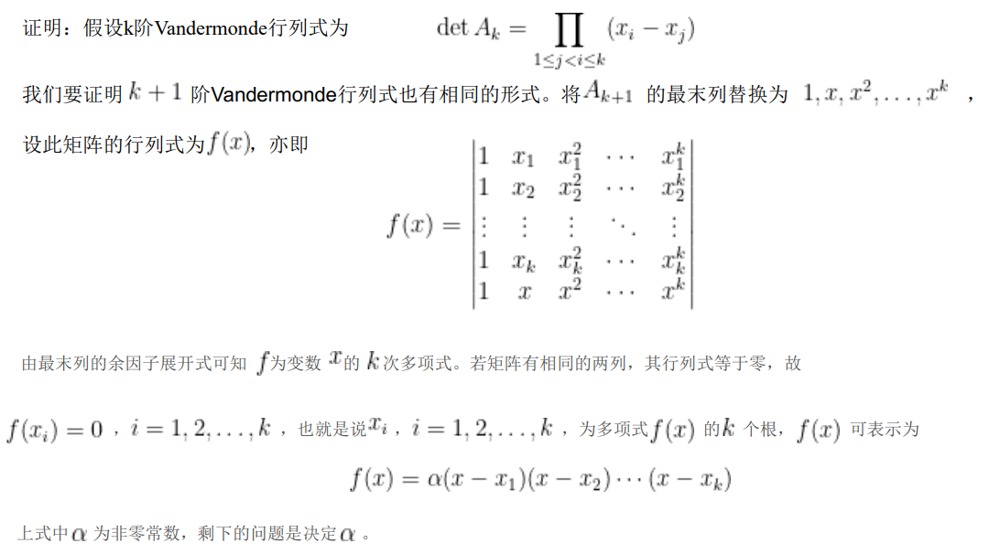

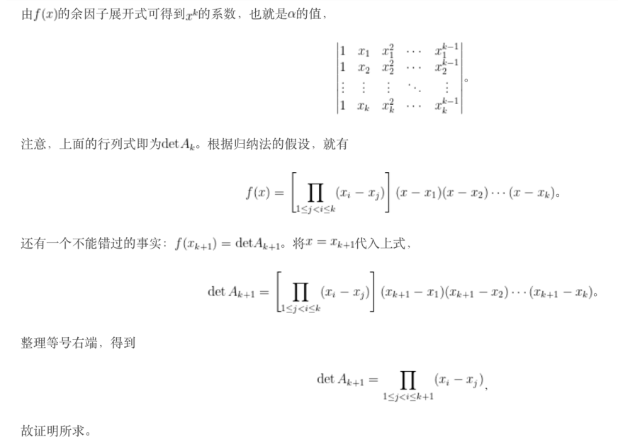

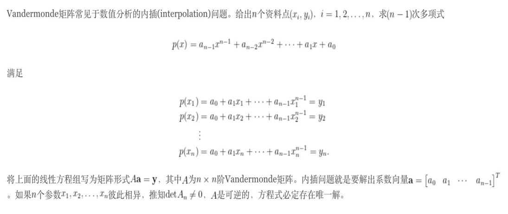

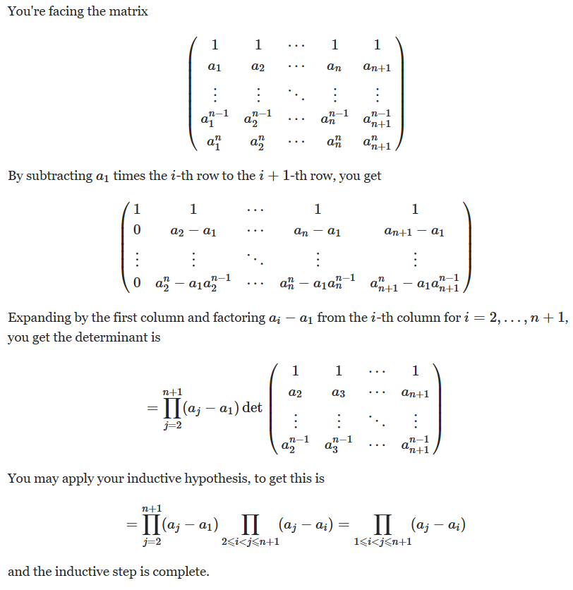

## 第三讲 矩阵的相似化简与特征分析

1. 特征值分解
    - 对 **方阵** 有 **$Au = \lambda u$**, 有 $n$ 个特征值 $\lambda_i$, 以及 $n$ 个对应的特征向量 $u_i$
    - 对 **方阵** 有 **$AU = U\Sigma$**, 其中 $U = \begin{bmatrix} u_1 & u_2 & \cdots & u_n \\\end{bmatrix}$, $\Sigma = \operatorname{diag}(\lambda_1, \lambda_2, \ldots, \lambda_n)$
    - 对 **可对角化矩阵** 有 $U$ 为非奇异矩阵, 且 **$U^{-1}AU = \Sigma$**
    - $A$ 的相异特征值对应的特征向量线性无关
        - 假设线性相关, 则 $u_1 = \sigma u_2$
        - $A u_1 = \lambda_1 u_1, A u_2 = \lambda_2 u_2 \Rightarrow A \sigma u_2 = \lambda_1 \sigma u_2 \Rightarrow A u_2 = \lambda_1 u_2$ 矛盾
    - 对 **Hermite 矩阵** 有
        - $\lambda^{*} = \lambda$, 即 $\lambda$ 是实数
            - $\bar{x}^{T}Ax = \lambda \bar{x}^{T}x$
            - $\bar{x}^{T}Ax = \bar{x}^{T} \bar{A}^{T} x = (\overline{Ax})^{T}x = \bar{\lambda} \bar{x}^{T}x$
            - $(\bar{\lambda} - \lambda)\bar{x}^{T}x = 0$
        - Hermite 矩阵 $A$ 的特征向量 $u_1, u_2, \ldots, u_n$ 是相互正交的, 进行规范化得到酉矩阵 $U$, 因此有
        - $U^{H}AU = \Sigma$, 其中 $U$ 是一个酉矩阵
            - $A$ 是 $n \times n$ 实对称矩阵, 则存在 $n$ 个相互正交的特征向量
                - 证明
                    - 可以证明当 $x$ 是 $A$ 相对于特征值 $a$ 的特征向量, $y$ 是 $A^{T}$ 相对于特征值 $b$ 的特征向量, 且 $a \neq b$ 时, 有 $x^{T}y = 0$
                    - $x^{T}A^{T}y = (Ax)^{T}y = ax^{T}y, x^{T}A^{T}y = x^{T}(A^{T}y) = bx^{T}y$
                    - $ax^{T}y - bx^{T}y = (a - b)x^{T}y = 0$
                    - 还需要证明几何重数等于代数重数, 可以通过 Jordan 标准型说明
                    - 主对角线上都是同一个系数, 而对角线上方一排全是, 形同以上 $J_{i}$ 的矩阵称为若尔当矩阵. 而矩阵 $J$ 中每一个这样的小块被称为若尔当块. 
                    - 对任意系数域为 $\mathbb{K}$ 的矩阵 $M$, 只要其特征值都在 $\mathbb{K}$ 中, 就存在一个与之相似的若尔当标准型 $J: M=PJP^{{-1}}$, 其中 $P$ 是一个可逆矩阵. 并且满足: 
                        - 矩阵 $J$ 的特征值 (计入重数) 就是主对角线上的系数. 
                        - 对于 $J$ 的一个特征值 $\lambda_i$, 它的几何重数就是属于特征值 $\lambda_i$ 的若尔当块的个数. 
                        - 所有属于特征值 $\lambda_i$ 的若尔当块的维数之和是特征值 $\lambda_i$ 的代数重数. 
                - 可以看出, 这是一个充要条件, 但是实对称矩阵不代表 $A$ 可逆
                - 相互正交可以推出线性无关, 因此可以构成 $n$ 维空间的基底
            - 实对称矩阵 $A$ 的特征值都是实数, 其对应的特征向量也可以组成一个正交矩阵
    - 右特征向量 (简称特征向量): $Av = \lambda v$
    - 左特征向量: $u^{H}A = \lambda u^{H}$
    - 矩阵 $A$ 非奇异的充要条件为 $A$ 没有零特征值值
    - $A$ 和 $A^{T}$ 有相同的特征值
        - $\det(A - \lambda I) = \det((A - \lambda I)^{T}) = \det(A^{T} - \lambda I)$
    - $\lambda^{k}$ 是 $A^{k}$ 的特征值, $\frac{1}{\lambda}$ 是 $A^{-1}$ 的特征值, $\lambda + \sigma^{2}$ 是 $A + \sigma^{2} I$ 的特征值
        - $A^{k}u = A^{k-1}Au = \lambda A^{k-1}u = \lambda (\lambda^{k-1}u) = \lambda^{k} u$ 数学归纳法
        - $A u = \lambda u \implies \frac{1}{\lambda} u = A^{-1} u$
        - $(A + \sigma^{2} I) u = A u + \sigma^{2} I u = (\lambda + \sigma^{2})u$
    - 矩阵 $A$ 对特征值 $\lambda$ 的条件数为 $\operatorname{cond}(\lambda) = 1 / \cos \theta(u, v)$, 即左特征向量 $u$ 和右特征向量 $v$ 之间的夹角 (锐角)
        - 一个特征值的条件数越大, 则计算这个特征值的稳定性越差, 即当观测数据有扰动时, 计算得到的特征值有可能变化很大
    - 矩阵特征值与行列式关系: $\det(A) = \prod_{i=1}^{m} \lambda_i$
    - 矩阵特征值与秩关系: $\operatorname{tr}(A) = \sum_{i=1}^{m} \lambda_i$
    - 实矩阵特征值的特点: 如果实矩阵 $A$ 有复特征值, 则一定成对出现, 形如 $a + b j$ 与 $a - b j$
        - 由代数基本定理的推论即可得到这个结果: 一元实系数多项式都可以表示为常数, $x + a$ 形式的多项式 ($a$ 为实数), 以及 $x^2 + ax + b$ 形式的多项式
        - 或者直接证明 $Au^{*} = A^{*}u^{*} = (Au)^{*} = (\lambda u)^{*} = \lambda^{*}u^{*}$
    - 矩阵特征值与矩阵秩的关系: 若 $A$ 有 $r$ 个非零特征值, 则 $\operatorname{rank}(A) \ge r$
        - 矩阵的秩 = $n$ - 特征值为零的约当块的个数
        - $r = n$ - 零特征值个数 (包括重数)
    - Cayley-Hamilton 定理: $p(A) = \prod_{i=1}^{m}(A - \lambda_i I) = 0$
        - 我们使用 $\operatorname{adj} (B) B = \det(B) I$
        - 即有 $(C_0 + C_1 t + \cdots + C_{n-1}t^{t-1}) (A - t I) = (a_0 + a_1 t + a_2 t^{2} + \cdots + a_n t^{n}) I$
        - 对每一个式子 $C_{n-1}A - C_{n-2} = a_{n-1} I$ 乘上 $A^{n-1}$ 再求和即可
        - 也可以用 Schur 定理 $A = UTU^{-1}$ 来证, 其中 $T$ 为一个主元为 $A$ 特征值的幺正矩阵
        - $p(A) = p(UTU^{-1}) = U p(T) U^{-1} = O$
        - 用途之一是计算矩阵的乘方, 以及用来判断线性系统的可控性
    - 若 $A$ 为 $m \times n$ 矩阵, $B$ 为 $n \times m$ 矩阵, 则 $\operatorname{eig}(AB), \operatorname{eig}(BA)$ 有相同的非零特征值, 所不同的是零特征值的重数不一样
        - 非零特征值
            - 若 $u$ 是 $AB$ 非零特征值 $\lambda$ 的一个特征向量, 则有 $Bu \neq 0$
            - $\lambda Bu = B(AB u) = (BA) Bu$
            - 则有 $\lambda$ 也是 $BA$ 一个特征值, 而特征向量为 $Bu$
        - 零特征值
            - $0 = \det(AB) = \det(A)\det(B) = \det(BA)$
    - 特征值分解的计算
        - 特征值计算: 求出 $\det(\lambda I - A)u = 0$ 的 $n$ 个根
        - 特征向量计算: 对每一个特征值 $\lambda_i$ 求解 $(A - \lambda_i I)u = 0$ 的非零特征向量
        - 正交化
    - 一个 $n \times n$ 矩阵 $A$ 是可对角化的充要条件是 $A$ 具有 $n$ 个线性无关的特征向量
    - Schur 定理: 任何一个$n$ 阶复矩阵都酉相似于一个上三角矩阵, 则存在一个 $n$ 阶酉矩阵 $U$ 和一个 $n$ 阶上三角矩阵 $R$ 使得: $U^{H}AU = R$, 其中 $R$ 的对角元是 $A$ 的特征值.
    - 正规矩阵: $AA^{H} = A^{H}A$, 因此正反 Hermite 矩阵, 酉矩阵都是正规矩阵
    - 方阵 $A$ 酉相似于对角矩阵 $A = P\Lambda P^{H}$ 充要条件为 $A$ 为正规矩阵
        - 必要性: $A = P\Lambda P^{H} \implies A^{H}A = P \bar{\Lambda} P^{H} P \Lambda P^{H} = P \bar{\Lambda} \Lambda P^{H} = P \Lambda \bar{\Lambda} P^{H} = P \Lambda P^{H}P \bar{\Lambda} P^{H} = AA^{H}$
        - 充分性: $A^{H}A = AA^{H} \implies B^{H}B = P^{H} A^{H} P P^{H} A P = P^{H} A^{H} A P = P^{H} A A^{H} P = P^{H} A P P^{H} A^{H} P = BB^{H}$, 其中由 Schur 定理可知 $B$ 为一个上三角矩阵, 则由 $B^{H}B = BB^{H}$ 可知 $B$ 为一个对角阵
    - 谱分解 $A = \sum_{i=1}^{n} \lambda_i u_i u_i^{T}$
2. 奇异值分解
    - 定义: 对任意矩阵 $A$ 有 $A = U\Sigma V^{H}$, 其中 $U, V$ 为正交矩阵, $\Sigma = \operatorname{diag}(\sigma_1, \sigma_2, \cdots, \sigma_n)$ 为 $m\times n$ 的对角矩阵, $\sigma_i \ge 0$ 为奇异值
    - 另一种定义: 如果存在非负实数 $\sigma$ 和非零向量 $u \in \mathbb{C}^{n}, v \in \mathbb{C}^{m}$ 使得 $Au = \sigma v, A^{H}v = \sigma u$, 则称 $\sigma$ 为 $A$ 的奇异值, $u$ 和 $v$ 分别为 $\sigma$ 的右奇异向量和左奇异向量
    - 向量表达式: $A = \sum_{i=1}^{r} \sigma_i u_i v_i^{H}$
    - 紧凑奇异分解: $A = U_r \Sigma_r V_r^{H}$
    - $\sigma^{2}$ 是 $A^{H}A$ 和 $AA^{H}$ 的特征值, $u$ 是 $A^{H}A$ 的特征向量, $v$ 是 $AA^{H}$ 的特征向量
        - $A^{H}A u = \sigma A^{H}v = \sigma^{2} u$
        - $AA^{H} v = \sigma A u = \sigma^{2} v$
    - 几何观点
        - 任意一个 $m×n$ 矩阵将 $n$ 维空间的单位球面映射为 $m$ 维空间一个超球面
        - SVD 分解即为
            - $R^{n}$ 中的旋转: $X \to V^{T}X$
            - $R^{n}$ 中的向量 $V^{T}X$ 前 $r$ 分量伸缩, 其余分量变为零: $V^{T}X \to \Sigma V^{T}X$
            - $R^{m}$ 中旋转: $\Sigma V^{T}X \to U \Sigma V^{T}X$
    - 性质
        - 非零奇异值个数为矩阵的秩
            - $\operatorname{rank}(A) = \operatorname{rank}(A^{H}A) = \operatorname{rank}(AA^{H})$
        - 设 $A$ 是正规矩阵, 则 $A$ 的奇异值为 $A$ 的特征值的模
        - 子空间
            - 正交矩阵 $U$ 前 $r$ 列是 $C(A)$ 的一组标准正交基
            - 正交矩阵 $U$ 后 $m-r$ 列是 $N(A^{T})$ 的一组标准正交基
            - 正交矩阵 $V$ 前 $r$ 列是 $C(A^{T})$ 的一组标准正交基
            - 正交矩阵 $V$ 后 $n-r$ 列是 $N(A)$ 的一组标准正交基
        - 设 $|\lambda|_{\max}$ 是矩阵特征值的模长最大值, 则 $\sigma_1 \ge |\lambda|_{\max}, \sigma_1 \ge |a_{ij}|$
        - 矩阵 $A$ 列满秩等价于 $A$ 奇异值均非零
        - 对于正定矩阵而言, SVD 分解和特征值分解相同
        - 特征值分解必须要求 $A$ 为方阵, 而奇异值分解不需要
        - 我们可以根据 $A^{H}A$ 和 $AA^{H}$ 求特征值和特征向量, 从而得到 $U, \Sigma, V$
    - 条件数: $\operatorname{cond}(A) = \left\| A \right\| \cdot \left\| A^{-1} \right\|$
    - 2 范数条件数: $\operatorname{cond}_2(A) = \sigma_{\max} / \sigma_{\min}$
    - 奇异值和范数的关系
        - $\left\| A \right\|_{2} = \sqrt{\lambda_{\max}(A^{H}A)} = \sigma_1 = \sigma_{\max}$
        - $\left\| A \right\|_{F} = \left\| U^{H}AV \right\|_{F} = \left\| \Sigma \right\|_{F} = \sqrt{\sigma_1^{2} + \sigma_2^{2} + \cdots + \sigma_r^{2}} \ge \left\| A \right\|_{2}$
    - 奇异值和行列式的关系: $|\det(A)| = |\det(U\Sigma V^{H})| = |\det(\Sigma)|$
    - 奇异值和特征值的关系:
        - 对实对称矩阵 $A$ 有 $\sigma_i = |\lambda_i|$
        - $\operatorname{tr}(A^{H}A) = \sum_{i}^{p}\sigma_i^{2}$
3. 矩阵低秩逼近
    - $\min_{B \in R^{m \times n}} \left\| A - B \right\|_{2} \text{ s.t. } \operatorname{rank}(B) = k < p$

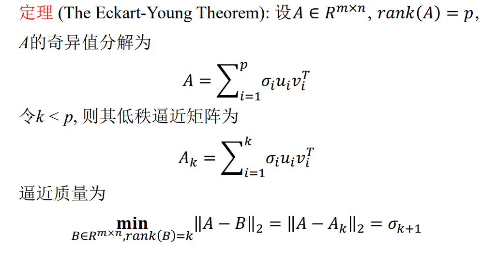

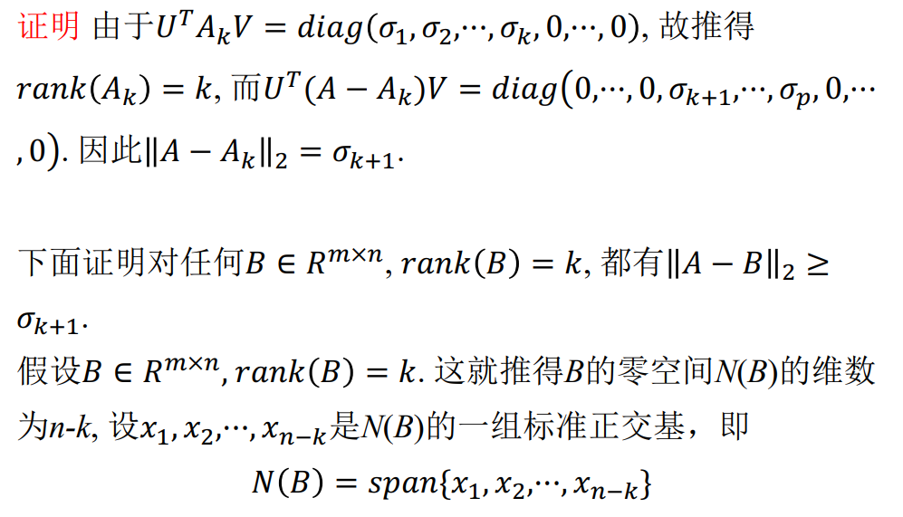

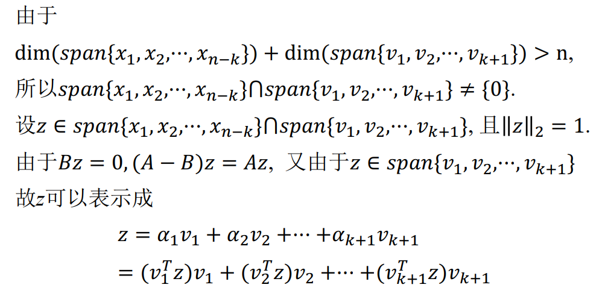

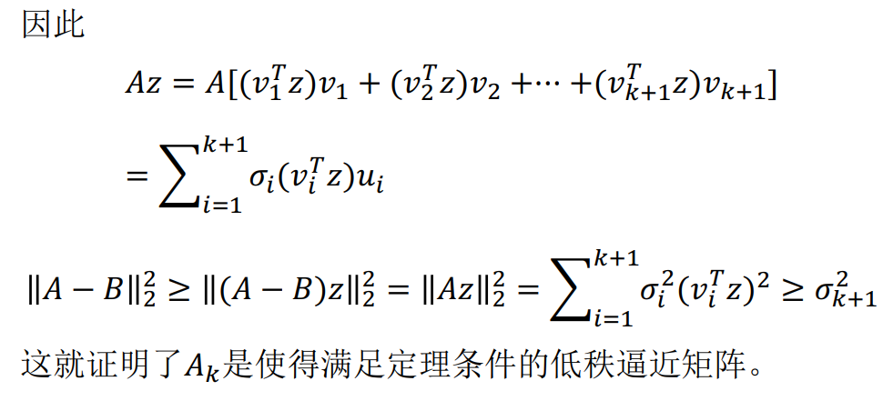

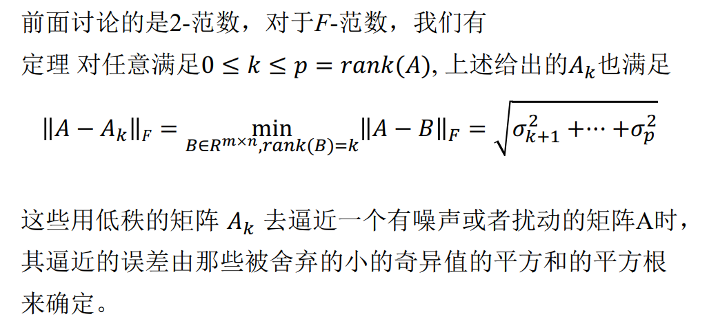

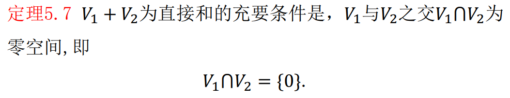

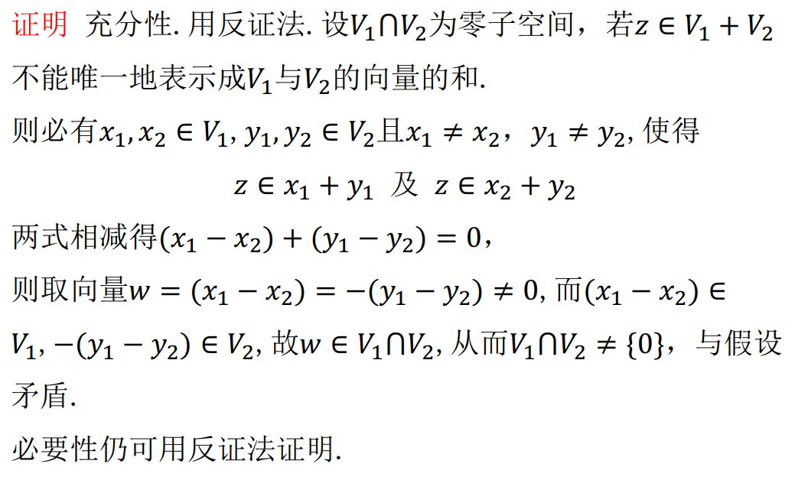

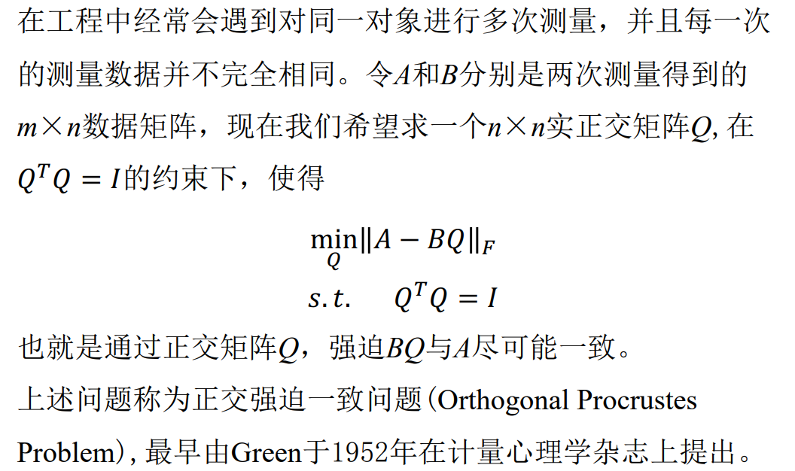

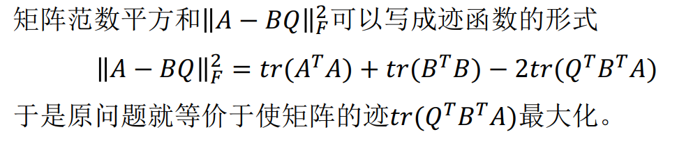

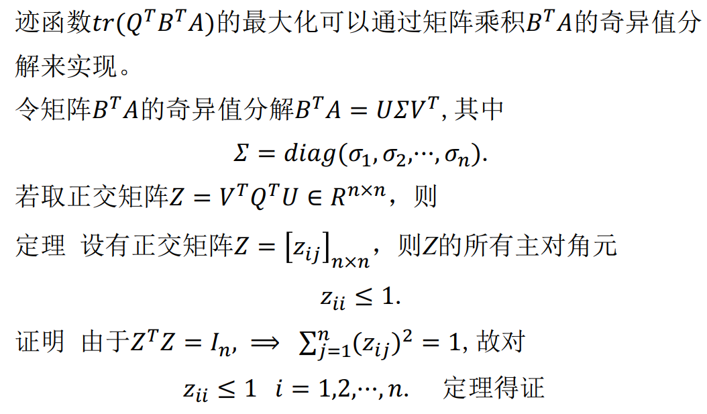

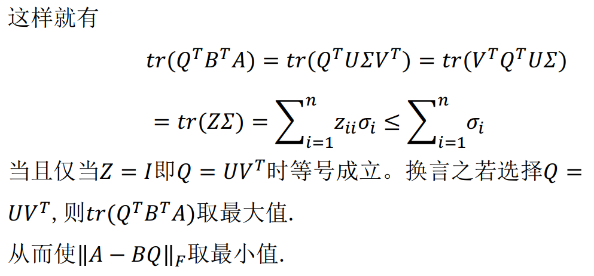
