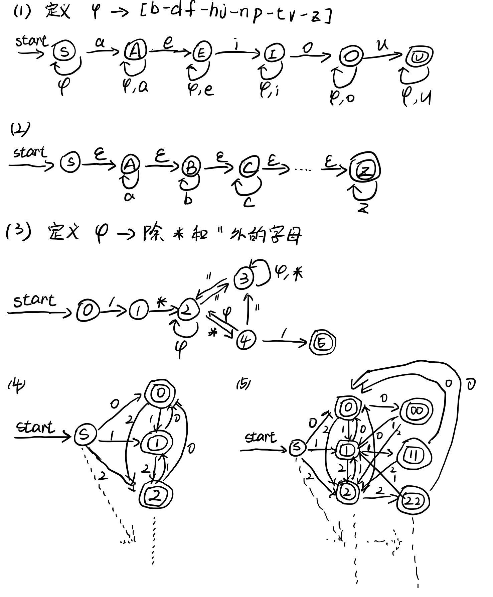
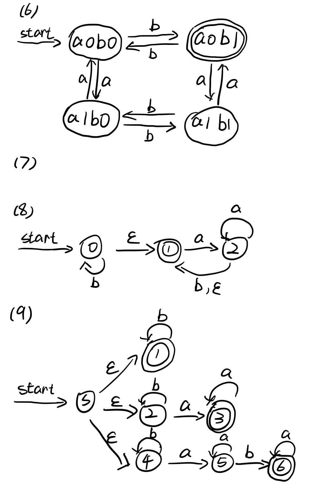
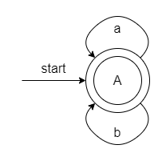

# 编译原理第一次作业

## 201300035 方盛俊

## Ex. 3.3.1

以下均以 Python 3 为标准, 而非使用 Python 2.

**(i)**

输入字母表为 Unicode 码, 包含了

- 数字: `0123456789`
- 英文: `abcdefghijklmnopqrstuvwxyzABCDEFGHIJKLMNOPQRSTUVWXYZ`
- 标点符号: `!"#$%&\'()*+,-./:;<=>?@[\\]^_{|}~`
- 空格符: ` \t\n\r\x0b\x0c`
- 其他语言字符, 如中文字符

等内容.

**(ii)**

整数词法形式:

```txt
integer      ::=  decinteger | bininteger | octinteger | hexinteger
decinteger   ::=  nonzerodigit (["_"] digit)* | "0"+ (["_"] "0")*
bininteger   ::=  "0" ("b" | "B") (["_"] bindigit)+
octinteger   ::=  "0" ("o" | "O") (["_"] octdigit)+
hexinteger   ::=  "0" ("x" | "X") (["_"] hexdigit)+
nonzerodigit ::=  "1"..."9"
digit        ::=  "0"..."9"
bindigit     ::=  "0" | "1"
octdigit     ::=  "0"..."7"
hexdigit     ::=  digit | "a"..."f" | "A"..."F"
```

浮点数词法形式:

```txt
floatnumber   ::=  pointfloat | exponentfloat
pointfloat    ::=  [digitpart] fraction | digitpart "."
exponentfloat ::=  (digitpart | pointfloat) exponent
digitpart     ::=  digit (["_"] digit)*
fraction      ::=  "." digitpart
exponent      ::=  ("e" | "E") ["+" | "-"] digitpart
```

虚数词法形式:

```txt
imagnumber ::=  (floatnumber | digitpart) ("j" | "J")
```


**(iii)**

标识符词法形式:

```txt
identifier   ::=  xid_start xid_continue*
id_start     ::=  <all characters in general categories Lu, Ll, Lt, Lm, Lo, Nl,
                  the underscore, and characters with the Other_ID_Start property>
id_continue  ::=  <all characters in id_start, plus characters in the categories
                  Mn, Mc, Nd, Pc and others with the Other_ID_Continue property>
xid_start    ::=  <all characters in id_start whose NFKC normalization is
                  in "id_start xid_continue*">
xid_continue ::=  <all characters in id_continue whose NFKC normalization is
                  in "id_continue*">
```


## Ex. 3.3.2 - 2)

$L(((\epsilon | a)b^{*})^{*}) = \{ \epsilon, a, b, ab, abb, abab, abbab, abbabb, \cdots \}$

即由任意多个字母 $a$ 和字母 $b$ 组成的任意一个字符串. 


## Ex. 3.3.5 - 2)

```txt
a*b*c*d*e*f*g*h*i*j*k*l*m*n*o*p*q*r*s*t*u*v*w*x*y*z*
```


## Ex. 3.6.2





## Ex. 3.6.3

- (0) =a=> (0) =a=> (0) =b=> (0) =b=> (0)
- (0) =a=> (0) =a=> (1) =b=> (1) =b=> (1)
- (0) =a=> (1) =a=> (1) =b=> (1) =b=> (1)
- (0) =a=> (1) =a=> (2) =b=> (2) =b=> (2)
- (0) =a=> (1) =a=> (2) =b=> (2) =b=> (3)
- (0) =a=> (1) =a=> (2) =ϵ=> (0) =b=> (0) =b=> (0)
- (0) =a=> (1) =a=> (2) =b=> (2) =ϵ=> (0) =b=> (0)

这个 NFA 接受 aabb.


## Ex. 3.6.5 - 1)

| 状态 | a     | b     | ε   |
| ---- | ----- | ----- | --- |
| 0    | {0,1} | {0}   | ∅   |
| 1    | {1,2} | {1}   | ∅   |
| 2    | {2}   | {2,3} | {0} |
| 3    | ∅     | ∅     | ∅   |


## Ex. 3.7.1 - 3)

使用子集构造法可知, ε-closure(0) = { 0, 1, 2, 3 }, 因此 U = ε-closure(move(T, a)) = { 0, 1, 2, 3 }, 列表可知

| NFA 状态      | DFA 状态 | a   | b   |
| ------------- | -------- | --- | --- |
| { 0, 1, 2, 3} | A        | A   | A   |

因此有 DFA:




