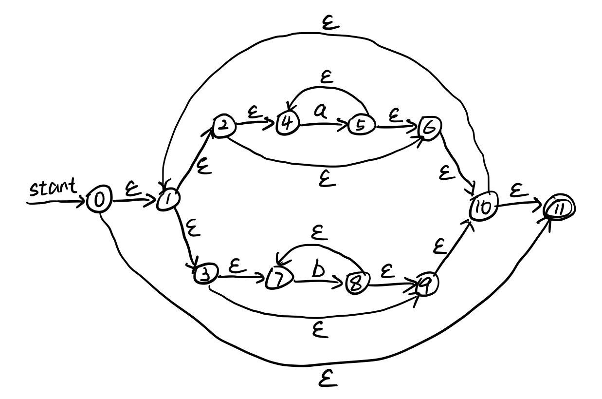
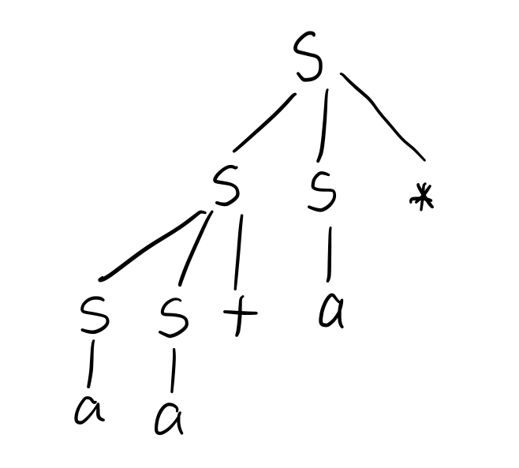

# 编译原理第二次作业

## 201300035 方盛俊

## Ex. 3.7.3 (2)

将正则表达式 `(a*|b*)*` 转为 NFA 有:

通过子集构造法将 NFA 转换为 DFA 有:

- A: ε-closure(0) = { 0, 1, 2, 3, 4, 6, 7, 9, 10, 11 }
- B: Dtran[A, a] = ε-closure(move(A, a)) = ε-closure({ 5 }) = { 1, 2, 3, 4, 5, 6, 7, 9, 10, 11 }
- C: Dtran[A, b] = ε-closure(move(A, b)) = ε-closure({ 8 }) = { 1, 2, 3, 4, 6, 7, 8, 9, 10, 11 }
- Dtran[B, a] = ε-closure({ 5 }) = B
- Dtran[B, b] = ε-closure({ 8 }) = C
- Dtran[C, a] = ε-closure({ 5 }) = B
- Dtran[C, b] = ε-closure({ 8 }) = C

则有 DFA:

- 开始状态: A
- 接受状态: A, B, C

| NFA 状态                           | DFA 状态 | a   | b   |
| ---------------------------------- | -------- | --- | --- |
| { 0, 1, 2, 3, 4, 6, 7, 9, 10, 11 } | A        | B   | C   |
| { 1, 2, 3, 4, 5, 6, 7, 9, 10, 11 } | B        | B   | C   |
| { 1, 2, 3, 4, 6, 7, 8, 9, 10, 11 } | C        | B   | C   |

作图即可得:

## Ex. 4.2.1

**(1)**

$S \xRightarrow[lm]{} SS* \xRightarrow[lm]{} SS+S* \xRightarrow[lm]{} aS+S* \xRightarrow[lm]{} aa+S* \xRightarrow[lm]{} aa+a*$

**(2)**

$S \xRightarrow[rm]{} SS* \xRightarrow[rm]{} Sa* \xRightarrow[rm]{} SS+a* \xRightarrow[rm]{} Sa+a* \xRightarrow[rm]{} aa+a*$

**(3)**

**(4)**

不是二义性的.

**证明:**

令 $G$ 为文法 $S \to SS+ | SS* | a$.

首先我们证明 $L(G)$ 是 $p$-表达式组成的集合.

我们称由 $\{ a, +, * \}$ 组成的符号串 $\omega$ 为 $p$-表达式, 等且仅当:
- $\omega$ 不是空串;
- 对于任何 $\omega$ 的一个真后缀 $\varphi$ 来说, 符号 $a$ 的个数小于或等于操作符 $\{ +, * \}$ 的个数, 不妨记作 $|\varphi|_{a} \le |\varphi|_{+}$;
- $\omega$ 中符号 $a$ 的个数恰好比操作符的个数多一个, 记作 $|\omega|_{a} - |\omega|_{+} = 1$;
- 除 $\omega = a$ 的情况外, $\omega$ 以 $aa$ 开头, 且以任意一个操作符结尾.

我们使用数学归纳法证明 $L(G)$ 是 $p$-表达式组成的集合.

**归纳基础:** 当 $\omega = a$ 或 $\omega = aa+$ 或 $\omega = aa*$ 时, 易见以上三个条件均满足, 此时 $\omega$ 是 $p$-表达式.

**归纳假设:** 当 $|\omega| < n$ 时, $\omega$ 是 $p$-表达式.

**归纳步骤:**

当 $|\omega| = n$ 时, 不失一般性, 我们认为 $\omega$ 是由 $S \to SS+$ 推导得到的, $S \to SS*$ 同理, 则 $\omega$ 有形式 $\omega_1\omega_2+$, 其中 $\omega_1, \omega_2 \in L(G)$.

由归纳假设可得, $\omega_1$ 和 $\omega_2$ 是 $p$-表达式.

对于第一个条件, 易见由于 $|\omega| = n$, 有 $\omega$ 不是空串.

对于第二个条件, 令 $\varphi+$ 是 $\omega = \omega_1\omega_2+$ 的一个真后缀:

- 若 $\varphi = \varepsilon$, 则 $\varphi+ = +$ 满足 $|\varphi+|_{a} = 0 \le |\varphi+|_{+} = 1$.
- 若 $\varphi$ 是 $\omega_2$ 的真后缀, 则由于 $\omega_2$ 是 $p$-表达式, 我们可知 $|\varphi|_{a} \le |\varphi|_{+}$, 则 $|\varphi+|_{a} = |\varphi|_{a}  \le |\varphi|_{+} < |\varphi+|_{+}$ 同样满足 $|\varphi+|_{a} \le |\varphi+|_{+}$.
- 若 $\varphi = \omega_2$, 则由于 $\omega_2$ 是 $p$-表达式, 我们可知 $|\omega_2|_{a} = |\omega_2|_{+} + 1$, 则 $|\varphi+|_{a} = |\omega_2|_{a} = |\omega_2|_{+} + 1 = |\omega_2+|_{+} = |\varphi+|_{+}$, 满足 $|\varphi+|_{a} \le |\varphi+|_{+}$.
- 若 $\varphi = \varphi_1\omega_2$, 我们可知 $\varphi_1\omega_2+$ 中 $a$ 的个数与操作符个数的差值, 等于 $\varphi_1$ 中 $a$ 的个数与操作符个数的差值, 即 $|\varphi_1\omega_2+|_{a} - |\varphi_1\omega_2+|_{+} = |\varphi_1|_{a} - |\varphi_1|_{+}$. 由于 $\varphi_1$ 是 $\omega_1$ 的真后缀 (由 $\varphi$ 是 $\omega$ 的真后缀可知 $\varphi_1 \neq \omega_1$), 且 $\omega_1$ 是 $p$-表达式, 因此 $|\varphi_1|_{a} - |\varphi_1|_{+} \le 0$, 则有 $|\varphi_1\omega_2+|_{a} - |\varphi_1\omega_2+|_{+} \le 0$ 满足 $|\varphi|_{a} \le |\varphi|_{+}$.

对于第三个条件, $|\omega|_{a} - |\omega|_{+} = |\omega_1\omega_2+|_{a} - |\omega_1\omega_2+|_{+} = (|\omega_1|_{a} - |\omega_1|_{+}) + (|\omega_2|_{a} - |\omega_2|_{+}) - 1 = 1 + 1 - 1 = 1$ 满足条件.

对于第四个条件, 若 $\omega_1 = a$, 则 $\omega_1\omega_2+ = a\omega_2+$ 必然以 $aa$ 开头, 以 $+$ 结尾. 若 $\omega_1 \neq a$, 则 $|\omega_1| \ge 3$, 且由 $\omega_1$ 为 $p$-表达式, 则 $\omega_1$ 也是以 $aa$ 开头的, 则 $\omega_1\omega_2+ = a\omega_2+$ 必然以 $aa$ 开头, 以 $+$ 结尾.

由以上归纳证明可知, $L(G)$ 是 $p$-表达式组成的集合.

接着我们使用数学归纳法证明 $G$ 是无二义性的, 其中 $\omega \in L(G)$.

**归纳基础:** 当 $\omega = a$ 时, 易见 $S \to a$ 是 $\omega$ 唯一的推导, $\omega$ 有着唯一的语法树.

**归纳假设:** 当 $|\omega| < n$ 时, $\omega$ 有着唯一的语法树.

**归纳步骤:**

当 $|\omega| = n$ 时, 不失一般性, 我们认为 $\omega$ 是由 $S \to SS+$ 推导得到的, $S \to SS*$ 同理, 则 $\omega$ 有形式 $\omega_1\omega_2+$, 其中 $\omega_1, \omega_2 \in L(G)$.

如果 $\omega$ 没有唯一的语法树, 则我们会有多个符合条件的 $\omega_1\omega_2$ 对, 以 $\omega_2$ 为例, 不同的 $\omega_2$ 有着不同的长度 $|\omega_2|$, 我们要证明的就是 $\omega_1\omega_2$ 对是唯一的, 即 $|\omega_2|$ 是唯一的.

从右到左, 我们逐个扫描符号, 获取当前的真后缀 $\varphi+$, 我们始终追踪 $|\varphi+|_{a} - |\varphi+|_{+}$ 的值:

- 若 $\varphi = \varepsilon$, 则 $|\varphi+|_{a} - |\varphi+|_{+} = -1$
- 若 $\varphi$ 是 $\omega_2$ 的真后缀, 则 $|\varphi+|_{a} - |\varphi+|_{+} = |\varphi|_{a} - |\varphi|_{+} - 1 \le -1$.
- 若 $\varphi = \omega_2$, 则 $|\varphi+|_{a} - |\varphi+|_{+} = |\omega|_{a} - |\omega|_{+} - 1 = 1 - 1 = 0$.
- 若 $\varphi = \varphi_1\omega_2$,
    - 若 $\omega_1 = a$, 则已经扫描了所有真后缀 $\varphi+$ 了, 已经终止了.
    - 若 $\omega_1 \neq a$, 则 $\omega_1$ 以 $aa$ 开头,
        - 若 $\varphi_1$ 是 $\omega_1$ 的真后缀且不包括 $\omega_1$ 开头的 $aa$ 中的 $a$, 则 $|\varphi+|_{a} - |\varphi+|_{+} = |\varphi_1|_{a} - |\varphi_1|_{+} < 0$.
        - 若 $\varphi_1$ 是 $\omega_1$ 的真后缀且包括 $\omega_1$ 开头的 $aa$ 中的一个 $a$, 则 $|\varphi+|_{a} - |\varphi+|_{+} = |\varphi_1|_{a} - |\varphi_1|_{+} = 0$.

可以看出, 扫描真后缀 $\varphi+$ 时, 最多只有两次 $|\varphi+|_{a} - |\varphi+|_{+} = 0$, 且只有第一次 $|\varphi+|_{a} - |\varphi+|_{+} = 0$ 时, 我们有 $\varphi = \omega_2$.

因此我们证明了 $\omega_1\omega_2$ 对是唯一的, 说明 $|\omega_2|$ 是唯一的, 即 $\omega_2$ 是唯一的, 因此 $\omega_1$ 也是唯一的, $\omega$ 有着唯一的语法树.

由以上归纳证明可知, $S \to SS+ | SS* | a$ 是无二义性的.

**(5)**

包含加法 "+", 乘法 "*" 和操作数 "a" 的后缀表达式.

## Ex. 4.2.3 (1)

该文法应该对应正则表达式 `1*(01+)*`, 则文法为

- `S -> 1S | A`
- `A -> 0BA | ε`
- `B -> 1B | 1`
