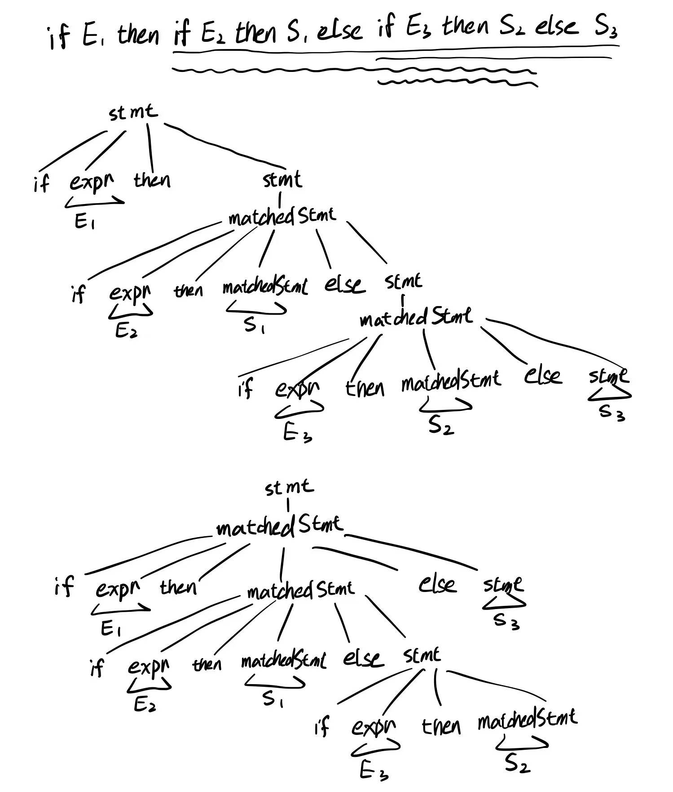
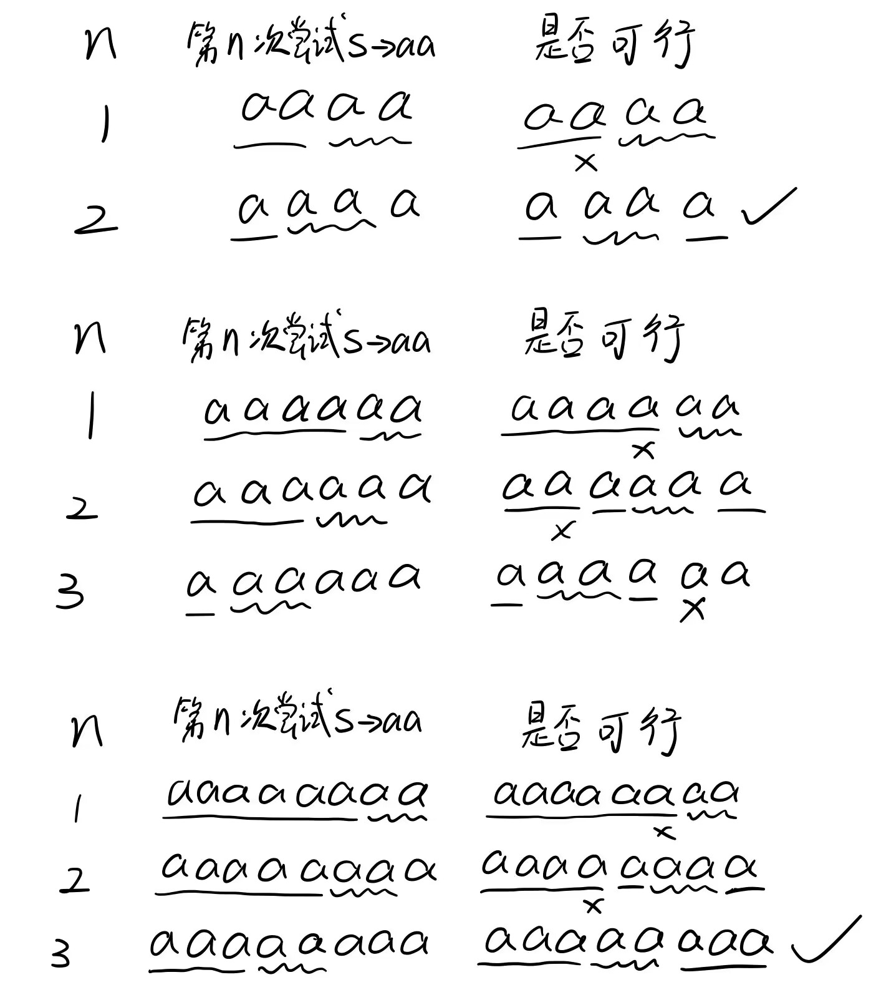

# 编译原理第三次作业

## 201300035 方盛俊

## Ex. 4.3.2 (3)

**(1)**

没有可以提取的左公因子.

**(2)**

仍然存在左递归, 不适合自顶向下的语法分析技术.

**(3)**

```txt
// 原始文法
S -> S ( S ) S | ε

// 消除左递归后文法
S -> S'
S' -> ( S ) S S' | ε
```

**(4)**

适用于自顶向下的语法分析.


## Ex. 4.3.3

构造串 `if E1 then if E2 then S1 else if E3 then S2 else S3`, 可得到两棵不同的语法树.

其原因是末尾的 `else S3` 既可以认为是与顶部的 `if E1` 匹配的, 也可以认为是与末端 `if E3` 匹配的.




## Ex. 4.4.1

**(1)**

文法:

```txt
S -> 0 S 1 | 0 1
```

提取左公因子:

```txt
S -> 0 A
A -> S 1 | 1
```

消除左递归:

```txt
S -> 0 A
A -> 0 A 1 | 1
```

预测分析表:

| 非终结符号 | 0            | 1        | $   |
| ---------- | ------------ | -------- | --- |
| S          | `S -> 0 A`   | -        | -   |
| A          | `A -> 0 A 1` | `A -> 1` | -   |

**(2)**

文法:

```txt
S -> + S S | * S S | a
```

预测分析表:

| 非终结符号 | +            | *            | a        | $   |
| ---------- | ------------ | ------------ | -------- | --- |
| S          | `S -> + S S` | `S -> * S S` | `S -> a` | -   |

**(3)**

文法:

```txt
S -> S ( S ) S | ε
```

消除左递归:

```txt
S -> A
A -> ( S ) S A | ε
```

计算 FIRST:

```txt
First(S) = { (, ε }
First(A) = { (, ε }
```

计算 FOLLOW:

```txt
Follow(S) = { ), (, $ }
Follow(A) = { ), (, $ }
```

预测分析表:

| 非终结符号 | (                          | )        | $        |
| ---------- | -------------------------- | -------- | -------- |
| S          | `S -> A`                   | `S -> A` | `S -> A` |
| A          | `A -> ( S ) S A`, `A -> ε` | `A -> ε` | `A -> ε` |

**(4)**

文法:

```txt
S -> S + S | S S | ( S ) | S * | a
```

提取左公因子:

```txt
S -> S A | ( S ) | a
A -> + S | S | *
```

消除左递归:

```txt
S -> ( S ) B | a B
B -> A B | ε
A -> + S | ( S ) B | a B | *
```

计算 FIRST:

```txt
First(S) = { (, a }
First(B) = { +, (, a, *, ε }
First(A) = { +, (, a, * }
```

计算 FOLLOW:

```txt
Follow(S) = { (, ), a, +, *, $ }
Follow(B) = { (, ), a, +, *, $ }
Follow(A) = { (, ), a, +, *, $ }
```

预测分析表:

| 非终结符号 | (                    | )        | a                    | +                    | *                    | $        |
| ---------- | -------------------- | -------- | -------------------- | -------------------- | -------------------- | -------- |
| S          | `S -> ( S ) B`       | -        | `S -> a B`           | -                    | -                    | -        |
| B          | `B -> A B`, `B -> ε` | `B -> ε` | `B -> A B`, `B -> ε` | `B -> A B`, `B -> ε` | `B -> A B`, `B -> ε` | `B -> ε` |
| A          | `A -> ( S ) B`       | -        | `A -> a B`           | `A -> + S`           | `A -> *`             | -        |

**(5)**

文法:

```txt
S -> ( L ) | a
L -> L, S | S
```

消除左递归 (排序 `L S A`):

```txt
S -> ( L ) | a
L -> S A
A -> , S A | ε
```

计算 FOLLOW:

```txt
Follow(A) = { ) }
```

预测分析表:

| 非终结符号 | (            | )        | ,            | a          | $   |
| ---------- | ------------ | -------- | ------------ | ---------- | --- |
| S          | `S -> ( L )` | -        | -            | `S -> a`   | -   |
| L          | `L -> S A`   | -        | -            | `L -> S A` | -   |
| A          | -            | `A -> ε` | `A -> , S A` | -          | -   |

**(6)**

文法:

```txt
bexpr -> bexpr or bterm | bterm
bterm -> bterm and bfactor | bfactor
bfactor -> not bfactor | ( bexpr ) | true | false
```

消除左递归:

```txt
bexpr -> bterm bexpr'
bexpr' -> or bterm bexpr' | ε
bterm -> bfactor bterm'
bterm' -> and bfactor bterm' | ε
bfactor -> not bfactor | ( bexpr ) | true | false
```

计算 FOLLOW:

```txt
Follow(bexpr') = { ), $ }
Follow(bterm') = { or, ), $ }
```

预测分析表:

| 非终结符号 | (                         | )             | or                          | and                            | not                       | true                      | false                     | $             |
| ---------- | ------------------------- | ------------- | --------------------------- | ------------------------------ | ------------------------- | ------------------------- | ------------------------- | ------------- |
| bexpr      | `bexpr -> bterm bexpr'`   | -             | -                           | -                              | `bexpr -> bterm bexpr'`   | `bexpr -> bterm bexpr'`   | `bexpr -> bterm bexpr'`   | -             |
| bexpr'     | -                         | `bexpr' -> ε` | `bexpr' -> or bterm bexpr'` | -                              | -                         | -                         | -                         | `bexpr' -> ε` |
| bterm      | `bterm -> bfactor bterm'` | -             | -                           | -                              | `bterm -> bfactor bterm'` | `bterm -> bfactor bterm'` | `bterm -> bfactor bterm'` | -             |
| bterm'     | -                         | `bterm' -> ε` | ``bterm' -> ε``             | `bterm' -> and bfactor bterm'` | -                         | -                         | -                         | `bterm' -> ε` |
| bfactor    | `bfactor -> ( bexpr )`    | -             | -                           | -                              | `bfactor -> not bfactor`  | `bfactor -> true`         | `bfactor -> false`        | -             |


## Ex. 4.4.3

文法:

```txt
S -> S S + | S S * | a
```

提取左公因子:

```txt
S -> S S A | a
A -> + | *
```

消除左递归:

```txt
S -> a B
B -> a B A B | ε
A -> + | *
```

计算 FIRST:

```txt
First(S) = { a }
First(B) = { a, ε }
First(A) = { +, * }
```

计算 FOLLOW:

```txt
Follow(S) = { $ }
Follow(B) = { a, +, *, $ }
Follow(A) = { a, +, *, $ }
```

如果不添加额外的非终结符号的话, 即直接对 `S -> S S + | S S * | a` 分析:

```txt
First(S) = { a } 
Follow(S) = { a, +, *, $ }
```


## Ex. 4.4.5

**(1)**

我们给出这个带回溯的递归下降分析器:

```cpp
bool match_a(void* &cur) {
    return next(cur) == 'a';
}

bool match_end(void* &cur) {
    return next(cur) == EOF;
}

bool match_S(void* &cur) {
    // 保存指针用以失败后恢复
    void* saved = cur;
    if (match_a(cur) && match_S(cur) && match_a(cur)) return TRUE;
    // 恢复指针
    cur = saved;
    if (match_a(cur) && match_a(cur)) return TRUE;
    return FALSE;
}

bool match(void* &cur) {
    return match_S(cur) && match_end(cur);
}
```

可见这个递归下降分析器首先尝试 `S -> aSa`, 如果无法识别, 则会恢复当前位置, 然后尝试 `S -> aa`.

对于 `aa`, 显然我们有函数调用树:

```cpp
match(cur)
    match_S(cur)
        S -> aSa
            match_a(cur)
            match_S(cur)
                S -> aSa (failure)
                S -> aa (failure)
            (failure)
        S -> aa
            (success)
    match_end(cur)
        (success)
```

因此能够正确识别 `aa`.

我们使用一个更形象的方式对 `aaaa`, `aaaaaa` 和 `aaaaaaaa` 进行分析 (用直线指示 `S -> aSa` 中的 `a`, 波浪线指示 `S -> aa` 中的 `a`):



可以看出, 这个递归下降分析器可以识别 `aa`, `aaaa` 和 `aaaaaaaa`, 却识别不了 `aaaaaa`.

识别不了 `aaaaaa` 的原因是, 在第 2 次尝试 `S -> aa` 的时候, 后 4 个 `a` 匹配了 `match_S(cur)`, 因此直接返回到第 2 个 `a` 所在位置, 此时已经跳过了在第 3 个 `a` 所在位置尝试 `S -> aa` 的机会, 也就不可能对 `aaaaaa` 进行正确的分析 (正确分析应该在第 3 个 `a` 所在位置进行 `S -> aa`).

**(2)**

由 (1) 我们可以看出, 对于串 $a^N$, 能否识别关键在于递归下降分析器能否在正确的 `a` 的位置进行 `S -> aa` 的尝试, 正确的 `a` 的位置应该是第 $N / 2$ 个 `a` 进行 `S -> aa` 的尝试.

我们可以用类似于 (1) 中的分析方法进行分析, 可知算法尝试 `S -> aa` 的位置是倒数第 2, 倒数第 3, 倒数第 5, 倒数第 9...

进行数学归纳可得, 即倒数第 $2^k + 1$ 的位置, 即顺数第 $N - 2^k$ 的位置进行分析, 其中 $k = 0, 1, \cdots$.

令 $N / 2 = N - 2^k$ 可得, $N = 2^{k+1}, k = 0, 1, \cdots$

说明这个递归下降识别器识别 $\{ a^{2^{k+1}} | k = 0, 1, \cdots \}$ 语言.

即识别长度为 $2, 4, 8, 16, \cdots$ 的由 `a` 组成的串的语言.