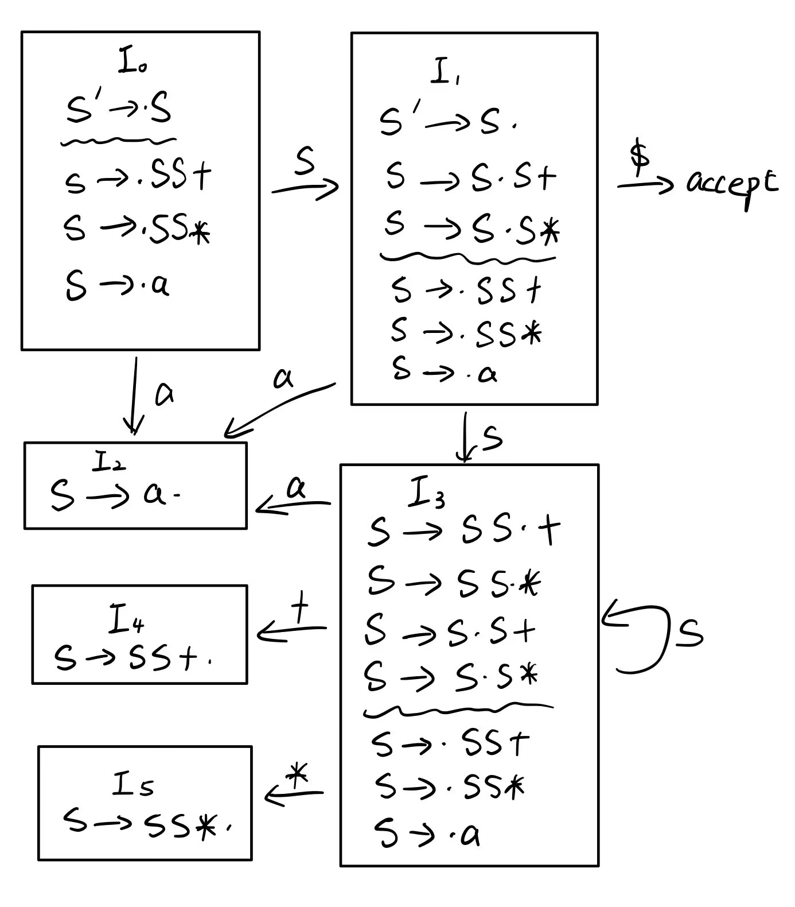

# 编译原理第四次作业

## 201300035 方盛俊

## Ex. 4.5.2 (1) (3)

**(1)**

| 最右句型  | 句柄  | 产生式      |
| --------- | ----- | ----------- |
| $SSS+a*+$ | $SS+$ | $S \to SS+$ |
| $SSa*+$   | $a$   | $S \to a$   |
| $SSS*+$   | $SS*$ | $S \to SS*$ |
| $SS+$     | $SS+$ | $S \to SS+$ |
| $S$       | -     | -           |

可以看出, $SSS+a*+$ 的句柄为 $SS+$.

**(3)**

| 最右句型  | 句柄  | 产生式      |
| --------- | ----- | ----------- |
| $aaa*a++$ | $a$   | $S \to a$   |
| $Saa*a++$ | $a$   | $S \to a$   |
| $SSa*a++$ | $a$   | $S \to a$   |
| $SSS*a++$ | $SS*$ | $S \to SS*$ |
| $SSa++$   | $a$   | $S \to a$   |
| $SSS++$   | $SS+$ | $S \to SS+$ |
| $SS+$     | $SS+$ | $S \to SS+$ |
| $S$       | -     | -           |

可以看出, $aaa*a++$ 的句柄为 $a$.

## Ex. 4.5.3 (2)

| 栈       | 输入        | 动作                  |
| -------- | ----------- | --------------------- |
| $\$$     | $aaa*a++\$$ | 移入                  |
| $\$a$    | $aa*a++\$$  | 按照 $S \to a$ 规约   |
| $\$S$    | $aa*a++\$$  | 移入                  |
| $\$Sa$   | $a*a++\$$   | 按照 $S \to a$ 规约   |
| $\$SS$   | $a*a++\$$   | 移入                  |
| $\$SSa$  | $*a++\$$    | 按照 $S \to a$ 规约   |
| $\$SSS$  | $*a++\$$    | 移入                  |
| $\$SSS*$ | $a++\$$     | 按照 $S \to SS*$ 规约 |
| $\$SS$   | $a++\$$     | 移入                  |
| $\$SSa$  | $++\$$      | 按照 $S \to a$ 规约   |
| $\$SSS$  | $++\$$      | 移入                  |
| $\$SSS+$ | $+\$$       | 按照 $S \to SS+$ 规约 |
| $\$SS$   | $+\$$       | 移入                  |
| $\$SS+$  | $\$$        | 按照 $S \to SS+$ 规约 |
| $\$S$    | $\$$        | 接受                  |

## Ex. 4.6.2

我们构建增广文法 $G'$, 即

1. $S' \to S$
2. $S \to SS+$
3. $S \to SS*$
4. $S \to a$

后续归约我们也使用 **这个编号** (1 ~ 4).

我们构造 LR(0) 自动机如下:

同时我们计算出

$\text{Follow}(S') = \{ \$ \}$

$\text{Follow}(S) = \{ a, +, *, \$ \}$

因此有语法分析表

| 状态 | >   | >   | >   | ACTION | GOTO |
| ---- | --- | --- | --- | ------ | ---- |
| -    | $a$ | $+$ | $*$ | $\$$   | $S$  |
| 0    | s2  | -   | -   | -      | 1    |
| 1    | s2  | -   | -   | acc    | 3    |
| 2    | r4  | r4  | r4  | r4     | -    |
| 3    | s2  | s4  | s5  | -      | 3    |
| 4    | r2  | r2  | r2  | r2     | -    |
| 5    | r3  | r3  | r3  | r3     | -    |

由于表中没有多个条目, 因此该语法分析表是语法 $G$ 的 SLR(1) 分析表, 也即该文法是 SLR(1) 文法.

## Ex. 4.6.3

根据上一题的语法分析表, 给出处理 $aa*a+$ 时的各个动作如下:

| -    | 栈      | 符号  | 输入      | 动作                  |
| ---- | ------- | ----- | --------- | --------------------- |
| (1)  | 0       | -     | $aa*a+\$$ | 移入                  |
| (2)  | 0 2     | $a$   | $a*a+\$$  | 根据 $S \to a$ 规约   |
| (3)  | 0 1     | $S$   | $a*a+\$$  | 移入                  |
| (4)  | 0 1 2   | $Sa$  | $*a+\$$   | 根据 $S \to a$ 规约   |
| (5)  | 0 1 3   | $SS$  | $*a+\$$   | 移入                  |
| (6)  | 0 1 3 5 | $SS*$ | $a+\$$    | 根据 $S \to SS*$ 规约 |
| (7)  | 0 1     | $S$   | $a+\$$    | 移入                  |
| (8)  | 0 1 2   | $Sa$  | $+\$$     | 根据 $S \to a$ 规约   |
| (9)  | 0 1 3   | $SS$  | $+\$$     | 移入                  |
| (10) | 0 1 3 4 | $SS+$ | $\$$      | 根据 $S \to SS+$ 规约 |
| (11) | 0 1     | $S$   | $\$$      | 接受                  |

