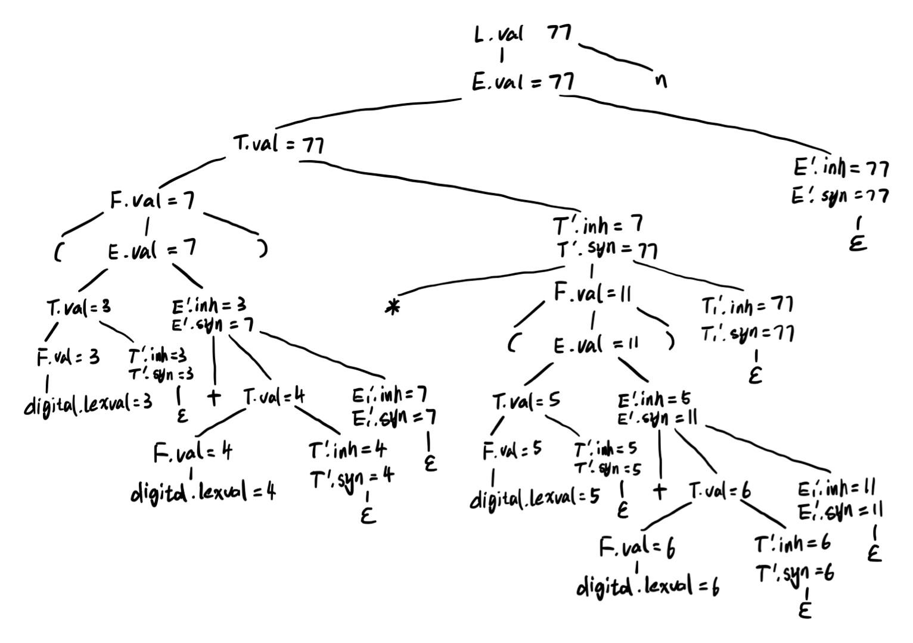

# 编译原理第五次作业

## 201300035 方盛俊

## Ex. 5.1.2

|     | 产生式               | 语义规则        |
| --- | -------------------- | --------------- |
| (1) | $L \to E n$          | $L.val = E.val$ |
| (2) | $E \to T E'$         | $E'.inh = T.val$ <br /> $E.val = E'.syn$ |
| (3) | $E' \to + T E_1'$    | $E_1'.inh = E'.inh + T.val$ <br /> $E'.syn = E_1'.syn$ |
| (4) | $E' \to \epsilon$    | $E'.syn = E'.inh$ |
| (5) | $T \to F T'$         | $T'.inh = F.val$ <br /> $T.val = T'.syn$ |
| (6) | $T' \to * F T_1'$    | $T_1'.inh = T'.inh * F.val$ <br /> $T'.syn = T_1'.syn$ |
| (7) | $T' \to \epsilon$    | $T'.syn = T'.inh$ |
| (8) | $F \to (E)$          | $F.val = E.val$ |
| (9) | $F \to \bold{digit}$ | $F.val = \bold{digit}.lexval$ |


## Ex. 5.1.3 (1)

**(1)**




## Ex. 5.2.3 (2)

**(2)**

(i) 由于 SDD 存在继承属性 $A.i$, $B.i$, $D.i$, 因此它不符合 S 属性定义的要求.

(ii) 由于 $A.s = B.i + C.s$ 的左侧是综合属性 $A.s$, 而 $D.i = A.i + B.s$ 中的 $D.i$ 依赖于 $A$ 的继承属性 $A.i$ 和左边符号 $B$ 的属性 $B.s$ 且不依赖于自身的其他属性, 因此满足 L 属性定义的要求.

(iii) 由于其满足 L 属性定义的要求, 因此存在和这些规则一致的求值过程.


## Ex. 5.2.4

|     | 产生式          | 语义规则        |
| --- | --------------- | --------------- |
| (1) | $S \to L_1.L_2$ | $L_1.side = \mathrm{Left}$ <br /> $L_2.side = \mathrm{Right}$ <br /> $S.val = L_1.val + L_2.val$ |
| (2) | $S \to L$       | $L.side = \mathrm{Left}$ <br /> $S.val = L.val$ |
| (3) | $L \to L_1 B$     | $L_1.side = L.side$ <br /> $L.len = L_1.len + 1$ <br /> $L.val = (L.side == \mathrm{Left}) ? (2 * L_1.val + B.val) : (L_1.val + B.val * 2^{-L.len})$ |
| (4) | $L \to B$       | $L.len = 1$ <br /> $L.val = (L.side == \mathrm{Left}) ? B.val : B.val / 2$ |
| (5) | $B \to 0$       | $B.val = 0$ |
| (6) | $B \to 1$       | $B.val = 1$ |


## Ex. 5.3.1 (1)

**(1)**

|     | 产生式          | 语义规则        |
| --- | --------------- | --------------- |
| (1) | $E \to E_1 + T$ | $E.type = (E_1.type == \mathrm{float} \vert\vert T.type == \mathrm{float}) ? \mathrm{float} : \mathrm{int}$ |
| (2) | $E \to T$       | $E.type = T.type$ |
| (3) | $T \to \mathrm{num}.\mathrm{num}$     | $T.type = \mathrm{float}$ |
| (4) | $T \to \mathrm{num}$       | $T.type = \mathrm{int}$ |


## Ex. 5.4.3

原来的 SDT 为：

```txt
B -> B_1 0 { B.val = 2 x B_1.val }
  |  B_1 1 { B.val = 2 x B_1.val + 1 }
  |  1 { B.val = 1 }
```

提取左公因子得

```txt
B -> B_1 D { B.val = 2 x B_1.val + D.val }
  |  1 { B.val = 1 }

D -> 0 { D.val = 0 }
  |  1 { D.val = 1 }
```

消除左递归后得

```txt
B -> 1 { B.val = 1 }

B -> 1 { A.i = 1 } A { B.val = A.s }

A -> D { A_1.i = 2 x A.i + D.val } A_1 { A.s = A_1.s }
  |  ε { A.s = A.i }

D -> 0 { D.val = 0 }
  |  1 { D.val = 1 }
```

化简得

```txt
B -> 1 { A.i = 1 } A { B.val = A.s }

A -> D { A_1.i = 2 x A.i + D.val } A_1 { A.s = A_1.s }
  |  ε { A.s = A.i }

D -> 0 { D.val = 0 }
  |  1 { D.val = 1 }
```

