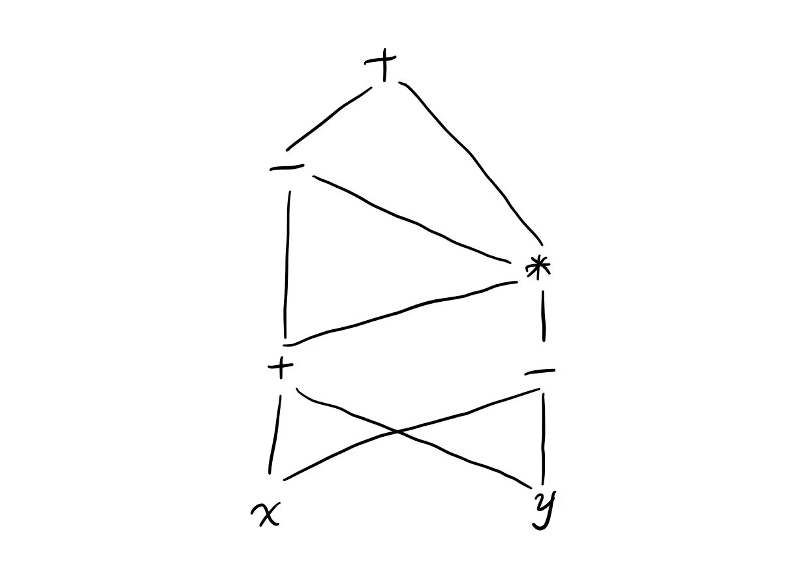

# 编译原理第六次作业

## 201300035 方盛俊

## Ex. 6.1.1



## Ex. 6.3.1

我们认为 int 类型占据 4 个字节的宽度, float 字节占据 8 个字节的宽度, 表格中的 Env 代表当前使用的符号表.

| 行号 | id  | Env | 类型 (type)    | 相对地址 (offset) |
| ---- | --- | --- | -------------- | ----------------- |
| (1)  | x   | 0   | float          | 0                 |
| (2)  | x   | 1   | float          | 0                 |
| (2)  | y   | 1   | float          | 8                 |
| (2)  | p   | 0   | record(Env(1)) | 8                 |
| (3)  | tag | 2   | int            | 0                 |
| (3)  | x   | 2   | float          | 4                 |
| (3)  | y   | 2   | float          | 12                |
| (3)  | q   | 0   | record(Env(2)) | 24                |


## Ex. 6.4.3 (2)

翻译结果如下:

```txt
t_1 = i * a_i_width
t_2 = j * a_j_width
t_3 = t_1 + t_2
t_4 = a[t_3]
t_5 = i * b_i_width
t_6 = j * b_j_width
t_7 = t_5 + t_6
t_8 = b[t_7]
t_9 = t_4 + t_8
x = t_9
```


## Ex. 6.4.6 (2)

### (2)

由于 i 和 j 是 1-base 且按行存放的, 我们可以使用公式 `(i - 1) * 20 * 4 + (j - 1) * 4` 进行计算, 因此我们有:

A[10, 8]: `(10 - 1) * 20 * 4 + (8 - 1) * 4 = 748`


## Ex. 6.4.7 (2)

### (2)

由于 i 和 j 是 1-base 且按行存放的, 我们可以使用公式 `(j - 1) * 10 * 4 + (i - 1) * 4` 进行计算, 因此我们有:

A[10, 8]: `(8 - 1) * 10 * 4 + (10 - 1) * 4 = 316`


## Ex. 6.6.1 (1)

添加 `S -> repeat S_1 while B` 的语法制导定义规则如下:

```txt
S_1.next = newlabel()
B.true = newlabel()
B.false = S.label
S.code = label(B.true) || S.code || label(S_1.next) || B.code
```


## Ex. 6.6.4 (1)

`if (a == b && c == d || e == f) x == 1;` 对应的翻译为:

```txt
    ifFalse a == b goto L3
    if c == d goto L2
L3: ifFalse e == f goto L1
L2: x == 1
L1:
```

