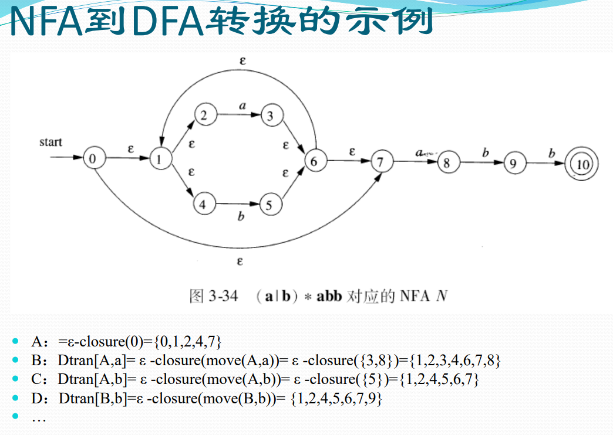
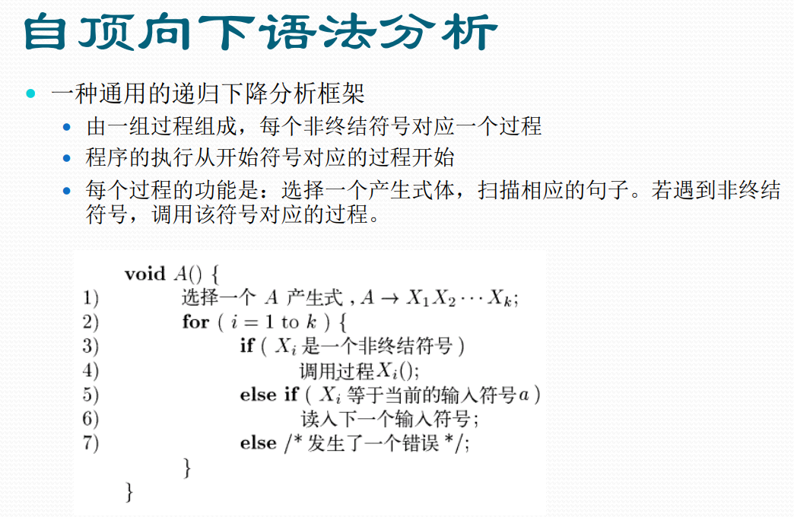
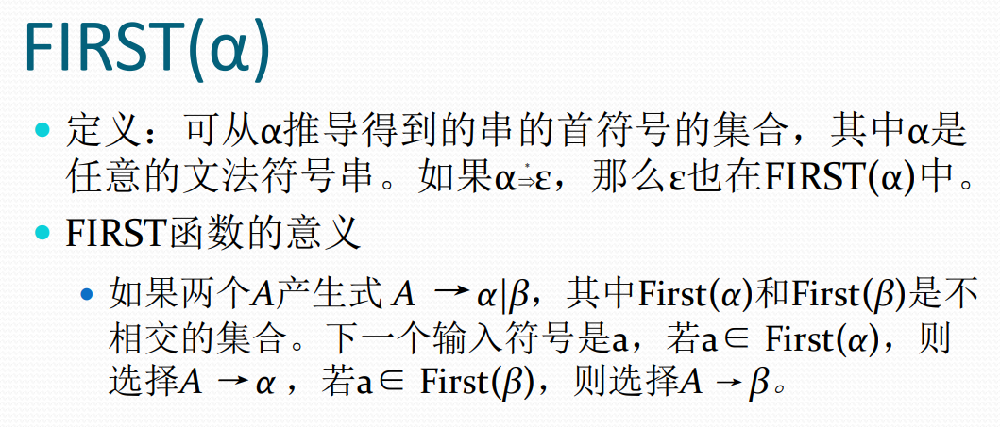
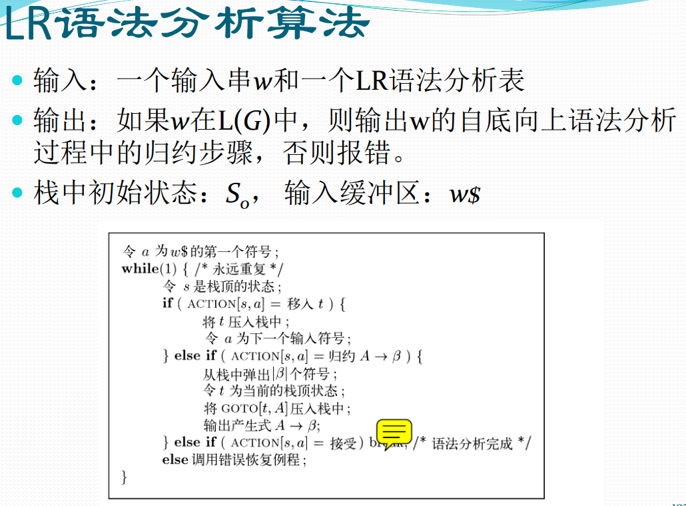
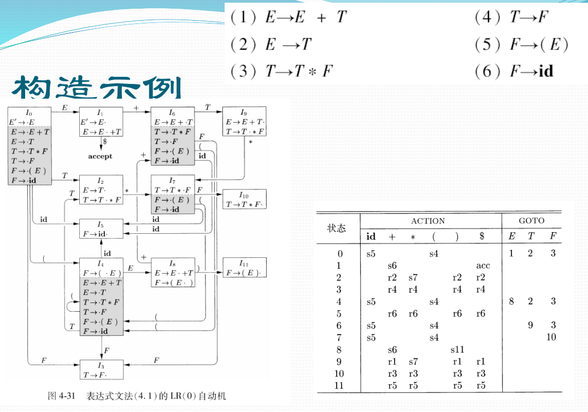

# 编译原理

## 第一章: 引论

## 第三章: 词法分析

### 3.1 词法分析概念

- 词法分析是读入源程序的输入字符, 将它们组成词素, 生成并输出一个词法单元序列, 每个词法单元对应于一个词素.
- 词法单元 (Token):
    - 包含单元名 (Token-name) 和可选的属性值 (attribute-value)
    - 单元名是表示某种词法单位抽象符号. 语法分析器通过单元名即可确定词法单元序列的结构. 
- 词素 (Lexeme):
    - 源程序中的字符序列, 它和某类词法单元的模式匹配, 被词法分析器识别为该词法单元的实例. 
- 模式 (Pattern):
    - 词法单元的词素可能具有的形式. 可以用正则表达式来表示. 

### 3.2 语言和正则表达式定义

- 正则表达式:
    - 一种描述词素模式的重要表示方法
- 和串有关的术语 (banana)
    - 前缀: 从串的尾部删除 0 个或多个符号后得到的串. (ban, banana,  ε)
    - 后缀: 从串的开始处删除 0 个或多个符号后得到的串. (nana, banana, ε)
    - 子串: 删除串的某个前缀和某个后缀得到的串. (banana, nan,  ε)
    - 真前缀, 真后缀, 真子串: 既不等于原串, 也不等于空串的前缀, 后缀, 子串.
    - 子序列: 从原串中删除 0 个或者多个符号后得到的串. (baan)

### 3.3 状态转换图

- 状态转换图是词法分析器的重要组件之一
- 可以将正则表达式转换成状态转换图
- 状态转换图 (transition diagram)
    - 状态 (state): 表示了在识别词素的过程中可能出现的情况
        - 状态看作是已处理部分的总结. 
        - 某些状态为接受状态或最终状态, 表明已经找到词素. 
        - 加上 * 的接受状态表示最后读入的符号不在词素中. 
        - 开始状态 (初始状态):用 start 边表示. 
    - 边 (edge): 从一个状态指向另一个状态; 边的标号是一个或者多个符号. 
        - 如果当前状态为 s, 下一个输入符号为 a, 就沿着从 s 离开, 标号为 a 的边到达下一个状态. 
    - 只要存在从开始状态到接受状态的路径, 符号串就认为被 NFA 接受.

**不确定有穷自动机 NFA:**

### 3.4 NFA 转换成 DFA - 子集构造法

**示例:**

### 3.5 DFA 状态数最小化

### 3.6 正则表达式到 NFA

## 第四章: 语法分析

### 4.1 概念

- 文法：一种用于描述程序设计语言语法的表示方法, 能够自然地描述程序设计语言构造的层次化语法结构.
    - 文法给出了一个程序设计语言的精确易懂的语法规约.
    - 可以基于文法构造语法分析器, 帮助确定源程序的语法结构.
    - 语法结构有助于把源程序翻译为正确的目标代码, 以及检测导语法错误.

- 推导中可能遇到的两个问题
    - 每一步替换哪个非终结符号.
    - 若以这个非终结符号为头的产生式有多个, 用哪个产生式的右部替换.

- 语法分析树
    - 是推导的图形表示形式，树上看不出来推导的顺序
    - 能够反映串的语法层次结构
    - 语法分析树
        - 内部节点：对应于一个非终结符号
        - 子节点：对应于其父节点为头的产生式体
        - 叶子节点：可以是终结符号或非终结符号，从左到右排列可以得到一个句型，称为这棵树的结果。

### 4.2 为 NFA 构造等价文法

### 4.3 如何验证文法 $G$ 所确定的语言 $L$

- 如何验证文法 $G$ 所确定的语言 $L$
    - 证明 $G$ 生成的每个串都在 $L$ 中
    - 证明 $L$ 中的每个串都能被 $G$ 生成
    - 实质上回归到了原始的定义, 证明采用数学归纳法

### 4.4 文法的设计

### 4.5 自顶向下语法分析

### 4.6 LL(1) 文法

### 4.7 自底向上句法分析

### 4.8 LR 语法分析技术

## 第五章: 语法制导的翻译

### 5.1 概念

### 5.2 语法制导定义

### 5.3 语法制导的翻译方案

## 第六章: 中间代码生成

