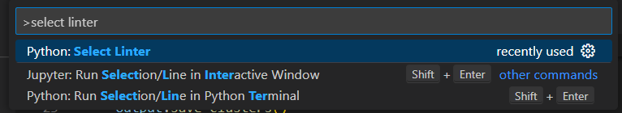
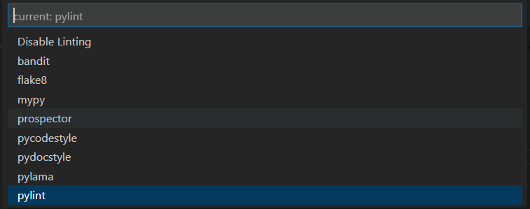
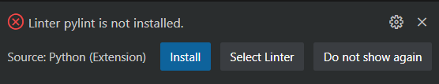
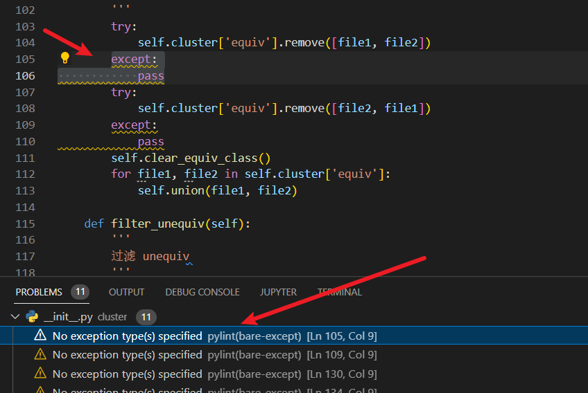

<style>
h1 {
    text-align: center;
}
h2, h3 {
    page-break-after: avoid; 
}
.center {
    margin: 0 auto;
    width: fit-content;
    margin-top: 2em;
    padding-top: 0.5em;
    padding-bottom: 0.5em;
    margin-bottom: 2em;
}
.title {
    font-weight: bold;
    border-top-style: solid;
    border-bottom-style: solid;
}
.newpage {
    page-break-after: always
}
@media print {
    @page {
        margin: 3cm;
    }
}
</style>

<h1 style="margin-top: 4em">
软件工程实验报告
</h1>

# <h1 class="center title">实验六: 软件分析与测试</h1>

<div class="center">
<h3>院系: 人工智能学院</h3>
<h3>姓名: 方盛俊</h3>
<h3>学号: 201300035</h3>
<h3>班级: 人工智能 20 级 2 班</h3>
<h3>邮箱: 201300035@smail.nju.edu.cn</h3>
<h3>时间: 2022 年 12 月 6 日</h3>
</div>

<div class="newpage"></div>

<!-- 生成目录 -->

## <h1>目录</h1>

[TOC]

<div class="newpage"></div>

<!-- 文章主体内容 -->

## 一、静态分析报告

### 1.1 静态分析工具的选取及安装

在实验 4 中，我使用的开发语言是 Python，因此这里我选取了 Pylint 作为我使用的静态分析工具。

在 VS Code 下 Pylint 的安装过程如下：

按下 `Ctrl + Shift + P`, 输入 `select linter`, 选择 `pylint`.





此时 `.vscode/settings.json` 文件内容如下:

```json
{
  "python.analysis.typeCheckingMode": "basic",
  "python.linting.pylintEnabled": true,
  "python.linting.enabled": true
}
```

说明此时已经开启了 Pylint。

我们打开一个 Python 文件，VS Code 会提醒我们还未安装 Pylint，需要执行安装。




如图所示，此时即为安装完成了。

我们再回到 `main.py` 文件，可以看出 Pylint 已经正常工作了，给出了几个警告。


### 1.2 静态分析工具的使用说明

我们查询微软 VS Code 官方文档的说明，可以知道，我们可以控制 Pylint 的报错的警告的种类，首先我们需要输出一个 `.pylintrc` 文件：

```sh
# Using an *nix shell or cmd on Windows
pylint --generate-rcfile > .pylintrc

# Using PowerShell
pylint --generate-rcfile | Out-File -Encoding utf8 .pylintrc
```


然后我们就可以在 `.pylintrc` 进行 Pylint 的配置。

配置完成之后，只要我们任意打开一个 Python 文件，在打开和保存的时候，VS Code 均会自动地执行 Pylint 对打开的 Python 文件进行分析。




### 1.3 静态分析工具的结果分析

静态分析工具的结果表明，大部分文件没有严重的代码错误，但是存在着不良好的编程习惯，例如：

没有说明异常的类型：


### 1.4 静态分析工具的代码修复


## 二、单元测试报告

