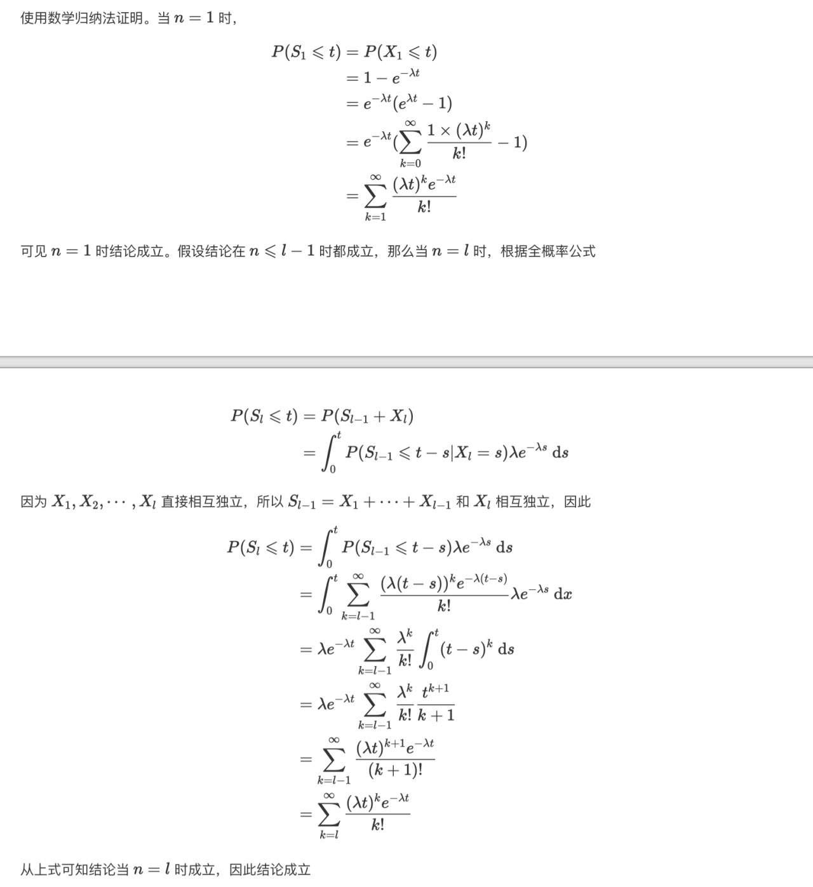

    

        <b style="float: left;">随机过程</b>
        <b style="float: right;">人工智能学院</b>
    

    <h1 style="text-align: center;">Homework 1</h1>
    

        <i>Instructor:</i> 钱超
        <i>Name:</i> 方盛俊, <i>StudentId:</i> 201300035
    

## Problem 1

我们有泊松过程定义 1:

1. $N(0) = 0$
2. 过程有独立增量
3. 任意长度为 $t$ 的区间中发生的事件数是一个均值为 $\lambda t$ 的泊松分布. 也就是, 对于任意 $s, t \ge 0$ 有

$$
P(N(s + t) - N(s) = n) = e^{-\lambda t}\frac{(\lambda t)^{n}}{n!}, n = 0, 1, 2, \cdots
$$

要证明定义 2:

1. $N(0) = 0$
2. 过程有独立增量
3. 过程有静态增量
4. $P(N(h) = 1) = \lambda h + o(h)$
5. $P(N(h) \ge 2) = o(h)$

**证明**:

两个定义的 1. 和 2. 是相同的, 易得证明.

**对于定义 2 的 3. 的证明**:

由定义 1 中的 3. 易得, $N(t)$ 有静态增量, 即对于 $\forall s > 0$ 有

$$
N(t + s) - N(t)
$$

对于所有的 $t$ 有着相同的分布.

**对于定义 2 的 4. 的证明**:

由定义 1 的 1. 和 3. 有, 令 $s = 0, t = h, n = 1$, 则

$$
\begin{aligned}
P(N(h) = 1) & = P(N(0 + h) - N(0) = 1)  \\
& = e^{-\lambda h}\frac{(\lambda h)^{1}}{1!}  \\
& = \lambda h (1 - \lambda h + o(\lambda h))  \\
& = \lambda h + o(h)  \\
\end{aligned}
$$

其中 $e^{-\lambda h} = 1 - \lambda h + o(\lambda h)$ 为泰勒展开.

**对于定义 2 的 5. 的证明**:

同理令 $s = 0, t = h, n = 0$, 则有

$$
\begin{aligned}
P(N(h) = 0) & = P(N(0 + h) - N(0) = 0)  \\
& = e^{-\lambda h}\frac{(\lambda h)^{0}}{0!}  \\
& = 1 - \lambda h + o(h)  \\
\end{aligned}
$$

则有

$$
P(N(h) \ge 2) = 1 - P(N(h) = 0) - P(N(h) = 1) = o(h)
$$

## Problem 2

<!-- 由于 $X_n$ 是独立同分布且均值为 $1 / \lambda$ 的指数随机变量, 且有

$$
S_n = X_1 + X_2 + \cdots + X_n
$$

因此由泊松过程定义 3 可知计数过程 $\{ N(t), t \ge 0 \}$ 是一个参数为 $\lambda$ 的泊松过程, 即有

$$
P(N(t) = n) = e^{-\lambda t} \frac{(\lambda t)^{n}}{n!}
$$

由 $S_n$ 和 $N(t)$ 的定义我们可知, $N(t) \ge n$ 与 $S_n \le t$ 是等价的, 即有

$$
\begin{aligned}
P(S_n \le t) & = P(N(t) \ge n)  \\
& = \sum_{k=n}^{\infty}P(N(t) = k)  \\
& = \sum_{k=n}^{\infty}\frac{(\lambda t)^{k}e^{-\lambda t}}{k!}  \\
\end{aligned}
$$ -->

## Problem 3

我们使用泊松过程定义 1:

1. $N(0) = 0$: 易得 $N(0) = \sum_{i=1}^{n}N_{i}(0) = \sum_{i=1}^{n}0 = 0$
2. 过程有独立增量: 由 $N_{i}(t)$ 之间相互独立且 $N_{i}(t)$ 是泊松过程可知, 事件发生相互独立, 事件发生数的增量也就独立, 即它们的和 $N(t)$ 也有着独立增量.
3. 任意长度为 $t$ 的区间中发生的事件数是一个均值为 $\lambda t$ 的泊松分布. 也就是, 对于任意 $s, t \ge 0$ 有

$$
P(N(s + t) - N(s) = n) = e^{-\lambda t}\frac{(\lambda t)^{n}}{n!}, n = 0, 1, 2, \cdots
$$

下面证明 3.

首先我们先证明两个泊松过程的和为另一个泊松过程, 即参数分别为 $\lambda_1$ 和 $\lambda_2$ 的泊松过程 $N_1(t)$ 与 $N_2(t)$ 的和 $N(t) = N_1(t) + N_2(t)$ 为参数为 $\lambda_1 + \lambda_2$ 的泊松过程.

记 $X = N_1(s + t) - N_1(s), Y = N_2(s + t) - N_2(s), Z = X + Y = N(s + t) - N(s)$, 则有 $X \sim \mathrm{Pois}(\lambda_1 t)$ 和 $Y \sim \mathrm{Pois}(\lambda_2 t)$, 要证 $Z  \sim \mathrm{Pois}((\lambda_1 + \lambda_2) t)$.

证明如下:

$$
\begin{aligned}
P(Z = n) &= \sum_{j = 0}^{n} P(X = j \land Y = n - j)  \\
&=\sum_{j = 0}^{n} P(X = j)P(Y = n - j)  \\
&=\sum_{j = 0}^{n} \frac{e^{-\lambda_1 t}(\lambda_1 t)^{j}}{j!} \frac{e^{-\lambda_2 t}(\lambda_2 t)^{n-j}}{(n-j)!}  \\
&=e^{-(\lambda_1 + \lambda_2) t}\sum_{j = 0}^{n} \frac{(\lambda_1 t)^{j}}{j!} \frac{(\lambda_2 t)^{n-j}}{(n-j)!}  \\
&=e^{-(\lambda_1 + \lambda_2) t} \cdot \frac{(\lambda_1 t + \lambda_2 t)^{n}}{n!}  \\
&= \frac{e^{-\lambda t}(\lambda t)^{n}}{n!}  \\
\end{aligned}
$$

其中倒数第二步用了二项式公式 $\displaystyle (\lambda_1 t + \lambda_2 t)^{n} = \sum_{j=0}^{n}\frac{n!}{j!(n-j)!}(\lambda_1 t)^{j}(\lambda_2 t)^{n-j}$

因此我们证明了参数分别为 $\lambda_1$ 和 $\lambda_2$ 的泊松过程 $N_1(t)$ 与 $N_2(t)$ 的和 $N(t) = N_1(t) + N_2(t)$ 为参数为 $\lambda_1 + \lambda_2$ 的泊松过程.

因此, 重复应用该结论, 我们就有 $N(t) = N_1(t) + N_2(t) + \cdots N_{n}(t)$ 是一个参数为 $\sum_{i=1}^{n}\lambda_{i}$ 的泊松过程.

## Problem 4

我们使用数学归纳法.

当 $n = 0$ 时,

$$
\begin{aligned}
P_0(s + h) &= P(N(t + s + h) - N(t) = 0)  \\
&=P(N(t + s) - N(t) = 0 \land N(t + s + h) - N(t + s) = 0)   \\
&=P_0(s)(1 - \lambda(t+s)h + o(h))
\end{aligned}
$$

因此我们有

$$
P_0'(s) = \lim_{h \to 0} \frac{P_0(s+h) - P_0(s)}{h} = -\lambda(t+s)P_0(s)
$$

则有

$$
\frac{P_0'(s)}{P_0(s)} = -\lambda(t+s)
$$

两边积分则有

$$
\log P_0(s) = \int_{0}^{s}-\lambda(t+x)\mathrm{d}x
$$

两边取指数则有

$$
P_0(s) = e^{-(m(t+s) - m(t))}
$$

符合原式.

当 $n \ge 1$ 时,

$$
\begin{aligned}
&\quad\ P_{n}(s + h) \\
&= P(N(t + s + h) - N(t) = n)  \\
&= P([N(t + s + h) - N(t)] - [N(t + s) - N(t)] = 0, N(t + s) - N(t) = n)  \\
&\quad\ + P([N(t + s + h) - N(t)] - [N(t + s) - N(t)] = 1, N(t + s) - N(t) = n - 1)  \\
&\quad\ + P([N(t + s + h) - N(t)] - [N(t + s) - N(t)] \ge 2, N(t + s + h) - N(t) = n)  \\
&= P_{n}(s)(1-\lambda(s+t)h) + P_{n-1}(s)\lambda(s+t)h + o(h)
\end{aligned}
$$

两边除以 $h$ 得

$$
\frac{P_n(s+h) - P_n(s)}{h} = -\lambda(t+s)P_n(s) +\lambda(t+s)P_{n-1}(s) + \frac{o(h)}{h}
$$

也即

$$
P_n'(s) = -\lambda(t+s)P_n(s) +\lambda(t+s)P_{n-1}(s)
$$

移项后两边乘上 $e^{m(t+s)-m(t)}$ 可得

$$
e^{m(t+s)-m(t)}[P_n'(s) + \lambda(t + s)P_n(s)] = \lambda(t+s)e^{m(t+s)-m(t)}P_{n-1}(s)
$$

可以凑成微分形式
 
$$
\frac{\mathrm{d}e^{m(t+s)-m(t)}P_n(s)}{\mathrm{d}t} = \lambda(t+s)e^{m(t+s)-m(t)}P_{k-1}(s)
$$

我们使用数学归纳法, 已知 $n=0$ 时奠基成立. 假设对于 $n \le k - 1$ 均成立, 则我们只需证明对于 $n = k, k \ge 1$ 有

$$
\begin{aligned}
\frac{\mathrm{d}e^{m(t+s)-m(t)}P_k(s)}{\mathrm{d}t} & = \lambda(t+s)e^{m(t+s)-m(t)}P_{k-1}(s)  \\
& = \lambda(t+s)\frac{(m(t+s)-m(t))^{k-1}}{(k-1)!}  \\
\end{aligned}
$$

两边积分即有

$$
e^{m(t+s)-m(t)}P_k(s) - P_k(0) = \frac{(m(t+s)-m(t))^{k}}{k!}
$$

最后移项即有最终结果

$$
P_k(s) = e^{-(m(t+s)-m(t))}\frac{(m(t+s)-m(t))^{k}}{k!}
$$

## Problem 5

我们证明定义 2:

1. $N'(0) = N(0) = 0$.
2. 由于 $N(t)$ 有着独立的增量, 那么从 $N(t)$ 上采样得到的 $N'(t)$ 同样拥有独立的增量.
3. 在 $(t, t+s]$ 中发生的事件数遵从均值为 $m(t+s)-m(t)$ 的泊松分布, 也即

$$
P(N'(t + s) - N'(t) = n) = e^{-(m(t+s)-m(t))}\frac{(m(t+s)-m(t))^{n}}{n!}
$$

下面我们证明 3.

由泊松过程的性质可得, 若我们将 $N(u)$ 中发生的事件分别分类为 type-1 和 type-2, 当 $u \ge t$ 时, 其中的一个事件分类为 type-1 的概率为 $\frac{\lambda(u)}{\lambda}$, $u < t$ 时概率为零, 则我们有时间 $t$ 之后的 type-1 事件发生的次数 $N''(u)$ 是均值为 $\lambda up$ 的泊松随机变量, 其中

$$
p = \frac{1}{u}\int_{t}^{u}\frac{\lambda(x)}{\lambda}\mathrm{d}x = \frac{1}{\lambda u}(m(u) - m(t))
$$

即 $N''(u)$ 是均值为 $m(u) - m(t)$ 的泊松随机变量. 因此我们有 $N''(t) = 0$ 且有

$$
P(N''(u) = n) = e^{-(m(u) - m(t))}\frac{(m(u) - m(t))^{n}}{n!}
$$

由我们对 $N''(x)$ 的定义可知,

$$
\begin{aligned}
P(N'(t+s) - N'(t) = n) & = P(N''(t+s) - N''(t) = 0)  \\
& = P(N''(t+s) = 0)  \\
& = e^{-(m(t+s) - m(t))}\frac{(m(t+s) - m(t))^{n}}{n!}  \\
\end{aligned}
$$

因此 $\{ N'(t), t \ge 0 \}$ 是一个参数为 $\lambda(t)$ 的非齐次泊松过程.

## Problem 6

我们证明定义 2:

1. $N(0) = N^{*}(m(0)) = N^{*}(\int_{0}^{0}\lambda(x)\mathrm{d}x) = N^{*}(0) = 0$.
2. 由于 $N^{*}(t)$ 有着独立的增量, 那么经过将时间域单调变换后得到的 $N^{*}(m(t))$ 同样拥有独立的增量.
3. 在 $(t, t+s]$ 中发生的事件数遵从均值为 $m(t+s)-m(t)$ 的泊松分布, 也即

$$
P(N(t + s) - N(t) = n) = e^{-(m(t+s)-m(t))}\frac{(m(t+s)-m(t))^{n}}{n!}
$$

下面我们证明 3.

我们知道比率为 $1$ 的齐次泊松过程 $\{ N^{*}(t), t \ge 0 \}$ 满足

$$
P(N^{*}(t+s) - N^{*}(t) = n) = e^{-t}\frac{t^{n}}{n!} = e^{-((t + s) - t)}\frac{((t + s) - t)^{n}}{n!}
$$

因此我们有

$$
\begin{aligned}
P(N(t+s) - N(t) = n) & = P(N^{*}(m(t+s)) - N^{*}(m(t)) = n)  \\
& = e^{-(m(t + s) - m(t))}\frac{(m(t + s) - m(t))^{n}}{n!}  \\
\end{aligned}
$$

因此 $\{ N(t), t \ge 0 \}$ 是一个参数为 $\lambda(t)$ 的非齐次泊松过程.

## Problem 7

我们证明定义 2:

1. $N^{*}(0) = N(m^{-1}(0)) = N^{*}(0) = 0$.
2. 由于 $N(t)$ 有着独立的增量, 那么经过将时间域单调变换后得到的 $N^{*}(m^{-1}(t))$ 同样拥有独立的增量.
3. 在 $(s, s+t]$ 中发生的事件数遵从均值为 $t$ 的泊松分布, 也即

$$
P(N^{*}(s + t) - N^{*}(s) = n) = e^{-t}\frac{t^{n}}{n!}
$$

下面我们证明 3.

我们知道参数为 $\lambda(t)$ 的非齐次泊松过程 $\{ N(t), t \ge 0 \}$ 满足

$$
P(N(s + t) - N(s) = n) = e^{-(m(s+t)-m(s))}\frac{(m(s+t)-m(s))^{n}}{n!}
$$

因此我们有

$$
\begin{aligned}
&\quad\ P(N^{*}(s+t) - N^{*}(s) = n) \\
& = P(N(m^{-1}(s+t)) - N(m^{-1}(s)) = n)  \\
& = e^{-(m(m^{-1}(s + t)) - m(m^{-1}(s)))}\frac{(m(m^{-1}(s + t)) - m(m^{-1}(s)))^{n}}{n!}  \\
& = e^{-((s + t) - s)}\frac{((s + t) - s)^{n}}{n!}  \\
& = e^{-t}\frac{t^{n}}{n!}  \\
\end{aligned}
$$

因此 $\{ N(t), t \ge 0 \}$ 是一个比率为 $1$ 的齐次泊松过程.

