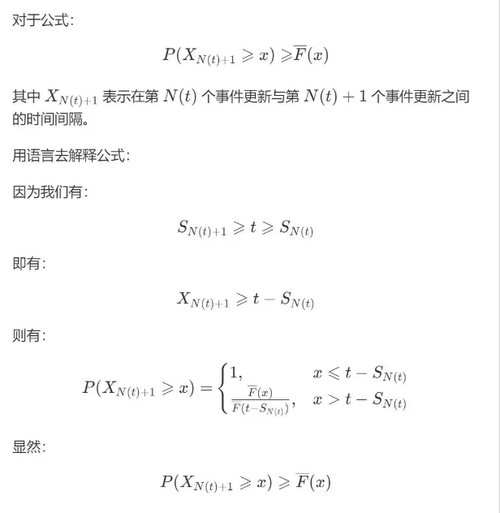

    

        <b style="float: left;">随机过程</b>
        <b style="float: right;">人工智能学院</b>
    

    <h1 style="text-align: center;">Homework 2</h1>
    

        <i>Instructor:</i> 钱超
        <i>Name:</i> 方盛俊, <i>StudentId:</i> 201300035
    

## Problem 1

考虑一个交替更新过程 $\begin{cases} \mathrm{on}, & \text{otherwise} \\ \mathrm{off}, & Y(t) \le x \end{cases}$

$$
\begin{aligned}
&\quad\ \lim_{t \to \infty} P(Y(t) \le x)  \\
& = \frac{E[\min(X, x)]}{E[X]}  \\
& = \frac{\int_{0}^{\infty}P(\min(X, x) > y)\mathrm{d}y}{E[X]}  \\
& = \frac{\int_{0}^{x}P(X > y)\mathrm{d}y}{E[X]}  \\
& = \frac{\int_{0}^{x}\bar{F}(y)\mathrm{d}y}{\mu}  \\
\end{aligned}
$$

## Problem 2

$$
\begin{aligned}
E[N_{11\cdots 1}] & = E[N_{1^{k}}]  \\
& = E[N_{1^{k}|1^{k-1}}] + E[N_{1^{k-1}}]  \\
& = E[N_{1}] + \sum_{i = 2}^{k}E[N_{1^{i}|1^{i-1}}]  \\
& = \frac{1}{p} + \sum_{i = 2}^{k}\frac{1}{p^{i}}  \\
& = \begin{cases} k, & p = 1 \\ \frac{(\frac{1}{p})^{k} - 1}{1 - p}, & \text{otherwise} \end{cases}  \\
\end{aligned}
$$

## Problem 3

$\displaystyle E[N_{A}] = E[N_{1010}] = E[N_{1010|10}] + E[N_{10}] = \frac{1}{p^{2}q^{2}} + \frac{1}{pq} = \frac{304}{9}$

$\displaystyle E[N_{B}] = E[N_{0100}] = E[N_{0100|0}] + E[N_{0}] = \frac{1}{pq^{3}} + \frac{1}{q} = \frac{292}{27}$

$\displaystyle E[N_{A|B}] = E[N_{1010|0100}] = E[N_{1010}] = \frac{1}{p^{2}q^{2}} + \frac{1}{pq} = \frac{304}{9}$

$\displaystyle E[N_{B|A}] = E[N_{0100|1010}] = E[N_{0100|010}] = E[N_{0100}] - E[N_{010}] = E[N_{0100}] - E[N_{010|0}] - E[N_{0}] = \frac{292}{27} - \frac{1}{pq^{2}} - \frac{1}{q} = \frac{64}{27}$

$\displaystyle P(A \text{ before } B) = \frac{E[N_{B}] + E[N_{A|B}] - E[N_{A}]}{E[N_{B|A}] + E[N_{A|B}]} = \frac{\frac{292}{27} + \frac{304}{9} -\frac{304}{9}}{\frac{64}{27} + \frac{304}{9}} = \frac{73}{244}$

## Problem 4

考虑 The Ballot Problem, 候选人 $A$ 收到 $n$ 张票, 候选人 $B$ 受到 $m$ 张票, 且满足 $n > m$. 我们可以证明在投票计数过程中 $A$ 总是领先于 $B$ 的概率为 $P_{n, m} = (n - m) / (n + m)$.

我们通过考虑最后一张票投给谁作为条件进行全概率展开有

$$
P_{n, m} = \frac{n}{n + m}P_{n-1, m} + \frac{m}{m + n}P_{n, m - 1}
$$

根据数学归纳法, 由于 $P_{n, 0} = 1$ 与 $P_{m, m} = 0$ 可知奠基成立, 因此可以假设 $P_{n', m'} = (n' - m') / (n' + m')$ 对 $n' < n$ 或 $m' < m$ 时均成立, 则有

$$
P_{n, m} = \frac{n}{n + m}\frac{n - 1 - m}{n - 1 + m} + \frac{m}{m + n}\frac{n - m + 1}{n + m - 1} = \frac{n - m}{n + m}
$$

我们将其应用在对称随机游走过程中, 其中 $Y_{i}$ 以 $p$ 的概率取值为 $1$, $1-p$ 的概率取值 $-1$. 因此我们有

$$
\begin{aligned}
& \quad\ P(Z_1 \neq 0, Z_2 \neq 0, \ldots, Z_{2n-1} \neq 0, Z_{2n} = 0)  \\
& = P(\text{first time equal } = 2n)  \\
& = P(\text{first time equal } = 2n \land n \text{ are positive in first } 2n)  \\
& = P(\text{first time equal } = 2n | n \text{ are positive in first } 2n)\binom{2n}{n}p^{n}(1-p)^{n}  \\
& = P_{n, n - 1}\binom{2n}{n}p^{n}(1-p)^{n}  \\
& = \frac{\binom{2n}{n}p^{n}(1-p)^{n}}{2n-1}  \\
\end{aligned}
$$

由于我们有 $\displaystyle u_n = P(Z_{2n} = 0) = \binom{2n}{n}\frac{1}{n^{2n}}$, 我们令 $\displaystyle p = \frac{1}{2}$, 则可得

$$
u_{n} = \frac{2n - 1}{2n}u_{n-1}
$$

以及

$$
P(Z_1 \neq 0, Z_2 \neq 0, \ldots, Z_{2n-1} \neq 0, Z_{2n} = 0) = \frac{\binom{2n}{n}(\frac{1}{2})^{2n}}{2n-1} = \frac{u_n}{2n - 1}
$$

因此应用上式我们可得

$$
P(Z_1 \neq 0, Z_2 \neq 0, \ldots, Z_{2n} \neq 0) = 1 - \sum_{k=1}^{n} \frac{u_k}{2k - 1}
$$

我们只需证明

$$
u_{n} = 1 - \sum_{k=1}^{n} \frac{u_k}{2k - 1}
$$

我们使用数学归纳法, 当 $n = 1$ 时有 $u_{1} = \frac{1}{2}$ 成立, 假设上式对 $n - 1$ 时成立, 则我们有

$$
\begin{aligned}
1 - \sum_{k=1}^{n} \frac{u_k}{2k - 1} & = 1 - \sum_{k=1}^{n-1} \frac{u_k}{2k - 1} - \frac{u_n}{2n - 1}  \\
& = u_{n-1} - \frac{u_n}{2n - 1}  \\
& = u_{n}  \\
\end{aligned}
$$

因此可知

$$
P(Z_1 \neq 0, Z_2 \neq 0, \ldots, Z_{2n} \neq 0) = u_n
$$

## Problem 5

$X_{N(t) + 1}$ 是区间末端在时间 $t$ 之后的第一个更新区间的长度.

证明 $P(X_{N(t)+1} \ge x) \ge \bar{F}(x)$:

$$
\begin{aligned}
P(X_{N(t)+1} \ge x) & = P(X_{N(t)+1} \ge x | S_{N(t)} = 0)P(S_{N(t)} = 0)  \\
&\quad\ + \int_{0}^{\infty}P(X_{N(t)+1} \ge x | S_{N(t)} = s)\mathrm{d}F_{S_{N(t)}}(s)  \\
& \ge \int_{0}^{\infty}P(X_{N(t)+1} \ge x | S_{N(t)} = s)\mathrm{d}F_{S_{N(t)}}(s)  \\
& = \int_{0}^{\infty}P(X_{N(t)+1} \ge x | X_{N(t)+1} > t - s)\mathrm{d}F_{S_{N(t)}}(s)  \\
& = \int_{0}^{\infty}\frac{P(X_{N(t)+1} \ge x, X_{N(t)+1} > t - s)}{P(X_{N(t)+1} > t - s)}\mathrm{d}F_{S_{N(t)}}(s)  \\
& = \int_{0}^{\infty}\frac{\bar{F}(\max\{ x, t-s \})}{\bar{F}(t - s)}\mathrm{d}F_{S_{N(t)}}(s)  \\
& = \int_{0}^{\infty}\min\{ \frac{\bar{F}(x)}{\bar{F}(t - s)}, \frac{\bar{F}(t-s)}{\bar{F}(t - s)} \}\mathrm{d}F_{S_{N(t)}}(s)  \\
& = \int_{0}^{\infty}\min\{ \frac{\bar{F}(x)}{\bar{F}(t - s)}, 1 \}\mathrm{d}F_{S_{N(t)}}(s)  \\
& \ge \int_{0}^{\infty} \bar{F}(x) \mathrm{d}F_{S_{N(t)}}(s)  \\
& = \bar{F}(x) \int_{0}^{\infty} \mathrm{d}F_{S_{N(t)}}(s)  \\
& = \bar{F}(x)  \\
\end{aligned}
$$

