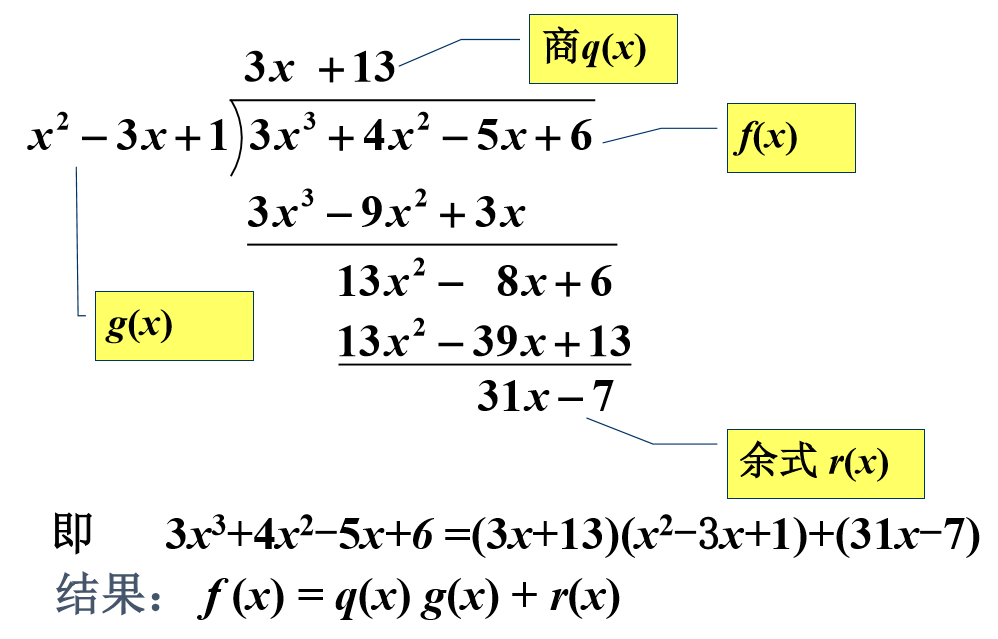
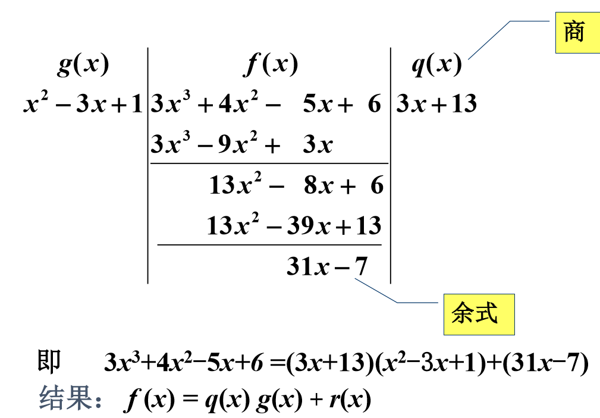
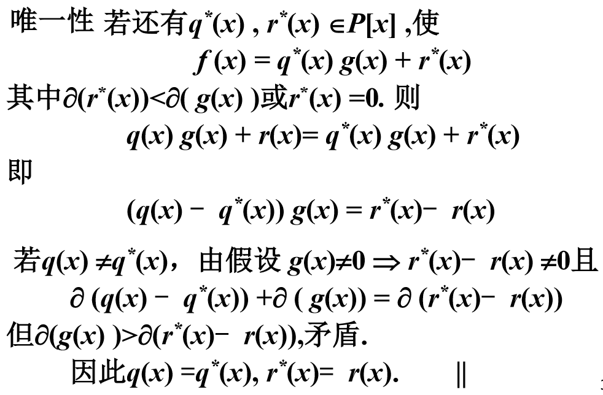

# 整除的概念

# 引言

在一元多项式环 $P[x]$ 中,有 $f(x)±g(x),f(x)g(x)$ . 是否有除法？应该如何描述 $P[x]$ 中两个多项式相 除的关系？两个多项式除法的一般结果是什么？

# 带余除法

## 长除法

## 竖式除法

## 定理

设$f(x), g(x) \in P[x], g(x) \neq 0$, 则**存在唯一**的多项式$q(x), r(x)\in P[x]$, 使得

$$
f(x) = q(x)g(x) + r(x)
$$

其中 $r(x)=0$ 或 $\partial(r(x))<\partial(g(x))$

称上式中$q(x)$为$g(x)$除$f(x)$的**商**, $r(x)$为$g(x)$除$f(x)$的**余数**

## 证明

# 整除的定义

设$f(x), g(x) \in P[x]$, 如果存在多项式$h(x) \in P[x]$

使得

$$
f(x) = h(x)g(x)
$$

称$g(x)$整除$f(x)$(或$f(x)$能被$g(x)$整除)， 记为$g(x)|f(x)$,  
此时称$g(x)$为$f(x)$的**因式**， $f(x)$为$g(x)$的**倍式**.

等价为:

$g(x)$除$f(x)$的余式为零.

正确例子:

* $2|3$
* $f(x)|0$

# 整除的性质

* $f(x)|f(x)$  (反身性)
  * $f(x)=1\cdot f(x)$
* $f(x)|0$
  * $0 = 0 \cdot f(x)$
* $c|f(x)$
  * $f(x)=c[c^{-1}f(x)]$
* 若$f(x)|g(x), g(x)|f(x)$, 则$f(x)=cg(x)$
* 若$f(x)|g(x), g(x)|h(x)$, 则$f(x)|h(x)$
* 若$f(x)|g(x)$, 则$\forall c\neq 0, cf(x)|g(x)$

## 思考题

若$\partial f(x)<\partial g(x), 且g(x)|f(x)$

则$f(x)=0$

# 作业

