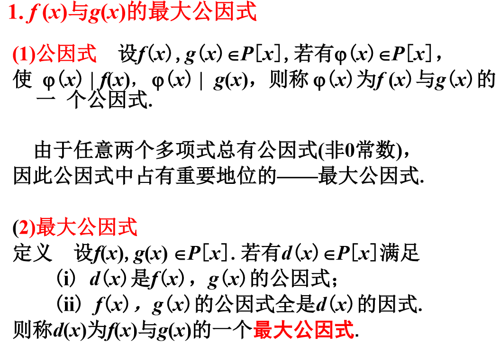
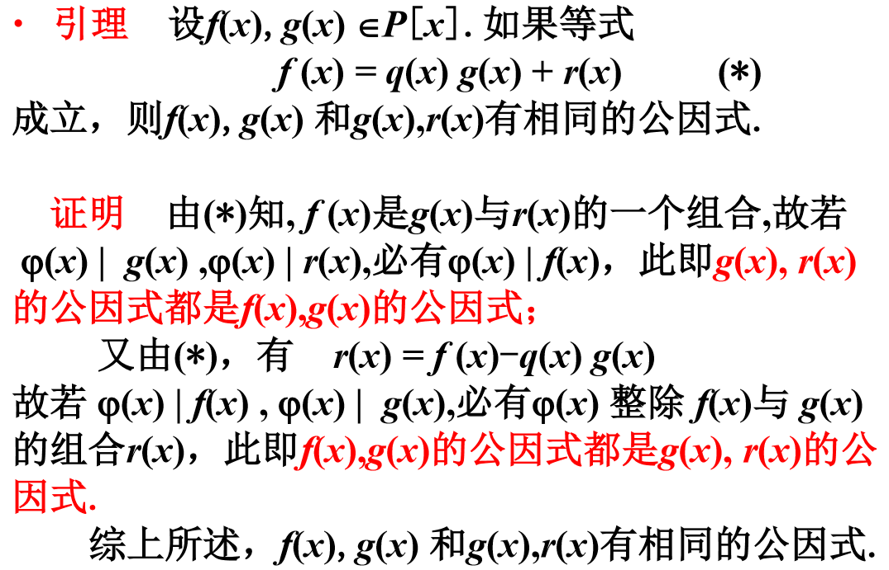
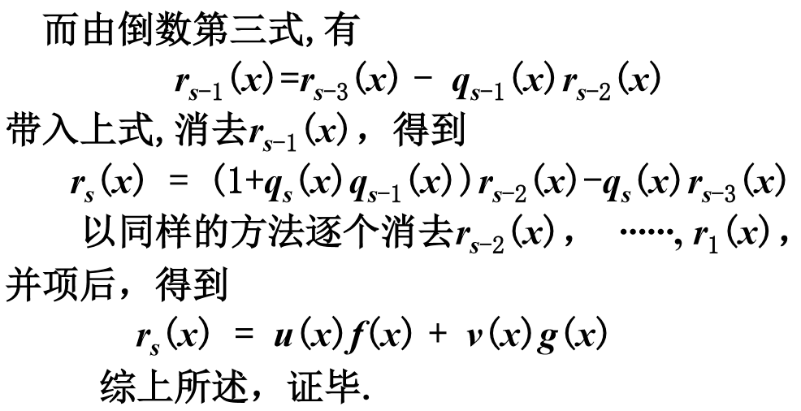

# 最大公因式

# 说明

## 最大公因式再相差一个非零常数的意义下是唯一确定的

事实上, 若$d_1(x), d_2(x)$是$f(x), g(x)$的最大公因式, 由最大公因式定义, 知

$$
d_1(x)|d_2(x), d_2(x)|d_1(x)
$$

可得

$$
d_1(x)=cd_2(x)
$$

## 记法

记$(f(x), g(x))$为$f(x)$和$g(x)$的首项为$1$的最大公因式.

# 例题

若$\{f(x),g(x)的公因式\}=\{p(x),q(x)的公因式\}$

那么$\{f(x),g(x)的最大公因式\}=\{p(x),q(x)的最大公因式\}$

即$(f(x),g(x))=(p(x),q(x))$

## 证明:

$设c(x)是f(x),g(x)的最大公因式, 则c(x)也是p(x),q(x)的最大公因式.$

$p(x),q(x)的因式都能在f(x), g(x)找到相同的因式, 所以c(x)能被所有因式整除.$

$c(x)是p(x),q(x)的最大公因式.$

# 公因式的存在及其求法 (辗转相除法)

用辗转相除法求最大公因式.

# 最大公因式存在及其求法

$d(x) = u(x)f(x) + v(x)g(x)$

## 辗转相除法证明:

# 例

# 互素多项式

## 定义

$设f(x), g(x) \in P[x], 如果(f(x), g(x))=1,$
$称f(x)与g(x)互素(也称互斥)$.

易知, 两个互素多项式的公因式只有零次多项式.

## 充分必要条件
$f(x), g(x) 互素 \Leftrightarrow \exist u(x) \exist v(x) \in P [x], (f(x), g(x))=1$

## 性质

$若(f(x), g(x))=1, f(x)|g(x)h(x), 则f(x)|h(x)$

### 证明:

$\because u(x)f(x)+v(x)g(x)=1$

$\therefore u(x)f(x)h(x)+v(x)g(x)h(x)=h(x)$

$\because f(x)|g(x)h(x), f(x)|f(x)$

$\therefore f(x)|u(x)f(x)h(x)+v(x)g(x)h(x)$

$\therefore f(x)|h(x)$

## 推论

$若f_1(x)|g(x), f_2(x)|g(x) 且 (f_1(x), f_2(x))=1, 则f_1(x)f_2(x)|g(x)$

### 证明:

$\because g(x)=f_1(x)p(x), f_2|g(x)$

$\therefore f_2(x)|f_1(x)p(x)$

$\because (f_1(x), f_2(x))=1$

$\therefore f_2(x)|p(x)$

$\therefore p(x) = f_2(x)q(x)$

$\therefore g(x)=f_1(x)f_2(x)q(x)$

$\therefore f_1(x)f_2(x)|g(x)$

# 最小公倍式

$设f_1(x),f_2(x),\cdots,f_m(x),C(x)\in P[x]$

$其中f_1(x),f_2(x),\cdots,f_m(x)不会为0$

$如果:$
$(1) f_i(x)|C(x), i = 1,2,\cdots,m$
$(2) 设f_i(x)|h(x), 有C(x)|h(x), i=1,2,\cdots,m$

$记为[f_1(x),f_2(x),\cdots,f_m(x)]$

# 性质

互素性不随数域的扩大而扩大.