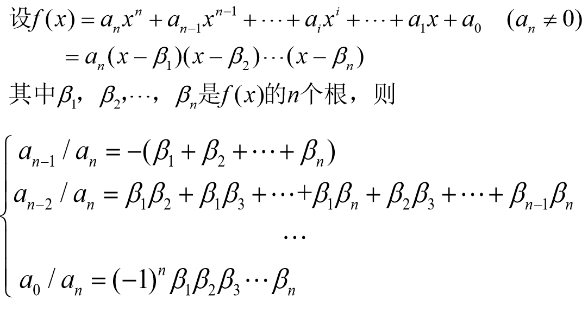

# 复系数与实系数多项式的因式分解

对于复数域我们有下列重要定理

## 代数基本定理

每个次数≥1的复系数多项式, 在复数域中总有一个根. 

* 每个次数≥1的复系数多项式, 在复数域中总有一个一次因式.
* 复数域上所有次数大于1的多项式都是可约的, 或复数域上不可约多项式只有一次的.

## 复系数多项式因式分解定理

每个次数≥1的复系数多项式都可以唯一地分解成一次因式的乘积.

# Vieta定理

$\displaystyle \frac{a_{n-1}}{a_n}=-\sum_{i=1}^n\beta_i$

$\displaystyle \frac{a_{n-2}}{a_n}=\sum_{1\leq i < j \leq n}\beta_i\beta_j$

$\displaystyle \frac{a_{n-3}}{a_n}=-\sum_{1\leq i < j < k \leq n}\beta_i\beta_j\beta_k$

# 根的共轭性

$设\alpha 是实系数多项式f(x)的一个根, 则其共轭数\overline{\alpha}也一定是f(x)的一个根.$

## 证明:

$令p(x)=(x-\alpha)(x-\overline\alpha), \alpha = a+bi, p(x)与f(x)有共根\alpha$

$\therefore p(x)=x^2-2ax+a^2+b^2, 不可约$

$\therefore p(x)|f(x)$

$\therefore x-\overline{\alpha}|f(x)$

$\therefore \overline{\alpha}是f(x)的根.$

## 推论

奇次实系数多项式至少有一个实根.

# 实系数多项式因式分解定理

每个次数≥1的实系数多项式在实数域上都可以唯一地分解成一次因式与二次不可约因式的乘积.

## 例题(1)

$分解f(x)=x^n-1$

### 解:

$\because 1=\cos 2k\pi + i\sin 2k\pi$

$\therefore x=1^{\frac{1}{n}}=(\cos 2k\pi + i\sin 2k\pi)^{\frac{1}{n}}=(e^{i2k\pi})^{\frac{1}{n}}=\cos \frac{2k\pi}{n} + i\sin \frac{2k\pi}{n}$

$\therefore f(x)=\displaystyle\prod_{l=0}^{n-1}[x-(\cos \frac{2k\pi}{n} + i\sin \frac{2k\pi}{n})]$

## 例题(2)

$已知f(x)=a_nx^n+a_{n-1}x^{n-1}+\cdots+a_1x+a_0, a_i已知.$
$c_i为f(x)的根,未知. 求以\displaystyle\frac{1}{c_i}为根的g(x).$

### 解:

$\therefore 0=f(c_i)=a_nc_i^n+a_{n-1}c_i^{n-1}+\cdots+a_1c_i+a_0$

$\therefore 0=\displaystyle\frac{f(c_i)}{c_i^n}=a_n+a_{n-1}\cdot\frac{1}{c_i}+\cdots+a_1c_i\cdot\frac{1}{c_i^{n-1}}+a_0\cdot\frac{1}{c_i^n}$

$\therefore g(x)=a_0x^n+a_1x^{n-1}+\cdots+a_{n-1}x+a_n$

## 例题(3)

$设f(x)\in \mathbb{C}[x], 对于任意c\in \mathbb{R}, f(c)\in \mathbb{R}$

$求证: f(x)\in \mathbb{R}$

### 解:

$设f(x)=f(x)=a_nx^n+a_{n-1}x^{n-1}+\cdots+a_1x+a_0, 其中a_i\in \mathbb{C},$
$即要证a_i\in \mathbb{R}$

$设:$

$a_n1^n+a_{n-1}1^{n-1}+\cdots+a_0=b_1$
$a_n2^n+a_{n-1}2^{n-1}+\cdots+a_0=b_2$
$\vdots$
$a_n(n+1)^n+a_{n-1}(n+1)^{n-1}+\cdots+a_0=b_{n+1}$

$\therefore 可写成矩阵:$

$$
\begin{bmatrix}
1^n &1^{n-1} &\cdots &1 \\
1^n &1^{n-1} &\cdots &2 \\
\vdots &\vdots &\ddots &\vdots \\
(n+1)^n &(n+1)^{n-1} &\cdots &(n+1) \\
\end{bmatrix}
$$

$由矩阵性质可知a_i\in \mathbb{R}$