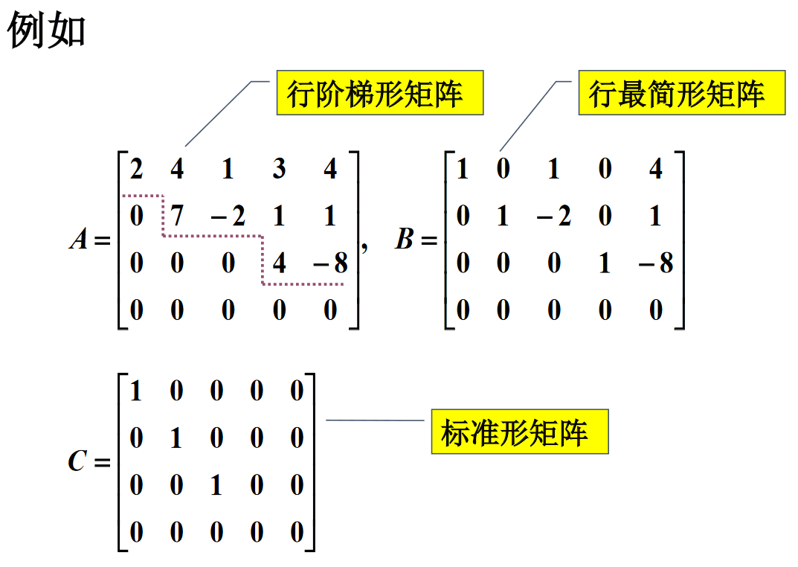

# 线性方程组

$$
\begin{cases}
a_{11}x_1+a_{12}x_2+\cdots+a_{1n}x_n=b_1 \\
a_{21}x_1+a_{22}x_2+\cdots+a_{2n}x_n=b_2 \\
\cdots \\
a_{s1}x_1+a_{s2}x_2+\cdots+a_{sn}x_n=b_s \\
\end{cases}
$$

## 我们要研究:

* 有解的条件
* 解的个数
* 存在多个解时解的结构
* 解有无实际意义

## 相关概念

# 高斯消元法

* 高斯消元法与线性方程组的初等变换
* 矩阵及其初等变换
* 线性方程组的解的问题

问题的解决过程突出了矩阵的**初等行变换**, 矩阵的**行最简形式**等概念的重要性

## 线性方程组的初等变换

* 互换两个方程位置
* 以非零常数k乘以某一个方程
* 把一个方程的k倍加到另一个方程

## 数表

方程组施行初等变换, 只是系数和常数项在变,与未知量$x_1,x_2,\cdots,x_n$无关.
因此可以擦去未知量, 只写出其系数和常数项——**数表**

消元法解方程组的过程就是对数表中的行作变换的过程,
一个方程组对应着一张数表

$$
\begin{bmatrix}
a_{11} &a_{12} &\cdots &a_{1n} &b_1 \\
a_{21} &a_{22} &\cdots &a_{2n} &b_2 \\
\vdots &\vdots &\ddots &\vdots &\vdots \\
a_{s1} &a_{s2} &\cdots &a_{sn} &b_s \\
\end{bmatrix}
$$

# 矩阵及其初等变换

$数域P上的s×n个数排成的s行(横的)n列(纵的)的数表$

$$
\begin{bmatrix}
a_{11} &a_{12} &\cdots &a_{1n} \\
a_{21} &a_{22} &\cdots &a_{2n} \\
\vdots &\vdots &\ddots &\vdots \\
a_{s1} &a_{s2} &\cdots &a_{sn} \\
\end{bmatrix}
$$

$称为数域P上的s×n矩阵$
$可以表示成A_{s×n}或A=(a_{ij})_{s×n}$

$线性方程组可以表示为 A\vec{x}=\vec b$
$A实际上就是一个操作$

## 相关概念

# 矩阵的初等变换

定义：称以下三种变换为矩阵的**初等行变换**.
* 互换矩阵的两行($r_i↔r_j$)
* 以非零数k乘矩阵某行的所有元素($kr_i$)
* 把矩阵某一行所有元素的k倍加到另一行对应的元素上去($r_i+kr_j$).

相应的三种列变换称为矩阵的**初等列变换**.($c_i↔c_j，kc_i ，c_i+kc_j$)

每个初等变化都可以用矩阵表示

## 高斯消元法

* 利用矩阵的初等行变换将方程组的增广矩阵化为行阶梯形——消元过程
* 再继续施行初等行变换将其化成行最简形——回代过程
* 而由行最简形则直接读原方程组的解

# 考虑线性方程组的解

$
线性方程组
\begin{cases}
x_1-x_2=-3 \\
2x_1-2x_2=-6
\end{cases}
有无穷多个解, 等价于x_1-x_2=-3.
$

$我们可知x_1=x_2-3, 其中x_2是自由变量.$

$其中r称为秩, d_{r+1}=0且r=n \Leftrightarrow |A|\neq 0$

$自由变量的个数为n-r个$

