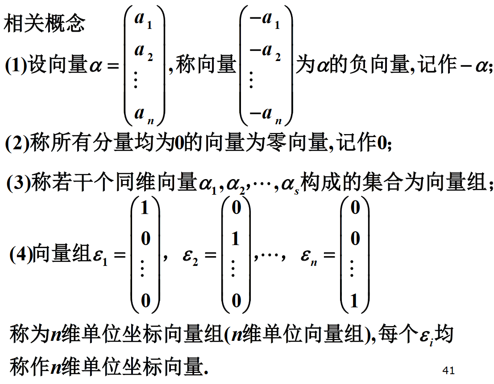

# 向量

$数域P中的n个数组成的有序数组$

$$
(a_1,a_2,\cdots,a_n)或
\begin{pmatrix}
a_1 \\
a_2 \\
\vdots \\
a_n \\
\end{pmatrix}
$$

$称为数域P上的一个n维向量$
$(一般称前者为行向量，称后者为列向量)$
$a_i称为向量的第i个分量$

## 相关概念

## 向量相等

$如果n维度向量对应的分量都相等, 则这两个向量相等.$

## 线性运算

* 加法
* 数乘