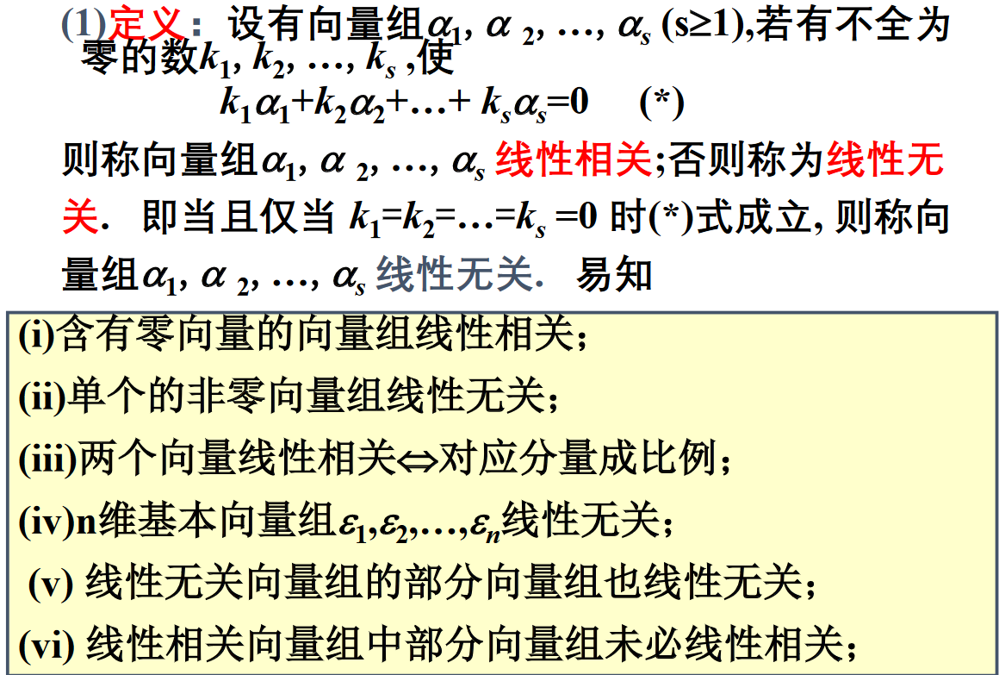

# 向量组的线性相关性

## 线性组合与线性表示

* 零向量是任意向量组的线性组合
* 任一向量可由单位坐标向量组线性表示

## 等价

$若向量组(I)\vec{a_i}每个向量均能用向量组(II)\vec{b_i}的向量线性表示,$
$则称为向量组Ⅰ可用向量组Ⅱ线性表示$

$向量组(I)与向量组(II)可以相互线性表示,则称这两个向量组等价$

## 解方程组

$方程组$

$\Rightarrow$

$向量形式表示方程组$

$\Rightarrow$

$从向量的生成子空间内搜寻可能的表示系数$

$\Rightarrow$

$研究向量空间的结构$

* 一个向量能否用一组向量表示
* 如果能, 表示系数是否唯一
* 如何求表示系数

# 线性相关性

## 定理一

$低维无关,则高维无关;反之,高维相关,则低维相关$

## 定理二

$若向量组α_1,α_2,...,α_r线性无关,而α_1,α_2,...,α_r,β线性相关,$
$则β必可由向量组α_1,α_2,...,α_r线性表示,且表示法唯一.$

## 定理三

$若向量组α_1,α_2,...,α_r(I)可由向量组β_1,β_2,...,β_s(II)线性表示,$
$且r>s,则向量组α_1,α_2,...,α_r必线性相关.$

## 推论一

$若向量组α_1,α_2,...,α_r(I)可由向量组β_1,β_2,...,β_s(II)线性表示,$
$且α_1,α_2,...,α_r线性无关，则必有r≤s.$

## 推论二

$n+1个n维向量必线性相关$

## 推论三

$两个等价的线性无关向量组所含向量个数相同$

# 线性无关向量组的性质

# 向量组的极大无关组

* 只包含零向量的向量组不存在极大无关组
* 含有非零向量的向量组必存在极大无关组
* 线性无关向量组的极大无关组即是该向量组本身
* 线性相关组的极大无关组所含向量数少于原向量组
* 向量组的极大无关组可能不唯一，但所含向量个数唯一

# 秩

向量组的极大无关组所含向量个数称为向量组的秩(rank).

* 仅含零向量的向量组不存在极大无关组,规定秩为零
* 任意含非零向量的向量组的秩至少为1
* 线性无关向量组的秩即向量组所含向量个数
* 在秩为r的向量组中,任意r个线性无关向量都是这个向量组的极大无关组

等价的向量组具有相同的秩.

## 思考

* $如果a_1,a_2,\cdots,a_s可由b_1,\cdots,b_t线性表示出, 则$
  * $r(a_1,a_2,\cdots,a_s)\leq r(b_1,\cdots,b_t)$

# 矩阵的秩

矩阵行向量组的秩称为该矩阵的
矩阵的列向量组的秩称为矩阵定义行秩的列秩

## 定理

行秩等于列秩.

#### 证明:

1. 对于任意一个矩阵(s*n)
2. 构造出行秩对应的齐次线性方程组(n*r, r<=s)
3. 通过线性无关可知, 新方程组仅有零解
4. 进而推出新方程组行秩大于等于列数r, 这是一个逆否命题
5. 选中其中r个线性无关的行向量
6. 通过扩大维度可让他们变成线性无关的一开始的矩阵的r个线性无关的列向量
7. 一开始的矩阵的极大无关列向量组必定要能包含这r个列向量
8. 则列秩r'>=r
9. 同理行秩r>=r'
10. 可知行秩等于列秩

## 作用

* 回答方程组解的唯一性问题, 给出了真正有用的方程的个数
* 通过r可判断线性无关性
* 几何的秩是图像经过矩阵变换之后的空间维度
* 反映了向量空间的维度(行列之间)
* 本质: 如何用最少的几个向量去表示向量组
* 从三个角度刻画矩阵的特性(行秩, 列秩, 如何求)

## 求法

一矩阵的秩是r
⇔
矩阵中有一个r级子式不为零,同时所有的r+1级子式(如果有的话)全为零

## 性质

初等变换不改变矩阵的秩

# 极大无关组的求法

# 线性方程组有解判别定理

线性方程组有解
⇔
是它的系数矩阵与增广矩阵有相同的秩