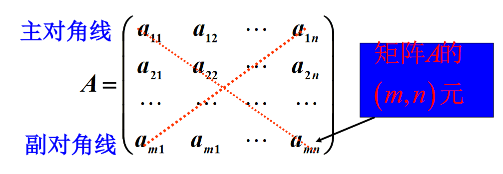
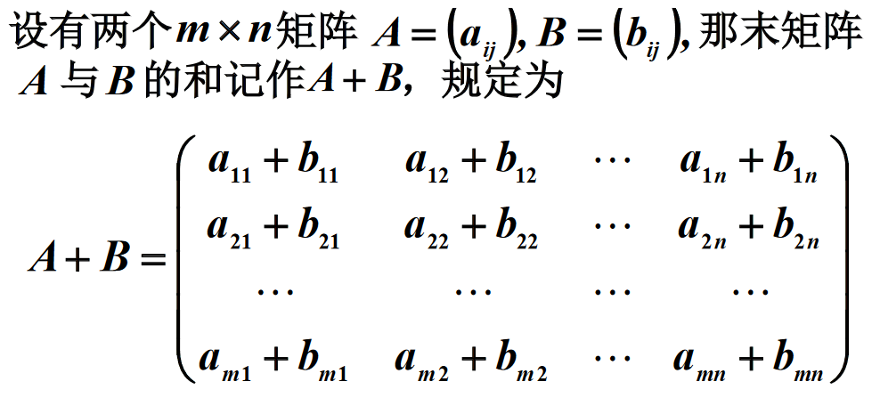
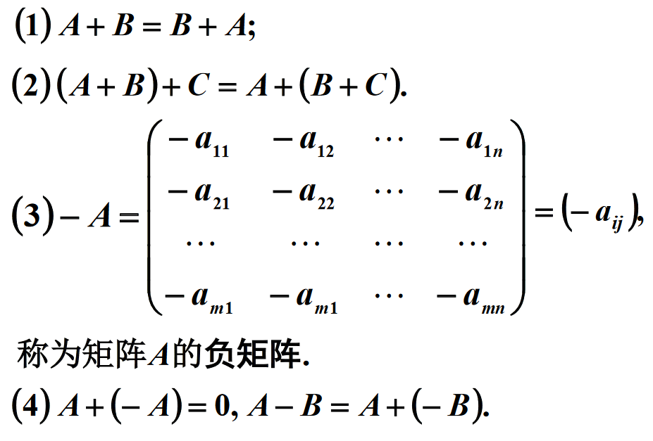
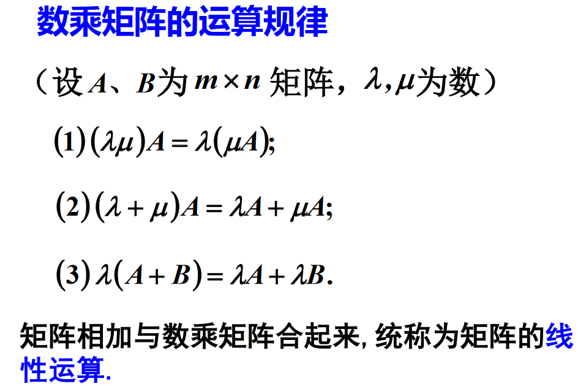
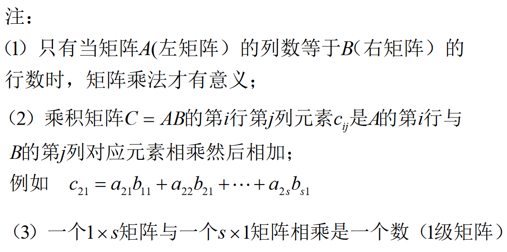
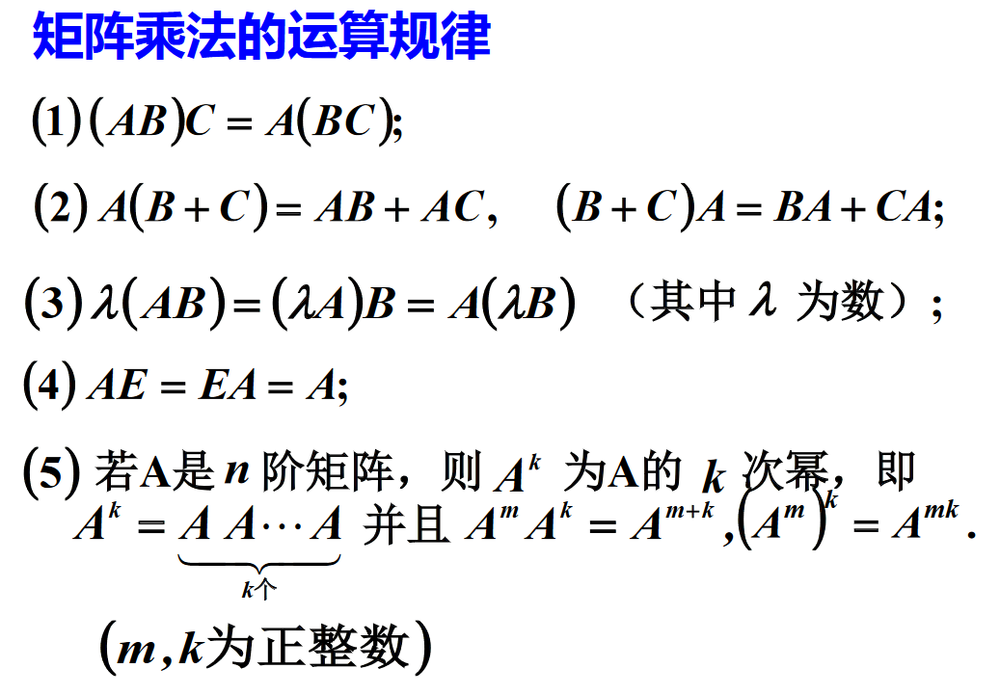

# 矩阵

## 矩阵的定义

$由m\times n个数 a_{ij} 排成的m行n列的数表$

$$
\begin{matrix}
a_{11} &a_{12} &\cdots &a_{1n} \\
a_{21} &a_{22} &\cdots &a_{2n} \\
\vdots &\vdots & &\vdots \\
a_{m1} &a_{m2} &\cdots &a_{mn} \\
\end{matrix}
$$

$称为m\times n矩阵, 记作$

$简记为 A=A_{m\times n}=(a_{ij})_{m\times n}=(a_{ij})$

$元素是实数的矩阵称为实矩阵, 元素是虚数的矩阵称为虚矩阵$

$可以表示成$

$A=(\vec{a_1} \quad \vec{a_2} \quad \cdots \quad \vec{a_n}) 或 A=\begin{pmatrix}\vec{a_1}\\\vec{a_2}\\\vdots\\\vec{a_m}\end{pmatrix}$

# 矩阵的运算

## 相等

$若矩阵A和B相等, 则$

* $A和B两个矩阵的行数相等$
* $A和B两个矩阵的列数相等$
* $A和B两个矩阵所对应的元素相同$

## 加法

$行数列数相同的矩阵, 即同形矩阵的加法:$

## 数乘

## 矩阵相乘

$\vec\alpha^T\vec\beta称为向量的内积, 结果是一个数,$
$\vec\alpha\vec\beta^T称为向量的外积, 结果是一个矩阵$

### 几种其他的表示方式

$
\begin{aligned}
C&=AB=A=(\vec{a_1} \quad \vec{a_2} \quad \cdots \quad \vec{a_s})
\begin{pmatrix}
b_{11} &b_{12} &\cdots &b_{1n} \\
b_{21} &b_{22} &\cdots &b_{2n} \\
\vdots &\vdots & &\vdots \\
b_{s1} &b_{s2} &\cdots &b_{sn} \\
\end{pmatrix}
\\ &=
\begin{pmatrix}b_{11}\vec a_1+b_{21}\vec a_2+\cdots+b_{s1}\vec a_s&b_{12}\vec a_1+b_{22}\vec a_2+\cdots+b_{s2}\vec a_s&\cdots &b_{1n}\vec a_1+b_{2n}\vec a_2+\cdots+b_{sn}\vec a_s\end{pmatrix}
\\ &=
\begin{pmatrix}\vec c_1&\vec c_2&\cdots &\vec c_n\end{pmatrix}
\end{aligned}
$

$\therefore \vec c_i均是\vec a_i的线性组合$

$
\begin{aligned}
C&=AB=A=
\begin{pmatrix}
a_{11} &a_{12} &\cdots &a_{1s} \\
a_{21} &a_{22} &\cdots &a_{2s} \\
\vdots &\vdots & &\vdots \\
b_{m1} &a_{m2} &\cdots &a_{ms} \\
\end{pmatrix}
\begin{pmatrix}\vec b_1\\\vec b_2\\\vdots \\\vec b_s\end{pmatrix}
\\ &=
\begin{pmatrix}
a_{11}\vec b_1^T+a_{12}\vec b_2^T+\cdots +a_{1s}\vec b_s^T \\
a_{21}\vec b_1^T+a_{22}\vec b_2^T+\cdots +a_{2s}\vec b_s^T \\
\vdots \\
a_{m1}\vec b_1^T+a_{m2}\vec b_2^T+\cdots +a_{ms}\vec b_s^T \\
\end{pmatrix}
\\ &=
\begin{pmatrix}\vec c_1\\\vec c_2\\\cdots \\\vec c_n\end{pmatrix}
\end{aligned}
$

### 运算性质

$其中E为单位矩阵, 是一个主对角线全为1, 其他元素全为0的方阵$

$对角阵 {\rm diag}(a_1,a_2,\cdots,a_n)=\begin{pmatrix}a_1 &0 &\cdots &0 \\0 &a_2 &\cdots &0\\ \vdots &\vdots &\ddots &\vdots \\0 &0 &\cdots &a_n\end{pmatrix}$

$\therefore E={\rm diag}(1,1,\cdots,1)$

### 零因子

$OA=O, AO=O, 称0为平凡零因子$

$但是AB=O并不能推出A=O或B=O$

### 可交换的矩阵

$若AB=BA, 则我们称A和B为可交换的$

# 矩阵的转置

$把矩阵A的行换成同序数的列得到的新矩阵, 叫做A的转置矩阵, 记为A^T$

## 运算性质

* $(A^T)^T=A$
* $(A+B)^T=A^T+B^T$
* $(\lambda A)^T=\lambda A^T$
* $(AB)^T=B^TA^T$
* $(A_1A_2\cdots A_n)^T=A_n^T\cdots A_2^TA_1^T$

