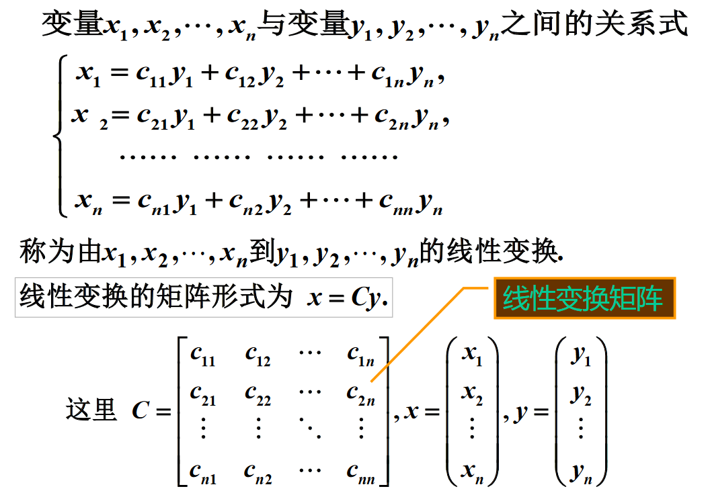

# 矩阵乘积的行列式与秩

## 定理一

$设A,B是数域P上的两个n\times n矩阵, 那么|AB|=|A||B|$

### 证明

$构造|D|=\begin{vmatrix}A&0\\C&B\end{vmatrix}, 证明|D|=|AB|=|A||B|$

## 推论

$|A_1A_2\cdots A_m|=|A_1|A_2|\cdots |A_m|$

## 奇异矩阵

$数域P上n\times n的矩阵A, 若|A|=0即r(A)<n,$
$则称为退化的, 也称为奇异矩阵$

$数域P上n\times n的矩阵A, 若|A|\neq0即r(A)=n,$
$则称为非退化的, 也称为非奇异矩阵$

## 常见性质

$若有C=AB$

$则有C的行向量是B的行向量的线性组合$
$\qquad C的列向量是A的列向量的线性组合$

---

$两个非零矩阵相乘可能是零矩阵, 即AB=0不能推出A=0或B等于0$
$AC=BC也不能推出A=B$

# 常见矩阵

## 基本矩阵

$基本矩阵E_{ij}: 只有一个元素为一, 其他元素都为零的矩阵$

$E_{ij}A相当于把A的第i行移到了第j行, 其他的归零$
$AE_{ij}相当于把A的第i列移到了第j列, 其他的归零$

## 初等矩阵

$对应三种初等变换$

## 对称矩阵

$A=A^T, a_{ij}=a_{ji}, i,j=1,2,\cdots,n$

$即A中的元素关于主对角线对称,$
$如果A,B为同级对称矩阵, 则A+B,\alpha A都为对称矩阵$

## 斜对称矩阵

$A=-A^T, a_{ij}=-a_{ji}, i,j=1,2,\cdots,n$

$即A中的元素关于主对角线互为相反数, 主对角线上全为0$

## 线性变换矩阵

