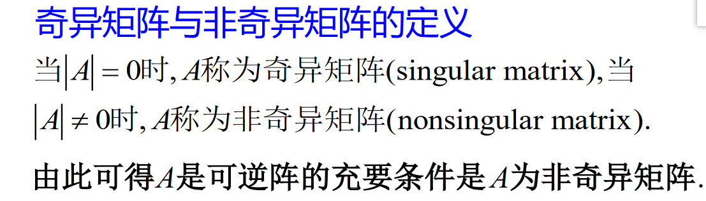
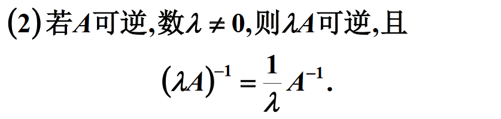

# 矩阵的逆

$对于n级矩阵A, 如果有一个n级矩阵B, 使得AB=BA=E,$
$则称矩阵A是可逆的, 并把B称作A的逆矩阵, A的逆矩阵记作A^{-1}$

$若A是可逆矩阵, 则A的逆矩阵是唯一的$

## 求法

利用待定系数法

$A^{-1}=B=\displaystyle\frac{1}{|A|}\begin{bmatrix}a_{11}的代数余子式&a_{21}的代数余子式\\a_{12}的代数余子式&a_{22}的代数余子式\end{bmatrix}$

$A^{-1}=B=\displaystyle\frac{1}{|A|}\begin{bmatrix}A_{11}&A_{21}&\cdots &A_{n1}\\A_{12}&A_{22}&\cdots &A_{n2}\\\vdots &\vdots & &\vdots \\A_{1n}&A_{2n}&\cdots &A_{nn}\end{bmatrix}$

# 伴随矩阵

$\quad\begin{pmatrix}a_{11}&a_{12}&\cdots &a_{1n}\\a_{21}&a_{22}&\cdots &a_{2n}\\\vdots &\vdots & &\vdots \\a_{n1}&a_{n2}&\cdots &a_{nn}\end{pmatrix}\begin{pmatrix}A_{11}&A_{21}&\cdots &A_{n1}\\A_{12}&A_{22}&\cdots &A_{n2}\\\vdots &\vdots & &\vdots \\A_{1n}&A_{2n}&\cdots &A_{nn}\end{pmatrix}$
$=\begin{pmatrix}|A|&0&\cdots &0\\0&|A|&\cdots &0\\\vdots &\vdots & &\vdots \\0&0&\cdots &|A|\end{pmatrix}=|A|\begin{pmatrix}1&0&\cdots &0\\0&1&\cdots &0\\\vdots &\vdots & &\vdots \\0&0&\cdots &1\end{pmatrix}$

$对应行展开得|A|, 非对应行展开得0$

# 奇异矩阵

$可逆矩阵\Leftrightarrow 非奇异矩阵 \Leftrightarrow |A|\neq 0 \Leftrightarrow 行向量列向量线性无关$

## 推论

$若AB=E(或BA=E), 则B=A^{-1}$

## 运算性质

* $若A, B为同阶方阵且均可逆, 则AB亦可逆, 且(AB)^{-1}=B^{-1}A^{-1}$

## 思考

* $若A,B可逆\Rightarrow A+B可逆$
  * $错误, 令A=\begin{pmatrix}1&0\\0&1\end{pmatrix}, B=\begin{pmatrix}-1&0\\0&-1\end{pmatrix}, 但A+B=0$

# 秩等定理

$可逆矩阵作用于一个矩阵不改变这个矩阵的秩$

$其中H是一个正交矩阵$