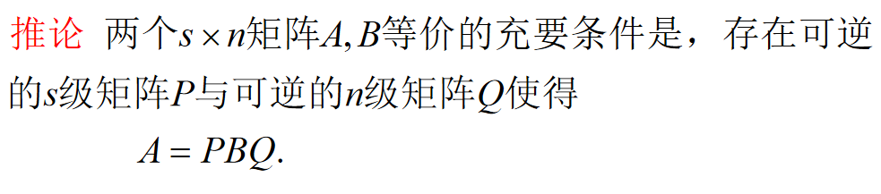

# 初等矩阵

对单位矩阵E经过一次初等变换得到的矩阵,称为初等矩阵(初等方阵)

## 三种初等矩阵

$分别记作 P(i,j), P(i(k)), P(i, j(k))$

$\det(P(i,j))=-1, \det(P(i(k)))=k, \det(P(i, j(k)))=1$

$如果是左乘, 即AB, 其中A是初等矩阵, 那么这个时候是行变换,$
$如果是右乘, 即BA, 其中A是初等矩阵, 那么这个时候是列变换.$

## 初等矩阵可转置可逆性

$我们知道, 可逆方阵A不改变B的秩$

## 左乘和右乘的关系

$P(i,j)=Q(i,j)$

$P(i(c))=Q(i(c))$

$P(i,j(k))=Q(j,i(k))$

## 等价定义

$如果B可以由A经过一系列初等变换得到, 则称矩阵A与B是等价的$

$等价有自反性, 对称性, 传递性$

# 等价标准形定理

# 矩阵可逆充要条件

# 初等变换求逆方法

$可逆矩阵仅需初等行变换即可转化为单位矩阵$

$同理可以用这种方式直接解矩阵方程AX=B,$
$将(A:B)\to(E:A^{-1}B)$

## 思考

$当A可逆时, 求XA=B$

$\therefore \begin{pmatrix}A\\B\end{pmatrix}\to\begin{pmatrix}E\\BA^{-1}\end{pmatrix}$

