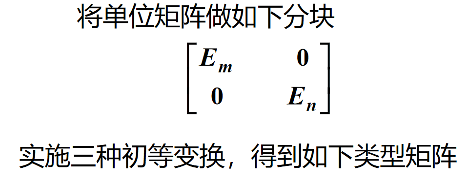
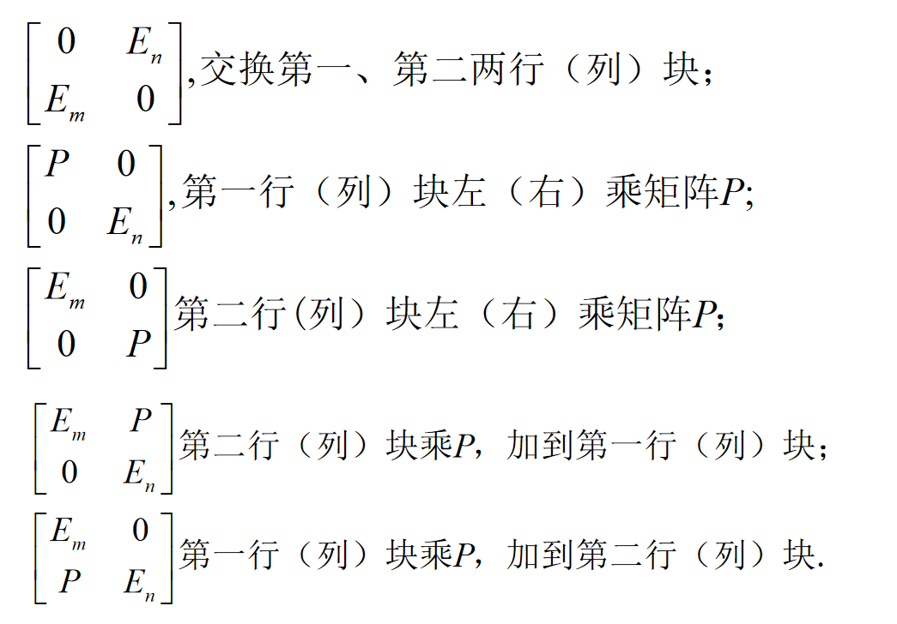
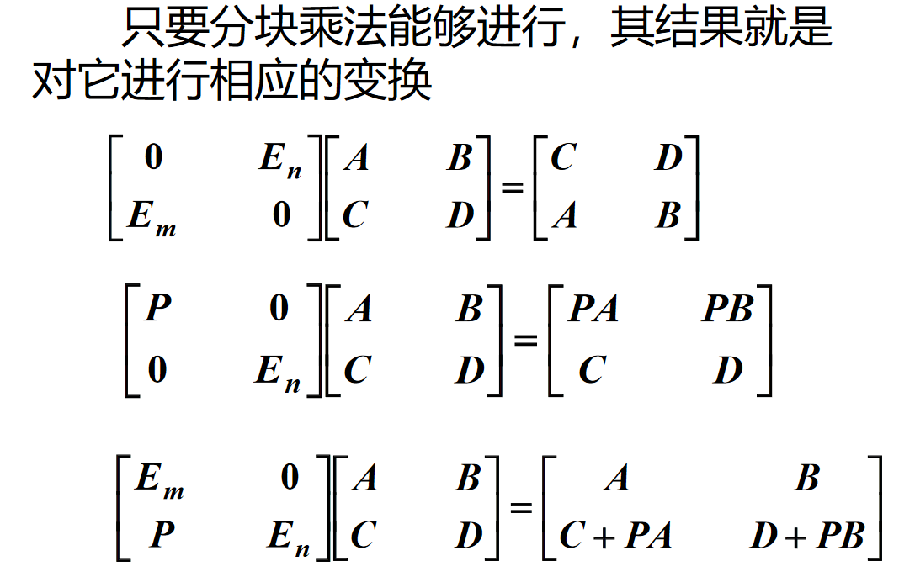
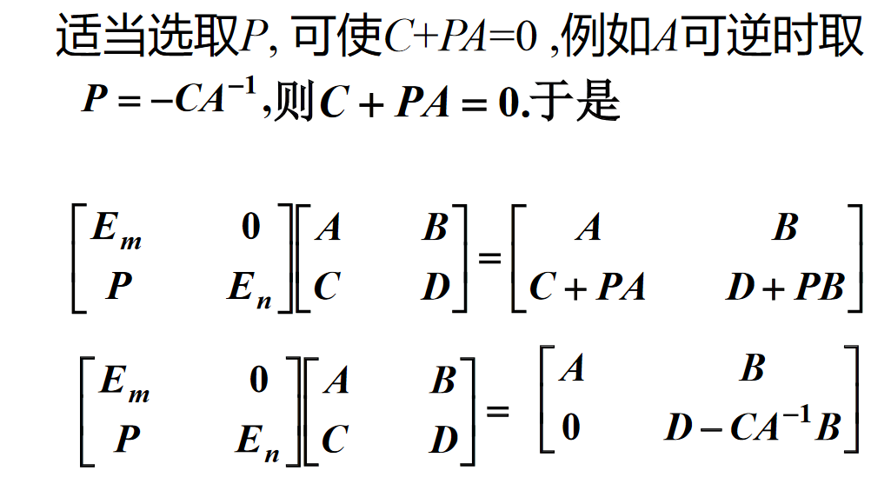
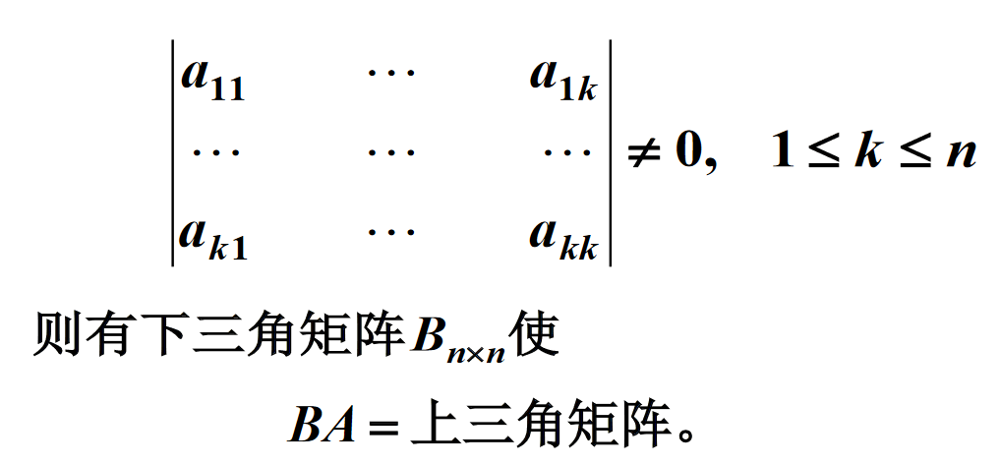

# 分块乘法的初等变换及应用

## 思考

$\begin{bmatrix}s&1\\1&1\end{bmatrix}转化为下三角矩阵, 令P=-BD^{-1}$

## 下三角矩阵求法

## 例

## 另一种矩阵求逆方法

$记忆(原+外积)^{-1}=逆-\displaystyle\frac{逆外积逆}{1+内逆积}$

# 总结矩阵求逆的方法

* 待定系数法
* 伴随矩阵法
* 分块法
* 初等变换法
* 分块初等变换法
* Sherman法