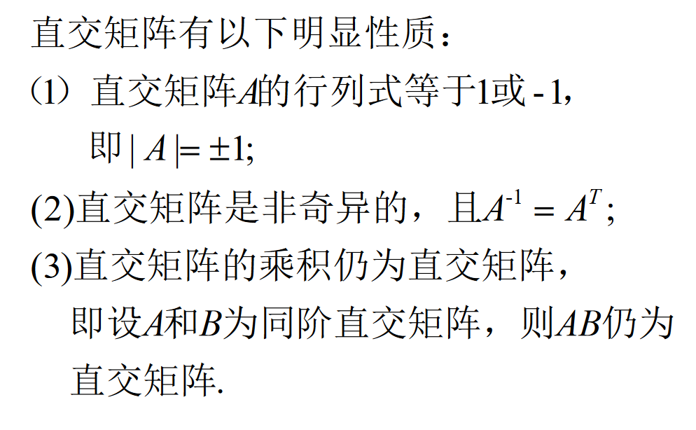
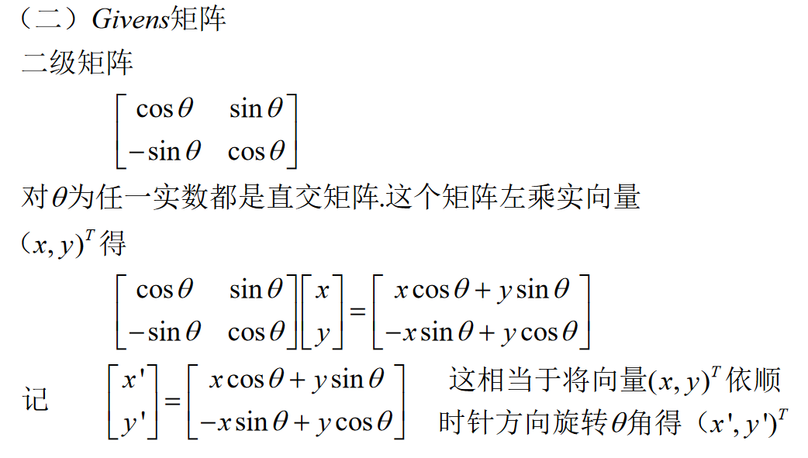

# 正交矩阵

$\because A^TA=E, A^{-1}A=E$

$\therefore A^T=A^{-1}$

$\therefore AA^T=E$

$\because A^TA=E, B^TB=E$

$\therefore B^TA^TAB=E$

## 排列阵

## Givens 矩阵

## Householder 矩阵

# 酉矩阵

$H指的是, 先进行T转置, 然后让a+bi变成a-bi, 即复数域上的共轭.$

$正交矩阵是实数域上的酉矩阵, 一种特殊情况.$