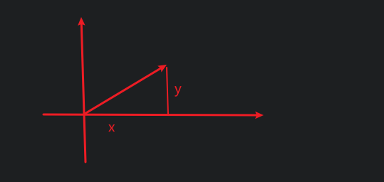

# 向量范数

$二维平面上有一个向量, 如何衡量这个向量的长度?$

$向量范数就是用来衡量一个向量的长度的.$

# 向量的数量积, 欧式范数及其性质

$设x=\begin{pmatrix}x_1&x_2&\cdots &x_n\end{pmatrix}^T, y=\begin{pmatrix}y_1&y_2&\cdots &y_n\end{pmatrix}^T,$

$将实数(x,y)=y^Tx=\displaystyle\sum_{i=1}^nx_iy_i称为向量的数量积$

$将非负实数||x||_2=(x,x)^\frac{1}{2}=(\displaystyle\sum_{i=1}^nx_i^2)^\frac{1}{2}称为向量的欧式范数$

# 范数集合意义

$||x||_\infty=\max(|x_2-x_1|,|y_2-y_1|)$

$||x||_2=\sqrt{(x_2-x_1)^2+(y_2-y_1)^2}$

$||x||_1=|x_2-x_1|+|y_2-y_1|$

# 矩阵范数

# 多项式应用

$机器学习$

# 行列式应用

## 几何意义

$行列式的几何意义是对应矩阵多维向量形成的超几何体的体积,$
$如2阶矩阵的面积, 3阶矩阵的体积等$

## 因式分解

$f(x)=f_1(x)-f_2(x)=g_1(x)g_2(x)-g_3(x)g_4(x)=\begin{vmatrix}g_1(x)&g_2(x)\\g_3(x)&g_4(x)\end{vmatrix}$

$然后就可以应用行列式的行列变换, 进行因式分解$

## 线性相关

$求四点(x_1,y_1),(x_2,y_2),(x_3,y_3),(x_4,y_4)位于一个圆上的充要条件$

$圆表示为a(x^2+y^2)+bx+cy+d=0$

$$
\begin{cases}
a(x_1^2+y_1^2)+bx_1+cy_1+d=0 \\
a(x_2^2+y_2^2)+bx_2+cy_2+d=0 \\
a(x_3^2+y_3^2)+bx_3+cy_3+d=0 \\
a(x_4^2+y_4^2)+bx_4+cy_4+d=0 \\
\end{cases}
$$

$有非零解, 即对应行列式等于0$

$求三点(x_1,y_1),(x_2,y_2),(x_3,y_3)对应的圆的方程$

$\therefore \begin{vmatrix}x^2+y^2&x&y&1\\x_1^2+y_1^2&x_1&y_1&1\\x_2^2+y_2^2&x_2&y_2&1\\x_3^2+y_3^2&x_3&y_3&1\\\end{vmatrix}=0组成了一个关于x,y的方程, 即圆的方程$

# 矩阵的应用

## 矩阵的概率

* 概率
* 联合概率
* 概率加法规则
* 条件概率

