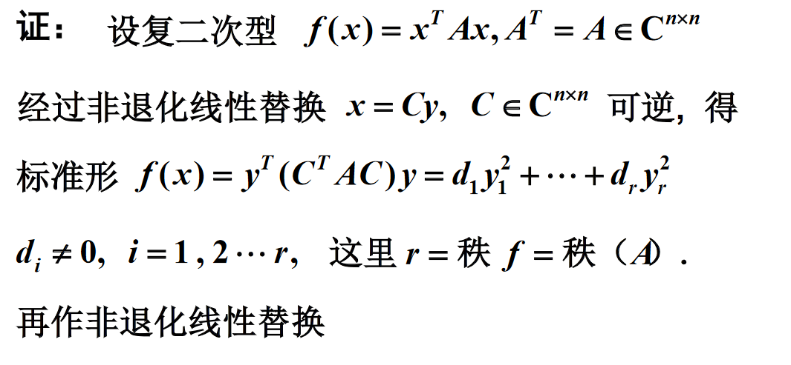
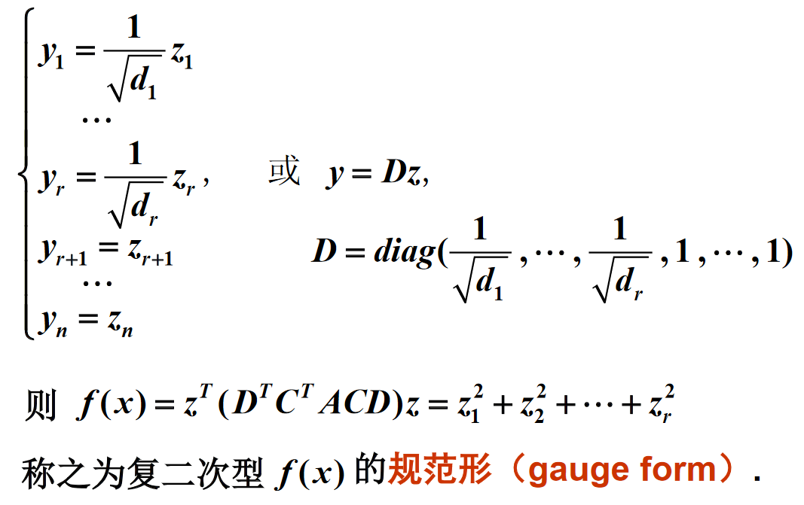
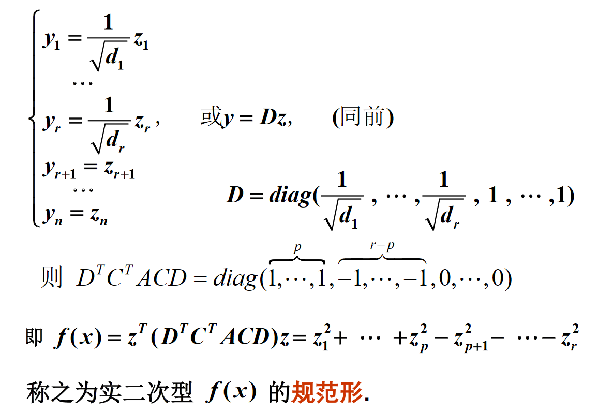

# 唯一性

## 引入

二次型的标准形是不唯一的, 与所作的非退化替换有关.

二次型经过非退化线性替换所得的标准形中, 系数不为零的平方项的个数是唯一确定的, 与所作的非退化线性替换无关.

## 复数域上的二次型的规范形

Def: 任一复二次型经过适当的非退化线性替换可化为规范形, 且规范形唯一.

$\displaystyle D=\text{diag}(\frac{1}{\sqrt{d_1}},\cdots ,\frac{1}{\sqrt{d_1}},1,\cdots ,1)$

$f(x)=z^T(D^TC^T ACD)z=z^2_1+z^2_2+\cdots+z^2_r$

## 实数域上的二次型的规范形

### 证明

对于 $y_1^2+\cdots +y_p^2-\cdots -y_r^2=z_1^2+\cdots +z_q^2-\cdots -z_r^2 \qquad (*)$

假设 $p>q$, 构造齐次线性方程组:

$$
\begin{cases}
g_{11}y_1+\cdots +g_{1n}y_n=0 \\
\cdots \\
g_{q1}y_1+\cdots +g_{qn}y_n=0 \\
y_{p+1}=0 \\
\cdots \\
y_{n}=0 \\
\end{cases}
$$

有非零解, 带入 $(*)$ 式可知左边大于零, 右边小于等于零, 产生矛盾.

### 注意

1. 实二次型的规范形中平方项的系数只有1, －1, 0.
2. 实二次型的规范形中平方项的系数中1 的个数与－1的个数之和(rank(A))是唯一确定的. 
3. 规范形是唯一的.

### 定义

实二次型 $f(x_1,x_2,\cdots,x_n)$ 的规范型为:

$$
y_1^2+\cdots +y_p^2-y_{p+1}^2-\cdots -y_r^2
$$

* 正平方项的个数 $p$ 称为 $f$ 的**正惯性指数**;
* 负平方项的个数 $r-p$ 称为 $f$ 的**负惯性指数**;
* 它们的差 $p-(r-p)=2p-r$ 称为 $f$ 的**符号差**.

