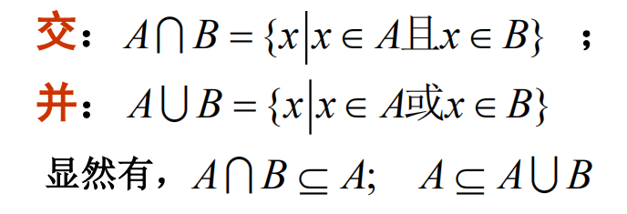

# 线性空间

## 集合

## 线性空间

$\because 0+\alpha=\alpha=1\alpha=(0+1)\alpha=0\alpha+\alpha$

$\therefore 0\alpha=0$

**思考:**

1. 如果一个线性空间包含一个非零向量, 则一定包含无穷多的向量.
2. 数域 P 是否是数域 P 上的线性空间: 是.
3. $\mathbb{R}$ 是 $\mathbb{C}$ 上的线性空间: 不是.
4. $\mathbb{C}$ 是 $\mathbb{R}$ 上的线性空间: 是.

