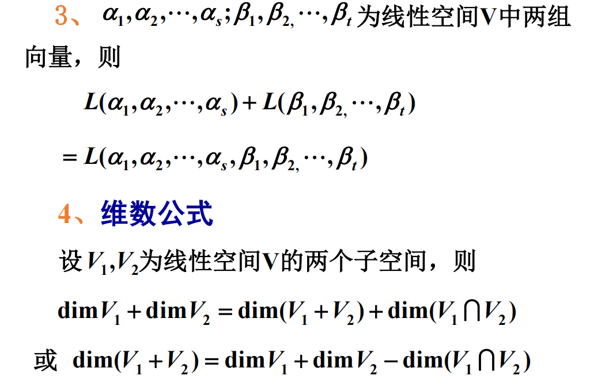

# 子空间的交与和

## 子空间的交

设 $V_1, V_2$ 为线性空间 $v$ 的子空间, 则集合

$$
V_1\cap V_2 = \{a|a\in V_1 \land a\in V_2\}
$$

也是 $V$ 的子空间, 称为 $V_1, V_2$ 的**交空间**.

## 子空间的和

设 $V_1, V_2$ 为线性空间 $v$ 的子空间, 则集合

$$
V_1 + V_2 = \{a_1 + a_2|a\in V_1, a\in V_2\}
$$

也是 $V$ 的子空间, 称为 $V_1, V_2$ 的**和空间**.

这里注意, 和空间并非 $V_1, V_2$ 的并集. 并集不一定是 $V$ 的子空间.

例如:

令 $S = \{(a, 0)|a\in\mathbb{R}\}\cup\{(0, b)|b\in\mathbb{R}\}$

则 $(1, 0)\in S, (0, 1)\in S$, 但 $(1,1)\notin S$, 说明加法运算不封闭, 不构成子空间.

## 性质

## 求交空间或和空间的基和维数

### 交空间

所得解空间即为交空间.

### 和空间

进行初等变换.

## 结论

1. 令 $A=L(\alpha_1,\alpha_2,\cdots,\alpha_n, \beta_1,\beta_2,\cdots,\beta_n)\Rightarrow$ 行阶梯型矩阵 $G$.

