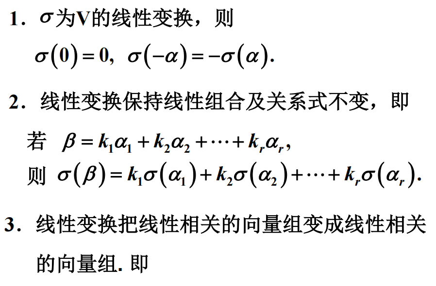
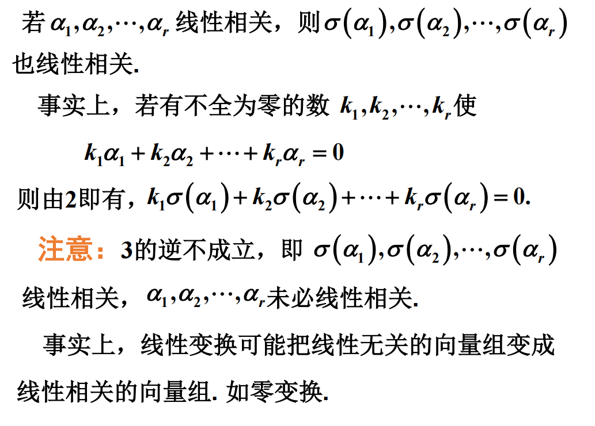
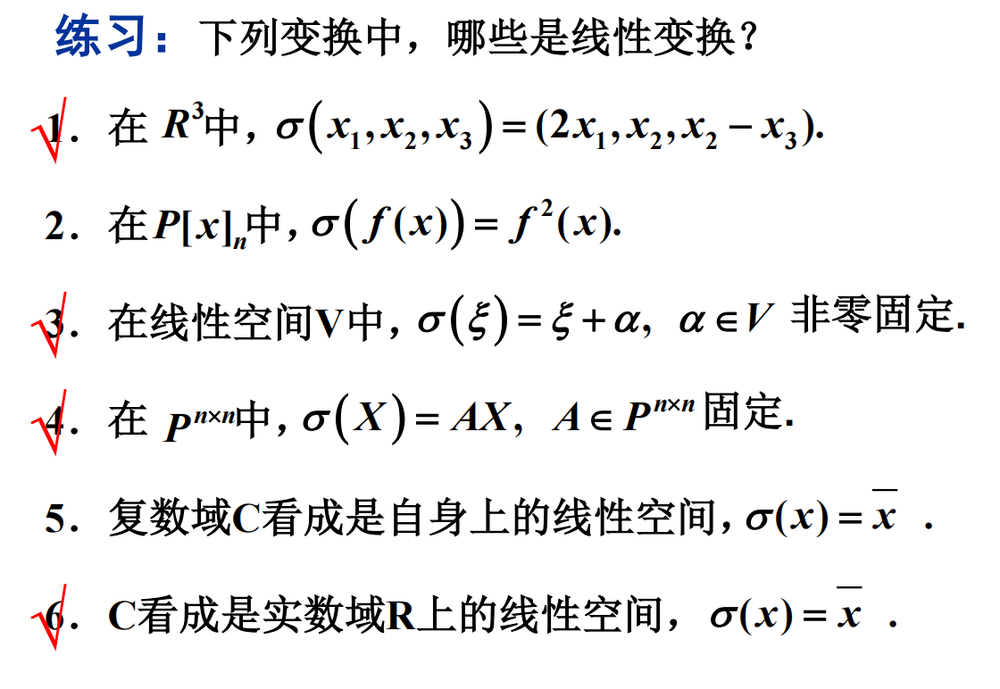

# 线性变换

## 定义

线性变换反映了线性空间中元素之间的一种最基本的联系, 它是线性函数的推广.

设 $V$ 为数域 $P$ 上的线性空间, 映射 $\sigma: V\to V$ 称为**线性变换**, 如果 

1. 对于 $\forall \alpha, \beta\in V$, 有 $\sigma(\alpha+\beta)=\sigma(\alpha)+\sigma(\beta)$
2. 对于 $\forall k\in P, \alpha\in V$, 有 $\sigma(k\alpha)=k\sigma(\alpha)$

线性变换不要求双射.

## 特殊线性变换

### 单位变换

$E:V\to V, \alpha\mapsto \alpha, \forall \alpha\in V$

### 零变换

$0:V\to V, \alpha\mapsto 0, \forall \alpha\in V$

### 数乘变换

设 $k$ 为数域 $P$ 上任意一个数.

$K:V\to V, \alpha\mapsto k\alpha, \forall \alpha\in V$

## 例题

### 1. 旋转变换

$V=\mathbb{R}^2$ (实数域上的二维向量空间), 把 $V$ 中每一个向量绕着坐标原点旋转 $\theta$ 角, 就是一个线性变换.

用 $T_\theta$ 表示, 即

$\displaystyle T_\theta: \mathbb{R}^2\to\mathbb{R}^2, \begin{pmatrix}x\\y\end{pmatrix}\mapsto\begin{pmatrix}x'\\y'\end{pmatrix}$

这里 $\begin{pmatrix}x'\\y'\end{pmatrix}=\begin{pmatrix}\cos\theta&-\sin\theta\\\sin\theta&\cos\theta\end{pmatrix}$

### 2. 求微商

$V=P[x]$ 或 $P[x]_n$ 上的求微商是一个线性变换.

用 $D$ 表示, 即

$\displaystyle D:V\to V, D(f(x))=f'(x), \forall f(x)\in V$

### 3. 求积分

闭区间 $[a,b]$ 上的全体连续函数构成的线性空间 $C(a,b)$ 上的变换

$\displaystyle J:C(a,b)\to C(a,b), J(f(x))=\int_a^xf(t){\rm d}t$

是一个线性变换.

### 4. 

在数域 $P$ 上的数 $r$, 定义 $T:R^2\to R^2$ 为 $T(x)=rx$

当 $r=0$ 时, $T$ 称为**零变换**

当 $0< r< 1$ 时, $T$ 称为**压缩变换**

当 $r=1$ 时, $T$ 称为**恒等变换**

当 $r>1$ 时, $T$ 称为**拉伸变换**

### 5. 内射影变换

设 $\alpha$ 是几何空间中的一个固定的非零向量, 将每个向量 $\eta$ 变到它在 $\alpha$ 上的内射影的变换.

$\displaystyle \Pi_\alpha(\eta)=\frac{(\alpha, \eta)}{(\alpha, \alpha)}\alpha$

是一个线性变换. 其中 $(\alpha,\eta)$ 是点乘.

## 思考

$T: \mathbb{R}\to \mathbb{R}, T(x)=3x+1$ 是不是线性变换?

不是. 因为 $T(0)=1\neq 0$.

## 性质

### 1.

$\sigma$ 为 $V$ 的线性变换, 则 $\sigma(0)=0, \sigma(-\alpha)=-\sigma(\alpha)$

## 例题

### 3.

并不是线性变换.

### 5.

令 $k=e+fi$

$\displaystyle k\alpha=(e+fi)(a+bi)=ea-bf+(eb+fa)i$

$\displaystyle \sigma(k\alpha)=(ea-bf)-(eb+fa)i$

$\displaystyle k\sigma(\alpha)=(ea+bf)-(eb-fa)i$

不满足.

