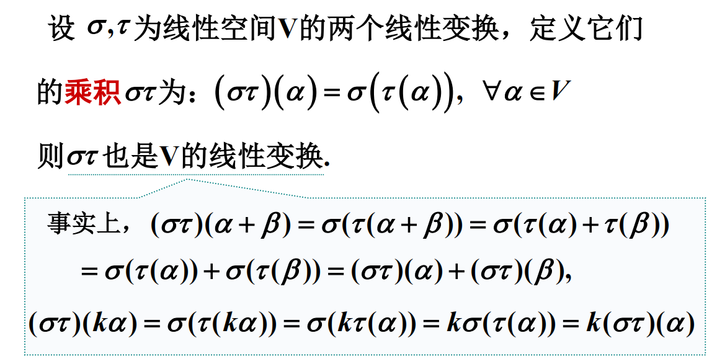
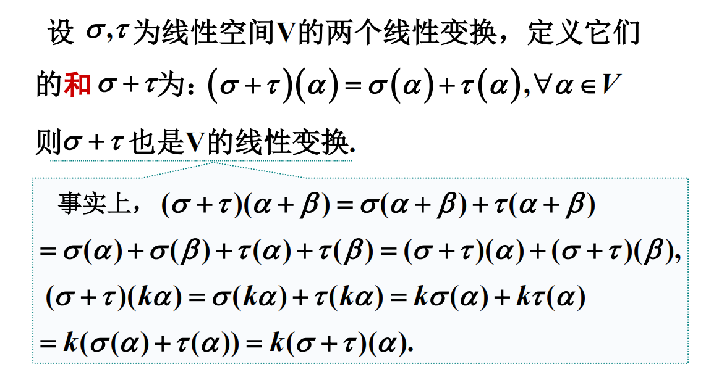
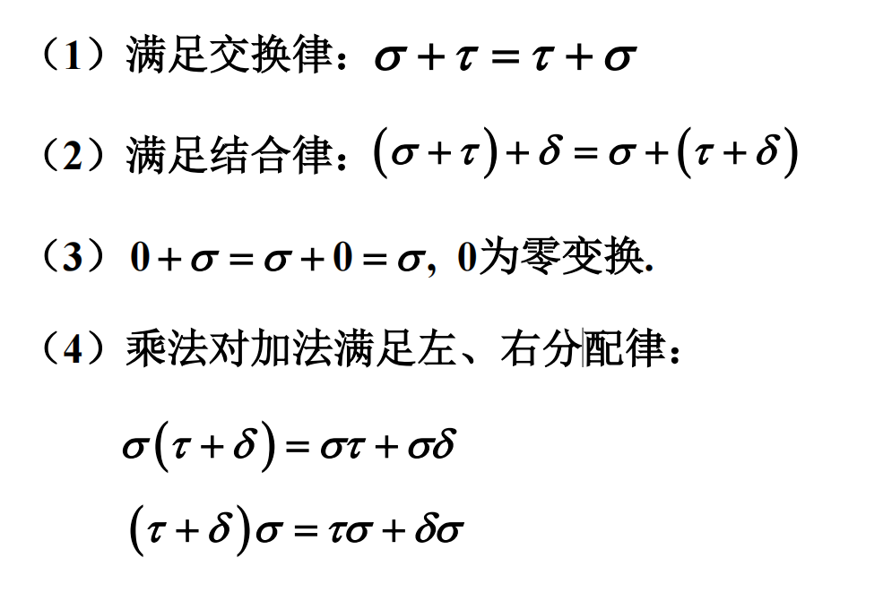
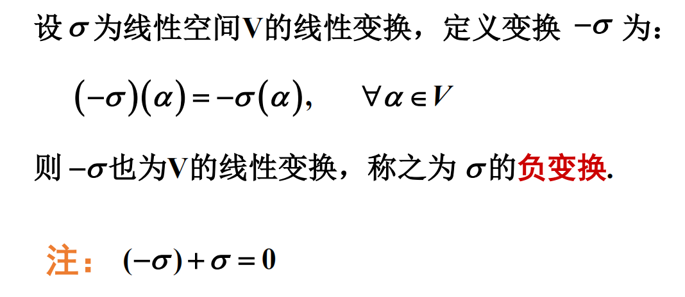
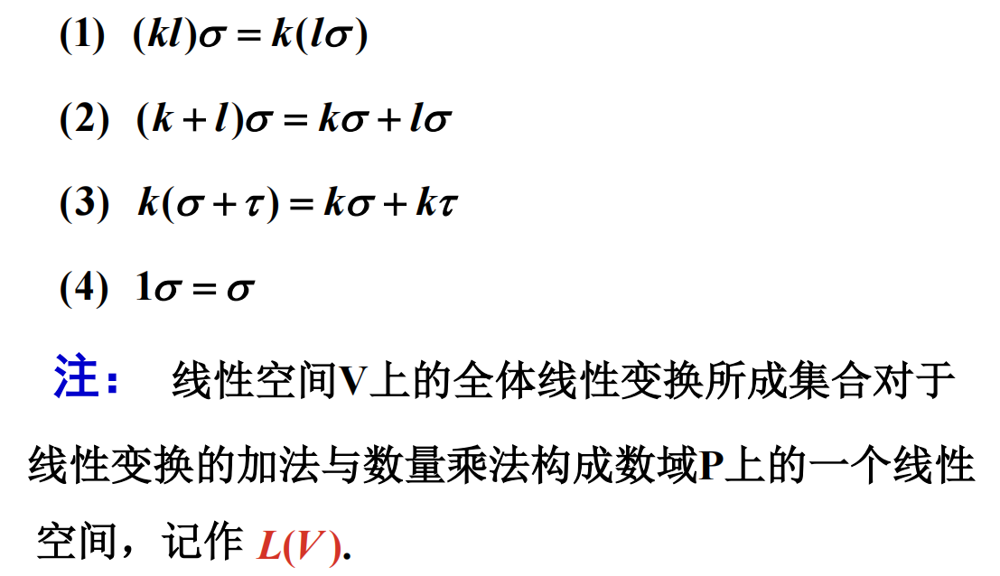
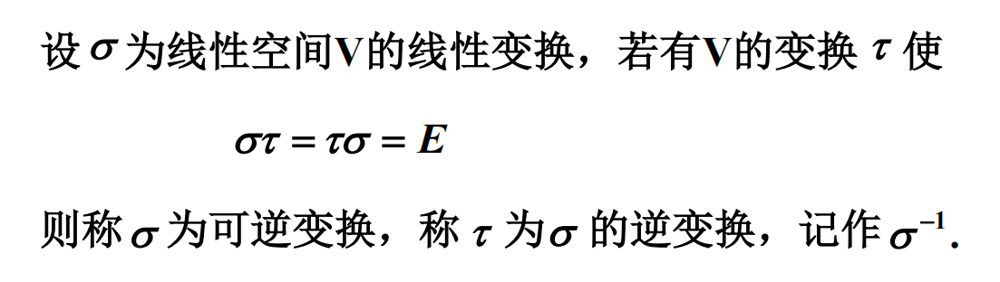
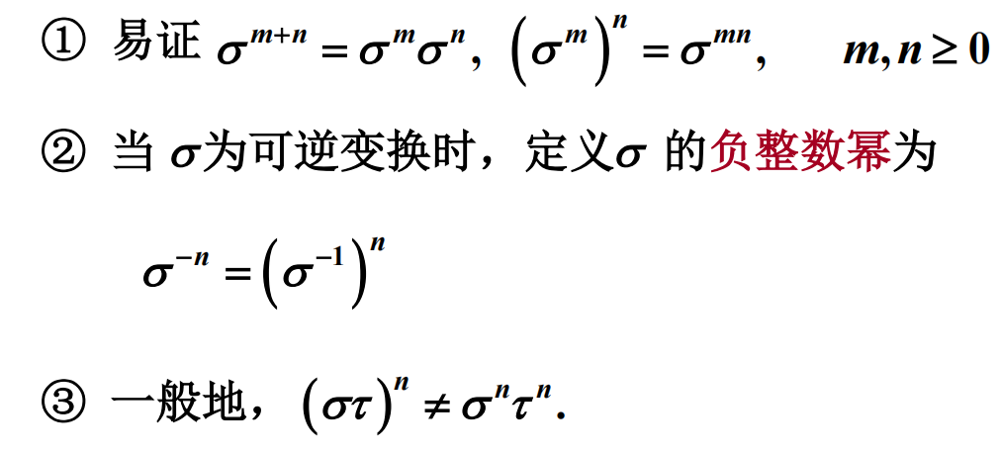
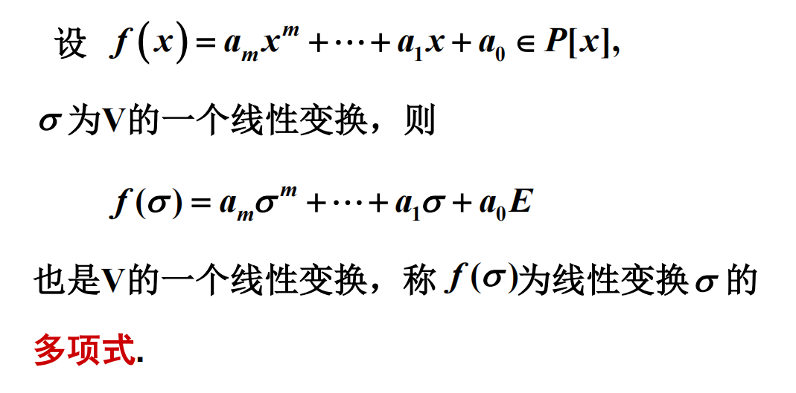
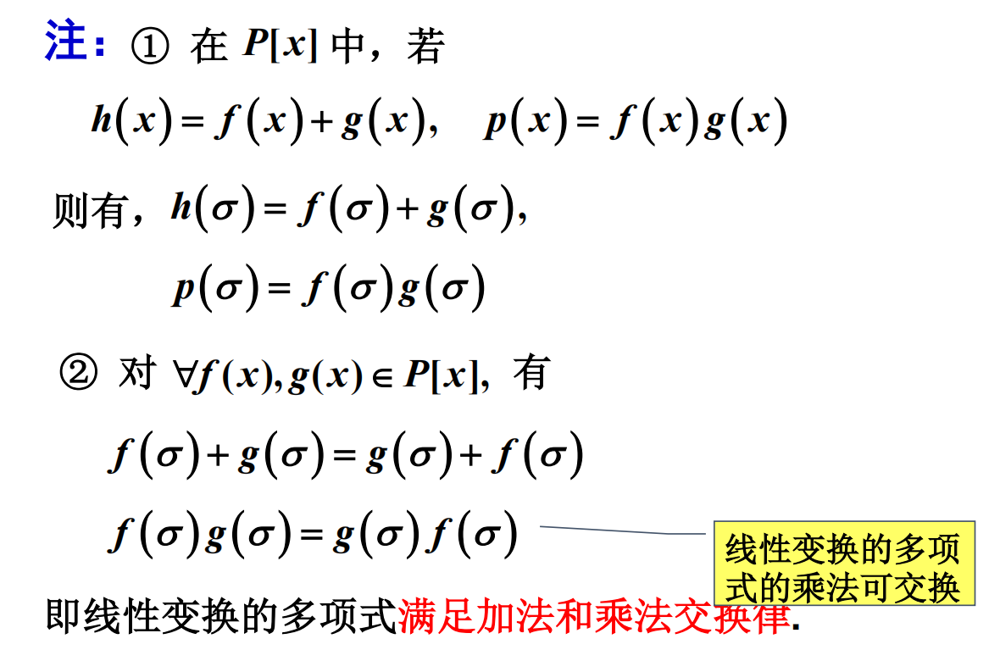

# 线性变换的运算

## 乘积

### 定义

### 基本性质

* 满足结合律 $(\sigma\tau)\delta=\sigma(\tau\delta)$
* $E\sigma=\sigma E=\sigma$, $E$ 为单位变换
* 交换律一般不成立

## 加法

### 定义

### 基本性质

## 负变换

### 定义

## 数量乘法

### 定义

### 性质

## 线性空间

线性空间 $V$ 上的全体变换所成的集合对于线性变换的加法和数量乘法构成数域 $P$ 上的一个线性空间, **记作 $L(V)$**.

## 线性变换的逆

### 定义

### 性质

* 可逆变换 $\sigma$ 的逆变换 $\sigma^{-1}$ 也是 $V$ 的线性变换.
* 线性变换 $\sigma$ 可逆 $\Leftrightarrow$ 线性变换 $\sigma$ 是一一对应.
* $(\varphi\psi)^{-1}=\psi^{-1}\varphi^{-1}$
* $(c\varphi)^{-1}=c^{-1}\varphi^{-1}$

### 可逆映射

设 $\sigma$ 是 $n$ 维线性空间 $V$ 上的线性变换, 则下列命题等价:

* $\sigma$ 是可逆的;
* $\sigma$ 是同构映射;
* $\sigma$ 是单射;
* $\sigma$ 是满射.

## 线性变换多项式

### 线性变换的幂

**性质:**

### 线性变换多项式

**性质:**

