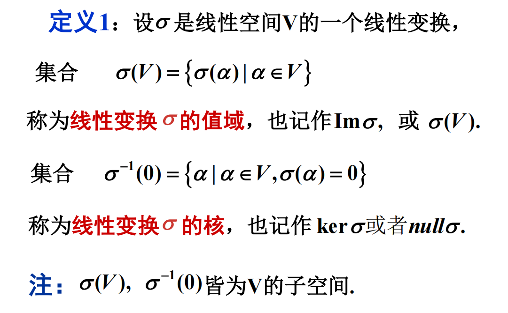
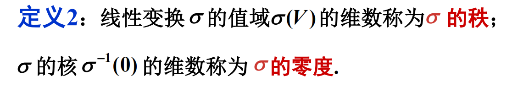
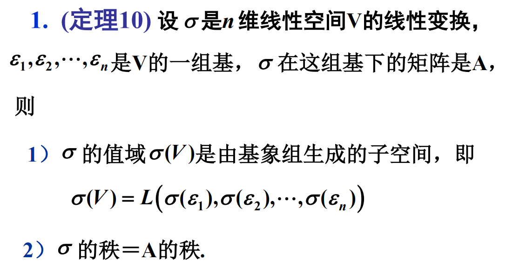
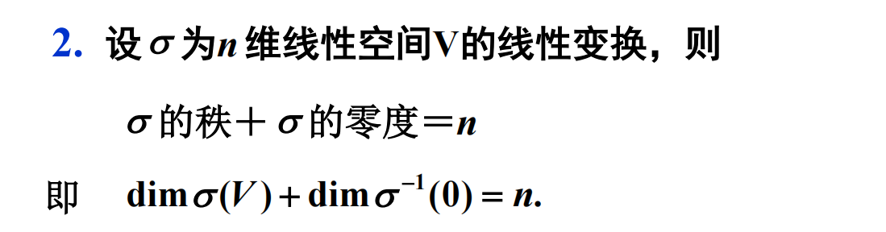
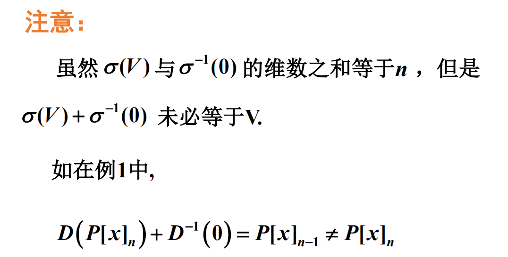

# 值域与核

## 概念

对于 $\sigma(x)=Ax$

值域 $\text{range}(A)$ 表示所有可以表示为 $Ax$ 形式的向量的集合.

是由 $A$ 的列向量所张成空间 $\Rightarrow$ $A$ 的列空间.

零空间 $\text{null}(A)$ 是满足 $Ax=0$ 的向量 $x$ 的集合.

## 秩和零度

## 性质

## 等幂矩阵

