# 标准正交基

## 正交向量组

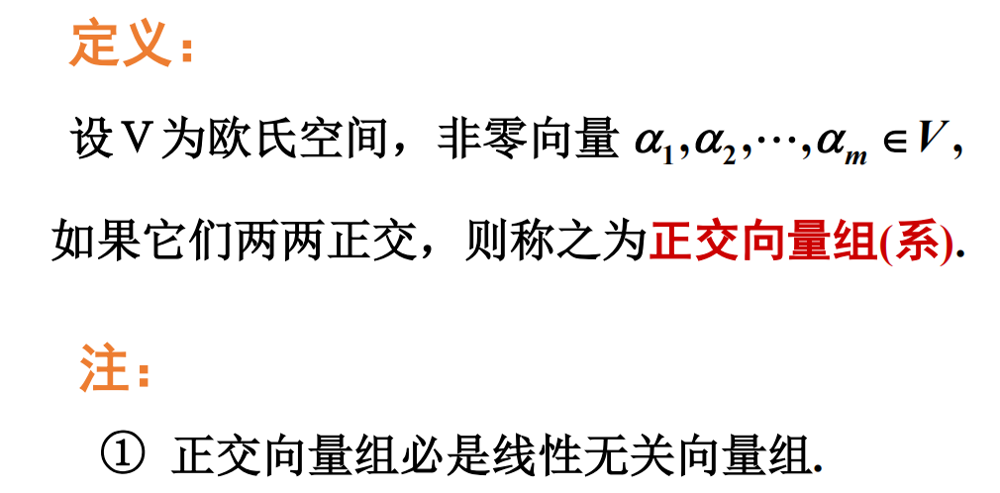

## 标准正交基

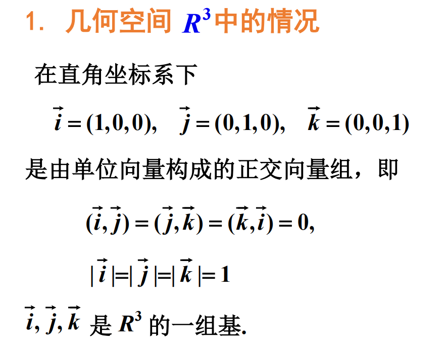

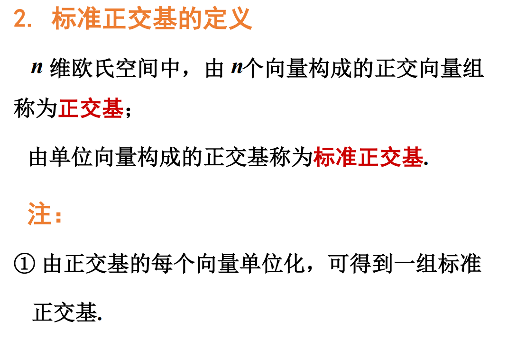

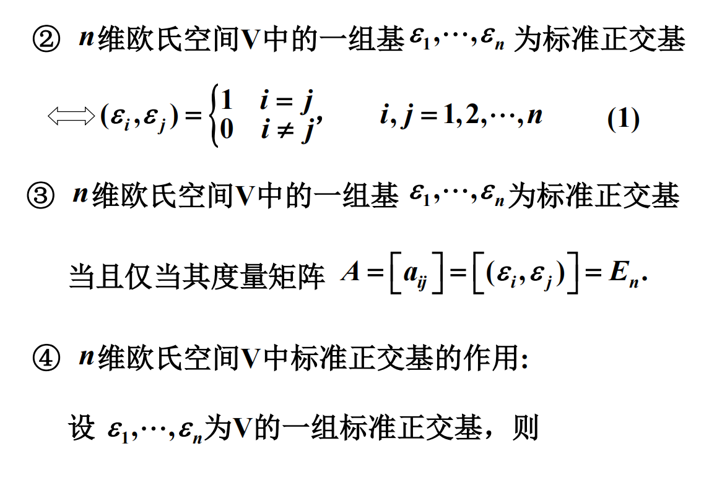

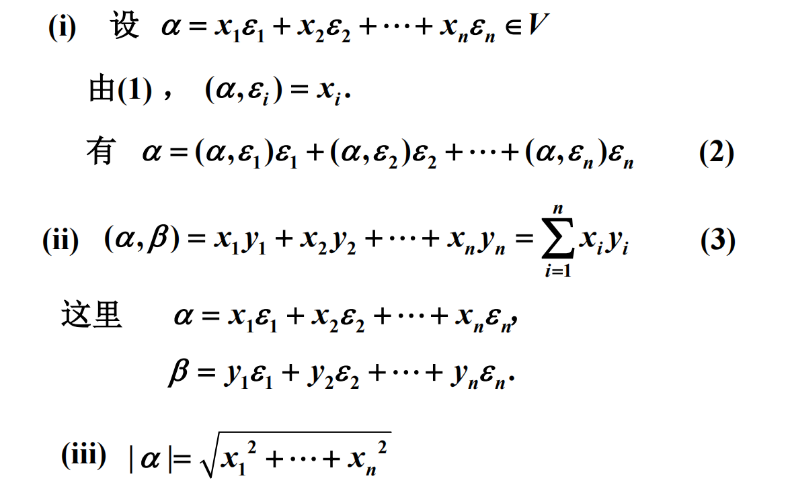

## 施密特 (Schmidt) 正交化过程

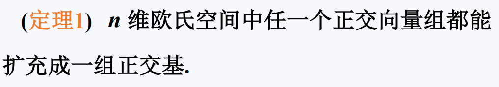

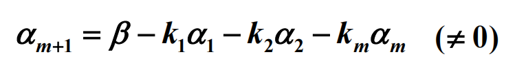

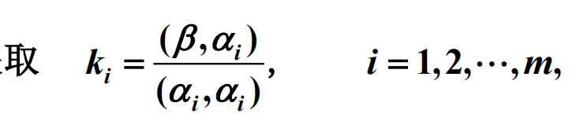

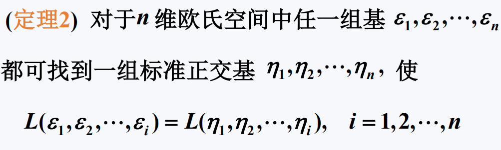

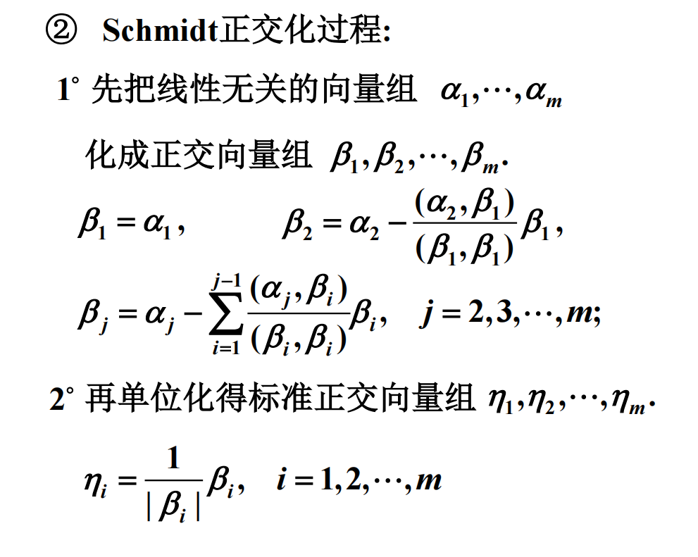

## 线性无关度

正交的向量组线性无关度最好.

不正交的向量组线性无关度较差.

## 标准正交基之间的基变换

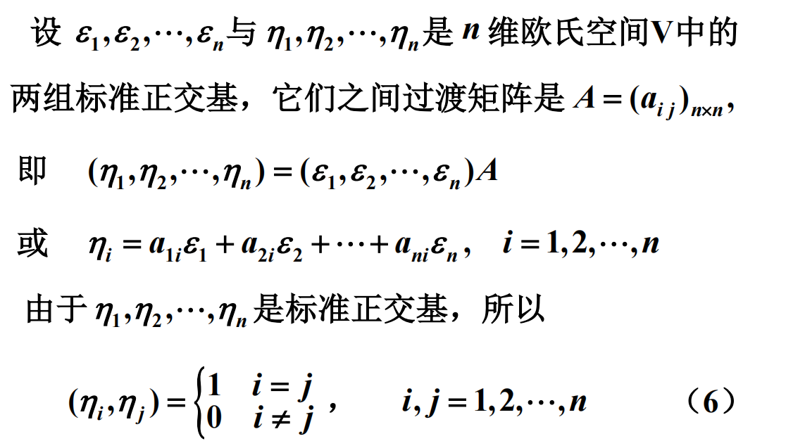

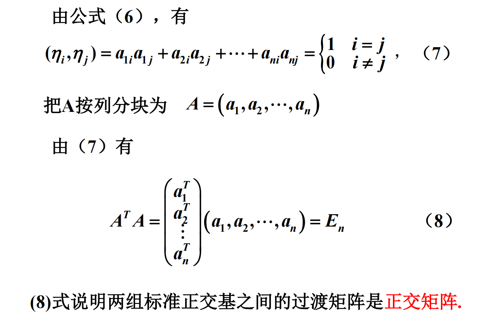

## 正交矩阵

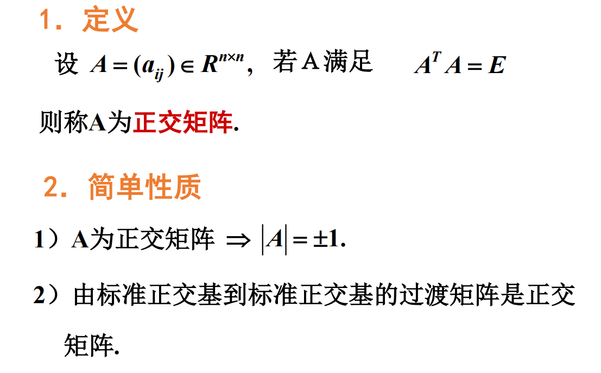

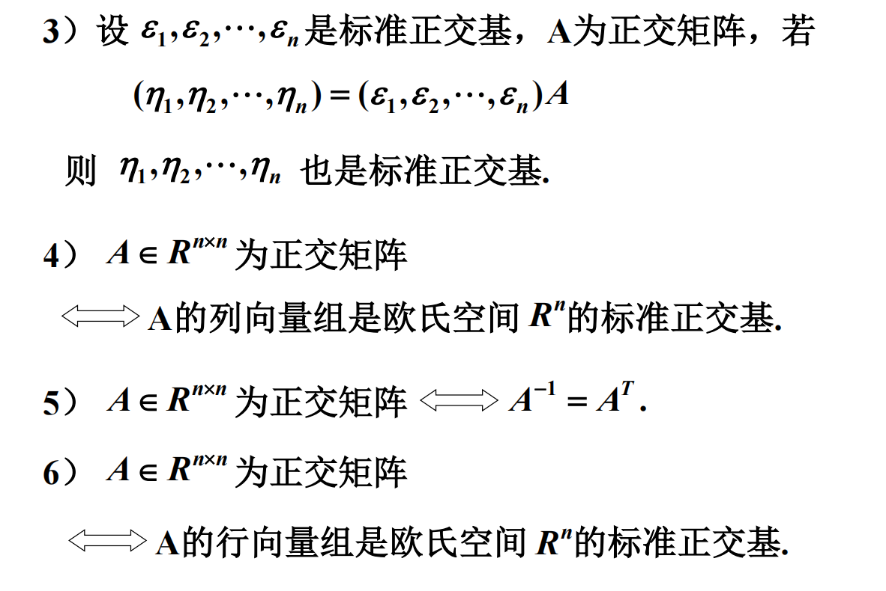

- 正交矩阵 $A$ 与正交矩阵 $B$ 的乘积也是正交矩阵:
  - $(AB)^T(AB)=B^TA^TAB=B^TB=E$
- $(x,y)=(Ax,Ay)$, 其中 $A$ 是正交矩阵, 我们也称 $A$ 为刚性旋转.

