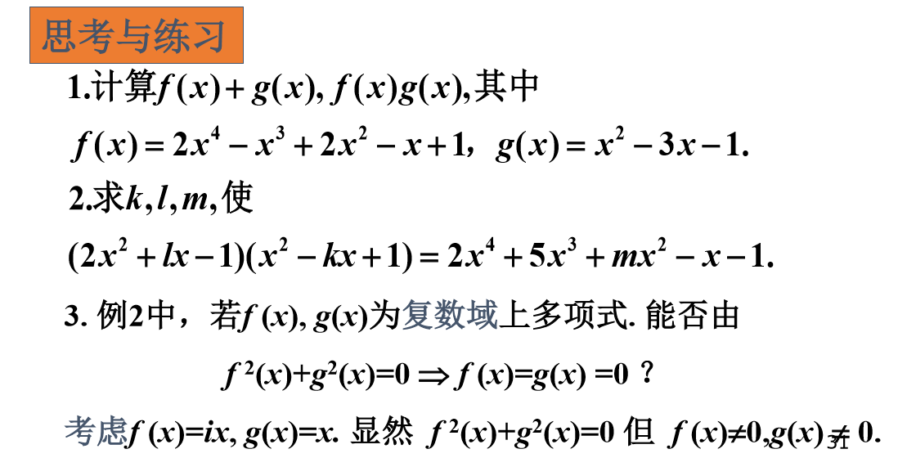

# 1.2 作业

# 1.

$$
\begin{aligned}
f(x)+g(x) &= (2x^4 - x^3 + 2x^2 -x + 1) + (x^2 - 3x - 1) \\
&= 2x^4 - x^3 + 3x^2 - 4x \\
\\
f(x)g(x) &= (2x^4 - x^3 + 2x^2 -x + 1)  (x^2 - 3x - 1) \\
&= 2x^6 - x^5 + 2x^4 -x^3 +x^2 -6x^5  +3x^4 - 6x^3 + 3x^2 -3x -2x^4 + x^3 - 2x^2 + x - 1\\
&= 2x^6 - 7x^5 + 3x^4- 6x^3 + 2x^2 -2x - 1\\
\end{aligned}
$$

# 2.

$$
\begin{aligned}
& \ \quad (2x^2 + lx - 1)(x^2 - kx + 1) \\
&= 2x^4 + lx^3 - x^2 - 2kx^3 - klx + kx + 2x^2 + lx - 1 \\
&= 2x^4 + (l-2k)x^3 + x^2+ (k + l -kl)x - 1 \\
&= 2x^4 + 5x^3 + mx^2 - x - 1 \\
\end{aligned}
$$

所以

$$
\begin{cases}
& l - 2k = 5 \\
& 1 = m \\
& k + l - kl = -1
\end{cases}
$$

可得

$$
\begin{cases}
& k = -2 \\
& m = 1 \\
& l = \frac{1}{3}
\end{cases}
$$

# 3.

答: 不能由$f^2(x)+g^2(x)=0 \Rightarrow f(x)=g(x)=0$

### 解:

令$f(x)=ix, g(x)=x$

则此时 $f^2(x)+g^2(x)=0$, 且 $f(x)\neq 0, g(x)\neq 0$

# 4.

证明: 在$P[x]$中, 如果$f(x)=h(x)g(x)$, 且$f(x)\neq 0$, 那么$\partial(g(x))\leq \partial(f(x))$

### 解:

$$
\partial(f(x)) = \partial(h(x)g(x)) = \partial(h(x)) + \partial(g(x))
$$

因为

$$
f(x) = h(x)g(x)\neq 0
$$

所以
$$
\begin{aligned}
&h(x) \neq 0, g(x) \neq 0 \\
\\
&\partial(h(x)) \geq 0
\end{aligned}
$$

所以

$$
\begin{aligned}
\partial(f(x)) &= \partial(h(x)) + \partial(g(x))\\
&\geq \partial(g(x))
\end{aligned}
$$

# 5.

设$R$是一个有单位元1(不等于0)的环, 对于$a\in R$, 如果存在$b\in R$,  
使得 ab = ba = 1, 则称$a$是可逆元, 称$b$是$a$的逆元, 记作$a^{-1}$

证明: 如果a是可逆元, 那么a的逆元唯一

### 解:

假设$a$有两个或两个以上的逆元, 设$a$其中两个逆元为$b, c$ 且 $b \neq c$

则
$$
ab = ba = 1, ac = ca = 1
$$

所以, 前式减后式得
$$
ab - ac = a(b - c) =0
$$

因为$ab = 1$, 则有$a \neq 0$, 则

$$
b - c = 0
$$

即

$$
b = c
$$

与题设$b \neq c$不符

所以a的逆元唯一