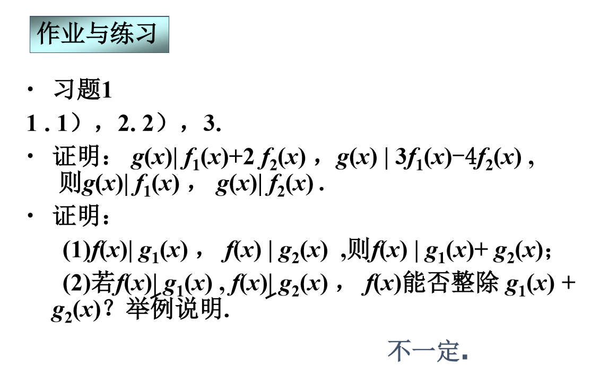

# 作业

# 习题一

## 1.1

                    1/3     -7/9
            3       -2      1
    ----------------------------
    1       -3      -1      -1
    1       -2/3    1/3 
    ----------------------------
            -7/3    -4/3    -1
            -7/3    14/9    -7/9
            --------------------
                    -26/9   -2/9

$$
q(x)=\frac{1}{3}x - \frac{7}{9}, r(x)=-\frac{26}{9} x -\frac{2}{9}
$$