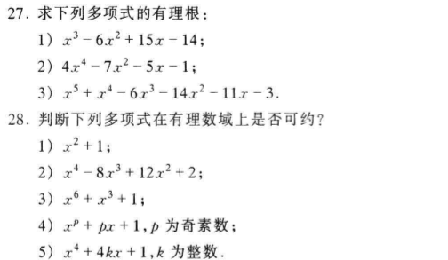

27.(2), 28.(5)

# 1.

$\therefore 由题目可知x只可能是\pm 1, \pm 3$

$\therefore f(-1)=-1+1+6-14+11-3=0$

$\therefore f(1)=1+1-6-14-11-3=-30\neq 0$

    1       1       -6      -14     -11     -3
            -1      0       6       8       3
    -------------------------------------------
    1       0       -6      -8      -3      0
            3       9       9       3
    ------------------------------------
    1       3       3       1       0
            -3      0       -9
    ---------------------------
    1       0       3       -8

$\therefore f(x)=(x+1)(x-3)(x^3+3x^2+3x+1)=(x+1)^4(x-3)$

$\therefore f(x)的有理根为-1和3$

# 2.

## (1)

$令素数p=2, 则2\not| \ 5,\ 2|-6,12,6, \ 2^2\not |6,$
$由Eisenstain判别法可知$

$f(x)=5x^4-6x^3+12x+6在有理数域上不可约$

## (2)

$\because f(x)=x^6+x^3+1$

$\therefore f(x)的有理根只能为\pm 1$

$\because f(1)=3\neq 0, f(-1)=1\neq 0$

$\therefore f(x)在有理数域上无有理根, 即无一次因式$

$当(x^2+ax+1)|f(x)时,$

                    1       -a          a^2-1   2a-a^3-1        1
                                        1       a               1       
    ---------------------------------------------------------------
    1       0       0       1           0       0               1
    1       a       1
    ---------------------------
            -a      -1      1
            -a      -a^2    -a
            ------------------------------
                    a^2-1   a+1         0
                    a^2-1   a^3-a       a^2-1
                    ---------------------------------
                            2a-a^3+1    1-a^2       0
                            2a-a^3+1    2a^2-a^4+a  2a-a^3+1
                            ------------------------------------
                                        a^4-3a^2-a+1 a^3-2a-1   1
                                        1            a          1    

$\therefore a^4-3a^2+a+1=1, a^3-2a-1=a$

$\therefore a(a^3-3a+1)=0, a^3-3a-1=0$

$\therefore 易知无解, 所以此情况不成立.$

$当(x^3+ax^2+bx+1)|f(x)时,$

                            1           -a          a^2-b           1
                            1           a           b               1       
    --------------------------------------------------------------------
    1       0       0       1           0           0               1
    1       a       b       1
    ---------------------------------------
            -a      -b      0           0
            -a      -a^2    -ab         -a
            ------------------------------------------
                    a^2-b   ab          a           0
                    a^2-b   a^3-ab      a^2b-b^2    a^2-b
                    --------------------------------------------------
                            2ab-a^3     b^2-a^2b+a  b-a^2           1
                            1           a           b               1

$$
\therefore
\begin{cases}
2ab-a^3-1=0 \\
b^2-a^2b=0 \\
-a^2=0
\end{cases}
\Rightarrow
\begin{cases}
-1=0 \\
b=0 \\
a=0
\end{cases}
$$

$\therefore 产生矛盾, 此情况也不成立$

$\therefore 综上f(x)在有理数域上不可约$

# 27.(2)

$令f(x)=4x^4-7x^2-5x-1$

$\therefore\displaystyle 易知有理根只可能是\pm 1,\pm\frac{1}{2}, \pm\frac{1}{4}$

$\therefore f(1)=4-7-5-1=-9\neq 0, f(-1)=4-7+5-1=1\neq 0$

    4       0       -7      -5      -1
            -2      1       3       1
    -----------------------------------
    4       -2      -6      -2      0
            -2      2       -2
    ---------------------------
    4       -4      -4      0
            -2      3
    --------------------
    4       -6      -1

$经检验\displaystyle\frac{1}{2}和\pm\frac{1}{4}均不符合$

$\therefore f(x)的有理根为-\displaystyle\frac{1}{2}, -\frac{1}{2}$

# 28.(5)

$令x=t+1, 令f(t)=(t+1)^4+4k(t+1)+1$

$\therefore f(t)=t^4+4t^3+6t^2+(4+4k)t+4k+2$

$\therefore 令p=2, 则p\not|1, p|4,6,(4+4k),(4k+2), p^2\not|4k+2$

$\therefore 由Eisenstain判别法可知f(t)有理数域上不可约$

$\therefore x^4+4kx+1在有理数域上也不可约$