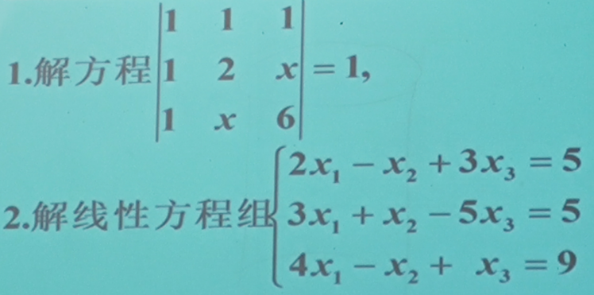
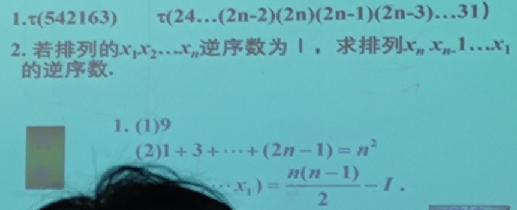

P97: 1(2)

P98: 3.5.6.8.(3).10.13.(2)(4)(5)(6)

# 第一份

## 1.

$解方程$

$$
\begin{vmatrix}
1 &1 &1 \\
1 &2 &x \\
1 &x &6 \\
\end{vmatrix}
=1
$$

$\therefore 12+x+x-2-6-x^2=4+2x-x^2=1$

$\therefore x^2-2x-3=(x-3)(x+1)=0$

$\therefore x=3或x=-1$

## 2.

$\therefore D=2+20-9-12+3-10=-6$

$\quad D_1=5+45-15-27+5-25=-12$

$\quad D_2=10-100+81-60-15+90=6$

$\quad D_3=18-20-15-20+27+10=0$

$\therefore\displaystyle x_1=\frac{D_1}{D}=2,x_2=\frac{D_2}{D}=-1,x_3=\frac{D_3}{D}=0$

# 第二份

## 1.

### (1)

$\therefore \tau(542163)=4+3+1+1=9$

### (2)

$
\begin{aligned}
&\tau(24\cdots(2n-2)(2n)(2n-1)(2n-3)\cdots 31) \\
=& 1+2+\cdots+n+\cdots+2+1 \\
=& n(n+1)-n \\
=& n^2 \\
\end{aligned}
$

## 2.

$①当n=2时,$

$\because \tau(x_1x_2)=I'$

$\therefore \tau(x_2x_1)=1-I'=\displaystyle\frac{n(n-1)}{2}-I' 成立$

$②假设n=k时, \tau(x_1x_2\cdots x_k)=I'$

$\therefore \tau(x_kx_{k-1}\cdots x_1)=\displaystyle\frac{k(k-1)}{2}-I'成立$

$当n=k+1时,$

$\therefore \tau(x_1x_2\cdots x_kx_{k+1})=\tau(x_1x_2\cdots x_k)+\displaystyle\sum_{i=1}^k\tau(x_ix_{k+1})=I=I'+I-I'$

$\therefore \displaystyle\sum_{i=1}^k\tau(x_ix_{k+1})=I-I'$

$\therefore \displaystyle\sum_{i=1}^k\tau(x_{k+1}x_i)=k-I+I'$

$
\begin{aligned}
\therefore\displaystyle \tau(x_{k+1}x_k\cdots x_1)&=\sum_{i=1}^k\tau(x_{k+1}x_i)+\tau(x_kx_{k-1}\cdots x_1) \\
&=k-I+I'+\frac{k(k-1)}{2}-I' \\
&=\displaystyle\frac{k(k+1)}{2}-I
\end{aligned}
$

$\therefore 综上, \tau(x_nx_{n-1}\cdots x_1)=\displaystyle\frac{n(n-1)}{2}-I成立$

# 第三份

## 1.

$\therefore D=(-1)^{\tau(23\cdots (n-1)n1)}1\times 2\times\cdots\times n=(-1)^{n-1}n!$

## 2.

$$
\begin{vmatrix}
a_{11} &a_{12} &a_{13} &a_{14} \\
a_{21} &a_{22} &a_{23} &a_{24} \\
a_{31} &a_{32} &a_{33} &a_{34} \\
a_{41} &a_{42} &a_{43} &a_{44} \\
\end{vmatrix}
$$

$\therefore 行列式中有a_{23}a_{41}的项是(-1)^{\tau(2341)}a_{12}a_{23}a_{34}a_{41}和(-1)^{\tau(4321)}a_{14}a_{23}a_{32}a_{41}$

$\therefore 易知-a_{12}a_{23}a_{34}a_{41}符合要求$

# 书上习题

## 1.(2)

$\therefore \tau(217986354)=18, 奇偶性为偶$

## 3.

$12435 \stackrel{(12)}{\to} 21435 \stackrel{(15)}{\to} 25431 \stackrel{(34)}{\to} 25341$

## 5.

$①当n=2时,$

$\because \tau(x_1x_2)=K'$

$\therefore \tau(x_2x_1)=1-K'=\displaystyle\frac{n(n-1)}{2}-K' 成立$

$②假设n=k时, \tau(x_1x_2\cdots x_k)=K'$

$\therefore \tau(x_kx_{k-1}\cdots x_1)=\displaystyle\frac{k(k-1)}{2}-K'成立$

$当n=k+1时,$

$\therefore \tau(x_1x_2\cdots x_kx_{k+1})=\tau(x_1x_2\cdots x_k)+\displaystyle\sum_{i=1}^k\tau(x_ix_{k+1})=K=K'+K-K'$

$\therefore \displaystyle\sum_{i=1}^k\tau(x_ix_{k+1})=K-K'$

$\therefore \displaystyle\sum_{i=1}^k\tau(x_{k+1}x_i)=k-K+K'$

$
\begin{aligned}
\therefore\displaystyle \tau(x_{k+1}x_k\cdots x_1)&=\sum_{i=1}^k\tau(x_{k+1}x_i)+\tau(x_kx_{k-1}\cdots x_1) \\
&=k-K+K'+\frac{k(k-1)}{2}-K' \\
&=\displaystyle\frac{k(k+1)}{2}-K
\end{aligned}
$

$\therefore 综上, \tau(x_nx_{n-1}\cdots x_1)=\displaystyle\frac{n(n-1)}{2}-K成立$

## 6.

$\because \tau(431265)=6, \tau(452316)=8$

$\therefore 两项的符号都为正$

## 8.(3)

$设该行列式为D$

$\therefore D = (-1)^{\tau((n-1)(n-2)\cdots 21n)}1\times 2\times \cdots \times n=(-1)^{\frac{(n-1)(n-2)}{2}}n!$

## 10.

$由行列式定义可知, 每一项都是取自不同行、不同列4个元素的乘积$

$对于含x^4项:$

$\because 每一项都是取自不同行不同列的4个元素乘积,$
$\quad 且行列式里每一个元素要么是0次要么是1次的$

$\therefore 取出来的四个元素必定都是1次的$

$\therefore 只能取a_{11},a_{22},a_{33},a_{44}组成的项$

$\therefore 包含x^4的项的系数是2$

$对于含x^3项:$

$\therefore 取出来的四个元素有且仅有三个1次项$

$\therefore 只能取a_{12},a_{21},a_{33},a_{44}组成的项$

$\therefore 包含x^3的项的系数是-1$

## 13.

### (2)

$$
\begin{aligned}
\begin{vmatrix}
x &y &x+y \\
y &x+y &x \\
x+y &x &y \\
\end{vmatrix}
&=3xy(x+y)-(x+y)^3-x^3-y^3 \\
&=3x^2y+3xy^2-x^3-3x^2y-3xy^2-y^3-x^3-y^3 \\
&=-2x^3-2y^3 \\
\end{aligned}
$$

### (4)

$$
\begin{aligned}
&
D=
\begin{vmatrix}
1 &2 &3 &4 \\
2 &3 &4 &1 \\
3 &4 &1 &2 \\
4 &1 &2 &3 \\
\end{vmatrix}
\xlongequal[r_4-4r_1]{r_2-2r_1,r_3-3r_1}
\begin{vmatrix}
1 &2 &3 &4 \\
0 &-1 &-2 &-7 \\
0 &-2 &-8 &-10 \\
0 &-7 &-10 &-13 \\
\end{vmatrix}
\\
&
\xlongequal[r_4-7r_2]{r_3-2r_2}
\begin{vmatrix}
1 &2 &3 &4 \\
0 &-1 &-2 &-7 \\
0 &0 &-4 &4 \\
0 &0 &4 &36 \\
\end{vmatrix}
\xlongequal{r_4+r_2}
\begin{vmatrix}
1 &2 &3 &4 \\
0 &-1 &-2 &-7 \\
0 &0 &-4 &4 \\
0 &0 &0 &40 \\
\end{vmatrix}
\end{aligned}
$$

$\therefore D=1\times(-1)\times(-4)\times 40=160$

### (5)

$$
\begin{aligned}
&
D=
\begin{vmatrix}
1+x &1 &1 &1 \\
1 &1-x &1 &1 \\
1 &1 &1+y &1 \\
1 &1 &1 &1-y \\
\end{vmatrix}
\xlongequal[r_3-r_4]{r_1-r_4,r_2-r_4}
\begin{vmatrix}
x &0 &0 &y \\
0 &-x &0 &y \\
0 &0 &y &y \\
1 &1 &1 &1-y \\
\end{vmatrix}
\\
&
\xlongequal[]{T}
\begin{vmatrix}
x &0 &0 &1 \\
0 &-x &0 &1 \\
0 &0 &y &1 \\
y &y &y &1-y \\
\end{vmatrix}
\xlongequal{r_4+(y-1)r_3}
\begin{vmatrix}
x &0 &0 &1 \\
0 &-x &0 &1 \\
0 &0 &y &1 \\
y &y &y^2 &0 \\
\end{vmatrix}
\end{aligned}
$$

$\therefore D=x^2y^2-xy^2+xy^2=x^2y^2$

### (6)

$$
\begin{aligned}
&
D=
\begin{vmatrix}
a^2 &(a+1)^2 &(a+2)^2 &(a+3)^2 \\
b^2 &(b+1)^2 &(b+2)^2 &(b+3)^2 \\
c^2 &(c+1)^2 &(c+2)^2 &(c+3)^2 \\
d^2 &(d+1)^2 &(d+2)^2 &(d+3)^2 \\
\end{vmatrix}
\xlongequal[]{T}
\begin{vmatrix}
a^2 &b^2 &c^2 &d^2 \\
(a+1)^2 &(b+1)^2 &(c+1)^2 &(d+1)^2 \\
(a+2)^2 &(b+2)^2 &(c+2)^2 &(d+2)^2 \\
(a+3)^2 &(b+3)^2 &(c+3)^2 &(d+3)^2 \\
\end{vmatrix}
\\
&
\xlongequal[r_4-r_1]{r_2-r_1,r_3-r_1}
\begin{vmatrix}
a^2 &b^2 &c^2 &d^2 \\
2a+1 &2b+1 &2c+1 &2d+1 \\
4a+4 &4b+4 &4c+4 &4d+4 \\
6a+9 &6b+9 &6c+9 &6d+9 \\
\end{vmatrix}
\xlongequal[r_4-3r_2]{r_3-2r_2}
\begin{vmatrix}
a^2 &b^2 &c^2 &d^2 \\
2a+1 &2b+1 &2c+1 &2d+1 \\
2 &2 &2 &2 \\
6 &6 &6 &6 \\
\end{vmatrix}
\end{aligned}
$$

$\therefore D=0$