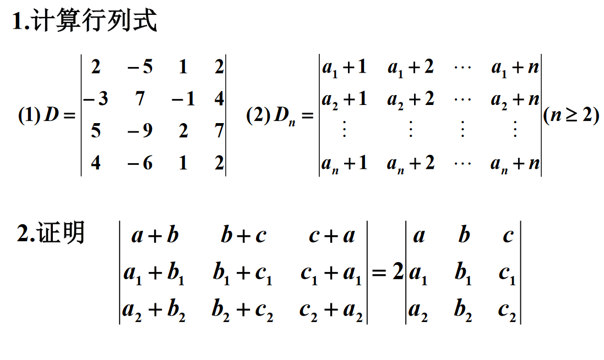
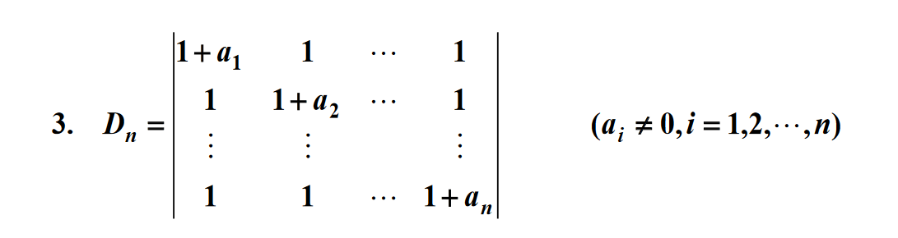

# 1.

## (1)

$$
\begin{aligned}
&D=
\begin{vmatrix}
2 &-5 &1 &2 \\
-3 &7 &-1 &4 \\
5 &-9 &2 &7 \\
4 &-6 &1 &2 \\
\end{vmatrix}
\xlongequal[r_3-\frac{5}{2}r_1,r_2-2r_1]{r_2+\frac{3}{2}r_1}
\begin{vmatrix}
2 &-5 &1 &2 \\
0 &-\frac{1}{2} &\frac{1}{2} &7 \\
0 &\frac{7}{2} &-\frac{1}{2} &2 \\
0 &4 &-1 &-2 \\
\end{vmatrix}
\\ &\xlongequal[r_4+8r_2]{r_3+7r_2}
\begin{vmatrix}
2 &-5 &1 &2 \\
0 &-\frac{1}{2} &\frac{1}{2} &7 \\
0 &0 &3 &51 \\
0 &0 &3 &54 \\
\end{vmatrix}
\xlongequal[]{r_4-r_3}
\begin{vmatrix}
2 &-5 &1 &2 \\
0 &-\frac{1}{2} &\frac{1}{2} &7 \\
0 &0 &3 &51 \\
0 &0 &0 &3 \\
\end{vmatrix}=-9 
\end{aligned}
$$

## (2)

$当n=2时,$

$$
D_n=
\begin{vmatrix}
a_1+1 &a_1+2 \\
a_2+1 &a_2+2 \\
\end{vmatrix}=
\begin{vmatrix}
a_1+1 &1 \\
a_2+1 &1 \\
\end{vmatrix}=a_1+1-a_2-1=a_1-a_2
$$

$当n\geq 3时,$

$$
\begin{aligned}
&
D_n=
\begin{vmatrix}
a_1+1 &a_1+2 &\cdots &a_1+n \\
a_2+1 &a_2+2 &\cdots &a_2+n \\
\vdots &\vdots &\ddots &\vdots \\
a_n+1 &a_n+2 &\cdots &a_n+n \\
\end{vmatrix}
\xlongequal[c_2-c_3]{c_1-c_3}
\begin{vmatrix}
-2 &-1 &\cdots &a_1+n \\
-2 &-1 &\cdots &a_2+n \\
\vdots &\vdots &\ddots &\vdots \\
-2 &-1 &\cdots &a_n+n \\
\end{vmatrix}=0 
\end{aligned}
$$

# 2.

$$
\begin{aligned}
&
\begin{vmatrix}
a+b &b+c &c+a \\
a_1+b_1 &b_1+c_1 &c_1+a_1 \\
a_2+b_2 &b_2+c_2 &c_2+a_2 \\
\end{vmatrix}
\xlongequal[]{c_1+c_3-c_2}
2\begin{vmatrix}
a &b+c &c+a \\
a_1 &b_1+c_1 &c_1+a_1 \\
a_2 &b_2+c_2 &c_2+a_2 \\
\end{vmatrix}
\\ &\xlongequal[]{c_3-c_1}
2\begin{vmatrix}
a &b+c &c \\
a_1 &b_1+c_1 &c_1 \\
a_2 &b_2+c_2 &c_2 \\
\end{vmatrix}
\xlongequal[]{c_2-c_3}
2\begin{vmatrix}
a &b &c \\
a_1 &b_1 &c_1 \\
a_2 &b_2 &c_2 \\
\end{vmatrix}
\end{aligned}
$$

# 3.

$$
\begin{aligned}
&
\begin{vmatrix}
1+a_1 &1 &\cdots &1 \\
1 &1+a_2 &\cdots &1 \\
\vdots &\vdots &\ddots &\vdots \\
1 &1 &\cdots &1+a_n \\
\end{vmatrix}
\\ \xlongequal[i=1,2\cdots n-1]{r_i-r_n} &
\begin{vmatrix}
a_1 &0 &\cdots &-a_n \\
0 &a_2 &\cdots &-a_n \\
\vdots &\vdots &\ddots &\vdots \\
1 &1 &\cdots &1+a_n \\
\end{vmatrix}
\\ \xlongequal[i=1,2\cdots n-1]{r_n-\sum \frac{r_i}{a_i}} &
\begin{vmatrix}
a_1 &0 &\cdots &-a_n \\
0 &a_2 &\cdots &-a_n \\
\vdots &\vdots &\ddots &\vdots \\
0 &0 &\cdots &1+a_n+\sum\frac{a_n}{a_i} \\
\end{vmatrix}
\\ \xlongequal[i=1,2\cdots n-1]{} &
(\prod_{i=1}^{n-1}a_i)(1+a_n+\sum_{i=1}^{n-1}\frac{a_n}{a_i})
\end{aligned}
$$