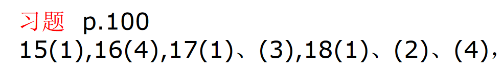

# 15.(1)

$$
\begin{matrix}
A_{11}=-6
&A_{12}=0
&A_{13}=0
&A_{14}=0
\\
A_{21}=-12
&A_{22}=6
&A_{23}=0
&A_{24}=0
\\
A_{31}=15
&A_{32}=-6
&A_{33}=-3
&A_{34}=0
\\
A_{41}=7
&A_{42}=0
&A_{43}=1
&A_{44}=-2
\end{matrix}
$$

# 16.(4)

$$
\begin{aligned}
&
\begin{vmatrix}
1 &\frac{1}{2} &0 &1 &-1 \\
2 &0 &-1 &1 &2 \\
3 &2 &1 &\frac{1}{2} &0 \\
1 &-1 &0 &1 &2 \\
2 &1 &3 &0 &\frac{1}{2} \\
\end{vmatrix}=
\begin{vmatrix}
1 &\frac{1}{2} &0 &1 &-1 \\
0 &-1 &-1 &-1 &4 \\
0 &\frac{1}{2} &1 &-\frac{5}{2} &3 \\
0 &-\frac{3}{2} &0 &0 &3 \\
0 &0 &3 &-2 &\frac{5}{2} \\
\end{vmatrix}
\\=&
\begin{vmatrix}
-1 &-1 &-1 &4 \\
\frac{1}{2} &1 &-\frac{5}{2} &3 \\
-\frac{3}{2} &0 &0 &3 \\
0 &3 &-2 &\frac{5}{2} \\
\end{vmatrix}=
\begin{vmatrix}
-1 &-1 &-1 &4 \\
0 &\frac{1}{2} &-3 &5 \\
0 &\frac{3}{2} &\frac{3}{2} &-3 \\
0 &3 &-2 &\frac{5}{2} \\
\end{vmatrix}=-
\begin{vmatrix}
\frac{1}{2} &-3 &5 \\
\frac{3}{2} &\frac{3}{2} &-3 \\
3 &-2 &\frac{5}{2} \\
\end{vmatrix}
\\=&-
\begin{vmatrix}
\frac{1}{2} &-3 &5 \\
0 &\frac{21}{2} &-18 \\
0 &16 &-\frac{55}{2} \\
\end{vmatrix}=\frac{21\times 55}{8}-8\times 18=\frac{3}{8}
\end{aligned}
$$

# 17.

## (1)

$$
\begin{aligned}
&
\begin{vmatrix}
x &y &0 &\cdots &0 &0 \\
0 &x &y &\cdots &0 &0 \\
\vdots &\vdots &\vdots & &\vdots &\vdots \\
0 &0 &0 &\cdots &x &y \\
y &0 &0 &\cdots &0 &x \\
\end{vmatrix}
\\ =&
x
\begin{vmatrix}
x &y &\cdots &0 &0 \\
\vdots &\vdots & &\vdots &\vdots \\
0 &0 &\cdots &x &y \\
0 &0 &\cdots &0 &x \\
\end{vmatrix}+
(-1)^{n+1}y
\begin{vmatrix}
y &0 &\cdots &0 &0 \\
x &y &\cdots &0 &0 \\
\vdots &\vdots & &\vdots &\vdots \\
0 &0 &\cdots &x &y \\
\end{vmatrix}
\\ =&
x^{n}+(-1)^{n+1}y^{n}
\end{aligned}
$$

## (3)

$$
\begin{aligned}
&
\begin{vmatrix}
x_1-m &x_2 &\cdots &x_n \\
x_1 &x_2-m &\cdots &x_n \\
\vdots &\vdots & &\vdots \\
x_1 &x_2 &\cdots &x_n-m \\
\end{vmatrix}=
\begin{vmatrix}
\displaystyle\sum_{i=1}^n x_i-m &x_2 &\cdots &x_n \\
\displaystyle\sum_{i=1}^n x_i-m &x_2-m &\cdots &x_n \\
\vdots &\vdots & &\vdots \\
\displaystyle\sum_{i=1}^n x_i-m &x_2 &\cdots &x_n-m \\
\end{vmatrix}
\\ =&
(\displaystyle\sum_{i=1}^n x_i -m)
\begin{vmatrix}
1 &x_2 &\cdots &x_n \\
1 &x_2-m &\cdots &x_n \\
\vdots &\vdots & &\vdots \\
1 &x_2 &\cdots &x_n-m \\
\end{vmatrix}=
(\displaystyle\sum_{i=1}^n x_i -m)
\begin{vmatrix}
1 &0 &\cdots &0 \\
1 &-m &\cdots &0 \\
\vdots &\vdots & &\vdots \\
1 &0 &\cdots &-m \\
\end{vmatrix}
\\ =&
(-m)^{n-1}(\displaystyle\sum_{i=1}^n x_i -m)
\end{aligned}
$$

# 18.

## (1)

$$
\begin{aligned}
&
\begin{vmatrix}
a_0 &1 &1 &\cdots &1 \\
1 &a_1 &0 &\cdots &0 \\
1 &0 &a_2 &\cdots &0 \\
\vdots &\vdots &\vdots & &\vdots \\
1 &0 &0 &\cdots &a_n \\
\end{vmatrix}=
\begin{vmatrix}
a_0-\displaystyle\sum_{i=1}^n \frac{1}{a_i} &1 &1 &\cdots &1 \\
0 &a_1 &0 &\cdots &0 \\
0 &0 &a_2 &\cdots &0 \\
\vdots &\vdots &\vdots & &\vdots \\
0 &0 &0 &\cdots &a_n \\
\end{vmatrix}
\\ =&
a_1a_2\cdots a_n(a_0-\displaystyle\sum_{i=1}^n \frac{1}{a_i})
\end{aligned}
$$

## (2)

$$
\begin{aligned}
&
\begin{vmatrix}
x &0 &0 &\cdots &0 &a_0 \\
-1 &x &0 &\cdots &0 &a_1 \\
0 &-1 &x &\cdots &0 &a_2 \\
\vdots &\vdots &\vdots & &\vdots &\vdots \\
0 &0 &0 &\cdots &x &a_{n-2} \\
0 &0 &0 &\cdots &-1 &x+a_{n-1} \\
\end{vmatrix}
\\ =&
(-1)^{n+1}a_0
\begin{vmatrix}
-1 &x &0 &\cdots &0 \\
0 &-1 &x &\cdots &0 \\
\vdots &\vdots &\vdots & &\vdots \\
0 &0 &0 &\cdots &x \\
0 &0 &0 &\cdots &-1 \\
\end{vmatrix}+
(-1)^{n+2}a_1
\begin{vmatrix}
x &0 &0 &\cdots &0 \\
0 &-1 &x &\cdots &0 \\
\vdots &\vdots &\vdots & &\vdots \\
0 &0 &0 &\cdots &x \\
0 &0 &0 &\cdots &-1 \\
\end{vmatrix}
\\ +&\cdots+
(-1)^{2n-1}a_{n-2}
\begin{vmatrix}
x &0 &0 &\cdots &0 \\
-1 &x &0 &\cdots &0 \\
0 &-1 &x &\cdots &0 \\
\vdots &\vdots &\vdots & &\vdots \\
0 &0 &0 &\cdots &-1 \\
\end{vmatrix}+
(-1)^{2n}(x+a_{n-1})
\begin{vmatrix}
x &0 &0 &\cdots &0 \\
-1 &x &0 &\cdots &0 \\
0 &-1 &x &\cdots &0 \\
\vdots &\vdots &\vdots & &\vdots \\
0 &0 &0 &\cdots &x \\
\end{vmatrix}
\\ =&
(-1)^{n+1}(-1)^{n-1}a_0+
(-1)^{2n}a_1x+\cdots+
(-1)^{2n}a_{n-2}x^{n-2}+
(-1)^{2n}(x+a_{n-1})x^{n-1}
\\ =&
x^n+a_{n-1}x^{n-1}+\cdots+a_1x+a_0
\end{aligned}
$$

## (4)

$①当n=2时,$

$$
\begin{vmatrix}
\cos \alpha &1 \\
1 &2\cos \alpha \\
\end{vmatrix}
=2\cos^2 \alpha-1=\cos 2\alpha
成立
$$

$$
\begin{vmatrix}
\cos \alpha &1 &0 \\
1 &2\cos \alpha &1 \\
0 &1 &2\cos \alpha \\
\end{vmatrix}
=2\cos\alpha\cos2\alpha-\cos\alpha
=\cos\alpha\cos2\alpha-\sin\alpha\sin2\alpha
=\cos3\alpha
成立
$$

$②假设当n-1,n-2时成立,$

$\quad 对于n的情况:$

$$
\begin{aligned}
&
\begin{vmatrix}
\cos \alpha &1 &0 &\cdots &0 &0 \\
1 &2\cos \alpha &1 &\cdots &0 &0 \\
0 &1 &2\cos \alpha &\cdots &0 &0 \\
\vdots &\vdots &\vdots & &\vdots &\vdots \\ 
0 &0 &0 &\cdots &2\cos \alpha &1 \\
0 &0 &0 &\cdots &1 &2\cos \alpha \\
\end{vmatrix}_{n}
\\ =&
2\cos \alpha\cos[(n-1)\alpha]-
\begin{vmatrix}
\cos \alpha &1 &0 &\cdots &0 &0 \\
1 &2\cos \alpha &1 &\cdots &0 &0 \\
0 &1 &2\cos \alpha &\cdots &0 &0 \\
\vdots &\vdots &\vdots & &\vdots &\vdots \\ 
0 &0 &0 &\cdots &2\cos \alpha &0 \\
0 &0 &0 &\cdots &1 &1 \\
\end{vmatrix}_{n-1}
\\ =&
2\cos \alpha\cos[(n-1)\alpha]-
\begin{vmatrix}
\cos \alpha &1 &0 &\cdots &0 \\
1 &2\cos \alpha &1 &\cdots &0 \\
0 &1 &2\cos \alpha &\cdots &0 \\
\vdots &\vdots &\vdots & &\vdots \\ 
0 &0 &0 &\cdots &2\cos \alpha \\
\end{vmatrix}_{n-2}
\\ =&
2\cos \alpha\cos[(n-1)\alpha]-\cos[(n-2)\alpha]
\\ =&
2\cos \alpha\cos[(n-1)\alpha]-\cos[(n-1)\alpha-\alpha]
\\ =&
2\cos \alpha\cos[(n-1)\alpha]-\cos\alpha\cos[(n-1)\alpha]-\sin\alpha\sin[(n-1)\alpha]
\\ =&
\cos\alpha\cos[(n-1)\alpha]-\sin\alpha\sin[(n-1)\alpha]
\\ =&
\cos n\alpha
\end{aligned}
$$

# 1.

$$
D_n=
\begin{vmatrix}
a &0 &\cdots &0 &1 \\
0 &a &\cdots &0 &0 \\
\vdots &\vdots & &\vdots &\vdots \\
0 &0 &\cdots &a &0 \\
1 &0 &\cdots &0 &a \\
\end{vmatrix}=
a
\begin{vmatrix}
a &\cdots &0 &0 \\
\vdots & &\vdots &\vdots \\
0 &\cdots &a &0 \\
0 &\cdots &0 &a \\
\end{vmatrix}+
(-1)^{n+1}
\begin{vmatrix}
0 &\cdots &0 &1 \\
a &\cdots &0 &0 \\
\vdots & &\vdots &\vdots \\
0 &\cdots &a &0 \\
\end{vmatrix}=a^n+a^{n-2}
$$

# 2.

$$
\begin{aligned}
D_{n+1}=
&
\begin{vmatrix}
-a_1 &0 &0 &\cdots &0 &0 &1 \\
a_1 &-a_2 &0 &\cdots &0 &0 &1 \\
0 &a_2 &-a_3 &\cdots &0 &0 &1 \\
\vdots &\vdots &\vdots & &\vdots &\vdots &\vdots \\
0 &0 &0 &\cdots &a_{n-1} &-a_n &1 \\
0 &0 &0 &\cdots &0 &a_n &1 \\
\end{vmatrix}
\\ = &
\begin{vmatrix}
-a_1 &0 &0 &\cdots &0 &0 &1 \\
0 &-a_2 &0 &\cdots &0 &0 &2 \\
0 &0 &-a_3 &\cdots &0 &0 &3 \\
\vdots &\vdots &\vdots & &\vdots &\vdots &\vdots \\
0 &0 &0 &\cdots &0 &-a_n &n \\
0 &0 &0 &\cdots &0 &0 &n+1 \\
\end{vmatrix}
\\ = &
(n+1)\prod_{i=1}^n(-a_i)
\end{aligned}
$$