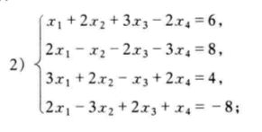

# 19.(2)

$
\begin{aligned}
\therefore
D&=
\begin{vmatrix}
1 &2 &3 &-2 \\
2 &-1 &-2 &-3 \\
3 &2 &-1 &2 \\
2 &-3 &2 &1 \\
\end{vmatrix}=
\begin{vmatrix}
1 &2 &3 &-2 \\
0 &-5 &-8 &1 \\
0 &-4 &-10 &8 \\
0 &-7 &-4 &5 \\
\end{vmatrix}=
\begin{vmatrix}
-5 &-8 &1 \\
-4 &-10 &8 \\
-7 &-4 &5 \\
\end{vmatrix}
\\
&=250+64\times 7+16-70-160-160  \\
&=324
\end{aligned}
$

$
\begin{aligned}
\quad
D_1=
\begin{vmatrix}
6 &2 &3 &-2 \\
8 &-1 &-2 &-3 \\
4 &2 &-1 &2 \\
-8 &-3 &2 &1 \\
\end{vmatrix}=324
\end{aligned}
$

$
\begin{aligned}
\quad
D_2=
\begin{vmatrix}
1 &2 &3 &-2 \\
2 &-1 &-2 &-3 \\
3 &2 &-1 &2 \\
2 &-3 &2 &1 \\
\end{vmatrix}=648
\end{aligned}
$

$
\begin{aligned}
\quad
D_3=
\begin{vmatrix}
1 &2 &3 &-2 \\
2 &-1 &-2 &-3 \\
3 &2 &-1 &2 \\
2 &-3 &2 &1 \\
\end{vmatrix}=-324
\end{aligned}
$

$
\begin{aligned}
\quad
D_4=
\begin{vmatrix}
1 &2 &3 &-2 \\
2 &-1 &-2 &-3 \\
3 &2 &-1 &2 \\
2 &-3 &2 &1 \\
\end{vmatrix}=-648
\end{aligned}
$

$\therefore x_1=\displaystyle\frac{D_1}{D}=1,x_2=\frac{D_2}{D}=2,x_3=\frac{D_3}{D}=-1,x_4=\frac{D_4}{D}=-2$